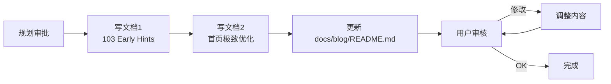

# 技术文档与博客文章写作规划

> 将已完成的所有首页优化编写为正式的技术博客文章。

---

## 一、优先级

| 优先级 | 任务 | 预估篇幅 |
|--------|------|---------|
| 🥇 **立即执行** | 文档 1：103 Early Hints 实战 | ~200 行 |
| 🥇 **立即执行** | 文档 2：首页极致优化 26 项实践 | ~500 行 |
| 🥈 **列入计划** | 文档 3：全局配置参考文档（前后端 + 运维 + 监控） | 待定 |

---

## 二、文档 1：103 Early Hints 实战

**文件**: `docs/blog/articles/frontend/cloudflare-103-early-hints.md`

**Slug**: `cloudflare-103-early-hints`

**Tags**: `Cloudflare, HTTP/103, Early Hints, Performance, Worker`

### 章节结构

| 章节 | 内容 |
|------|------|
| **1. 背景：性能瓶颈分析** | 首页优化最后一块短板 — 冷连接问题；Worker 请求流中插入 103 的时机 |
| **2. 什么是 103 Early Hints** | HTTP 103 定义；浏览器处理流程；配 Mermaid 时序图 |
| **3. 为什么选择 Cloudflare Workers** | 无需改 Next.js 代码；与 Cloudflare 原生 Early Hints 配合 |
| **4. 代码实现 ⭐** | `worker.ts:134-164` 完整代码块；条件判断逻辑；`ctx.waitUntil` 模式 |
| **5. Cloudflare Dashboard 配置 ⚠️** | **Speed → Optimization → Early Hints → On**；不开启则 103 不生效 |
| **6. 验证方法** | DevTools Network 面板、curl 命令、Cloudflare 分析 |
| **7. 性能影响** | 预期 200-500ms 收益；首次访问最大；局限性说明 |

---

## 三、文档 2：首页极致优化（26 项实践）

**文件**: `docs/blog/articles/frontend/homepage-extreme-optimization.md`

**Slug**: `homepage-extreme-optimization`

**Tags**: `Next.js, Performance, ISR, PWA, Cloudflare, Edge Computing`

### 章节结构

| 章节 | 内容 |
|------|------|
| **1. 背景** | 三端统一架构的缓存困境 + 混合渲染模式 |
| **2. 架构总览：双层缓存系统** | IndexedDB Local-First → Worker KV → Service Worker；配架构图 |
| **3. 26 项优化详解** | **P0 首屏体验**：ISR 60s / Priority / Quality / SSR initialCategories / BlurhashImage LRU / View Transitions |
| | **P1 预取与预加载**：IntersectionObserver 图片预取（200px rootMargin）/ 底部自动预取 / Hover 预取 / CDN Preconnect / LCP Preload Link |
| | **P2 自适应**：网络感知 5 级自适应（slow-2g→4g）/ Edge 图片 AVIF 变换 |
| | **P3 边缘缓存**：Cache-Control / Worker KV / OpenNext ISR / Service Worker 导航缓存 |
| | **P4 PWA 离线**：IndexedDB 4 张表 / offlineFirst / 离线指示器 |
| **4. 103 Early Hints** | 引用文档 1 的核心内容，快速说明 |
| **5. 配置清单 ⚠️** | Cloudflare Dashboard 配置项 + `next.config.ts` 关键配置 + 环境变量；表格形式标注必选/可选 |
| **6. 验证与监控** | DevTools / Lighthouse / IndexedDB 检查 / Worker 日志 |
| **7. 效果数据** | 优化前后对比（待补充） |

---

## 四、文档 3：全局配置参考（未来计划）

**文件**: 待定

**范围**: 前端 → 后端 → 运维 → 监控 → i18n

**状态**: 📋 列入计划，暂不执行

---

## 五、执行步骤

---

## 六、涉及的代码文件（两篇文章共用）

| 文件 | 文档 1 | 文档 2 |
|------|--------|--------|
| [`worker.ts`](../apps/frontend-blog/src/worker.ts:134) | ✅ 核心 | ✅ Worker KV 缓存 |
| [`page.tsx`](../apps/frontend-blog/src/app/%5Blocale%5D/page.tsx) | — | ✅ ISR + LCP Preload |
| [`page.client.tsx`](../apps/frontend-blog/src/app/%5Blocale%5D/page.client.tsx) | — | ✅ Priority + Quality + 底部预取 |
| [`ArticleCard.tsx`](../apps/frontend-blog/src/components/blog/ArticleCard.tsx) | — | ✅ 图片预取 + 自适应质量 |
| [`useNetworkQuality.ts`](../apps/frontend-blog/src/lib/hooks/useNetworkQuality.ts) | — | ✅ 5 级网络感知 |
| [`cloudflareImageLoader.ts`](../apps/frontend-blog/src/lib/utils/cloudflareImageLoader.ts) | — | ✅ Edge 图片变换 |
| [`next.config.ts`](../apps/frontend-blog/next.config.ts) | — | ✅ SW + Cache-Control + CDN |
| [`useFrontendArticles.ts`](../apps/frontend-blog/src/lib/hooks/useFrontendArticles.ts) | — | ✅ IndexedDB Local-First |
