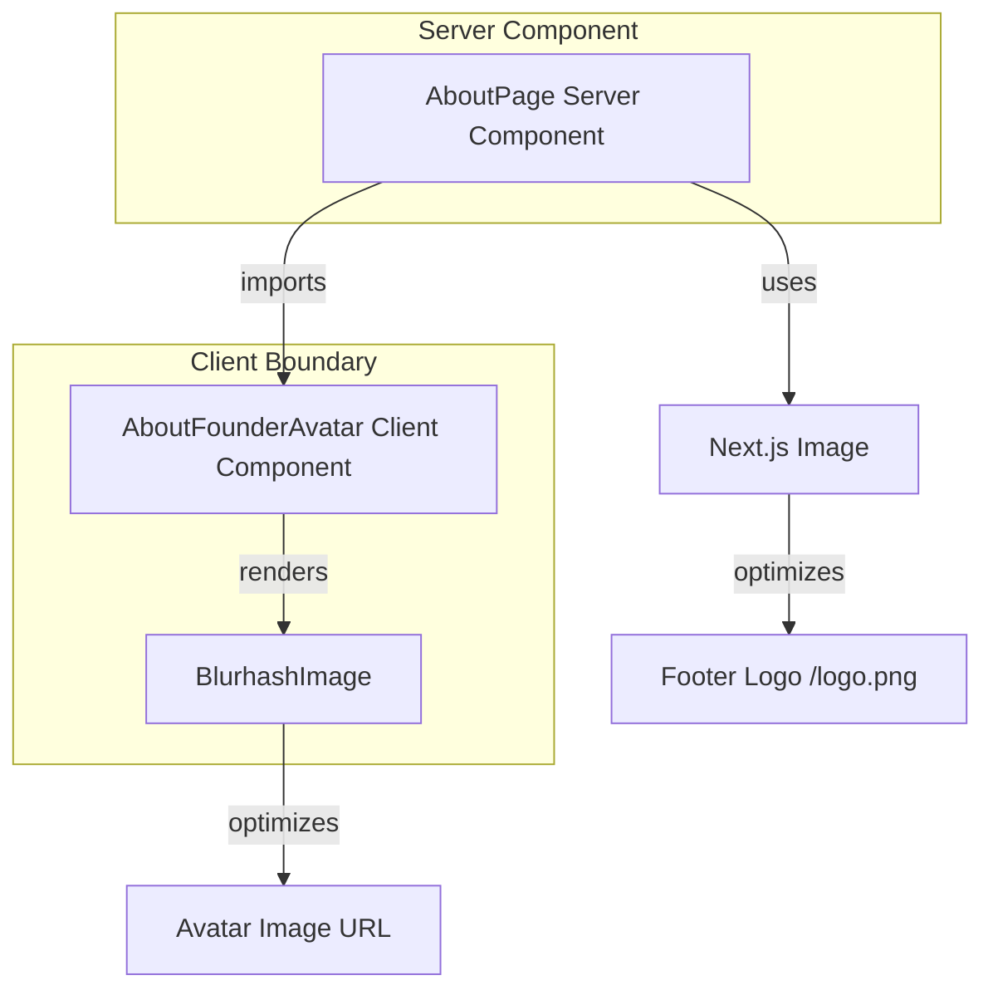

# Plan: Replace About Page Avatar with BlurhashImage

## Problem
The About page's founder avatar uses a plain `` tag with a large PNG image (`Gemini_Generated_Image_l8u1b7l8u1b7l8u1.png`). This results in:
- No Next.js Image optimization (lazy loading, responsive sizes, WebP conversion)
- No loading placeholder — the image appears with a flash
- Poor perceived performance on slow connections

## Solution
Replace the plain `` with the existing `BlurhashImage` component, which provides:
- Next.js `Image` optimization (lazy loading, responsive sizes)
- Smooth loading transition (pulse placeholder while loading, then fade-in)
- Consistent UX with the rest of the blog (ArticleCard, HeroSection, FeaturedProjects)

## Architecture

### Challenge: Server Component + Client Component
- `AboutPage` (`page.tsx`) is a **server component** (async, uses `getTranslations`)
- `BlurhashImage` is a **client component** (`'use client'`)

### Solution: Thin Client Wrapper
Create a new client component `AboutFounderAvatar.tsx` that wraps `BlurhashImage`. The server page imports and renders this client component.

### Blurhash Availability
The avatar image has no associated blurhash string. `BlurhashImage` handles this gracefully:
- Without `blurhash` prop → shows a pulsing gray placeholder while loading
- When image loads → placeholder fades out smoothly

This is acceptable and still provides significant benefits over a plain ``.

### Footer Logo
The footer logo (`/logo.png`, 24x24) is small. Replace the plain `` with Next.js `Image` directly for basic optimization, without the overhead of `BlurhashImage`.

## Files to Create/Modify

### 1. Create: `apps/frontend-blog/src/components/about/AboutFounderAvatar.tsx`
- `'use client'` component
- Props: `src`, `alt`, `name` (for the alt text)
- Renders `BlurhashImage` with `fill` mode inside a `relative w-64 h-64` container
- Includes the gradient background and status indicator (moved from page.tsx)

### 2. Modify: `apps/frontend-blog/src/app/[locale]/about/page.tsx`
- Import `AboutFounderAvatar` from `@/components/about/AboutFounderAvatar`
- Replace the avatar `` block (lines 216-225) with `<AboutFounderAvatar>`
- Replace footer `` with Next.js `Image` import

## Implementation Steps

1. Create `apps/frontend-blog/src/components/about/AboutFounderAvatar.tsx`
2. Update `apps/frontend-blog/src/app/[locale]/about/page.tsx`:
   - Add import for `AboutFounderAvatar`
   - Add import for `Image` from `next/image` (for footer logo)
   - Replace avatar `` with `<AboutFounderAvatar>`
   - Replace footer `` with `<Image>`
3. Run type-check and lint to verify

## Mermaid Diagram

