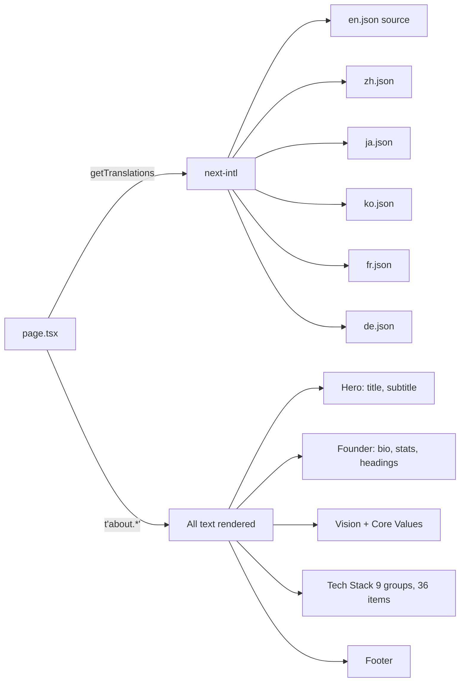

# About Page Update Plan

## Current State Analysis

### Files to Modify
| File | Purpose | Changes Needed |
|------|---------|---------------|
| `apps/frontend-blog/src/app/[locale]/about/page.tsx` | About page component | Remove Vue.js, add translation keys for hardcoded text |
| `apps/frontend-blog/src/messages/en.json` | English (source of truth) | Remove `techVue`, shorten descriptions, add new keys |
| `apps/frontend-blog/src/messages/zh.json` | Chinese | Same structural changes + translate new keys |
| `apps/frontend-blog/src/messages/ja.json` | Japanese | Same structural changes + translate new keys |
| `apps/frontend-blog/src/messages/ko.json` | Korean | Same structural changes + translate new keys |
| `apps/frontend-blog/src/messages/fr.json` | French | Same structural changes + translate new keys |
| `apps/frontend-blog/src/messages/de.json` | German | Same structural changes + translate new keys |

### Issues Found

1. **Vue.js is listed but not used** — `techVue` key exists in all 6 locales
2. **Hardcoded English text** — not translatable:
   - Line 29: `bio: 'Full-stack developer passionate about creating elegant solutions'`
   - Line 232: `Years` (stat label)
   - Line 237: `Projects` (stat label)
   - Line 243: `Stacks` (stat label)
   - Line 267: `Expertise` (heading)
   - Line 282: `Connect` (heading)
3. **Verbose tech descriptions** — 6-9 words each, causing overflow in DE/FR/KO/JA
4. **Vision/architecture text is generic** — doesn't reflect the 4 actual projects

## Proposed Changes

### 1. Remove Vue.js (3 files changed)

**`page.tsx`**: Remove the Vue.js item from the `frontend` group
```diff
- { name: 'Vue.js', icon: '🟢', descriptionKey: 'techVue' },
```

**All 6 message files**: Remove the `techVue` key

### 2. Replace Hardcoded English → Translation Keys

Add these new keys to `about.*` in all locale files:

| New Key | Purpose | English Value (short) |
|---------|---------|----------------------|
| `founderStatYears` | Years stat label | `Years` |
| `founderStatProjects` | Projects stat label | `Projects` |
| `founderStatStacks` | Stacks stat label | `Stacks` |
| `founderBio` | Founder bio text | `Creating elegant solutions for modern web apps` |
| `founderExpertise` | Expertise section heading | `Expertise` |
| `founderConnect` | Connect section heading | `Connect` |

### 3. Shorten Tech Descriptions (Max 5 Words)

Strategy: cut adjectives and adverbs, keep core noun phrases.

| Current Key | Current EN (6-9 words) | Shortened (≤5 words) |
|-------------|----------------------|----------------------|
| `techNextjs` | React framework supporting SSR/SSG | React framework for SSR/SSG |
| `techReact` | UI library supporting concurrent features | UI library with concurrent features |
| `techTypescript` | Type-safe JavaScript | Type-safe JavaScript |
| `techTailwind` | Utility-first CSS framework | Utility-first CSS framework |
| `techNestjs` | Enterprise-level Node.js framework | Enterprise Node.js framework |
| `techPrisma` | Modern ORM tool | Modern ORM tool |
| `techPostgresql` | Relational database | Relational database |
| `techRedis` | In-memory data storage | In-memory cache & data store |
| `techDocker` | Containerized deployment | Containerized deployment |
| `techFlutter` | Cross-platform mobile app framework for iOS and Android | Cross-platform mobile framework |
| `techShorebird` | Flutter hot update solution supporting incremental updates and fast deployment | Flutter hot update solution |
| `techCapacitor` | Hybrid app development framework using web technologies | Hybrid app framework |
| `techSembast` | Flutter embedded NoSQL database supporting offline data storage | Flutter embedded NoSQL database |
| `techSqlite` | Lightweight embedded database for mobile applications | Lightweight embedded database |
| `techBullmq` | Redis-based message queue system supporting task scheduling | Redis-based message queue |
| `techAwsRekognition` | Face recognition and liveness detection service | Face recognition & liveness detection |
| `techVertexAi` | Machine learning model service supporting AI features | ML model service for AI features |
| `techAiAgent` | AI agent system supporting automated task processing | AI agent system |
| `techGithubActions` | CI/CD automation pipeline supporting continuous integration and deployment | CI/CD automation pipeline |
| `techCloudflare` | Edge computing platform providing global CDN and Serverless services | Edge platform with CDN & Serverless |
| `techVite` | Frontend build tool supporting fast development and hot reload | Fast frontend build tool |
| `techSentry` | Full-stack performance monitoring and error tracking system | Performance monitoring & error tracking |
| `techPlaywright` | Modern end-to-end automation testing framework | E2E automation testing framework |
| `techJestVitest` | Unit testing framework supporting JavaScript and TypeScript | Unit testing framework |
| `techWebsocket` | Real-time bidirectional communication protocol for instant messaging | Real-time bidirectional protocol |
| `techSocketIo` | WebSocket library providing real-time communication functionality | Real-time communication library |
| `techFcm` | Firebase Cloud Messaging supporting cross-platform notifications | Cross-platform push notifications |
| `techOauth` | OAuth2 third-party login system | OAuth2 third-party login |
| `techFigma` | Collaborative UI/UX design tool | Collaborative design tool |
| `techFigmaToken` | Design system tokens ensuring UI consistency | Design system tokens |
| `techSeo` | Search engine optimization techniques improving website visibility | SEO optimization |
| `techNextIntl` | Multi-language support library supporting internationalized routing | Multi-language i18n library |

### 4. Shorten Core Value Descriptions (Max 8 words)

| Current Key | Current EN (10+ words) | Shortened (≤8 words) |
|-------------|----------------------|----------------------|
| `coreValueInnovationDesc` | Continuously explore new technologies, pursue excellent user experience | Explore new tech for better UX |
| `coreValueSecurityDesc` | Focus on data security and system stability, providing reliable services for users | Data security and system stability |
| `coreValuePerformanceDesc` | Optimize every line of code, ensure fast system response | Optimized code for fast response |
| `coreValueUserExperienceDesc` | User-centered, create simple and elegant product interfaces | Simple and elegant user interfaces |

### 5. Update Vision & Architecture Text

**Vision**: Keep short, reduce from 3 sentences to 2.
- Current: "Tarsier Labs is a modern web application platform... we are committed to creating the best user experience. We believe good software should be simple, elegant, and efficient. This blog is where we share..."
- Proposed: "Tarsier Labs builds modern web and mobile applications. We believe software should be simple, elegant, and efficient — this blog is where we share what we learn."

**Architecture**: Remove from individual translation (it's duplicated in tech stack section below)
- Current: `architectureDescription` is a 3-sentence paragraph that largely duplicates other content
- Proposed: Remove `architectureDescription` key and the architecture section from the page, OR make it a single sentence

### 6. Page Component Changes Summary

```diff
// page.tsx changes:
- { name: 'Vue.js', icon: '🟢', descriptionKey: 'techVue' },  // REMOVE

// Founder stats:
- <div className="text-2xl font-bold text-primary">10+</div>
- <div className="text-xs text-muted-foreground">Years</div>
+ <div className="text-2xl font-bold text-primary">10+</div>
+ <div className="text-xs text-muted-foreground">{t('about.founderStatYears')}</div>

// Founder bio:
- <p>{teamMembers[0].bio}</p>
+ <p>{t('about.founderBio')}</p>

// Expertise heading:
- <h4 className="font-semibold mb-3">Expertise</h4>
+ <h4 className="font-semibold mb-3">{t('about.founderExpertise')}</h4>

// Connect heading:
- <h4 className="font-semibold mb-4">Connect</h4>
+ <h4 className="font-semibold mb-4">{t('about.founderConnect')}</h4>
```

### Mermaid Diagram: Data Flow



## Execution Order

1. Edit `en.json` (source of truth): remove `techVue`, shorten all tech/core value descriptions, add new keys
2. Edit `page.tsx`: remove Vue.js, replace hardcoded text with `t()` calls
3. Edit remaining 5 locale files with parallel structural changes
4. Verify: type-check, no missing translation keys
5. Present to user for review

## Translation Strategy

- **Keep English source short** → all translations naturally stay shorter
- **No nested keys** for new additions (flat `about.*` pattern)
- **Use existing key patterns** (`tech*`, `coreValue*`, `founder*`) for consistency
- **Remove, don't add new tech** — the current 36 tech items are sufficient; just remove Vue.js and shorten descriptions
