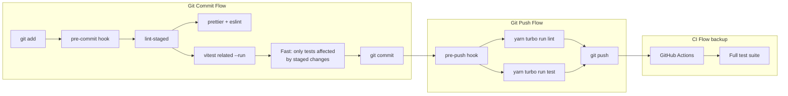

# Plan: Add Pre-Commit Test Checks to Prevent Bugs from Reaching Git

## Problem

The Login test failure that reached CI could have been caught locally before commit. Currently:

- **`.husky/pre-commit`** — Only runs `yarn lint:staged` (code formatting/linting)
- **`.husky/pre-push`** — Only runs `yarn turbo run lint` (no tests)
- **CI** — Runs tests but only after code is already pushed to remote

No local git hook runs any tests, allowing bugs to pass through unchecked.

## Root Cause of the Gap

The project's architecture docs (`docs/read/architecture/ADMIN_NEXT_TECH_OVERVIEW_CN.md`) describe the intended flow as:
```
git commit → lint-staged (prettier + eslint)
git push   → prepush (tsc + vitest)
```

But the pre-push hook was never implemented with test execution — it only runs `yarn turbo run lint`.

## Workspaces with Tests

| Workspace | Command | Framework |
|-----------|---------|-----------|
| `@lucky/admin-next` | `yarn workspace @lucky/admin-next test` | Vitest |
| `@lucky/api` | `yarn workspace @lucky/api test` | Jest |
| `@lucky/frontend-blog` | `yarn workspace @lucky/frontend-blog test` | Vitest |

Root turbo pipeline: `yarn turbo run test` runs tests across all workspaces with cache.

## Design



## Implementation Steps

### Step 1: Create `lint-staged.config.mjs` (root)

Currently, `yarn lint:staged` runs `lint-staged --config lint-staged.config.mjs` but this config file may not exist. We need to create it with proper patterns.

Create a config that:
- Runs `prettier --write` on all staged files
- Runs `eslint --fix` on staged `.ts/.tsx` files
- Runs `vitest related --run` on staged test files (`.test.tsx?`, `.spec.tsx?`)

```javascript
export default {
  '*.{ts,tsx,js,jsx,json,md,yaml,yml}': ['prettier --write'],
  '*.{ts,tsx,js,jsx}': ['eslint --fix'],
  'apps/admin-next/src/**/*.{test,spec}.{ts,tsx}': [
    () => 'yarn workspace @lucky/admin-next vitest related --run',
  ],
};
```

### Step 2: Update `.husky/pre-commit`

Keep `yarn lint:staged` as the primary pre-commit check (it now includes test running for staged test files via lint-staged config).

No changes needed to the pre-commit script itself — the lint-staged config handles everything.

### Step 3: Update `.husky/pre-push`

Add `yarn turbo run test` alongside the existing `yarn turbo run lint`. This ensures a full test suite runs across all affected workspaces before pushing to remote.

```bash
#!/usr/bin/env sh

# Run full lint before push — matches CI pipeline
yarn turbo run lint

# Run full test suite — catches cross-workspace regressions before push
yarn turbo run test
```

## How This Prevents Bugs Like the Login Test Failure

1. Developer modifies `Login.tsx` or `Login.test.tsx`
2. `git add` stages the files
3. Pre-commit hook fires → `lint-staged` runs:
   - Prettier formats the code
   - ESLint checks for lint issues
   - `vitest related --run` detects that `Login.test.tsx` is related to the changes and runs it
4. If a test fails → commit is aborted with clear error output
5. Developer fixes the test before the code ever reaches git

## Files to Modify

| File | Action |
|------|--------|
| `lint-staged.config.mjs` | **Create** — configure lint-staged patterns including vitest related |
| `.husky/pre-push` | **Modify** — add `yarn turbo run test` |
| `.husky/pre-commit` | **No change needed** — already calls `yarn lint:staged` |

## Edge Cases & Considerations

- **`--no-verify`**: Developers can bypass hooks with `git commit --no-verify` for emergencies (e.g., WIP commits, urgent hotfixes)
- **Turbo cache**: Repeated test runs on unchanged workspaces are instant due to caching
- **`vitest related` vs full suite**: For pre-commit, `vitest related` is preferred (fast). The full `turbo run test` in pre-push catches everything
- **CI as safety net**: CI still runs full tests as the final gate before deployment
