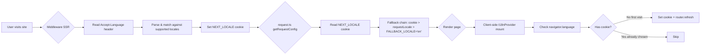

# Lessons Learned: Admin Blog Browser Language Detection

## Overview

Implementation of automatic browser language detection for [`apps/admin-blog`](../apps/admin-blog) (Next.js admin panel with **cookie-only** locale routing, no URL prefix). Pattern learned from [`apps/frontend-blog`](../apps/frontend-blog) (URL-based `[locale]/path` routing) and adapted for cookie-based architecture.

---

## 1. Architecture: The Three-Layer Detection Chain



### Key Principle

**Middleware is the authoritative source for SSR locale detection.** It runs before `request.ts` and sets the `NEXT_LOCALE` cookie, so `request.ts` doesn't need to call `headers()` directly — it just reads the cookie. This avoids redundant Accept-Language parsing on every request.

### Detection Priority (lowest to highest)

| Layer | Source | When | Condition |
|-------|--------|------|-----------|
| 1  — Fallback | `FALLBACK_LOCALE = 'en'` | SSR + CSR | No match anywhere |
| 2  — Accept-Language | HTTP `Accept-Language` header | SSR (middleware) | First visit, no cookie |
| 3  — `navigator.language` | Browser API | CSR (I18nProvider) | First visit, no cookie |
| 4  — `NEXT_LOCALE` cookie | Manual switch (LanguageSwitch) | SSR + CSR | User explicitly chose |

---

## 2. The Critical Edge Runtime Problem

### Root Cause

Both [`apps/admin-blog`](../apps/admin-blog) and [`apps/admin-next`](../apps/admin-next) deploy to **Edge Runtime** for middleware (Cloudflare Workers / Vercel Edge). Edge Runtime does NOT support Node.js built-in modules.

The chain that broke the build:

```
middleware.ts (Edge Runtime)
  └── import from @lucky/shared
        └── packages/shared/src/index.ts exports everything
              └── packages/shared/src/utils/order-no.helper.ts
                    └── import crypto from "node:crypto"  ← BREAKS ON EDGE
```

The [`node:crypto`](../packages/shared/src/utils/order-no.helper.ts:1) import in `order-no.helper.ts` is used to generate order numbers — it's never needed in middleware, but TypeScript doesn't know that.

### What DIDN'T Work

1. **Trying to configure NormalModuleReplacementPlugin for both server + client** ([`apps/admin-blog/next.config.ts:48-56`](../apps/admin-blog/next.config.ts:48))
   - Adding `node:crypto` → `'crypto'` replacement outside `!isServer` guard caused: `"Can't resolve 'crypto'"` — because Edge Runtime is NOT Node.js and doesn't have `crypto` either.

2. **Calling `headers()` from `next/headers` in `request.ts`**
   - Not the actual culprit. `request.ts` runs on the Node.js server, not Edge. The error was from middleware.

### The Solution

**Define locale codes inline** in both [`locale.ts`](../apps/admin-blog/src/lib/utils/locale.ts:18) and [`middleware.ts`](../apps/admin-blog/src/middleware.ts:10) as simple const arrays. Do NOT import `@lucky/shared` from any file that runs on Edge Runtime.

```typescript
// ✅ Safe for Edge Runtime — inline definition, no @lucky/shared dependency
const SUPPORTED_LOCALES = ['en', 'zh', 'ja', 'ko', 'fr', 'de'] as const;
```

```typescript
// ❌ BREAKS on Edge Runtime — @lucky/shared pulls in node:crypto
import { AVAILABLE_LOCALES } from '@lucky/shared';
```

### TypeScript Quirk with `as const`

When using `as const` tuples, `.includes()` with a `string` argument fails type-checking:

```typescript
// ❌ TypeScript error: Argument of type 'string' not assignable to parameter
const SUPPORTED_LOCALES = ['en', 'zh'] as const;
SUPPORTED_LOCALES.includes('en'); // OK — exact literal
SUPPORTED_LOCALES.includes(lang); // ERROR — lang is string
```

Fix: cast to `readonly string[]` at the call site:

```typescript
(SUPPORTED_LOCALES as readonly string[]).includes(lang)
```

For [`isSupportedLocale()`](../apps/admin-blog/src/lib/utils/locale.ts:108), use a type predicate to preserve narrow types downstream:

```typescript
export function isSupportedLocale(code: string): code is Locale {
  return (SUPPORTED_LOCALES as readonly string[]).includes(code);
}
```

---

## 3. Data Flow Details

### 3a. Middleware → Cookie Setting

In [`middleware.ts`](../apps/admin-blog/src/middleware.ts:64-91):

- Only sets locale cookie when **no existing `NEXT_LOCALE` cookie** exists (first visit)
- Only sets cookie when detected locale **differs from `FALLBACK_LOCALE`** (`'en'`)
- This means: English users get no cookie set, keeping requests lean
- The `applyLocaleCookie()` helper is called on **every response path** (public, auth redirect, normal) — this ensures the cookie is set even on redirects

### 3b. request.ts → Locale Resolution

In [`request.ts`](../apps/admin-blog/src/i18n/request.ts:36-70):

1. Reads `NEXT_LOCALE` cookie (set by middleware)
2. Falls back to `requestLocale` (always undefined since no next-intl middleware)
3. Falls back to `FALLBACK_LOCALE` (`'en'`)

```typescript
// Priority chain (lines 44-70)
locale = cookie('NEXT_LOCALE') ?? requestLocale ?? FALLBACK_LOCALE;
```

No `headers()` call needed here — middleware has already done the Accept-Language parsing and stored the result in the cookie.

### 3c. Client-side I18nProvider

In [`I18nProvider.tsx`](../apps/admin-blog/src/lib/providers/I18nProvider.tsx:31-50):

- Only fires on first visit (checks `document.cookie` for `NEXT_LOCALE`)
- Reads `navigator.language`, extracts primary language tag
- If browser language ≠ current locale → sets cookie + calls `router.refresh()` to re-render with new locale
- After user manually switches language (via LanguageSwitch), cookie exists → provider skips detection

Note: I18nProvider still imports [`@lucky/shared`](../apps/admin-blog/src/lib/providers/I18nProvider.tsx:7) for `AVAILABLE_LOCALES` — this is fine because it runs client-side (browser already has `crypto` via Web Crypto API). The edge runtime restriction is ONLY for middleware.

---

## 4. Files Modified/Created

| File | Action | Purpose |
|------|--------|---------|
| [`apps/admin-blog/src/lib/utils/locale.ts`](../apps/admin-blog/src/lib/utils/locale.ts) | **Created** | Locale detection utilities: `parseAcceptLanguage()`, `detectLocaleFromRequest()`, `detectLocaleFromBrowser()`, `isSupportedLocale()` |
| [`apps/admin-blog/src/middleware.ts`](../apps/admin-blog/src/middleware.ts) | **Modified** | Added Accept-Language header parsing, sets `NEXT_LOCALE` cookie on first visit |
| [`apps/admin-blog/src/i18n/request.ts`](../apps/admin-blog/src/i18n/request.ts) | **Modified** | Updated locale resolution chain: cookie → requestLocale → `FALLBACK_LOCALE='en'` |
| [`apps/admin-blog/src/lib/providers/I18nProvider.tsx`](../apps/admin-blog/src/lib/providers/I18nProvider.tsx) | **Created** | Client-side `navigator.language` detection as progressive enhancement |
| [`apps/admin-blog/src/app/layout.tsx`](../apps/admin-blog/src/app/layout.tsx) | **Modified** | Wrapped children with `<I18nProvider>` |
| [`apps/admin-blog/next.config.ts`](../apps/admin-blog/next.config.ts) | **Reverted** | No changes needed — only client-side `node:crypto` shim remains |

---

## 5. Key Differences Between Apps (for Future Reference)

| Aspect | admin-blog | admin-next | frontend-blog |
|--------|-----------|------------|---------------|
| **Locale routing** | Cookie-only (`NEXT_LOCALE`) | URL-based (`[locale]/path`) + `app_locale` cookie | URL-based (`[locale]/path`) |
| **Deployment** | Docker/Vercel Node.js | Cloudflare Workers Edge | Vercel Edge |
| **Middleware runtime** | Edge | Edge (Workers) | Edge |
| **next-intl middleware** | No (`createMiddleware` not used) | Yes | Yes |
| **Cookie name** | `NEXT_LOCALE` | `app_locale` | `NEXT_LOCALE` |
| **Default locale** | `en` (user requested) | `zh` (Chinese, original) | `en` |
| **`@lucky/shared` in Edge** | ❌ Breaks build | ❌ Breaks build | ❌ Breaks build |
| **Has `node:crypto` shim** | Yes (webpack only, client-side) | Yes (turbopack + webpack, client-side) | N/A |

### Why admin-next is Different

1. **URL-based locale**: uses `/[locale]/` path prefix via `next-intl`'s `createMiddleware`. Locale is extracted from the URL, not just a cookie.
2. **Two cookie names**: `app_locale` (legacy, set by `LanguageProvider`) AND the URL locale from next-intl routing.
3. **Cloudflare Workers**: Edge-only deployment. No Node.js server at all.
4. **Already has `node:crypto` shim**: `turbopack.resolveAlias` + webpack `NormalModuleReplacementPlugin` already set up for client-side — but middleware still can't import `@lucky/shared`.

---

## 6. Applying This to Admin-Next (Future Work)

When implementing browser language detection for [`apps/admin-next`](../apps/admin-next):

### Changes Needed

1. **Create** [`apps/admin-next/src/lib/utils/locale.ts`](../apps/admin-next) — fork of admin-blog's locale.ts, with inline locale codes (no `@lucky/shared` imports)

2. **Modify** [`apps/admin-next/src/middleware.ts`](../apps/admin-next/src/middleware.ts:68-124) — add Accept-Language detection logic BEFORE auth check, set `app_locale` cookie on first visit

3. **Modify** [`apps/admin-next/src/i18n/request.ts`](../apps/admin-next/src/i18n/request.ts) — update locale resolution chain:
   - Priority: URL locale (from next-intl) > `app_locale` cookie (set by middleware from Accept-Language) > `DEFAULT_LOCALE` (`'zh'`)
   - No need for `FALLBACK_LOCALE` — admin-next keeps `DEFAULT_LOCALE = 'zh'`

4. **Modify** layout — wrap with `I18nProvider` client component

5. **No `next.config.ts` changes needed** — admin-next already has `node:crypto` shim configured for both turbopack and webpack (client-side only)

### Key Differences to Account For

- admin-next uses `next-intl`'s `createMiddleware()` which handles locale routing from the URL
- The middleware already redirects based on locale prefix — locale detection must NOT interfere with URL routing
- The `app_locale` cookie is currently only set client-side by `LanguageProvider.setLocale`. Adding server-side cookie setting via middleware will be the new primary path
- `FALLBACK_LOCALE` is not needed — if no match, keep the existing `DEFAULT_LOCALE` (`'zh'`) behavior

---

## 7. Edge Cases Handled

1. **First visit, Chinese browser**: Accept-Language `zh-CN,zh;q=0.9` → matches `zh` → sets cookie → user sees Chinese. ✅
2. **First visit, Japanese browser**: Accept-Language `ja-JP,ja;q=0.9` → matches `ja` → sets cookie → user sees Japanese. ✅
3. **First visit, English browser**: Accept-Language `en-US,en;q=0.9` → matches `en` → `detected !== FALLBACK_LOCALE` is `false` → cookie NOT set → server uses FALLBACK_LOCALE. ✅
4. **First visit, unsupported language** (e.g., Thai): Accept-Language `th-TH,th;q=0.9` → no match → returns `FALLBACK_LOCALE='en'` → cookie NOT set. ✅
5. **Returning user with cookie**: Middleware detects existing `NEXT_LOCALE` → skips detection → uses cookie value. ✅
6. **Manual switch (LanguageSwitch)**: Sets `NEXT_LOCALE` cookie → subsequent visits use that locale, no auto-detection. ✅
7. **Middleware redirect (unauthorized)**: `applyLocaleCookie()` is called on the redirect response too → cookie is set even when redirecting to login. ✅

---

## 8. Verification Checklist (for any app)

| Check | Command | Notes |
|-------|---------|-------|
| TypeScript | `yarn workspace @lucky/admin-blog typecheck` | Separate from the `tsc --noEmit` check which runs globally |
| Lint | `yarn workspace @lucky/admin-blog lint` | Uses Next.js ESLint config |
| Prettier | `yarn workspace @lucky/admin-blog prettier --write` | Must pass before lint passes |
| Build | `yarn workspace @lucky/admin-blog build` | Tests the full production build including middleware |
| Edge compat | Manual review | Ensure no `@lucky/shared` imports in middleware.ts or any file in Edge Runtime |

---

## 9. Summary

The core architectural insight: **Edge Runtime cannot use `@lucky/shared`** because [`order-no.helper.ts`](../packages/shared/src/utils/order-no.helper.ts:1) imports `node:crypto`. The pattern to follow for any app that needs browser language detection in middleware:

1. Inline locale codes in Edge Runtime files (middleware, locale utils)
2. Middleware reads Accept-Language → sets cookie
3. `request.ts` reads cookie (no `headers()` call needed)
4. Client-side I18nProvider handles `navigator.language` as progressive enhancement
5. Keep `@lucky/shared` imports ONLY in Node.js or client-side code
