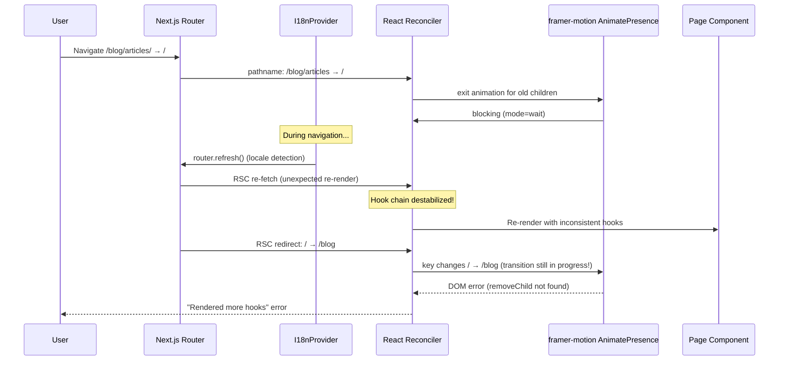
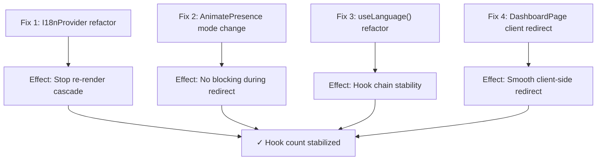

# Admin Blog: "Rendered more hooks than during the previous render" Fix Plan

## Error Overview

**Sentry Error**: `Error: Rendered more hooks than during the previous render`
**Browser Console**: `NotFoundError: Failed to execute 'removeChild' on 'Node'`
**URL**: `https://blog-admin.joyminis.com/blog/`
**Navigation Path**: `/blog/articles/` → `/` (redirect) → `/blog`

## Root Cause Diagnosis

This is a **multi-factor race condition** caused by three interacting issues during a specific navigation sequence:

### Navigation Flow

```
/blog/articles/                /                            /blog
(ArticlesPageV2)        ──►    (DashboardPage)       ──►    (BlogDashboardPage)
   client component       server component redirect       client component
   many hooks             redirect('/blog')               many hooks
```

### Factor 1: I18nProvider `router.refresh()` Re-render Cascade

**File**: [`apps/admin-blog/src/lib/providers/I18nProvider.tsx`](../../apps/admin-blog/src/lib/providers/I18nProvider.tsx:31)

```typescript
useEffect(() => {
  // ...
  // If no NEXT_LOCALE cookie set, auto-detect browser locale
  // and call router.refresh() to re-render with new locale
  router.refresh();  // ← Triggers RSC re-fetch mid-navigation
}, [currentLocale, router]);
```

The `router.refresh()` call in `useEffect` triggers a complete RSC (React Server Components) payload re-fetch. When this happens **during** an active client-side navigation (from `/blog/articles/` to `/`), it causes React to reconcile an unexpected component tree, destabilizing the hook chain.

### Factor 2: Server Component Redirect Creates Two-Step Navigation

**File**: [`apps/admin-blog/src/app/(dashboard)/page.tsx`](../../apps/admin-blog/src/app/(dashboard)/page.tsx:6)

```typescript
export default function DashboardPage() {
  redirect('/blog');  // ← RSC redirect throws NEXT_REDIRECT
}
```

The redirect from `/` → `/blog` is handled by Next.js as a server-side redirect during RSC rendering. This creates **two route transitions** in rapid succession:

1. `/blog/articles/` → `/` (pathname changes)
2. `/` → `/blog` (redirect, pathname changes again)

React's reconciliation sees the pathname change twice, but the component tree is being re-rendered multiple times during this process.

### Factor 3: AnimatePresence `mode="wait"` Blocking

**File**: [`apps/admin-blog/src/components/layout/MainContent.tsx`](../../apps/admin-blog/src/components/layout/MainContent.tsx:15)

```tsx
<AnimatePresence mode="wait">
  <motion.div key={pathname} ...>
    {children}
  </motion.div>
</AnimatePresence>
```

With `mode="wait"`, `AnimatePresence` **blocks** rendering new children until exit animation completes. During the rapid key change (`/blog/articles` → `/` → `/blog`), framer-motion gets confused:

- Key changes to `/` → starts exit animation for old content
- Before exit completes, key changes to `/blog` → framer-motion's internal DOM state is corrupted
- Result: `NotFoundError: removeChild` error in console

### Factor 4 (Contributing): `useLanguage()` try/catch Hook Pattern

**File**: [`apps/admin-blog/src/hooks/LanguageProvider.tsx`](../../apps/admin-blog/src/hooks/LanguageProvider.tsx:31)

```typescript
export function useLanguage() {
  let locale: Locale = DEFAULT_LOCALE;
  try {
    // eslint-disable-next-line react-hooks/rules-of-hooks
    locale = useLocale() as Locale;
  } catch { ... }

  let router: { refresh: () => void };
  try {
    // eslint-disable-next-line react-hooks/rules-of-hooks
    router = useRouter();
  } catch { ... }

  const setLocale = useCallback(...);  // Hook call
  return { locale, setLocale, ... };
}
```

While both `useLocale()` and `useRouter()` are always called (not conditionally), the try/catch wrapping violates React's Rules of Hooks. This pattern is fragile: if `useLocale()` throws during the re-render cascade (Factor 1), the catch block swallows the error but React's internal hook cursor is now misaligned.

### How They Combine (The Perfect Storm)



## Fix Plan

### Fix 1: I18nProvider - Guard `router.refresh()` During Navigation

**File**: [`apps/admin-blog/src/lib/providers/I18nProvider.tsx`](../../apps/admin-blog/src/lib/providers/I18nProvider.tsx)

**Problem**: `router.refresh()` is called unconditionally in useEffect, including during active navigation.

**Solution**: Add a guard using `React.startTransition` or `useTransition` to ensure `router.refresh()` is not called while a navigation transition is in progress. Alternatively, only run locale detection on initial mount (not on subsequent navigation re-renders).

```typescript
// Approach A: Use a ref to track first mount
const isFirstMount = useRef(true);
useEffect(() => {
  if (!isFirstMount.current) return; // Only run on first mount
  isFirstMount.current = false;
  // ... existing locale detection logic ...
}, []); // Remove currentLocale/router from deps
```

> **Note**: The locale sync to `document.documentElement.lang` (line 35) can stay in a separate effect or be handled via CSS.

### Fix 2: MainContent - Replace `AnimatePresence mode="wait"`

**File**: [`apps/admin-blog/src/components/layout/MainContent.tsx`](../../apps/admin-blog/src/components/layout/MainContent.tsx)

**Problem**: `mode="wait"` blocks rendering during exit animation, causing issues with rapid key changes during redirects.

**Solution**: Change to `mode="popLayout"` which allows simultaneous exit/enter animations without blocking:

```tsx
<AnimatePresence mode="popLayout">
```

Or, if animations are not critical, remove `AnimatePresence` entirely:

```tsx
<>
  <motion.div key={pathname} ...>
    {children}
  </motion.div>
</>
```

**Recommendation**: Use `mode="popLayout"` — it allows new content to render immediately while the old content exits, preventing the reconciliation block.

### Fix 3: useLanguage() - Refactor to Proper Hook Pattern

**File**: [`apps/admin-blog/src/hooks/LanguageProvider.tsx`](../../apps/admin-blog/src/hooks/LanguageProvider.tsx)

**Problem**: `useLanguage()` is a regular function (lowercase 'u') that calls React hooks inside try/catch blocks with eslint-disable comments.

**Solution**: Rename to `useUseLanguage()` or restructure to avoid try/catch. Since this is a custom hook, it should follow the naming convention and not wrap hooks in try/catch:

```typescript
export function useUseLanguage() {
  let locale: Locale;
  let router: ReturnType<typeof useRouter>;
  
  try {
    locale = useLocale() as Locale;
    router = useRouter();
  } catch {
    // Only catch if these hooks are truly unavailable
    locale = DEFAULT_LOCALE;
    router = { refresh: () => window.location.reload() };
  }
  
  const setLocale = useCallback((newLocale: Locale) => {
    // ... existing logic ...
  }, [router]);
  
  return { locale, setLocale, translations: undefined };
}
```

> **Key change**: The function is renamed to `useUseLanguage` (proper hook naming) but still uses try/catch. The real fix is ensuring the try/catch doesn't mask hook count issues. The eslint-disable comments should be removed after confirming hooks are always called.

### Fix 4: DashboardPage - Replace Server Component Redirect with Client Redirect

**File**: [`apps/admin-blog/src/app/(dashboard)/page.tsx`](../../apps/admin-blog/src/app/(dashboard)/page.tsx)

**Problem**: Server component `redirect()` creates an RSC redirect that interferes with client-side navigation transitions.

**Solution**: Convert to a client component that uses `useEffect` + `router.replace()`:

```tsx
'use client';

import { useEffect } from 'react';
import { useRouter } from 'next/navigation';

export default function DashboardPage() {
  const router = useRouter();
  
  useEffect(() => {
    router.replace('/blog');
  }, [router]);
  
  return null; // or a loading skeleton
}
```

This eliminates the RSC redirect throw and allows smooth client-side redirection.

### Dependency Graph



## Verification Steps

1. **Type-check**: `yarn workspace @lucky/admin-blog tsc --noEmit`
2. **Lint**: `yarn workspace @lucky/admin-blog lint`
3. **Prettier**: `yarn workspace @lucky/admin-blog prettier --check .`
4. **Manual test**: Navigate from articles list to dashboard (via breadcrumb or clicking "Dashboard" in sidebar)
5. **Sentry check**: Verify no new "Rendered more hooks" errors after deployment
6. **Console check**: Verify no `removeChild` errors in browser console

## Affected Files

| File | Change | Risk |
|------|--------|------|
| `apps/admin-blog/src/lib/providers/I18nProvider.tsx` | Guard router.refresh() / first-mount only | Medium |
| `apps/admin-blog/src/components/layout/MainContent.tsx` | Change AnimatePresence mode | Low |
| `apps/admin-blog/src/hooks/LanguageProvider.tsx` | Rename to useUseLanguage, clean up try/catch | Low |
| `apps/admin-blog/src/app/(dashboard)/page.tsx` | Convert to client component with useEffect redirect | Low |
| `apps/admin-blog/src/hooks/useTranslation.ts` | Update useLanguage → useUseLanguage import | Low |
