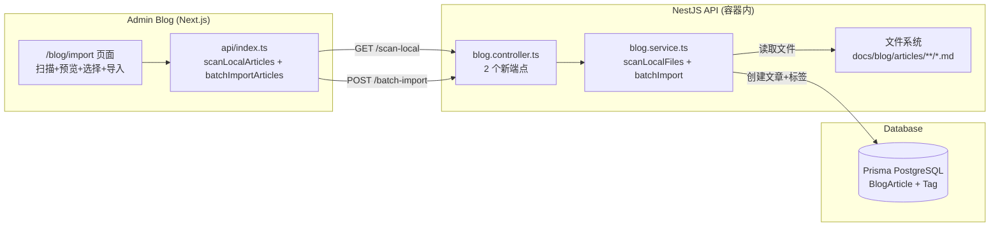
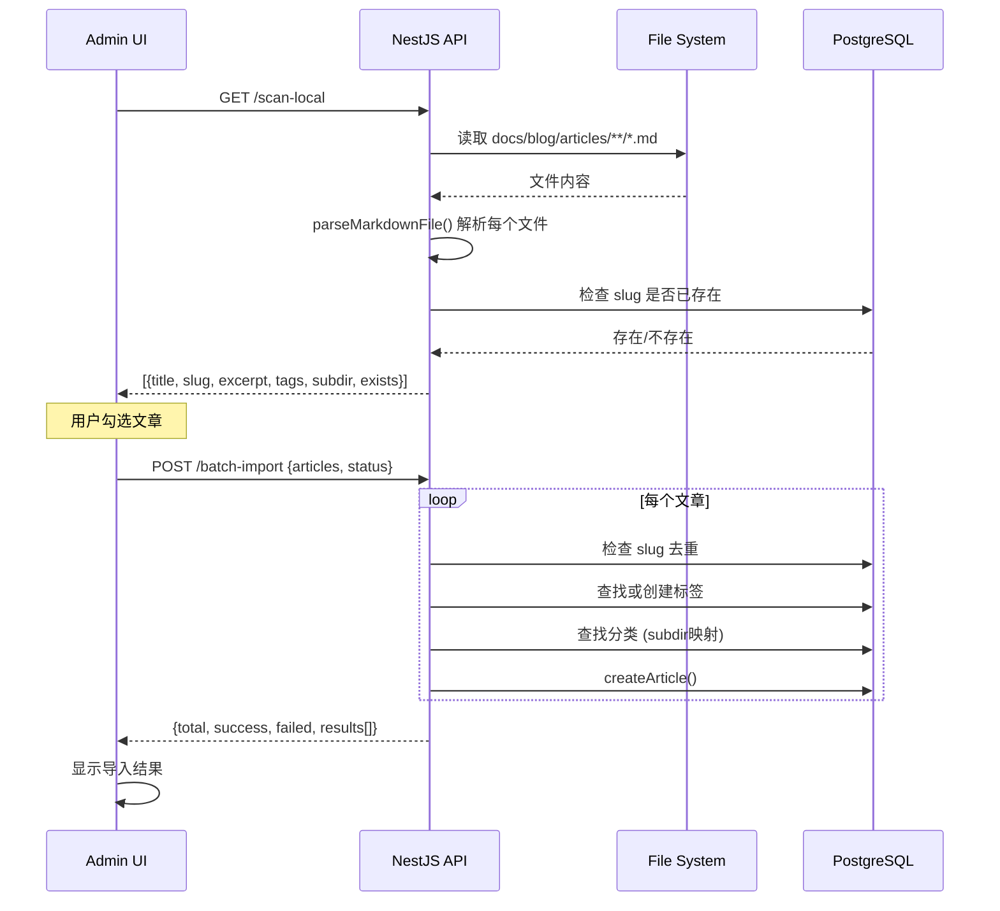

# Admin Blog - 批量导入文章 UI 设计方案

## 背景

用户放弃了 CLI 脚本 (`scripts/batch-import-blog-articles.ts`) 方式，希望在 admin-blog 后台管理界面中直接扫描并导入 `docs/blog/articles/` 下的 markdown 文章。

## 架构概览



## 关键设计决策

### 为什么后端能读取文件？

[`compose.yml:52`](compose.yml:52) 配置了 `volumes: - .:/app`，整个 monorepo 根目录挂载到了 API 容器的 `/app` 路径下。因此 API 可以通过 `/app/docs/blog/articles/` 访问 markdown 文件。

### 导入逻辑复用

后端新方法直接复用 import script 中的核心逻辑（`parseMarkdownFile`, `findOrCreateTag`, `slug dedup`），但改为 NestJS 风格（依赖注入、Prisma 事务），不再走 HTTP 调用。

---

## 后端改动

### 1. `blog.controller.ts` — 新增 2 个端点

```typescript
// GET /v1/admin/blog/articles/scan-local
// 扫描本地 docs/blog/articles/ 目录，返回解析后的文章列表
@Get('articles/scan-local')
@ApiBearerAuth()
@UseGuards(AdminJwtAuthGuard)
@ApiOperation({ summary: '扫描本地 Markdown 文件' })
async scanLocalArticles() {
  return this.blogService.scanLocalMarkdownFiles();
}

// POST /v1/admin/blog/articles/batch-import
// 批量导入选中的文章（含 slug 去重、标签查找/创建）
@Post('articles/batch-import')
@ApiBearerAuth()
@UseGuards(AdminJwtAuthGuard)
@ApiOperation({ summary: '批量导入文章' })
async batchImportArticles(
  @CurrentUserId() userId: string,
  @Body() dto: BatchImportDto,
) {
  return this.blogService.batchImportArticles(userId, dto);
}
```

### 2. `blog.service.ts` — 新增 2 个方法

#### `scanLocalMarkdownFiles()`

- 读取 `/app/docs/blog/articles/` 目录
- 递归查找所有 `*.md` 文件（保持子目录结构）
- 解析每个文件：提取标题（`# `）、摘要（`> `）、Tags 行、正文
- 对每个文件：
  - 通过 `filenameToSlug()` 生成 slug
  - 调用已有 `getArticleBySlug()` 检查是否已存在
  - 记录 `exists: true/false`
- 返回 `ScannedArticle[]` (title, slug, excerpt, tags, subdir, content first 200 chars, exists)

#### `batchImportArticles(userId, dto: BatchImportDto)`

- 接收 `{ articles: BatchImportItem[], status: "DRAFT" | "PUBLISHED" }`
- 遍历 `articles`：
  - slug 去重检查（跳过已存在的）
  - 子目录 → 分类映射（同 import script 的 `getCategoryMap`）
  - 标签查找/创建（同 `findOrCreateTag` 逻辑，但用 Prisma 查询）
  - 调用已有 `createArticle()` 创建文章
- 返回 `{ total, success, failed, results: [{slug, status, error?}] }`

### 3. 新增 DTO: `batch-import.dto.ts`

```typescript
class BatchImportItem {
  title: string;
  content: string;
  excerpt?: string;
  tags: string[];
  subdir: string | null;
  slug: string;
}

class BatchImportDto {
  articles: BatchImportItem[];
  status: 'DRAFT' | 'PUBLISHED';
}
```

### 4. 需要使用到的文件

| 文件 | 改动 |
|------|------|
| [`apps/api/src/blog/blog.controller.ts`](apps/api/src/blog/blog.controller.ts) | +2 端点 |
| [`apps/api/src/blog/blog.service.ts`](apps/api/src/blog/blog.service.ts) | +2 方法 (scanLocalMarkdownFiles, batchImportArticles) |
| `apps/api/src/blog/dto/batch-import.dto.ts` | 新建，BatchImportDto |

---

## 前端改动

### 1. `api/index.ts` — 新增 2 个 API 方法

```typescript
// 添加到 blogApi 对象中
scanLocalArticles: async () => {
  return await http.get<ScannedArticle[]>('/v1/admin/blog/articles/scan-local');
},

batchImportArticles: async (payload: {
  articles: { slug: string; title: string; content: string; excerpt?: string; tags: string[]; subdir: string | null }[];
  status: 'DRAFT' | 'PUBLISHED';
}) => {
  return await http.post<BatchImportResult>('/v1/admin/blog/articles/batch-import', payload);
},
```

### 2. 新页面: `/(dashboard)/blog/import/page.tsx`

**UI 布局:**

```
┌─────────────────────────────────────────────────────────┐
│ 📥 批量导入文章                                         │
│ 从 docs/blog/articles/ 扫描并导入 Markdown 文章          │
│                                                         │
│  ┌─────────────────────────────────────────────────┐    │
│  │ [🔍 扫描本地文件]   发布方式: [DRAFT ▼]         │    │
│  └─────────────────────────────────────────────────┘    │
│                                                         │
│  找到 46 篇文章                                         │
│                                                         │
│  ┌──────┬────────────────────────┬────────┬──────┬────┐ │
│  │  □   │ 标题                   │ 标签   │ 分类  │ 状态│ │
│  ├──────┼────────────────────────┼────────┼──────┼────┤ │
│  │  ☑   │ NestJS backend arch.. │nestjs  │arch..│ ✅  │ │
│  │  ☑   │ Next.js SSR SEO...    │nextjs  │fron..│ ⏳  │ │
│  │  □   │ ...                   │ ...    │ ...  │ ... │ │
│  └──────┴────────────────────────┴────────┴──────┴────┘ │
│                                                         │
│  ☑ 全选    已选 30 篇   新 28 篇  已导入 2 篇            │
│                                                         │
│  ┌─ 预览面板 ─────────────────────────────────────────┐ │
│  │  # Next.js SSR SEO 爬虫完全指南                    │ │
│  │                                                    │ │
│  │  > 本文详细介绍 Next.js App Router 下的 SSR SEO...  │ │
│  │                                                    │ │
│  │  Tags: nextjs, ssr, seo                            │ │
│  │  分类: frontend                                    │ │
│  └────────────────────────────────────────────────────┘ │
│                                                         │
│  [📥 导入选中文章]                                        │
└─────────────────────────────────────────────────────────┘
```

**组件结构:**
- `ImportPage` — main page component
  - `PageHeader` (复用现有组件)
  - 扫描按钮 + 发布状态选择 (DRAFT/PUBLISHED)
  - 文章列表 (SmartTable 复用)
  - 全选/取消全选
  - 预览面板 (点击行展开)
  - 导入按钮 + 进度/结果展示

**状态管理:**
- `useState` for local state (scanned list, selected IDs, import results)
- `useMutation` from `@tanstack/react-query` for API calls
- `useToastStore` for notifications

### 3. `routes/index.ts` — 新增路由

```typescript
{
  path: '/blog/import',
  name: 'import_articles',
  icon: Upload, // 或 Download
  group: 'Content',
}
```

### 4. 需要使用到的文件

| 文件 | 改动 |
|------|------|
| [`apps/admin-blog/src/api/index.ts`](apps/admin-blog/src/api/index.ts) | +2 API 方法 |
| [`apps/admin-blog/src/app/(dashboard)/blog/import/page.tsx`](apps/admin-blog/src/app/(dashboard)/blog/import/page.tsx) | 新建，导入页面 |
| [`apps/admin-blog/src/routes/index.ts`](apps/admin-blog/src/routes/index.ts) | +1 路由配置 |

---

## 数据流



---

## Bug 与风险分析

### 1. ⚠️ Slug 生成逻辑不一致（最重要的 Bug 风险）

| 环节 | Slug 来源 |
|------|-----------|
| 扫描端点 (`scan-local`) | 文件名去除 `.md` 后缀: `nextjs-rendering-modes-guide.md` → `nextjs-rendering-modes-guide` |
| 已有的 `createArticle()` ([`blog.service.ts:146`](apps/api/src/blog/blog.service.ts:146)) | 自动从标题生成: `"Next.js Rendering Modes Guide"` → `nextjs-rendering-modes-guide` |

如果文章标题和文件名不一致，扫描端点报告"未导入"，但实际同名文章可能已存在（通过标题生成的 slug 不同但内容重复）。

**修复方案**: 批量导入时传入文件名 slug，在 `createArticle` 中显式设置 slug，或在扫描时同时检查文件名 slug 和标题生成 slug。

### 2. ⚠️ 生产环境文件缺失

生产部署 (`deploy.sh`) 需要确保 `docs/blog/articles/` 目录存在于服务器上。如果不存在，扫描端点返回 500。

**修复方案**: 端点优雅处理 — 目录不存在时返回空数组 + 提示信息，不崩溃。

### 3. ⚠️ 路径遍历安全

扫描端点必须限制只读取 `docs/blog/articles/` 目录下的文件。

**修复方案**: 使用 `path.resolve()` 并验证解析后的路径仍在允许的 base 目录内。

### 4. ⚠️ 文件编码

部分文件可能包含 BOM 头或其他编码。

**修复方案**: 使用 `utf-8` 编码，读取时 strip BOM。

### 5. ✅ CSRF

新端点路径 `/v1/admin/blog/` 不在 CSRF skip 列表中（仅 `/v1/auth/` 在 [`csrf.middleware.ts:51-53`](apps/api/src/common/middleware/csrf.middleware.ts:51) 跳过）。但 admin-blog 的 HTTP 客户端 ([`http.ts`](apps/admin-blog/src/api/http.ts)) 已在请求拦截器中自动处理 CSRF token，浏览器请求不受影响。

### 6. ✅ 并发竞争

如果两个管理员同时点击导入，可能冲突。使用 Prisma transaction 处理即可。

---

## 打包大小影响分析

### 后端（NestJS API）
| 项目 | 影响 |
|------|------|
| 新 npm 包 | 0（使用 Node.js 内置 `fs/promises`, `path`） |
| 新代码量 | ~150 行（scan + batch-import 方法） |
| 打包大小 | **无影响**（NestJS 不是 bundled，compiled only） |

### 前端（Admin-Blog Next.js）
| 项目 | 影响 |
|------|------|
| 新 npm 包 | **0**（复用已有 `SmartTable`, `PageHeader`, `Card`, `Badge`, `Button`, `lucide-react`） |
| 新代码量 | ~200 行 TSX（~6KB uncompressed） |
| 路由加载 | **lazy-loaded**（Next.js 按路由自动 code-split，不影响首页 bundle） |
| 估计 gzip 后 | **~2KB**（首次访问 `/blog/import` 时加载） |
