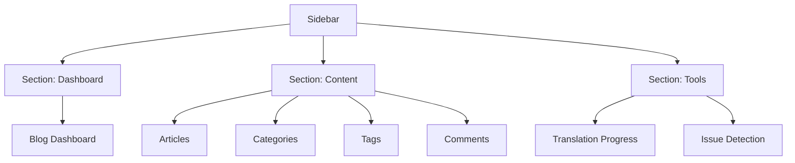

# admin-blog Navigation Restructure Plan

## Current State Analysis

### Problem Summary

1. **All blog sub-routes are `hidden: true`** — Only the Dashboard `/` shows in sidebar. Categories, Tags, Articles, Comments, Translation Progress are inaccessible from sidebar.
2. **Single flat group** — `RouteGroup = 'Blog'` with no navigation hierarchy.
3. **Monolithic Translation Progress page** — `BlogTranslationProgress.tsx` (1407 lines) combines translation progress tracking, issue detection (自动化检测), batch fix, and job management all on one page.
4. **Translation Progress page exists but hidden** — Route exists at `/blog/translation-progress` but is `hidden: true`.
5. **Pages rely on back-button navigation** — All pages use `showBackButton={true}` and breadcrumbs linking back to `/blog`, assuming hierarchical drill-down.

### Current File Structure (relevant)

```
apps/admin-blog/src/
├── routes/index.ts          # Single RouteGroup 'Blog', all sub-routes hidden
├── components/layout/
│   ├── Sidebar.tsx          # Renders only !hidden routes, flat list
│   ├── DashboardLayout.tsx  # Uses route.group for breadcrumbs
│   └── Header.tsx
├── app/(dashboard)/
│   ├── page.tsx             # Redirects to /blog
│   └── blog/
│       ├── page.tsx         # Blog Dashboard
│       ├── articles/
│       │   ├── page.tsx     # Article list (SmartTable)
│       │   └── create/page.tsx
│       ├── categories/page.tsx
│       ├── tags/page.tsx
│       ├── comments/page.tsx
│       └── translation-progress/page.tsx  # 1407 lines, monolithic
├── views/blog/
│   ├── BlogTranslationProgress.tsx  # Monolithic - has issue detection built in
│   ├── BlogArticleModal.tsx
│   ├── BlogCategoryModal.tsx
│   ├── BlogTagModal.tsx
│   ├── BlogCommentModal.tsx
│   ├── ArticleForm.tsx
│   └── components/
│       └── TranslationProgressCard.tsx
└── i18n/
    ├── en.json              # Has translation keys for blog features
    └── zh.json
```

## Proposed Navigation Structure

### Route Groups & Items

#### Group 1: 📊 Dashboard

| Route   | Name        | Icon              | Visible                  |
| ------- | ----------- | ----------------- | ------------------------ |
| `/`     | `dashboard` | `LayoutDashboard` | Yes (redirects to /blog) |
| `/blog` | `blog`      | `FileText`        | Hidden (parent route)    |

> Actually, `/` currently redirects to `/blog`. We can either:
>
> - Keep `/` redirecting to `/blog` and make `/blog` the dashboard
> - Or make `/` the dashboard directly

#### Group 2: 📝 Content (Blog Management)

| Route              | Name         | Icon            | Visible |
| ------------------ | ------------ | --------------- | ------- |
| `/blog/articles`   | `articles`   | `FileText`      | **Yes** |
| `/blog/categories` | `categories` | `Tag`           | **Yes** |
| `/blog/tags`       | `tags`       | `Tag`           | **Yes** |
| `/blog/comments`   | `comments`   | `MessageSquare` | **Yes** |

Hidden child routes (for metadata):

- `/blog/articles/create` → `create_article`
- `/blog/articles/edit/[id]` → `edit_article`

#### Group 3: 🛠️ Tools (separate navigation section)

| Route                        | Name                   | Icon       | Visible                   |
| ---------------------------- | ---------------------- | ---------- | ------------------------- |
| `/blog/translation-progress` | `translation_progress` | `Sparkles` | **Yes**                   |
| `/blog/translation-issues`   | `translation_issues`   | `Search`   | **Yes** (NEW - extracted) |

> The "自动化检测" (auto-detection) refers to the **Translation Issues Detection** section currently inside `BlogTranslationProgress.tsx`. This should be extracted into a separate page.

## Implementation Steps

### Step 1: Update Route Configuration

**File**: [`apps/admin-blog/src/routes/index.ts`](apps/admin-blog/src/routes/index.ts)

- Change `RouteGroup` from single `'Blog'` to `'Dashboard' | 'Content' | 'Tools'`
- Make blog sub-routes visible (remove `hidden: true`)
- Add route grouping with visible non-hidden routes
- Add new route for translation issues page
- Add i18n keys for new routes

### Step 2: Update Sidebar to Support Groups

**File**: [`apps/admin-blog/src/components/layout/Sidebar.tsx`](apps/admin-blog/src/components/layout/Sidebar.tsx)

- Add group headers/section separators
- Group visible routes by their `group` property
- Add appropriate icons for each section
- Show group title between sections



### Step 3: Update DashboardLayout for Breadcrumbs

**File**: [`apps/admin-blog/src/components/layout/DashboardLayout.tsx`](apps/admin-blog/src/components/layout/DashboardLayout.tsx)

- Update breadcrumb generation to work with new grouped routes
- Ensure `DashboardLayout` properly reflects the new `RouteGroup` values

### Step 4: Update Page Breadcrumbs & Navigation

**Files**: Multiple page files under [`apps/admin-blog/src/app/(dashboard)/blog/`](<apps/admin-blog/src/app/(dashboard)/blog/>)

- Remove `showBackButton={true}` from individual pages (since navigation is now lateral via sidebar)
- Update breadcrumbs to use the new group names
- Change `onBack={() => router.push('/blog')}` references to use sidebar navigation instead

Pages to update:

- [`articles/page.tsx`](<apps/admin-blog/src/app/(dashboard)/blog/articles/page.tsx>)
- [`categories/page.tsx`](<apps/admin-blog/src/app/(dashboard)/blog/categories/page.tsx>)
- [`tags/page.tsx`](<apps/admin-blog/src/app/(dashboard)/blog/tags/page.tsx>)
- [`comments/page.tsx`](<apps/admin-blog/src/app/(dashboard)/blog/comments/page.tsx>)
- [`translation-progress/page.tsx`](<apps/admin-blog/src/app/(dashboard)/blog/translation-progress/page.tsx>)

### Step 5: Extract Issue Detection into Separate Page

This is the most complex step. The monolithic `BlogTranslationProgress.tsx` contains these sections:

1. **Overall Progress Stats** (overall progress bar + category breakdown)
2. **Queue Status & Time Info** (active/waiting/failed/completed counts)
3. **Untranslated Articles** (list of pending articles to translate)
4. **Active Translation Jobs** (jobs currently processing)
5. **Issues Detection & Batch Fix** ⭐ (this is the "自动化检测")
6. **Job History** (persisted translation job records)
7. **Live Jobs** (real-time Bull queue jobs)

**Plan**: Split into two pages:

#### Page A: Translation Progress (`/blog/translation-progress`)

Keep sections 1, 2, 3, 4, 6, 7 — translation monitoring dashboard
**File**: [`apps/admin-blog/src/views/blog/BlogTranslationProgress.tsx`](apps/admin-blog/src/views/blog/BlogTranslationProgress.tsx)

- Simplify to focus on translation monitoring
- Remove issue detection section

#### Page B: Translation Issues Detection (`/blog/translation-issues`)

Extract section 5 — the issue detection and batch fix functionality
**New File**: [`apps/admin-blog/src/views/blog/BlogTranslationIssues.tsx`](apps/admin-blog/src/views/blog/BlogTranslationIssues.tsx)

- Focused on detecting problematic translations
- Batch fix functionality
- Per-language issue scanning
- Separate route entry in tools group

**New Page File**: [`apps/admin-blog/src/app/(dashboard)/blog/translation-issues/page.tsx`](<apps/admin-blog/src/app/(dashboard)/blog/translation-issues/page.tsx>)

### Step 6: Remove Unused I18n Keys (NEW — per user request)

**Files**: All locale files + [`i18n/request.ts`](apps/admin-blog/src/i18n/request.ts)

Due to admin-blog being copied from admin-next, many legacy keys remain. Below is the complete analysis of used vs unused keys.

#### Used Keys (KEEP)

**Used nested JSON sections** (top-level objects):
| Section | Used By |
|---------|---------|
| `translations` | All pages (contains all flat keys) |
| `blogCard` | [`TranslationProgressCard.tsx`](apps/admin-blog/src/views/blog/components/TranslationProgressCard.tsx) |
| `login` | [`Login.tsx`](apps/admin-blog/src/views/Login.tsx) |

**Used flat keys inside `translations`** — all `blog_*` prefixed keys plus these:

| Key(s)                                                                                                                                               | Used In                                                                                                                                              |
| ---------------------------------------------------------------------------------------------------------------------------------------------------- | ---------------------------------------------------------------------------------------------------------------------------------------------------- |
| `breadcrumbBlog`, `breadcrumbCategories`, `breadcrumbArticles`, `breadcrumbComments`, `breadcrumbCreate`                                             | Blog page breadcrumbs                                                                                                                                |
| `common_noData`, `common_total`, `common_previous`, `common_pageOf`, `common_next`                                                                   | [`BaseTable.tsx`](apps/admin-blog/src/components/scaffold/BaseTable.tsx), [`Pagination.tsx`](apps/admin-blog/src/components/scaffold/Pagination.tsx) |
| `header_switchToLightMode`, `header_switchToDarkMode`                                                                                                | [`Header.tsx`](apps/admin-blog/src/components/layout/Header.tsx)                                                                                     |
| `categories_*` (all)                                                                                                                                 | [`BlogCategoryModal.tsx`](apps/admin-blog/src/views/blog/BlogCategoryModal.tsx)                                                                      |
| `tags_*` (all)                                                                                                                                       | [`BlogTagModal.tsx`](apps/admin-blog/src/views/blog/BlogTagModal.tsx)                                                                                |
| `blog_comments_*` (all)                                                                                                                              | [`BlogCommentModal.tsx`](apps/admin-blog/src/views/blog/BlogCommentModal.tsx)                                                                        |
| `blog_tags_*` (all)                                                                                                                                  | [`tags/page.tsx`](<apps/admin-blog/src/app/(dashboard)/blog/tags/page.tsx>)                                                                          |
| `cancel`, `status`, `search`, `actions`, `edit`, `delete`, `save`                                                                                    | Multiple pages                                                                                                                                       |
| `confirm`, `deleteConfirm`, `publishConfirm`, `unpublishConfirm`                                                                                     | Dialog buttons                                                                                                                                       |
| `searchPlaceholder`, `allStatus`, `published`                                                                                                        | Filter/search components                                                                                                                             |
| `newArticle`, `noDescription`, `loadFailed`, `loadFailedTitle`, `loadFailedDesc`                                                                     | Various pages                                                                                                                                        |
| `pageTitle`, `pageDescription`, `pageSubtitle`                                                                                                       | Multiple blog pages                                                                                                                                  |
| `name`, `slug`, `description`, `created`, `articles`, `totalRecords`                                                                                 | Table columns                                                                                                                                        |
| `approved`, `pending`, `spam`, `rejected`                                                                                                            | Comments page                                                                                                                                        |
| `deleteArticle`, `deleteCategory`, `deleteConfirmText`, `deleteFailed`, `actionCannotBeUndone`, `articlesWillBeMoved`                                | Delete confirmation dialogs                                                                                                                          |
| `publishArticle`, `unpublishArticle`, `unpublishConfirm`                                                                                             | Article publish/unpublish                                                                                                                            |
| `categoryList`, `categoryUsageTips`, `commentList`, `moderationTips`                                                                                 | Section titles                                                                                                                                       |
| `tip1`-`tip5`                                                                                                                                        | Tips card sections                                                                                                                                   |
| `totalArticles`, `totalComments`, `totalCommentsCount`, `pendingComments`, `pendingModeration`, `pendingArticlesTitle`, `pendingArticlesDescription` | Dashboard / stats                                                                                                                                    |
| `writeNewArticle`, `nextPage`, `update`, `modalTitleEdit`, `modalTitleCreate`                                                                        | Various buttons                                                                                                                                      |
| `update`                                                                                                                                             | Save/update buttons                                                                                                                                  |

#### Unused Sections (REMOVE entirely)

**Unused nested JSON objects** — remove from ALL locale files (en.json, zh.json, ja.json, ko.json, fr.json, de.json):

- `actSections`, `orders`, `groups`, `coupon`, `ads`, `flashSale`, `luckyDraw`
- `notifications`, `customerService`, `supportChannels`, `analytics`
- `operationLogs`, `loginLogs`, `finance`, `paymentChannel`
- `adminUsers`, `roles`, `systemConfig`

**Unused flat keys inside `translations`** — remove from ALL locale files:

- Any key starting with: `dashboard_*`, `users_*`, `products_*`, `kyc_*`, `address_*`, `banners_*`
- Any other flat key NOT listed in the "Used Keys" table above

#### [`request.ts`](apps/admin-blog/src/i18n/request.ts) Changes:

1. Remove unused sections from `RawLocaleJson` type
2. Remove unused sections from `flatten()` function spread
3. Remove unused deep-merge blocks in `getRequestConfig` for non-English locales

### Step 7: Add New Navigation I18n Keys

Add these new keys to ALL locale files (en.json, zh.json, ja.json, ko.json, fr.json, de.json):

```json
{
  "dashboard": "Dashboard",
  "content": "Content",
  "tools": "Tools",
  "translation_issues": "Issue Detection",
  "translation_progress": "Translation Progress"
}
```

### Step 8: Verify & Test

- Check all imports are valid
- Run type-check
- Run lint + prettier
- Verify sidebar renders correctly with groups
- Verify all page routes are accessible
- Verify breadcrumbs display correctly

## Detailed Route Configuration (After)

```typescript
export type RouteGroup = "Dashboard" | "Content" | "Tools";

export const routes: RouteConfig[] = [
  // Dashboard
  { path: "/", name: "dashboard", icon: LayoutDashboard, group: "Dashboard" },

  // Content (Blog Management)
  {
    path: "/blog",
    name: "blog",
    icon: FileText,
    group: "Content",
    hidden: true,
  },
  {
    path: "/blog/articles",
    name: "articles",
    icon: FileText,
    group: "Content",
  },
  {
    path: "/blog/articles/create",
    name: "create_article",
    icon: FileText,
    group: "Content",
    hidden: true,
  },
  {
    path: "/blog/articles/edit/[id]",
    name: "edit_article",
    icon: FileText,
    group: "Content",
    hidden: true,
  },
  { path: "/blog/categories", name: "categories", icon: Tag, group: "Content" },
  { path: "/blog/tags", name: "tags", icon: Tag, group: "Content" },
  {
    path: "/blog/comments",
    name: "comments",
    icon: MessageSquare,
    group: "Content",
  },

  // Tools
  {
    path: "/blog/translation-progress",
    name: "translation_progress",
    icon: Sparkles,
    group: "Tools",
  },
  {
    path: "/blog/translation-issues",
    name: "translation_issues",
    icon: Search,
    group: "Tools",
  },
];
```

## Mermaid: New Navigation Flow

```mermaid
flowchart LR
    subgraph Sidebar
        D[Dashboard]
        C[Content]
        T[Tools]
    end

    D -->|click| DB[/\]
    DB -->|redirect| BDP[Blog Dashboard]

    C --> A[/blog/articles\]
    C --> CA[/blog/categories\]
    C --> TA[/blog/tags\]
    C --> CO[/blog/comments\]
    A --> AC[/blog/articles/create\]
    A --> AE[/blog/articles/edit/id\]

    T --> TP[/blog/translation-progress\]
    T --> TI[/blog/translation-issues\]
```

## Files to Create

1. [`apps/admin-blog/src/app/(dashboard)/blog/translation-issues/page.tsx`](<apps/admin-blog/src/app/(dashboard)/blog/translation-issues/page.tsx>) — New page
2. [`apps/admin-blog/src/views/blog/BlogTranslationIssues.tsx`](apps/admin-blog/src/views/blog/BlogTranslationIssues.tsx) — New view component
3. [`apps/admin-blog/src/app/(dashboard)/settings/locales/page.tsx`](<apps/admin-blog/src/app/(dashboard)/settings/locales/page.tsx>) — New language settings page

## Files to Modify

### Navigation Restructure

1. [`apps/admin-blog/src/routes/index.ts`](apps/admin-blog/src/routes/index.ts) — Restructure routes with groups, add translation-issues route, add settings route
2. [`apps/admin-blog/src/components/layout/Sidebar.tsx`](apps/admin-blog/src/components/layout/Sidebar.tsx) — Add group/section headers, group routes by group, import Search icon
3. [`apps/admin-blog/src/components/layout/DashboardLayout.tsx`](apps/admin-blog/src/components/layout/DashboardLayout.tsx) — Update breadcrumb logic for new groups
4. [`apps/admin-blog/src/views/blog/BlogTranslationProgress.tsx`](apps/admin-blog/src/views/blog/BlogTranslationProgress.tsx) — Remove issue detection section lines 846-1049
5. [`apps/admin-blog/src/app/(dashboard)/blog/articles/page.tsx`](<apps/admin-blog/src/app/(dashboard)/blog/articles/page.tsx>) — Remove showBackButton, update breadcrumbs
6. [`apps/admin-blog/src/app/(dashboard)/blog/categories/page.tsx`](<apps/admin-blog/src/app/(dashboard)/blog/categories/page.tsx>) — Remove showBackButton, update breadcrumbs
7. [`apps/admin-blog/src/app/(dashboard)/blog/tags/page.tsx`](<apps/admin-blog/src/app/(dashboard)/blog/tags/page.tsx>) — Remove showBackButton, update breadcrumbs
8. [`apps/admin-blog/src/app/(dashboard)/blog/comments/page.tsx`](<apps/admin-blog/src/app/(dashboard)/blog/comments/page.tsx>) — Remove showBackButton, update breadcrumbs

### Language Switcher & Settings

9.  [`apps/admin-blog/src/components/layout/Header.tsx`](apps/admin-blog/src/components/layout/Header.tsx) — Add LocaleDropdown component + useAvailableLocales import + Settings link in user menu

### I18n Cleanup (all locale files + request.ts)

10. [`apps/admin-blog/src/i18n/en.json`](apps/admin-blog/src/i18n/en.json) — Remove unused sections + unused flat keys + add new nav keys + add settings i18n keys
11. [`apps/admin-blog/src/i18n/zh.json`](apps/admin-blog/src/i18n/zh.json) — Same cleanup
12. [`apps/admin-blog/src/i18n/ja.json`](apps/admin-blog/src/i18n/ja.json) — Same cleanup
13. [`apps/admin-blog/src/i18n/ko.json`](apps/admin-blog/src/i18n/ko.json) — Same cleanup
14. [`apps/admin-blog/src/i18n/fr.json`](apps/admin-blog/src/i18n/fr.json) — Same cleanup
15. [`apps/admin-blog/src/i18n/de.json`](apps/admin-blog/src/i18n/de.json) — Same cleanup
16. [`apps/admin-blog/src/i18n/request.ts`](apps/admin-blog/src/i18n/request.ts) — Remove unused sections from RawLocaleJson type, flatten(), deep-merge blocks

### Step 13: Fix Sidebar Theme — Add Light/Dark Mode Support

The sidebar currently hardcodes dark-only classes (`bg-dark-900`, `text-white`, `border-white/5`), so it never switches to light mode when the theme toggles.

File: [`apps/admin-blog/src/components/layout/Sidebar.tsx`](apps/admin-blog/src/components/layout/Sidebar.tsx)

All hardcoded dark classes need the equivalent light-mode Tailwind classes added. Reference: [`admin-next/src/components/layout/Sidebar.tsx`](apps/admin-next/src/components/layout/Sidebar.tsx).

| Location                  | Current (dark-only)                                    | Should Be                                                                                                              |
| ------------------------- | ------------------------------------------------------ | ---------------------------------------------------------------------------------------------------------------------- |
| Desktop sidebar container | `bg-dark-900 border-r border-white/5`                  | `bg-white dark:bg-dark-900 border-r border-gray-100 dark:border-white/5`                                               |
| Mobile sidebar container  | `bg-dark-900`                                          | `bg-white dark:bg-dark-900`                                                                                            |
| Nav items (inactive)      | `text-gray-400 hover:text-white hover:bg-white/5`      | `text-gray-500 dark:text-gray-400 hover:bg-gray-100 dark:hover:bg-white/5 hover:text-gray-900 dark:hover:text-white`   |
| Logo title                | `text-white`                                           | `text-gray-900 dark:text-white`                                                                                        |
| User info section border  | `border-t border-white/10`                             | `border-t border-gray-100 dark:border-white/10`                                                                        |
| User display name         | `text-white`                                           | `text-gray-900 dark:text-white`                                                                                        |
| User role label           | `text-gray-400`                                        | `text-gray-500 dark:text-gray-400`                                                                                     |
| Logout button             | `text-gray-400 hover:text-red-400 hover:bg-red-500/10` | `text-gray-500 dark:text-gray-400 hover:text-red-500 dark:hover:text-red-400 hover:bg-red-50 dark:hover:bg-red-500/10` |
| Collapse toggle           | `text-gray-400 hover:text-white hover:bg-white/5`      | `text-gray-500 dark:text-gray-400 hover:bg-gray-100 dark:hover:bg-white/5`                                             |
| Mobile overlay bg         | `bg-black/60`                                          | `bg-black/50`                                                                                                          |

Also add `useAppStore` import for theme awareness (or just rely on Tailwind `dark:` class which reads from `<html>` class).

---

## Risk & Considerations

1. **Sidebar icons** — Need to import additional icons in Sidebar (`Search` for issues detection)
2. **Breadcrumbs** — Currently `DashboardLayout` uses `route.group` for breadcrumb generation. With new groups, breadcrumbs will show "Content > Articles" instead of "Blog > Articles" — this is a UX improvement.
3. **URL structure** — Pages remain under `/blog/*` path, just the sidebar navigation changes
4. **Existing issue detection API** — API calls already exist in `blogApi.translation.*`, no backend changes needed

---

## Additional Requirement: Language Switcher & Settings Page

User reported: _"现在不能进行多语言切换呢？还有多语言设置"_ — Language switching is not functional in the UI, and there is no language settings page.

### Investigation Results

| Item                                 | Status                                    | Details                                              |
| ------------------------------------ | ----------------------------------------- | ---------------------------------------------------- |
| `useTranslation.ts` in admin-blog    | ✅ Already returns `{ t, lang, setLang }` | Identical to admin-next's version                    |
| `useAvailableLocales.ts`             | ✅ Already exists                         | Provides `locales`, `enabledLocales`, `toggleLocale` |
| `LanguageProvider` / `useLanguage()` | ✅ Already exists                         | `setLocale` writes cookie + calls `router.refresh()` |
| `LanguageSwitch` component           | ✅ Already exists                         | Used in blog form modals only, not in header         |
| `useAppStore.lang`                   | ✅ Already persisted                      | Stored in localStorage, `setLang` available          |
| **LocaleDropdown in Header.tsx**     | ❌ **Missing**                            | admin-blog Header has NO language selector           |
| **Settings page**                    | ❌ **Missing**                            | No settings/locales page exists                      |
| **User dropdown links**              | ❌ Missing Settings link                  | Only has Logout, no Settings navigation              |

### Step 9: Add Language Selector to Header

File: [`apps/admin-blog/src/components/layout/Header.tsx`](apps/admin-blog/src/components/layout/Header.tsx)

Changes needed:

1. **Import `useAvailableLocales`** from `@/hooks/useAvailableLocales`
2. **Import `Check`** icon from `lucide-react`
3. **Import `Locale`** type from `@lucky/shared`
4. **Destructure `lang, setLang`** from `useTranslation()` — change line 29 to `const { t, lang, setLang: setI18nLang } = useTranslation();`
5. **Add `useAvailableLocales()` call** — `const { locales, enabledLocales } = useAvailableLocales();`
6. **Add `LocaleDropdown` component** — copy from admin-next Header.tsx lines 146-195 (the component definition)
7. **Place LocaleDropdown** between the right-section divider and theme toggle button
8. **Add Settings link** to user dropdown menu — copy admin-next pattern:
   ```tsx
   {
     label: t('header_settings') || 'Settings',
     icon: <Settings size={16} />,
     onClick: () => router.push('/settings'),
   },
   ```
9. **Import `Settings`** from `lucide-react`, **import `useRouter`** from `next/navigation`

The `LocaleDropdown` component from admin-next (to be copied):

```tsx
function LocaleDropdown({
  current,
  onSelect,
  locales,
  enabledLocales,
}: {
  current: Locale;
  onSelect: (code: Locale) => void;
  locales: { code: Locale; name: string }[];
  enabledLocales: { code: Locale; name: string }[];
}) {
  const fallbackNames: Record<string, string> = {
    zh: "中文",
    en: "English",
    ja: "日本語",
    ko: "한국어",
    fr: "Français",
    de: "Deutsch",
  };

  const rawList = enabledLocales.length ? enabledLocales : locales;
  const list = (rawList ?? []).map((l) => {
    const code = l.code;
    const name = l.name ?? fallbackNames[code] ?? String(code);
    return { code, name };
  });

  let shortLabel = String(current).toUpperCase();
  if (current === "en") shortLabel = "EN";
  else if (current === "zh") shortLabel = "中";

  const trigger = (
    <div className="p-2 text-gray-500 hover:text-primary-500 transition-colors rounded-full hover:bg-gray-100 dark:hover:bg-white/5 flex items-center gap-2">
      <span className="font-bold text-xs">{shortLabel}</span>
      <ChevronDown size={12} className="text-gray-400" />
    </div>
  );

  const items = list.map((l) => ({
    label: l.name,
    icon: l.code === current ? <Check size={14} /> : undefined,
    onClick: () => onSelect(l.code),
  }));

  return <Dropdown trigger={trigger} items={items} />;
}
```

### Step 10: Create Language Settings Page

Files to create:

1. [`apps/admin-blog/src/app/(dashboard)/settings/locales/page.tsx`](<apps/admin-blog/src/app/(dashboard)/settings/locales/page.tsx>) — Copy from admin-next

This is a simple client component that:

- Uses `useAvailableLocales()` to get `locales`, `toggleLocale`, `loading`
- Renders a list of locales with `Switch` toggle for enabled/disabled
- Shows info tips about language management behavior
- No server-side pre-fetching needed (can be purely client-side)

### Step 11: Add Settings Route

File: [`apps/admin-blog/src/routes/index.ts`](apps/admin-blog/src/routes/index.ts)

Add a Settings route (either as part of a new group or standalone):

- Path: `/settings`
- Group: Could be standalone or under a new "System" group
- The settings/locales page will be a sub-path of settings

### Step 12: Add Settings i18n Keys

File: [`apps/admin-blog/src/i18n/en.json`](apps/admin-blog/src/i18n/en.json) + all locale files

Add:

```json
"header_settings": "Settings",
"settings": "Settings",
"localeSettings": "Locale Settings",
"localeManagement": "Language Management",
"localeManagementDesc": "Enable or disable system supported languages. Changes take effect immediately without redeployment.",
"localeToggleTip": "Disabling a language will not delete existing translations. Re-enabling it will restore them automatically.",
"defaultLocaleCannotDisable": "Default language cannot be disabled.",
"localeAutoTranslate": "Newly enabled languages will automatically start translating all historical content in the background."
```

---
