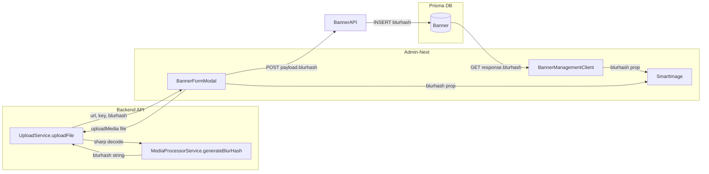

# Plan: Add Blurhash Support for Admin Banner Upload

## Current State

**No, banner upload in admin-next does NOT have blurhash support.**

Despite the existing blurhash infrastructure in the codebase:

| Layer | Blurhash Status |
|-------|----------------|
| Upload API (`POST /v1/admin/upload/image`) | ✅ Already returns `{ url, key, blurhash? }` |
| `SmartImage` component | ✅ Already supports `blurhash` prop with CSS-based placeholder |
| Banner Prisma model (`Banner`) | ❌ No `blurhash` field |
| `CreateBannerDto` | ❌ No `blurhash` field |
| `BannerResponseDto` | ❌ No `blurhash` field |
| `BannerService` | ❌ Doesn't handle `blurhash` |
| `Banner` type (admin-next) | ❌ No `blurhash` field |
| `BannerFormModal` upload handler | ❌ Destructures only `{ url }`, discards `blurhash` |
| `BannerFormModal` SmartImage preview | ❌ No `blurhash` prop passed |
| `BannerManagementClient` table view | ❌ SmartImage not passed `blurhash` |
| Client `BannersService` select | ❌ Doesn't select `blurhash` |

**Comparison**: The Treasure/Product flow already has blurhash fully implemented end-to-end. The banner flow is missing all the same pieces.

## Impact

- Banner images in admin-next show a spinner (`Loader2`) during loading instead of a smooth blurhash placeholder
- On slow connections, the table and form preview have a jarring flash/spinner experience
- Mobile app consuming banner data has no blurhash to use for placeholders

## Proposed Solution



## Steps

### Step 1: Add `blurhash` field to Banner Prisma model

- **File**: [`apps/api/prisma/schema.prisma`](apps/api/prisma/schema.prisma:552)
- Add after `bannerImgUrl` line:
  ```
  blurhash          String?   @map("blurhash") @db.VarChar(255)
  ```
- Run migration:
  ```bash
  cd apps/api && npx prisma migrate dev --name add_banner_blurhash
  ```

### Step 2: Add `blurhash` to CreateBannerDto

- **File**: [`apps/api/src/admin/banner/dto/create-banner.dto.ts`](apps/api/src/admin/banner/dto/create-banner.dto.ts:28)
- Add after `bannerImgUrl`:
  ```ts
  @ApiPropertyOptional({ description: 'Blurhash placeholder for banner image' })
  @IsOptional()
  @IsString()
  blurhash?: string;
  ```

### Step 3: Add `blurhash` to BannerResponseDto

- **File**: [`apps/api/src/admin/banner/dto/banner-response.dto.ts`](apps/api/src/admin/banner/dto/banner-response.dto.ts:26)
- Add after `bannerImgUrl`:
  ```ts
  @ApiProperty({ description: 'Blurhash placeholder', required: false })
  @Expose()
  blurhash?: string;
  ```

### Step 4: Update BannerService to save/update blurhash

- **File**: [`apps/api/src/admin/banner/banner.service.ts`](apps/api/src/admin/banner/banner.service.ts:36)
- In `create()`: add `blurhash: dto.blurhash` to the Prisma create data
- In `update()`: add `blurhash: dto.blurhash` to the Prisma update data (it will only apply if present via `PartialType`)

### Step 5: Update client BannersService to expose blurhash

- **File**: [`apps/api/src/client/banners/banners.service.ts`](apps/api/src/client/banners/banners.service.ts:42)
- Add `blurhash: true` to the `select` object in `findMany()`

### Step 6: Add `blurhash` to Banner type in admin-next

- **File**: [`apps/admin-next/src/type/types.ts`](apps/admin-next/src/type/types.ts:253)
- Add after `bannerImgUrl`:
  ```ts
  /** Blurhash placeholder for the banner image */
  blurhash?: string;
  ```

### Step 7: Update BannerFormModal to capture and pass blurhash

- **File**: [`apps/admin-next/src/views/banner/BannerFormModal.tsx`](apps/admin-next/src/views/banner/BannerFormModal.tsx:64)
- Change:
  ```ts
  const { url } = await uploadApi.uploadMedia(values.bannerImgUrl);
  ```
  To:
  ```ts
  const { url, blurhash } = await uploadApi.uploadMedia(values.bannerImgUrl);
  ```
- Pass `blurhash` in the payload:
  ```ts
  const payload = {
    ...values,
    bannerImgUrl,
    blurhash,
  };
  ```

### Step 8: Pass blurhash to SmartImage in BannerFormModal preview

- **File**: [`apps/admin-next/src/views/banner/BannerFormModal.tsx`](apps/admin-next/src/views/banner/BannerFormModal.tsx:130)
- The `FormMediaUploaderField` renders `SmartImage` but gets its `src` from the upload response internally. We need to check if the preview SmartImage can receive blurhash.
- Note: The `FormMediaUploaderField` manages its own preview rendering. The `renderImage` callback receives `{ src, alt, className }` from the field's internal state (blob URL). Blurhash for the preview would need to come from the upload response, which happens at submit time, not during file selection. **Skip this for now** — fix only the submit flow.

### Step 9: Pass blurhash to SmartImage in BannerManagementClient table

- **File**: [`apps/admin-next/src/components/banners/BannerManagementClient.tsx`](apps/admin-next/src/components/banners/BannerManagementClient.tsx:189)
- Add `blurhash={info.row.original.blurhash}` to the `SmartImage`:
  ```tsx
  <SmartImage
    src={info.getValue()}
    blurhash={info.row.original.blurhash}
    width={128}
    height={64}
    className="w-full h-full object-cover"
    imgClassName="w-full h-full object-cover"
    layout="fixed"
  />
  ```

## Testing

1. Upload a banner image → verify API response includes `blurhash` field
2. Create a banner → verify `blurhash` is saved in DB
3. Edit a banner with a new image → verify `blurhash` is updated
4. View banner list → verify `SmartImage` shows blurhash placeholder during image load (no more spinner)
5. Verify client `GET /banners` API returns `blurhash` field
6. Run `npx prisma migrate dev` to apply schema change
