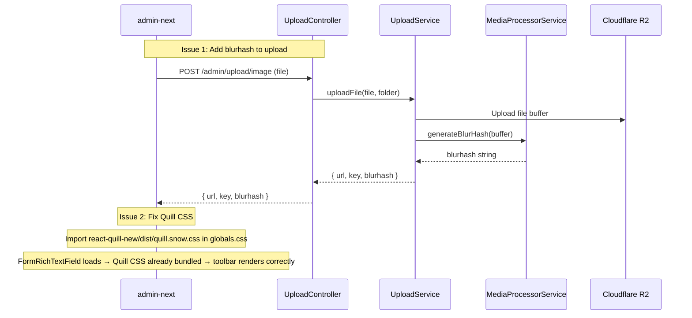

# Plan: Fix Rich Text Editor Toolbar & Add Blurhash to Admin Uploads

## Issue 1: Blurhash Generation Not Enabled for Admin Image Uploads

### Root Cause
The upload endpoint `POST /v1/admin/upload/image` ([`upload.controller.ts`](apps/api/src/common/upload/upload.controller.ts)) calls [`UploadService.uploadFile()`](apps/api/src/common/upload/upload.service.ts:373), which only triggers blurhash processing when `articleId` is provided. For admin product uploads (covers, editor images), no `articleId` is passed, so no blurhash is generated.

The [`MediaProcessorService.generateBlurHash()`](apps/api/src/common/media/media-processor.service.ts:114) method is private and only used in the async blog media pipeline. Blurhash generation is actually fast (~50ms for 32x32 resize + encode) and could be done synchronously during upload.

### Changes Needed

#### Step 1.1: Add `blurhash` field to upload response type (Admin-next API)
- **File:** [`apps/admin-next/src/api/index.ts`](apps/admin-next/src/api/index.ts:602)
- Update the `uploadMedia` return type from `{ url: string; key: string }` to `{ url: string; key: string; blurhash?: string }`

#### Step 1.2: Expose `generateBlurHash` as public method in MediaProcessorService
- **File:** [`apps/api/src/common/media/media-processor.service.ts`](apps/api/src/common/media/media-processor.service.ts:114)
- Change `private async generateBlurHash()` → `async generateBlurHash()` so it can be reused

#### Step 1.3: Modify UploadController to accept blurhash flag
- **File:** [`apps/api/src/common/upload/upload.controller.ts`](apps/api/src/common/upload/upload.controller.ts:57)
- Pass the file buffer to `UploadService.uploadFile()` so blurhash can be generated before upload

#### Step 1.4: Generate blurhash in UploadService
- **File:** [`apps/api/src/common/upload/upload.service.ts`](apps/api/src/common/upload/upload.service.ts:373)
- Inject `MediaProcessorService` into `UploadService`
- After uploading to S3, generate blurhash from the buffer
- Return `blurhash` in the response

---

## Issue 2: Rich Text Editor Toolbar Renders Unstyled Before Stabilizing

### Root Cause
The [`FormRichTextField`](packages/ui/src/form/FormRichTextField.tsx) component uses `react-quill-new` with the `snow` theme. However, the [`@repo/ui` build script](packages/ui/scripts/build.js:185) strips all CSS imports via `loader: { ".css": "empty" }`.

This means Quill's snow theme CSS (`react-quill-new/dist/quill.snow.css`) is never loaded in admin-next. The component shows a skeleton while JS loads, but when Quill renders, the toolbar buttons appear as unstyled HTML. Only after some CSS cascade takes effect (or the app re-renders) does the toolbar snap into its styled form.

### Changes Needed

#### Step 2.1: Import Quill snow CSS in admin-next
- **File:** [`apps/admin-next/src/app/globals.css`](apps/admin-next/src/app/globals.css)
- Add `@import 'react-quill-new/dist/quill.snow.css';`
- This ensures the Quill CSS is bundled with admin-next's main CSS chunk

#### Step 2.2: Improve loading experience in FormRichTextField
- **File:** [`packages/ui/src/form/FormRichTextField.tsx`](packages/ui/src/form/FormRichTextField.tsx:117)
- Replace the simple skeleton with a more targeted toolbar placeholder
- Use `requestAnimationFrame` or `useIsomorphicLayoutEffect` to delay showing Quill until after the first render, so CSS is applied before the user sees the toolbar

---

## Files to Modify Summary

| # | File | Change |
|---|------|--------|
| 1 | `apps/admin-next/src/api/index.ts` | Add `blurhash?: string` to upload response type |
| 2 | `apps/api/src/common/media/media-processor.service.ts` | Make `generateBlurHash()` public |
| 3 | `apps/api/src/common/upload/upload.controller.ts` | Pass file buffer for blurhash generation |
| 4 | `apps/api/src/common/upload/upload.service.ts` | Inject MediaProcessorService, generate blurhash, return it |
| 5 | `apps/admin-next/src/app/globals.css` | Import `react-quill-new/dist/quill.snow.css` |
| 6 | `packages/ui/src/form/FormRichTextField.tsx` | Improve loading UX to prevent unstyled toolbar flash |

## Flow Diagram

## Testing Notes
1. Upload an image from admin product form → verify response includes `blurhash` field
2. Open/create a product with rich text editor → verify toolbar renders correctly on first load
3. Test with both Create and Edit product modals
4. Verify existing blog upload flow still works (blurhash queue job)
