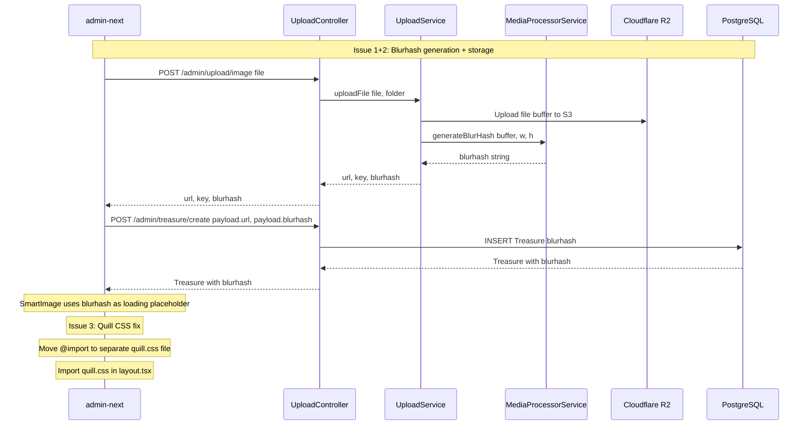

# Plan: Fix Rich Text Editor Toolbar & Add Blurhash to Admin Uploads

## Current State Analysis

After reviewing the codebase, the original plan has been **partially implemented**. Here's what's already done vs what still needs work:

### ✅ Already Implemented

| # | Change | Status |
|---|--------|--------|
| 1 | `apps/admin-next/src/api/index.ts` — `blurhash?: string` in upload response type | ✅ Done |
| 2 | `apps/api/src/common/media/media-processor.service.ts` — `generateBlurHash()` is public | ✅ Done |
| 3 | `apps/api/src/common/upload/upload.service.ts` — `uploadFile()` generates blurhash for ALL image uploads (lines 397-414) | ✅ Done |
| 4 | `apps/api/src/common/upload/upload.service.ts` — `MediaProcessorService` injected via `forwardRef` | ✅ Done |
| 5 | `apps/api/src/common/upload/upload.module.ts` — `forwardRef(() => MediaProcessorModule)` | ✅ Done |
| 6 | `apps/api/src/common/media/media-processor.module.ts` — `forwardRef(() => UploadModule)` | ✅ Done |
| 7 | `apps/admin-next/src/app/globals.css` — `@import 'react-quill-new/dist/quill.snow.css'` | ✅ Done |
| 8 | `packages/ui/src/form/FormRichTextField.tsx` — Skeleton loading state for Quill | ✅ Done |

### ❌ Still Missing / Issues

| # | Issue | Details |
|---|-------|---------|
| 1 | `confirmUpload()` presigned URL flow lacks blurhash | Only returns `{ url, key }`, no blurhash generated |
| 2 | Blurhash not stored in DB | No `blurhash` field in `Treasure` model or any product table |
| 3 | Blurhash not consumed in admin-next | Product forms only use `res.url`, ignore `res.blurhash` |
| 4 | `SmartImage` component has no blurhash placeholder | Currently shows a spinner (`Loader2`) during loading |
| 5 | Quill CSS `@import` may not work with Tailwind v4 | `@import` at top of CSS file may be stripped by Tailwind v4's PostCSS pipeline |

---

## Issue 1: Blurhash Not Generated for Presigned URL Flow

### Root Cause
[`UploadService.confirmUpload()`](apps/api/src/common/upload/upload.service.ts:490) is called after a direct browser-to-R2 upload. It only returns `{ url, key }` and does NOT generate blurhash. The blurhash generation in [`uploadFile()`](apps/api/src/common/upload/upload.service.ts:397) works because it has access to `file.buffer` (Multer). For presigned URLs, the file goes directly to R2, so we'd need to download it back to generate blurhash — which is expensive.

### Decision
**Skip blurhash for presigned URL flow.** The presigned URL flow is used for blog articles (large videos/images), where blurhash is already generated by the async `compress-image` BullMQ job in [`MediaProcessor.handleCompressImage()`](apps/api/src/common/media/media.processor.ts:106). For admin product uploads, the direct `POST /admin/upload/image` endpoint is used, which already generates blurhash synchronously.

**No changes needed for `confirmUpload()`.**

---

## Issue 2: Blurhash Not Stored or Consumed

### Root Cause
The blurhash is generated during upload and returned in the API response, but:
1. The product forms ([`CreateProductFormModal`](apps/admin-next/src/views/product/CreateProductFormModal.tsx:107), [`EditProductFormModal`](apps/admin-next/src/views/product/EditProductFormModal.tsx:116)) only use `res.url`, ignoring `res.blurhash`
2. The [`Treasure` model](apps/api/prisma/schema.prisma:322) has no `blurhash` field
3. The [`SmartImage`](apps/admin-next/src/components/ui/SmartImage.tsx) component shows a spinner during loading instead of a blurhash placeholder

### Changes Needed

#### Step 2.1: Add `blurhash` field to Treasure model
- **File:** [`apps/api/prisma/schema.prisma`](apps/api/prisma/schema.prisma:333)
- Add `blurhash String? @map("blurhash") @db.VarChar(255)` after `treasureCoverImg`
- Run `npx prisma migrate dev --name add_blurhash` to generate migration

#### Step 2.2: Update CreateTreasureDto to accept blurhash
- **File:** [`apps/api/src/admin/treasure/dto/create-treasure.dto.ts`](apps/api/src/admin/treasure/dto/create-treasure.dto.ts:55)
- Add `@IsOptional() @IsString() blurhash?: string` field

#### Step 2.3: Update TreasureResponseDto to expose blurhash
- **File:** [`apps/api/src/admin/treasure/dto/treasure-response.dto.ts`](apps/api/src/admin/treasure/dto/treasure-response.dto.ts:86)
- Add `@Expose() blurhash?: string` field

#### Step 2.4: Update treasure service to save blurhash
- **File:** [`apps/api/src/admin/treasure/treasure.service.ts`](apps/api/src/admin/treasure/treasure.service.ts:35)
- In `create()`: save `blurhash` from DTO to the Treasure record
- In `update()`: save `blurhash` from DTO if provided

#### Step 2.5: Update product forms to pass blurhash
- **File:** [`apps/admin-next/src/views/product/CreateProductFormModal.tsx`](apps/admin-next/src/views/product/CreateProductFormModal.tsx:107)
- Change `const res = await upload.runAsync(...)` → `const { url, blurhash } = await upload.runAsync(...)`
- Pass `blurhash` in the create payload

- **File:** [`apps/admin-next/src/views/product/EditProductFormModal.tsx`](apps/admin-next/src/views/product/EditProductFormModal.tsx:116)
- Same change as Create

#### Step 2.6: Update admin-next Product type
- **File:** [`apps/admin-next/src/type/types.ts`](apps/admin-next/src/type/types.ts:98)
- Add `blurhash?: string` to both `Product` and `CreateProduct` interfaces

#### Step 2.7: Add blurhash placeholder to SmartImage
- **File:** [`apps/admin-next/src/components/ui/SmartImage.tsx`](apps/admin-next/src/components/ui/SmartImage.tsx)
- Add `blurhash?: string` prop to `SmartImageProps`
- Install `blurhash` npm package in admin-next: `yarn workspace @lucky/admin-next add blurhash`
- When `blurhash` is provided and image is loading, render a CSS `background` using the decoded blurhash color instead of the spinner
- Use a simple CSS gradient approximation (no need for full canvas decode — just use the average color from blurhash for simplicity, or use the `blurhash` decode for a proper placeholder)

**Simpler approach:** Since full blurhash canvas decoding adds complexity, use a CSS `background-color` extracted from the blurhash string's average color. Or use the `blurhash` package's `decode` to render a tiny canvas as background.

---

## Issue 3: Quill Toolbar CSS Loading

### Root Cause
The [`@import 'react-quill-new/dist/quill.snow.css'`](apps/admin-next/src/app/globals.css:2) is placed after the Tailwind v4 `@import 'tailwindcss'`. Tailwind v4 uses a custom PostCSS pipeline that may strip or mishandle `@import` rules that aren't part of its own CSS processing.

### Changes Needed

#### Step 3.1: Move Quill CSS import to a separate CSS file
- **File:** [`apps/admin-next/src/app/globals.css`](apps/admin-next/src/app/globals.css)
- Remove the `@import 'react-quill-new/dist/quill.snow.css';` line
- Create a new file: [`apps/admin-next/src/app/quill.css`](apps/admin-next/src/app/quill.css) with:
  ```css
  @import 'react-quill-new/dist/quill.snow.css';
  ```

#### Step 3.2: Import quill.css in layout
- **File:** [`apps/admin-next/src/app/layout.tsx`](apps/admin-next/src/app/layout.tsx)
- Add `import './quill.css';` alongside the existing `import './globals.css';`

This ensures the Quill CSS is loaded as a separate CSS entry point, bypassing Tailwind v4's PostCSS pipeline entirely.

---

## Files to Modify Summary

| # | File | Change |
|---|------|--------|
| 1 | `apps/api/prisma/schema.prisma` | Add `blurhash String?` field to Treasure model |
| 2 | `apps/api/src/admin/treasure/dto/create-treasure.dto.ts` | Add `@IsOptional() blurhash?: string` |
| 3 | `apps/api/src/admin/treasure/dto/treasure-response.dto.ts` | Add `@Expose() blurhash?: string` |
| 4 | `apps/api/src/admin/treasure/treasure.service.ts` | Save/update blurhash in create and update methods |
| 5 | `apps/admin-next/src/type/types.ts` | Add `blurhash?: string` to Product and CreateProduct |
| 6 | `apps/admin-next/src/views/product/CreateProductFormModal.tsx` | Pass blurhash from upload response to create payload |
| 7 | `apps/admin-next/src/views/product/EditProductFormModal.tsx` | Pass blurhash from upload response to update payload |
| 8 | `apps/admin-next/src/components/ui/SmartImage.tsx` | Add blurhash prop and render placeholder |
| 9 | `apps/admin-next/package.json` | Add `blurhash` dependency |
| 10 | `apps/admin-next/src/app/globals.css` | Remove Quill CSS `@import` |
| 11 | `apps/admin-next/src/app/quill.css` | New file with Quill CSS `@import` |
| 12 | `apps/admin-next/src/app/layout.tsx` | Import `./quill.css` |

---

## Flow Diagram



---

## Testing Notes
1. Upload an image from admin product create/edit form → verify response includes `blurhash` field
2. Create a product → verify `blurhash` is saved in DB
3. Edit a product → verify `blurhash` is updated if a new image is uploaded
4. View product list → verify `SmartImage` shows blurhash placeholder during image load
5. Open/create a product with rich text editor → verify toolbar renders correctly on first load
6. Verify existing blog upload flow still works (blurhash queue job)
7. Run `npx prisma migrate dev` to apply schema change
8. Run `yarn workspace @lucky/admin-next check-types` to verify TypeScript
