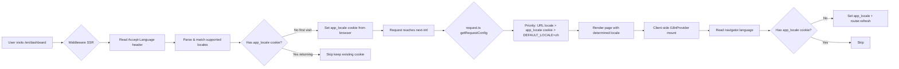

# Plan: Admin-Next Browser Language Detection

## Overview

Add automatic browser language detection to [`apps/admin-next`](../apps/admin-next) — the admin panel deployed to **Cloudflare Workers**.

**Pattern**: Same three-layer architecture as admin-blog (middleware → request.ts → I18nProvider), adapted for admin-next's **URL-based locale routing** (`/[locale]/path`) and **`app_locale` cookie**.

**Fallback**: Keep existing `DEFAULT_LOCALE = 'zh'` when no browser language match is found.

---

## Architecture



## Current State

### Locale Resolution Chain (request.ts)

1. `requestLocale` — from next-intl URL-based routing (`/[locale]/path`)
2. `app_locale` cookie — legacy, set by `LanguageProvider.setLocale()`
3. `DEFAULT_LOCALE = 'zh'` — final fallback

### Language Switch Flow (client-side)

- [`useLanguage().setLocale()`](../apps/admin-next/src/hooks/LanguageProvider.tsx:65) writes `app_locale` cookie + `localStorage` + calls `router.refresh()`
- Cookie triggers server re-render with new locale
- [`useAppStore`](../apps/admin-next/src/store/useAppStore.ts:8) persists `lang` in localStorage (for UI state only)

### Middleware (current)

- Auth-only: JWT validation, public path checks, login redirects
- **No locale detection** — this is what we're adding

---

## Changes

### 1. Create [`apps/admin-next/src/lib/utils/locale.ts`](../apps/admin-next/src/lib)

Same pattern as admin-blog's [`locale.ts`](../apps/admin-blog/src/lib/utils/locale.ts): inline locale codes to avoid `@lucky/shared` import on Edge Runtime.

```typescript
const SUPPORTED_LOCALES = ['en', 'zh', 'ja', 'ko', 'fr', 'de'] as const;
export type Locale = (typeof SUPPORTED_LOCALES)[number];
export const FALLBACK_LOCALE: Locale = 'en'; // Only used for Accept-Language matching

// Functions (same as admin-blog):
export function parseAcceptLanguage(header: string | null): Locale | null { ... }
export function detectLocaleFromRequest(request: NextRequest): Locale { ... }
export function detectLocaleFromBrowser(): Locale { ... }
export function isSupportedLocale(code: string): code is Locale { ... }
```

**Note**: `FALLBACK_LOCALE` here is only for the Accept-Language parsing utility. The actual app fallback remains `DEFAULT_LOCALE = 'zh'` in `request.ts`.

### 2. Modify [`apps/admin-next/src/middleware.ts`](../apps/admin-next/src/middleware.ts)

Add locale detection block **before** auth logic (similar to admin-blog):

```typescript
import { detectLocaleFromRequest, FALLBACK_LOCALE } from '@/lib/utils/locale';
import type { Locale } from '@/lib/utils/locale';

// Inline locale codes (Edge Runtime — no @lucky/shared)
const AVAILABLE_LOCALES = ['en', 'zh', 'ja', 'ko', 'fr', 'de'] as const;

export function middleware(request: NextRequest) {
  const { pathname, searchParams } = request.nextUrl;

  // ── Locale detection (before auth) ──────────────────────────────
  // Only detect on first visit (no app_locale cookie)
  const existingLocale = request.cookies.get('app_locale')?.value;
  let detectedLocale: string | undefined;

  if (!existingLocale || !AVAILABLE_LOCALES.includes(existingLocale as Locale)) {
    const detected = detectLocaleFromRequest(request);
    // Only set cookie if detected locale differs from FALLBACK_LOCALE
    // (English is common, no need to persist it)
    if (detected !== FALLBACK_LOCALE) {
      detectedLocale = detected;
    }
  }

  const applyLocaleCookie = (res: NextResponse) => {
    if (detectedLocale) {
      res.cookies.set('app_locale', detectedLocale, {
        path: '/',
        maxAge: 31536000,
        sameSite: 'lax',
        secure: process.env.NODE_ENV === 'production',
      });
    }
  };

  // Apply to ALL response paths (same as admin-blog pattern)
```

**Key points**:
- Uses `app_locale` cookie (admin-next's cookie name), NOT `NEXT_LOCALE`
- `applyLocaleCookie` is called on every response path (auth redirects, public paths, normal)
- Only sets cookie on first visit when no existing `app_locale` cookie
- Only sets cookie for non-English locales (English is the common case, no need to persist)

### 3. Modify [`apps/admin-next/src/i18n/request.ts`](../apps/admin-next/src/i18n/request.ts)

Update the locale resolution chain to consider the `app_locale` cookie as a middleware-set signal BEFORE falling back to `DEFAULT_LOCALE`:

```typescript
export default getRequestConfig(async ({ requestLocale }) => {
  let locale: Locale = DEFAULT_LOCALE;

  // 1. URL locale — from next-intl routing (highest priority)
  try {
    const rl = await requestLocale;
    if (rl && AVAILABLE_LOCALES.includes(rl as Locale)) {
      locale = rl as Locale;
    }
  } catch { /* fall through */ }

  // 2. app_locale cookie — set by middleware from Accept-Language, or by LanguageProvider
  if (locale === DEFAULT_LOCALE) {
    try {
      const cookieStore = await cookies();
      const c = cookieStore.get('app_locale')?.value;
      if (c && AVAILABLE_LOCALES.includes(c as Locale)) {
        locale = c as Locale;
      }
    } catch { /* fall through */ }
  }

  // 3. DEFAULT_LOCALE ('zh') is already set as the initial value
  // No English fallback — admin-next's default is Chinese
```

**Key change**: The cookie fallback now also catches the locale set by middleware (not just the legacy LanguageProvider). The URL locale still takes highest priority since that's the explicit route the user navigated to.

### 4. Create [`apps/admin-next/src/lib/providers/I18nProvider.tsx`](../apps/admin-next/src/lib/providers)

Fork of admin-blog's I18nProvider, adapted for `app_locale` cookie:

```typescript
'use client';

import { useEffect } from 'react';
import { useRouter } from 'next/navigation';
import { useLocale } from 'next-intl';
import { detectLocaleFromBrowser, FALLBACK_LOCALE } from '@/lib/utils/locale';
import { AVAILABLE_LOCALES } from '@lucky/shared';
import type { Locale } from '@lucky/shared';

export default function I18nProvider({
  children,
}: {
  children: React.ReactNode;
}) {
  const currentLocale = useLocale();
  const router = useRouter();

  useEffect(() => {
    if (typeof document === 'undefined') return;

    // Sync locale to document
    document.documentElement.lang = currentLocale;

    // If user has an app_locale cookie (manually chosen or set by middleware), skip
    const hasCookie = document.cookie.match(/(^| )app_locale=([^;]+)/);
    if (hasCookie) return;

    // Only auto-detect on first visit (no cookie)
    const browserLang = detectLocaleFromBrowser();
    if (browserLang === currentLocale) return;
    if (browserLang === FALLBACK_LOCALE && currentLocale === FALLBACK_LOCALE) return;

    // Set cookie and refresh
    const expires = new Date(Date.now() + 365 * 24 * 60 * 60 * 1000).toUTCString();
    document.cookie = `app_locale=${browserLang}; path=/; expires=${expires}; SameSite=Lax`;
    router.refresh();
  }, [currentLocale, router]);

  return <>{children}</>;
}
```

**Note**: Imports `AVAILABLE_LOCALES` from `@lucky/shared` — this is fine because it runs client-side (browser has Web Crypto API).

### 5. Modify [`apps/admin-next/src/app/layout.tsx`](../apps/admin-next/src/app/layout.tsx)

Wrap children with I18nProvider:

```typescript
import I18nProvider from '@/lib/providers/I18nProvider';

// Inside RootLayout:
<NextIntlClientProvider locale={locale} messages={messages}>
  <I18nProvider>
    <Providers>{children}</Providers>
  </I18nProvider>
</NextIntlClientProvider>
```

---

## Files Summary

| File | Action | Purpose |
|------|--------|---------|
| [`apps/admin-next/src/lib/utils/locale.ts`](../apps/admin-next/src/lib) | **Create** | Locale detection utilities (inline codes, no @lucky/shared) |
| [`apps/admin-next/src/middleware.ts`](../apps/admin-next/src/middleware.ts) | **Modify** | Add Accept-Language detection before auth, set `app_locale` cookie |
| [`apps/admin-next/src/i18n/request.ts`](../apps/admin-next/src/i18n/request.ts) | **Modify** | Midify locale resolution chain (minor: ensure cookie fallback works) |
| [`apps/admin-next/src/lib/providers/I18nProvider.tsx`](../apps/admin-next/src/lib/providers) | **Create** | Client-side navigator.language detection |
| [`apps/admin-next/src/app/layout.tsx`](../apps/admin-next/src/app/layout.tsx) | **Modify** | Wrap with I18nProvider |
| [`apps/admin-next/next.config.ts`](../apps/admin-next/next.config.ts) | **No change** | Already has node:crypto shim for both turbopack + webpack |

---

## Edge Cases

1. **First visit, Chinese browser**: Accept-Language `zh-CN,zh;q=0.9` → matches `zh` → detected !== `DEFAULT_LOCALE`? → `zh` !== `'en'` (FALLBACK_LOCALE) → set cookie → user sees Chinese. ✅
2. **First visit, English browser**: Accept-Language `en-US,en;q=0.9` → matches `en` → `en` === `FALLBACK_LOCALE` → cookie NOT set → server uses DEFAULT_LOCALE (`'zh'`)... Wait — this is a problem. If admin-next's default is `'zh'`, English users will see Chinese interface. They'd need to click the manual switch.

   **Decision needed**: Should we set the cookie even for English users in admin-next? Unlike admin-blog where `FALLBACK_LOCALE = 'en'` was the default, admin-next's default is `'zh'`. If an English-speaking admin visits, they definitely want English.

   **Resolution**: Change the logic in middleware to NOT compare against `FALLBACK_LOCALE` for admin-next. Instead, always set cookie when detected locale differs from the cookie value:

   ```typescript
   // For admin-next: always set cookie if detected differs from current cookie
   const existingLocale = request.cookies.get('app_locale')?.value;
   if (!existingLocale || !(AVAILABLE_LOCALES as readonly string[]).includes(existingLocale)) {
     const detected = detectLocaleFromRequest(request);
     detectedLocale = detected; // Always set, even for English
   }
   ```

3. **First visit, unsupported language** (e.g., Thai): No match → `detectLocaleFromRequest` returns `FALLBACK_LOCALE ('en')` → cookie set to `'en'` → server uses `'en'` for this user. ✅ (Better than showing Chinese to a Thai speaker)

4. **Returning user with `app_locale` cookie**: Middleware detects existing cookie → skips detection → uses cookie value. ✅

5. **Manual switch via LanguageProvider**: Writes `app_locale` cookie → middleware sees cookie → skips detection → respects user's choice. ✅

6. **URL locale override**: User navigates to `/zh/dashboard` → next-intl extracts `zh` from URL → request.ts uses URL locale (highest priority) over cookie. ✅

---

## Differences from Admin-Blog Implementation

| Aspect | Admin-Blog | Admin-Next |
|--------|-----------|------------|
| Cookie name | `NEXT_LOCALE` | `app_locale` |
| Final fallback | `FALLBACK_LOCALE = 'en'` | `DEFAULT_LOCALE = 'zh'` |
| URL-based locale | No (cookie-only) | Yes (`/[locale]/path`) |
| Detection for English | Skip (no cookie) | Always set cookie (English != Chinese default) |
| next-intl middleware | Not used | Not used (URL handled by pages directory) |
| Deploy target | Docker/Vercel Node.js | Cloudflare Workers |
| `node:crypto` shim | webpack only (client-side) | turbopack + webpack (client-side) |

---

## Verification

```bash
# TypeScript check
cd /Volumes/MySSD/work/JoyMini_Nest_Monorepo && yarn workspace @lucky/admin-next typecheck

# Lint + Prettier
cd /Volumes/MySSD/work/JoyMini_Nest_Monorepo && yarn workspace @lucky/admin-next lint
cd /Volumes/MySSD/work/JoyMini_Nest_Monorepo && yarn workspace @lucky/admin-next prettier --write

# Build test (Cloudflare Workers output)
cd /Volumes/MySSD/work/JoyMini_Nest_Monorepo && yarn workspace @lucky/admin-next build

# Edge Runtime compatibility — verify no @lucky/shared imports in:
# - apps/admin-next/src/lib/utils/locale.ts
# - apps/admin-next/src/middleware.ts
```
