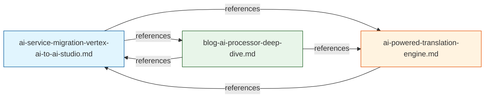

# AI Article Series — Restructuring Plan

## Problem Statement

Three articles cover the AI subsystem with significant overlap and outdated content:

| Article | Status | Problem |
|---------|--------|---------|
| [`ai-service-migration-vertex-ai-to-ai-studio.md`](../docs/blog/articles/api/ai-service-migration-vertex-ai-to-ai-studio.md) | ✅ Well-structured | Already covers migration + multi-key rotation well. Keep as-is. |
| [`ai-powered-translation-engine.md`](../docs/blog/articles/api/ai-powered-translation-engine.md) | ❌ Outdated | Still references Vertex AI code. Overlaps heavily with blog-ai-processor-deep-dive.md (~60% content duplication). |
| [`blog-ai-processor-deep-dive.md`](../docs/blog/articles/api/blog-ai-processor-deep-dive.md) | ⚠️ Problematic | Written without knowledge of multi-key rotation. Overlaps with ai-powered-translation-engine.md on translation pipeline, cache, moderation, auto-reply, BullMQ. |

## Root Cause

Both [`ai-powered-translation-engine.md`](../docs/blog/articles/api/ai-powered-translation-engine.md) and [`blog-ai-processor-deep-dive.md`](../docs/blog/articles/api/blog-ai-processor-deep-dive.md) try to cover **both layers** of the two-layer architecture:

```
BlogAiProcessor (BullMQ Worker - Business Logic)
    └── calls ──→ AiService (LLM Integration - Resilience Layer)
```

When they should each focus on **one layer only**.

## Proposed Solution: Clean Layer Separation

### Current Content Mapping

```
ai-powered-translation-engine.md (NOW)     blog-ai-processor-deep-dive.md (NOW)
├── Architecture Overview                   ├── Architecture Overview
├── AI Service Layer (Vertex AI) ❌         ├── Intelligent Backoff & Rate Limiting
├── Resilience Patterns                     ├── Translation Quality & Reliability
│   ├── Rate Limiting                       │   ├── L1 Cache
│   ├── Service Degradation                 │   ├── translateWithRetry
│   ├── Circuit Breaker                     │   └── batchTranslateArticle
│   ├── Backoff Retry                       ├── Core Business Processes
│   └── 429 Handling                        │   ├── moderate-comment
├── Translation Pipeline                    │   ├── auto-reply
│   ├── Batch Translation                   │   └── translate-article
│   ├── Fallback Chain                      ├── Error Handling
│   ├── Progress Tracking                   └── Conclusion
│   └── Translation Cache                   
├── Content Moderation & Auto-Reply         *** OVERLAP: 60% shared content ***
├── BullMQ Integration                      (both cover cache, translation,
├── Comparison Table                        moderation, auto-reply, rate limiting,
└── Key Takeaways                           batch translation, BullMQ)
```

### Target Content Mapping

```
ai-powered-translation-engine.md (REWRITTEN)   blog-ai-processor-deep-dive.md (REWRITTEN)
├── Architecture Overview (update to AI Studio) ├── BullMQ Processor Architecture
├── Initialization (Google AI Studio SDK)       │   ├── @Processor config
│   ├── Multi-Key Parsing                       │   ├── concurrency:1
│   └── GeminiKeyInstance[]                     │   └── limiter:5 RPM
├── Multi-Key Rotation ★NEW★                    ├── Job Dispatcher (process())
│   ├── rotateToNextKey() logic                 │   ├── moderate-comment
│   ├── Per-key daily budget tracking           │   ├── auto-reply
│   ├── Per-key 429 cooldown (60s)              │   ├── translate-article
│   └── Midnight reset for all keys             │   ├── translate-category
├── Rate Limiting                               │   └── translate-tag
│   ├── 12 RPM shared across keys               ├── getSourceContent() Helper
│   └── 800K TPM shared across keys             │   └── Localized field extraction strategy
├── Service Level Degradation                   ├── batchTranslateArticle()
│   ├── FULL→ESSENTIAL→MINIMAL→DISABLED         │   └── Orchestration flow (not AiService details)
│   └── Auto-recovery every 5 min               ├── translateWithRetry() Backoff
├── Circuit Breaker                             │   └── Jitter & exponential backoff
│   └── 5 consecutive failures → 15 min open    ├── L1 Translation Cache
├── Comment Moderation (moderateComment)         │   └── 1h TTL + cleanup
├── Auto-Reply Generation (generateAutoReply)    ├── TranslationJobService Progress Tracking
├── Translation Methods                          ├── Process Flow: translate-article
│   ├── translateText()                         │   └── DB writes (articleLocale upsert)
│   ├── translateMarkdown()                     ├── Process Flow: translate-category
│   └── generateContentFromImage() for KYC      ├── Process Flow: translate-tag
├── Usage Stats (getUsageStats)                  ├── Process Flow: moderate-comment
├── Cross-References                            ├── Process Flow: auto-reply
└── Key Takeaways                               ├── Error Handling
                                                 │   ├── Fail-without-throwing
                                                 │   ├── OpenSSL detection
                                                 │   └── Video tag preservation
                                                 ├── Cross-References
                                                 └── Key Takeaways

ai-service-migration-vertex-ai-to-ai-studio.md (KEEP - MINOR UPDATE)
├── Problem: $28/day cost shock
├── SDK Migration (Vertex AI → Google AI Studio)
├── Hard Daily Budget Cap
├── Multi-Key Rotation (already covered well!)
├── Architecture: Before vs After
├── Resilience Patterns
├── Files Modified
└── Key Takeaways
```

## Detailed Todo Breakdown

### Task 1: Rewrite [`ai-powered-translation-engine.md`](../docs/blog/articles/api/ai-powered-translation-engine.md)

**Scope:** Rewrite the entire article to focus on the `AiService` layer only.

**Content to REMOVE** (move to blog-ai-processor-deep-dive.md):
- Batch translation orchestration details (`batchTranslateArticle` flow)
- L1 translation cache implementation details
- Progress tracking with `TranslationJobService`
- BullMQ configuration and job types
- JSON fallback chain details (repairJsonResponse)

**Content to ADD/UPDATE:**
- Update all Vertex AI references to Google AI Studio
- Add multi-key rotation architecture (from ai.service.ts lines 171-246)
- Add `rotateToNextKey()` detailed explanation (lines 252-306)
- Add per-key daily budget tracking (lines 32-40)
- Add 429 per-key cooldown logic (lines 384-424)
- Add `getUsageStats()` for observability (lines 902-928)
- Add shared RPM/TPM across keys concept
- Add Mermaid diagrams for: multi-key rotation flow, rate limiting state machine
- Add comparison table: Single Key vs Multi-Key (daily budget, 429 recovery, max capacity)
- Add Key Takeaways focused on multi-key design decisions

**Title suggestion:** "AI Service Layer: Multi-Key Rotation, Rate Limiting & Graceful Degradation with Google AI Studio Gemini"

### Task 2: Rewrite [`blog-ai-processor-deep-dive.md`](../docs/blog/articles/api/blog-ai-processor-deep-dive.md)

**Scope:** Rewrite to focus on `BlogAiProcessor` business logic orchestration only.

**Content to REMOVE** (move to ai-powered-translation-engine.md):
- Rate limiting details (12 RPM, 800K TPM) — should reference AiService
- Circuit breaker explanation — should reference AiService
- Service level degradation — should reference AiService
- AiService initialization details

**Content to KEEP and IMPROVE:**
- BullMQ Processor decorator configuration
- 5 Job Types + process() dispatcher
- `getSourceContent()` helper for localized field extraction
- `batchTranslateArticle()` orchestration (what it does, not how AiService does it)
- `translateWithRetry()` backoff strategy (flow, not implementation)
- L1 Cache: key strategy, TTL, cleanup interval
- TranslationJobService progress tracking
- Process flows for each job type (with Mermaid diagrams!)
- Error handling: fail-without-throwing, OpenSSL detection
- Video tag preservation
- Category/Tag translation strategies

**Content to ADD:**
- Mermaid diagrams for each job type's full process flow
- Multi-key awareness: how BlogAiProcessor interacts with the multi-key AiService
- Cross-references to ai-powered-translation-engine.md for AiService details
- Cross-references to ai-service-migration-vertex-ai-to-ai-studio.md for migration context

### Task 3: Minor update to [`ai-service-migration-vertex-ai-to-ai-studio.md`](../docs/blog/articles/api/ai-service-migration-vertex-ai-to-ai-studio.md)

**Scope:** Very minor changes — just add cross-references.

- Add cross-reference at the end: "See [ai-powered-translation-engine.md](...) for detailed AiService architecture" 
- Add cross-reference: "See [blog-ai-processor-deep-dive.md](...) for BlogAiProcessor business logic"
- No other changes needed since multi-key rotation is already well-covered

### Task 4: Final Review

- Verify no remaining content overlap between the three articles
- Verify all cross-references point to correct files
- Verify code snippets match actual [`ai.service.ts`](../apps/api/src/common/ai/ai.service.ts) and [`blog-ai.processor.ts`](../apps/api/src/blog/processors/blog-ai.processor.ts)
- Verify Mermaid diagrams render correctly
- Verify Chinese article (`blog-ai-processor-deep-dive.md`) maintains language consistency
- Run `prettier` on all modified markdown files

## Cross-Reference Architecture



## Article Relationship

| Article | Audience | Focus | Updates Needed |
|---------|----------|-------|----------------|
| Migration Story | DevOps / Decision-makers | Why we migrated, cost savings, architecture change | Minor cross-refs |
| AiService Layer | Backend engineers | Multi-key rotation, resilience patterns, API design | Full rewrite |
| BlogAiProcessor | Backend engineers | BullMQ orchestration, business logic, job flows | Full rewrite |
