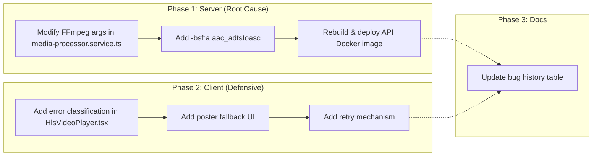

# Android HLS Audio LATM Compatibility Fix Plan

## Problem

HLS video transcoding pipeline outputs AAC audio in LATM encapsulation format (`audio/mp4a-latm`). Android ExoPlayer's HLS demuxer does not support LATM-wrapped AAC in MPEG-TS segments, causing `SampleQueueMappingException` and playback failure.

iOS AVPlayer handles LATM fine, so this issue only affects Android devices.

## Root Cause

[`media-processor.service.ts:336`](../apps/api/src/common/media/media-processor.service.ts:336) — FFmpeg command uses `-c:a aac` which, in some FFmpeg versions, defaults to LATM encapsulation for AAC in MPEG-TS containers.

## Fix: ADTS is Compatible with Both Platforms

| Encapsulation | iOS AVPlayer | Android ExoPlayer |
|---|---|---|
| LATM (current) | ✅ Works | ❌ Fails |
| ADTS (fix) | ✅ Works | ✅ Works |

ADTS (Audio Data Transport Stream) is the **standard** format for AAC in MPEG-TS. Switching to ADTS is backward-compatible.

---

## Part 1: Server-Side Fix (Root Cause)

**File:** [`media-processor.service.ts:314-351`](../apps/api/src/common/media/media-processor.service.ts:314)

**Current FFmpeg args (audio portion):**
```
-c:a aac -b:a 128k
```

**Fix:** Add `-bsf:a aac_adtstoasc` bitstream filter to ensure AAC is written in ADTS format.

The `aac_adtstoasc` bitstream filter, when used as an output bitstream filter for the HLS/mpegts muxer, converts the AAC stream encapsulation from LATM to ADTS within the TS segments. This is the recommended fix for ExoPlayer compatibility.

**Modified FFmpeg args:**
```
-c:a aac -b:a 128k -bsf:a aac_adtstoasc
```

This change goes in the `args` array passed to `spawnFfmpeg()` at line 314. Insert `-bsf:a` and `aac_adtstoasc` as two separate entries in the array, placed after `-b:a 128k` and before `-hls_time 6`.

### Technical Note

The FFmpeg native `aac` encoder outputs raw AAC frames without ADTS headers. When the mpegts muxer receives these raw frames, it wraps them in LATM by default in some FFmpeg versions. The `aac_adtstoasc` bitstream filter adds ADTS headers to the raw AAC frames before they reach the muxer, ensuring standard ADTS encapsulation in the TS output.

### Implementation Steps

1. Open [`media-processor.service.ts`](../apps/api/src/common/media/media-processor.service.ts)
2. Locate the `args` array in the `for (const qt of qualityTargets)` loop (around line 314)
3. Find the audio args: `'-c:a'`, `'aac'`, `'-b:a'`, `'128k'`
4. Insert two new entries after `'128k'`: `'-bsf:a'`, `'aac_adtstoasc'`
5. The CODECS string `mp4a.40.2` in the master playlist remains correct — AAC-LC is unchanged

### Verification

After deployment, download a `.ts` segment and check the audio stream:
```bash
# Check stream info
ffprobe -v error -show_entries stream=codec_name,codec_tag_string -of default=noprint_wrappers=1 segment_000.ts

# For ADTS, codec_tag_string should show "mp4a" (not "latm")
```

---

## Part 2a: Client-Side — Smart Error Detection

**File:** [`HlsVideoPlayer.tsx`](../apps/frontend-blog/src/components/blog/HlsVideoPlayer.tsx)

### Current Behavior (lines 113-118)

```typescript
hls.on(Hls.Events.ERROR, (_event, data) => {
  if (data.fatal) {
    setHasError(true);
    setIsLoading(false);
  }
});
```

All fatal errors are treated the same — no differentiation between codec issues, network failures, or other problems.

### Required Changes

1. **Add error detail analysis** — Create an error classification system:
   - `CODEC_ERROR`: Detect `SampleQueueMappingException`, `audio/mp4a-latm`, or `audio/mp4a-lc` in error details
   - `NETWORK_ERROR`: Detect `network`, `manifestLoadError`, `levelLoadError`, `fragLoadError`
   - `MANIFEST_ERROR`: Detect `manifestIncompatibleCodecs`, `manifestParsingError`
   - `UNKNOWN`: Fallback for unrecognized errors

2. **Add new state variables:**
   ```typescript
   const [errorType, setErrorType] = useState<'codec' | 'network' | 'manifest' | 'unknown' | null>(null);
   const [retryCount, setRetryCount] = useState(0);
   const MAX_RETRIES = 2;
   ```

3. **Update `Hls.Events.ERROR` handler:**
   ```typescript
   hls.on(Hls.Events.ERROR, (_event, data) => {
     const details = data.details || '';
     
     // Detect codec-specific errors
     if (
       details.includes('SampleQueueMappingException') ||
       details.includes('audio/mp4a-latm') ||
       details.includes('audio/mp4a-lc') ||
       data.type === Hls.ErrorTypes.MEDIA_ERROR
     ) {
       setErrorType('codec');
     } else if (
       data.type === Hls.ErrorTypes.NETWORK_ERROR ||
       details.includes('network') ||
       details.includes('loadError')
     ) {
       setErrorType('network');
     } else if (
       data.type === Hls.ErrorTypes.MANIFEST_ERROR ||
       details.includes('manifest')
     ) {
       setErrorType('manifest');
     }
     
     if (data.fatal) {
       setHasError(true);
       setIsLoading(false);
     }
   });
   ```

---

## Part 2b: Client-Side — Graceful Degradation (Poster Fallback)

**File:** [`HlsVideoPlayer.tsx`](../apps/frontend-blog/src/components/blog/HlsVideoPlayer.tsx)

### Current Error UI (lines 241-259)

Currently shows a broken video icon + "Video unavailable" — no poster fallback.

### Required Changes

1. **Modify the `hasError` render block** to show the poster image (when available) behind an error overlay:

```tsx
{hasError ? (
  <div
    className="relative w-full h-full flex items-center justify-center bg-slate-900"
    style={
      effectivePoster
        ? {
            backgroundImage: `url(${effectivePoster})`,
            backgroundSize: 'cover',
            backgroundPosition: 'center',
          }
        : undefined
    }
  >
    {/* Dark overlay for readability */}
    <div className="absolute inset-0 bg-black/50" />
    
    {/* Error content */}
    <div className="relative z-10 text-center p-4">
      {errorType === 'codec' ? (
        <>
          <svg className="w-10 h-10 mx-auto mb-2 text-amber-400" ...>
            {/* Warning/exclamation icon */}
          </svg>
          <p className="text-sm text-white/90">Video codec not supported on this device</p>
          <p className="text-xs text-white/60 mt-1">Please try a different browser</p>
        </>
      ) : (
        <>
          <svg className="w-10 h-10 mx-auto mb-2 text-slate-400" ...>
            {/* Current broken video icon */}
          </svg>
          <p className="text-sm text-white/90">Video unavailable</p>
          <button
            onClick={handleRetry}
            className="mt-2 px-4 py-1.5 text-xs bg-white/20 rounded-full hover:bg-white/30 transition-colors"
          >
            Retry
          </button>
        </>
      )}
    </div>
  </div>
) : ( ... )}
```

2. **Extract `handleRetry` callback** (reuse for Part 2c):

```typescript
const handleRetry = useCallback(() => {
  if (retryCount >= MAX_RETRIES) return;
  setRetryCount(prev => prev + 1);
  destroyVideo();
  // Brief delay to ensure cleanup
  setTimeout(() => initVideo(false), 1000);
}, [retryCount, destroyVideo, initVideo]);
```

---

## Part 2c: Client-Side — HLS Retry Mechanism

**File:** [`HlsVideoPlayer.tsx`](../apps/frontend-blog/src/components/blog/HlsVideoPlayer.tsx)

### Current Behavior

No retry mechanism exists — once `hasError` is set, the video stays broken permanently.

### Required Changes

1. **Add retry state and effect:**

```typescript
const MAX_RETRIES = 2;
const RETRY_DELAY = 1500; // ms
const [retryCount, setRetryCount] = useState(0);
```

2. **Add retry effect triggered by fatal errors:**

```typescript
// Retry logic: on fatal error, attempt recovery with a fresh hls.js instance
useEffect(() => {
  if (!hasError || retryCount >= MAX_RETRIES) return;
  
  const timer = setTimeout(() => {
    destroyVideo();
    initVideo(false);
    setRetryCount(prev => prev + 1);
    setHasError(false);
    setErrorType(null);
  }, RETRY_DELAY);
  
  return () => clearTimeout(timer);
}, [hasError, retryCount, destroyVideo, initVideo]);
```

3. **Reset retry count on new hlsUrl:**

```typescript
useEffect(() => {
  setRetryCount(0);
  setErrorType(null);
}, [hlsUrl]);
```

### Retry Strategy

- Auto-retry up to 2 times with 1.5s delay between attempts
- Each retry destroys the old `hls.js` instance and creates a new one
- Fresh `hls.js` instance sometimes bypasses codec mapping issues due to different internal state
- After max retries, show the graceful degradation UI (poster + error message)
- Retry count resets when `hlsUrl` changes (new video loaded)

---

## Part 3: Documentation Update

**File:** [`blog-video-system-architecture.md`](../docs/blog/architecture/blog-video-system-architecture.md)

Add a new entry to the bug history table (lines 364-376):

| # | Bug | Root Cause | Fix | File(s) |
|---|---|---|---|---|
| 11 | **Android HLS audio no playback** | FFmpeg outputs AAC in LATM format; ExoPlayer only supports ADTS | Added `-bsf:a aac_adtstoasc` to force ADTS output | [`media-processor.service.ts:336`](../apps/api/src/common/media/media-processor.service.ts:336) |

---

## Execution Order



Phases 1 and 2 are independent and can be done in parallel or any order.

---

## Files to Modify

| File | Change |
|---|---|
| [`apps/api/src/common/media/media-processor.service.ts`](../apps/api/src/common/media/media-processor.service.ts) | Add `-bsf:a aac_adtstoasc` to FFmpeg args (line ~336) |
| [`apps/frontend-blog/src/components/blog/HlsVideoPlayer.tsx`](../apps/frontend-blog/src/components/blog/HlsVideoPlayer.tsx) | Add error detection, poster fallback, retry mechanism |
| [`docs/blog/architecture/blog-video-system-architecture.md`](../docs/blog/architecture/blog-video-system-architecture.md) | Add bug #11 to history table |
