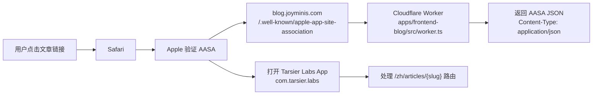
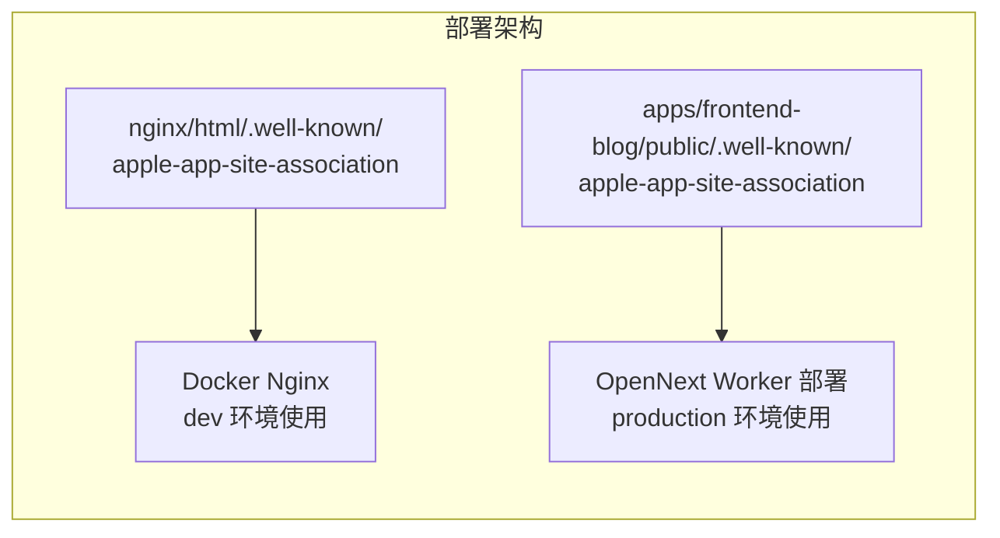

# Apple Universal Links 实施方案

## 概述

为 Tarsier Labs iOS App（`com.tarsier.labs`）配置 Apple Universal Links，使用 `blog.joyminis.com` 域名，实现从 Safari 文章链接直接打开 App。

---

## 架构图





---

## 当前状态

| 项目                   | 状态                                                                   |
| ---------------------- | ---------------------------------------------------------------------- |
| AASA 文件位置          | `nginx/html/.well-known/apple-app-site-association`（仅 Docker/Nginx） |
| Bundle ID 配置         | `com.tarsier.blog` ❌ 错误，应为 `com.tarsier.labs`                    |
| Worker 静态资源处理    | `isStaticAsset()` 只检查文件扩展名，AASA 无扩展名，不会命中            |
| iOS Associated Domains | 未配置                                                                 |
| 文章分享链接           | 已有 OG metadata，但无 Universal Links                                 |

---

## 实施步骤

### Step 1: 修复 AASA 文件 Bundle ID

**文件**: [`nginx/html/.well-known/apple-app-site-association`](nginx/html/.well-known/apple-app-site-association)

- 将 `PK28T343BP.com.tarsier.blog` → `PK28T343BP.com.tarsier.labs`
- 保留其他条目不动（`com.porter.joyminis` 的 Universal Links 不受影响）

> ⚠️ **需要确认**: Team ID `PK28T343BP` 是否正确？请用户确认。

修改后内容：

```json
{
  "applinks": {
    "apps": [],
    "details": [
      {
        "appID": "A1B2C3D4E5.com.porter.joyminis",
        "paths": ["/group/*", "/oauth/callback"]
      },
      {
        "appID": "A1B2C3D4E5.com.porter.joyminis.test",
        "paths": ["/group/*", "/oauth/callback"]
      },
      {
        "appID": "PK28T343BP.com.tarsier.labs",
        "paths": ["/article/*", "/oauth/callback", "/group/*"]
      }
    ]
  }
}
```

### Step 2: 为 Worker 部署创建 AASA 文件

**新建文件**: `apps/frontend-blog/public/.well-known/apple-app-site-association`

内容和 Step 1 修改后的 AASA 完全一致。`public/` 目录的内容会被 OpenNext 部署到 Cloudflare R2 存储。

### Step 3: 修改 Worker 处理 AASA 请求

**文件**: [`apps/frontend-blog/src/worker.ts`](apps/frontend-blog/src/worker.ts)

在 `fetch()` 方法中，**在缓存检查之后、静态资源检查之前**，添加 AASA 路由处理：

```typescript
// 位置：在 Early Hints 之后，缓存检查之前（约 line 176）

// Serve Apple App Site Association file for Universal Links
if (url.pathname === "/.well-known/apple-app-site-association") {
  const aasaResponse = await this.serveAASA(env);
  if (aasaResponse) {
    return this.addHeaders(aasaResponse, securityHeaders);
  }
}
```

新增方法：

```typescript
// Serve the Apple App Site Association file for Universal Links
async serveAASA(env: Env): Promise<Response | null> {
  try {
    const object = await env.R2_STORAGE.get('.well-known/apple-app-site-association');
    if (!object) return null;

    const headers = new Headers();
    headers.set('Content-Type', 'application/json');
    headers.set('Cache-Control', 'public, max-age=3600');

    return new Response(object.body, {
      headers,
      status: 200,
    });
  } catch (error) {
    console.warn('AASA serve error:', error);
    return null;
  }
}
```

> **为什么这么处理？**
>
> - AASA 文件没有扩展名，`isStaticAsset()` 不会命中
> - 需要显式设置 `Content-Type: application/json`（Apple 强制要求）
> - 直接从 R2 读取，确保 Worker 部署也能返回正确内容

### Step 4: 配置 iOS App Associated Domains

**文件**: `apps/frontend-blog/ios/App/App.xcodeproj`（由 Capacitor 管理）

需要通过 Capacitor 插件或修改 Xcode 项目配置，添加：

```
applinks:blog.joyminis.com
```

有两种方式：

1. **修改 `capacitor.config.ts`** — 但 Capacitor 原生不支持直接配置 Associated Domains
2. **创建或修改 Entitlements 文件** — 在 `ios/App/App/` 目录下配置 `.entitlements` 文件

推荐方式：通过 Capacitor 的 `@capacitor/ios` 生成 Entitlements，或在 Xcode 中手动添加。

### Step 5: 文章分享链接生成

当用户在 App 内点击"分享文章"时，生成 Universal Links 格式的 URL：

```
https://blog.joyminis.com/{locale}/articles/{slug}
```

目前分享功能（[`share.controller.ts`](apps/api/src/client/treasure/share.controller.ts)）使用 Custom URL Scheme `joymini://`。文章分享需要：

- 前端（App 内）：直接使用 `https://blog.joyminis.com/{locale}/articles/{slug}` 作为分享链接
- 如果分享到浏览器，`blog.joyminis.com` 本身就是正常网页，无需额外处理
- 如果用户安装了 App，点击链接会自动打开 App

> 文章分享不需要像 Treasure/product 分享那样构建自定义 HTML 页面，因为文章本身就是 Next.js 渲染的完整网页，OG metadata 也已经在 [`page.client.tsx`](apps/frontend-blog/src/app/%5Blocale%5D/articles/%5Bslug%5D/page.client.tsx:87) 中配置好了。

### Step 6: 验证

部署后验证：

```bash
# 验证 AASA 文件可访问
curl -s -i https://blog.joyminis.com/.well-known/apple-app-site-association

# 检查 Content-Type
curl -s -D - https://blog.joyminis.com/.well-known/apple-app-site-association | grep Content-Type
# 应返回: Content-Type: application/json

# 验证 JSON 格式
curl -s https://blog.joyminis.com/.well-known/apple-app-site-association | jq .
```

---

## 文件变更清单

| 文件                                                               | 操作     | 说明                                      |
| ------------------------------------------------------------------ | -------- | ----------------------------------------- |
| `nginx/html/.well-known/apple-app-site-association`                | 修改     | Bundle ID: blog → labs                    |
| `apps/frontend-blog/public/.well-known/apple-app-site-association` | 新建     | Worker 部署用的 AASA                      |
| `apps/frontend-blog/src/worker.ts`                                 | 修改     | 添加 AASA 路由 + serveAASA 方法           |
| `apps/frontend-blog/ios/App/App.entitlements`                      | 新建     | 添加 Associated Domains                   |
| (可选) `apps/frontend-blog/capacitor.config.ts`                    | 无需修改 | Universal Links 不在 Capacitor 配置范围内 |

---

## 注意事项

1. **AASA 文件必须无扩展名** — 文件名就是 `apple-app-site-association`，没有 `.json`
2. **Content-Type 必须为 `application/json`** — Apple 会验证，否则 Universal Links 不生效
3. **Apple CDN 缓存** — AASA 文件有 Apple 侧的缓存，修改后可能需要等待或重启设备
4. **Team ID** — 需要用户确认 `PK28T343BP` 是否正确
5. **Dev 环境** — `blog-dev.joyminis.com` 不在此方案范围内，dev 环境通过 Tunnel → Nginx 仍使用 `nginx/html/` 下的 AASA
