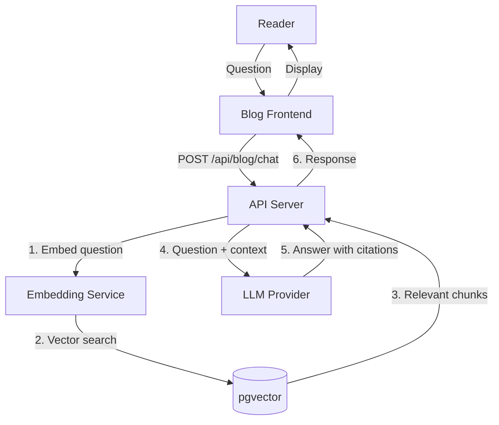

# Blog AI Integration Analysis

## 1. Current State of AI Features (Already Implemented)

### ✅ AI Translation System
- Multi-language article translation (zh -> en, ja, ko, fr, de) via Gemini/Groq/DeepSeek
- Batch translation with delimiter parsing instead of JSON
- Translation job queue (BullMQ `blog-ai` queue)
- Translation progress tracking, job management, issue detection
- Category/tag translation support
- Smart caching with TTL
- Service level degradation (FULL/ESSENTIAL/MINIMAL/DISABLED)

### ✅ AI Comment Moderation
- Content scoring (0-100) for spam/toxicity detection
- Auto-approve/reject based on AI score
- AI moderation fields in `BlogComment` model (`aiModerationScore`, `aiModerationReason`, `aiModerationCategories`)

### ✅ AI Auto-Reply
- Comment classification: praise, question, suggestion, bug_report, criticism, general
- Context enrichment with article metadata
- Prompt-based natural reply generation
- Reply validation (anti-robotic filtering)
- Fallback template replies when AI unavailable

### ✅ AI Service Infrastructure
- Multi-provider architecture (Gemini, Groq, DeepSeek)
- API key rotation with daily token limits
- Circuit breaker pattern (10 consecutive failures -> 5min cool-down)
- Per-minute rate limiting (12 RPM)
- Key cooldown on 429 errors
- Image/OCR support via Gemini Vision

### ✅ Admin AI Management
- AI service status dashboard (service level, API key quotas, health)
- Provider/model configuration switching
- Translation job monitoring

---

## 2. High-Value AI Integration Directions

### Priority Tiers Legend

| Tier | Label | Description |
|------|-------|-------------|
| P0 | **Must Have** | Immediate user value, relatively low implementation complexity |
| P1 | **Should Have** | High value, moderate complexity, great ROI |
| P2 | **Nice to Have** | Novelty/engagement features, higher complexity |

---

### P0: AI Chat Assistant / Blog RAG System

**Concept**: Allow readers to ask natural language questions about blog content. The system indexes all articles into a vector database and uses RAG (Retrieval-Augmented Generation) to answer questions with citations.

**Value**: 
- 🏆 **Highest engagement feature** — transforms blog from read-only to interactive
- Technical blog readers naturally have follow-up questions
- Keeps users on site longer, reduces bounce rate

**Implementation**:
1. Add `pgvector` extension to PostgreSQL for embedding storage
2. Create article embedding job (triggered on publish/update)
3. `/api/blog/chat` endpoint accepting user questions
4. Vector similarity search over article chunks
5. LLM generates answer with article citations
6. Frontend chat widget (floating or page-level)

**Key files to touch**:
- [`apps/api/prisma/schema.prisma`](apps/api/prisma/schema.prisma) — add `ArticleEmbedding` model
- [`apps/api/src/common/ai/`](apps/api/src/common/ai/) — add embedding service
- [`apps/api/src/blog/`](apps/api/src/blog/) — add chat controller/service
- [`apps/frontend-blog/`](apps/frontend-blog/) — add chat UI component
- [`apps/api/src/blog/processors/`](apps/api/src/blog/processors/blog-ai.processor.ts) — add embedding job



---

### P0: AI Article Summarization

**Concept**: Auto-generate concise TL;DR summaries for every article, displayed in search results, card previews, and social sharing.

**Value**:
- Improves search result quality significantly
- Better social sharing (OpenGraph/Schema.org `description` can use AI summary)
- Helps readers quickly decide which articles to read
- Can be generated at publish time, cached indefinitely

**Implementation**:
1. On article publish, enqueue a `generate-summary` job
2. AI generates 1-2 paragraph summary in article's language
3. Store in `BlogArticle.summary` field (add to schema)
4. Display in article cards, search results, meta tags

**Key files**:
- [`apps/api/prisma/schema.prisma`](apps/api/prisma/schema.prisma) — add `summaryLocalized` field
- [`apps/api/src/blog/processors/blog-ai.processor.ts`](apps/api/src/blog/processors/blog-ai.processor.ts) — add summary job
- [`apps/frontend-blog/`](apps/frontend-blog/) — display summary in cards

---

### P0: Semantic Search

**Concept**: Upgrade from keyword-based `LIKE` search to semantic/vector search that understands meaning, not just exact matches.

**Value**:
- Dramatically improves search relevance
- Handles synonyms, conceptual queries ("数据库 vs SQL vs 存储")
- Can search across languages (query in English, find Chinese articles)
- Powers the AI Chat RAG system naturally

**Implementation**:
- Shared embedding pipeline with Chat RAG
- Replace current `/v1/public/blog/search` implementation
- Return relevance scores alongside results
- Add hybrid search (keyword + vector) for best results

---

### P1: AI Content Generation Assistant

**Concept**: In the admin blog editor, provide AI-powered writing assistance.

**Features**:
1. **Title Suggestions** — given content, suggest 3-5 SEO-friendly titles
2. **Outline Generation** — given a topic, generate article outline
3. **Content Expansion** — expand a brief point into a full paragraph
4. **Tag Suggestions** — recommend relevant tags based on content
5. **SEO Meta Description** — auto-generate meta description
6. **Image Alt Text** — suggest alt text for uploaded images

**Value**:
- Dramatically speeds up content creation for admins
- Improves SEO quality
- Low implementation cost (mostly prompt engineering + admin UI)

**Implementation**:
- New admin endpoints under `/admin/blog/ai-assistant/*`
- Frontend admin-blog app gets AI writing toolbar
- Leverages existing [`AiService`](apps/api/src/common/ai/ai.service.ts) infrastructure

---

### P1: Personalized Reading Recommendations

**Concept**: Use AI to recommend articles based on user's reading history, bookmarks, and interests.

**Value**:
- Increases page views per session
- Improves user retention
- Can cross-sell older articles to new readers

**Implementation**:
1. Track article views (already has `viewCount`, can add per-user tracking)
2. Build user interest profile from reading/bookmark history
3. On article detail page, show "Recommended for You" section
4. Can use collaborative filtering or LLM-based content similarity

**Key files**:
- [`apps/api/src/blog/frontend/frontend-blog.controller.ts`](apps/api/src/blog/frontend/frontend-blog.controller.ts) — add personalized endpoint
- [`apps/api/src/blog/frontend/frontend-blog.service.ts`](apps/api/src/blog/frontend/frontend-blog.service.ts) — implement recommendation logic
- [`apps/frontend-blog/src/components/`](apps/frontend-blog/src/components/) — recommendation UI

---

### P1: Code Block Enhancement

**Concept**: Add interactive AI features to code blocks in articles:
- "Explain this code" button
- "Translate to Language X" (Python -> TypeScript, etc.)
- Code review analysis
- Complexity analysis

**Value**:
- Huge value for a **technical blog**
- Encourages readers to engage with code examples
- Educational — helps beginners understand complex code
- Differentiator from other tech blogs

**Implementation**:
- Frontend code block component enhancement
- API endpoint `/api/blog/ai/code-assist`
- Send code + instruction to LLM
- Display result inline or in modal

---

### P1: AI-Powered Related Articles

**Concept**: Replace basic tag-based related articles with AI semantic similarity.

**Current** implementation at [`frontend-blog.controller.ts:103-120`](apps/api/src/blog/frontend/frontend-blog.controller.ts:103) uses simple tag matching.

**Enhancement**: Use article embeddings to find semantically similar articles, regardless of tags.

**Value**:
- More relevant suggestions
- Discovers non-obvious connections between articles
- Can be cached with embedding similarity scores

---

### P2: AI SEO Optimization Suite

**Concept**: Automated SEO improvements using AI.

**Features**:
1. Auto-generate `<meta>` descriptions for all articles
2. Suggest focus keywords
3. Keyword density analysis
4. Internal linking suggestions ("This article mentions X, link to related article Y")
5. Readability scoring and suggestions

**Value**:
- Long-term organic traffic growth
- Batch process all existing articles
- Low ongoing cost (generate once per article)

---

### P2: Audio Article Generation (TTS)

**Concept**: Generate AI-narrated audio versions of articles.

**Value**:
- Accessibility improvement (screen reader users)
- Commute/podcast consumption mode
- Can increase time-on-site significantly
- Technical content benefits from listen-while-coding

**Implementation Options**:
- Use Gemini/DeepSeek TTS capabilities
- Third-party TTS API (ElevenLabs, Azure Speech)
- Store MP3 in cloud storage
- Add audio player to article page

---

### P2: AI Reading Assistant / Article Chat

**Concept**: On each article page, allow readers to have a conversation about that specific article.

**Difference from Blog RAG**: This is per-article, context-limited to the current article's content.

**Value**:
- Readers can ask clarifying questions without leaving the article
- "What does this term mean?" — AI explains in context
- "Can you give me another example?" — AI generates relevant examples
- Very engaging for complex technical topics

---

### P2: AI Knowledge Graph

**Concept**: Automatically extract entities, concepts, and relationships from articles to build a navigable knowledge graph.

**Value**:
- Visual knowledge exploration
- Discover relationships between technical concepts
- Could power an interactive "mind map" feature
- Novel, differentiated feature for a tech blog

**Implementation Complexity**: HIGH — requires:
- Named Entity Recognition (NER) pipeline
- Relationship extraction
- Graph database or pgvector graph
- Visualization UI (D3.js, vis-network)

---

## 3. Implementation Roadmap

```mermaid
gantt
    title AI Integration Roadmap
    dateFormat  YYYY-MM-DD
    axisFormat  %m/%d
    
    section 基础建设 P0
    AI Article Summarization     :a1, 14d
    Semantic Search              :a2, after a1, 10d
    
    section 对话交互 P0
    Blog RAG Chat Assistant      :b1, after a2, 21d
    
    section 内容工具 P1
    Code Block Enhancement       :c1, after b1, 14d
    AI-Powered Related Articles  :c2, after c1, 7d
    
    section 管理端 P1
    Content Generation Assistant :d1, after c1, 14d
    
    section 个性化 P1
    Reading Recommendations      :e1, after d1, 10d
    
    section 增强功能 P2
    SEO Optimization Suite       :f1, after e1, 10d
    Audio Article Generation     :f2, after f1, 14d
    Article Chat                 :f3, 10d
    Knowledge Graph              :f4, after f3, 21d
```

## 4. Architecture Considerations

### Existing Infrastructure to Leverage

| Component | Current | Enhancement |
|-----------|---------|-------------|
| [`AiService`](apps/api/src/common/ai/ai.service.ts) | Translation, moderation | Add embedding, chat, summarization methods |
| [`BlogAiProcessor`](apps/api/src/blog/processors/blog-ai.processor.ts) | Translation, moderation jobs | Add embedding, summary generation jobs |
| [`BlogArticle` schema](apps/api/prisma/schema.prisma:1510) | Translation fields | Add `summaryLocalized`, embedding fields |
| [`blog-ai` BullMQ queue](apps/api/src/blog/blog.service.ts:44) | Translation + moderation | Add embedding, summary job types |
| [`FrontendBlogController`](apps/api/src/blog/frontend/frontend-blog.controller.ts) | Read endpoints | Add chat, recommendations |

### New Dependencies Needed

```json
{
  "pgvector": "For storing and querying embeddings in PostgreSQL",
  "@langchain/community": "Optional: RAG pipeline utilities",
  "elevenlabs-api": "Optional: TTS for audio articles"
}
```

### Performance Considerations

1. **Embedding Generation**: Async, done at article publish time via BullMQ
2. **Chat RAG**: Implement streaming (SSE) for better UX — already have pattern in [`BlogController.detectIncompleteTranslationsStream()`](apps/api/src/blog/blog.controller.ts:432)
3. **Caching**: Cache summaries, embeddings, and recommendation results aggressively
4. **Rate Limiting**: Chat endpoint needs generous limits per user, tight limits per IP

### Data Model Changes

```prisma
model BlogArticle {
  // ... existing fields ...
  summaryLocalized   Json?       // AI-generated summaries per language
  // ⚠️ 维度取决于 embedding 模型:
  //   Gemini text-embedding-004 → vector(768)
  //   OpenAI text-embedding-3-small → vector(1536)
  // 使用前先确认选型，否则数据写入会报类型不匹配
  embedding          Unsupported("vector(768)")?   // pgvector (Gemini默认)
}

model BlogChatSession {
  id        String   @id @default(cuid())
  articleId String?  // null = site-wide chat, set = article chat
  messages  Json     // [{role, content, timestamp}]
  createdAt DateTime @default(now())
  updatedAt DateTime @updatedAt
}
```

---

## 5. Recommended First Phase (P0 — High Impact, Fast Delivery)

### Phase 1: AI Article Summarization (1-2 weeks)

1. Add `summaryLocalized` field to [`BlogArticle`](apps/api/prisma/schema.prisma:1510)
2. Add `generate-summary` job to [`BlogAiProcessor`](apps/api/src/blog/processors/blog-ai.processor.ts)
3. Trigger on article publish in [`BlogService.updateArticle()`](apps/api/src/blog/blog.service.ts)
4. Display summary in article cards on frontend
5. Use summary for meta tags and OpenGraph

### Phase 2: Semantic Search + Blog RAG (2-3 weeks)

1. Enable `pgvector` extension
2. Create embedding service in [`AiService`](apps/api/src/common/ai/ai.service.ts)
3. Add embedding generation to [`BlogAiProcessor`](apps/api/src/blog/processors/blog-ai.processor.ts)
4. Upgrade search endpoint at [`/v1/public/blog/search`](apps/frontend-blog/src/lib/api/blogApi.ts:106)
5. Build Chat RAG endpoint + frontend widget

### Phase 3: Code Block Enhancement (1-2 weeks)

1. Create `/api/blog/ai/code-assist` endpoint
2. Enhance frontend code block component with AI buttons
3. Implement "Explain", "Translate language", "Review" features

---

## 6. Summary of Recommendations

| # | Feature | Tier | Effort | Impact | Notes |
|---|---------|------|--------|--------|-------|
| 1 | **Article Summarization** | P0 | Low | High | Generate on publish, use everywhere |
| 2 | **Semantic Search** | P0 | Medium | High | Foundation for RAG, huge UX improvement |
| 3 | **Blog RAG Chat** | P0 | High | Very High | Most engaging feature, keeps users on site |
| 4 | **Code Block AI** | P1 | Medium | High | Perfect for a tech blog, educational |
| 5 | **Content Assistant** | P1 | Medium | Medium | Admin productivity tool |
| 6 | **Related Articles** | P1 | Low | Medium | Low effort uplift of existing feature |
| 7 | **Recommendations** | P1 | Medium | Medium | Personalization engine |
| 8 | **SEO Suite** | P2 | Medium | Medium | Long-term traffic growth |
| 9 | **Audio Articles** | P2 | Medium | Low-Med | Accessibility + new consumption mode |
| 10 | **Article Chat** | P2 | Low | Medium | Per-article Q&A |
| 11 | **Knowledge Graph** | P2 | High | Low-Med | Novel but complex |

**My recommendation**: Start with **Phase 1 (Summarization)** which is fast and provides immediate value for SEO/UX, then move to **Phase 2 (Semantic Search + Blog RAG)** which is the most impactful customer-facing feature. Code Block Enhancement is a strong P1 because it uniquely fits a technical blog audience.
