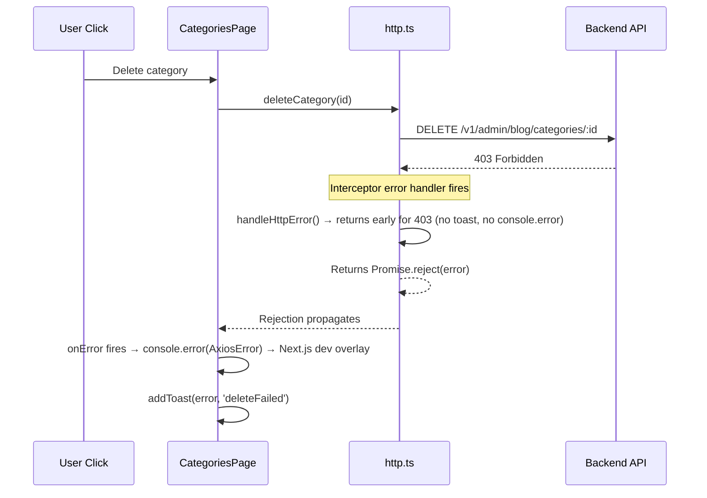
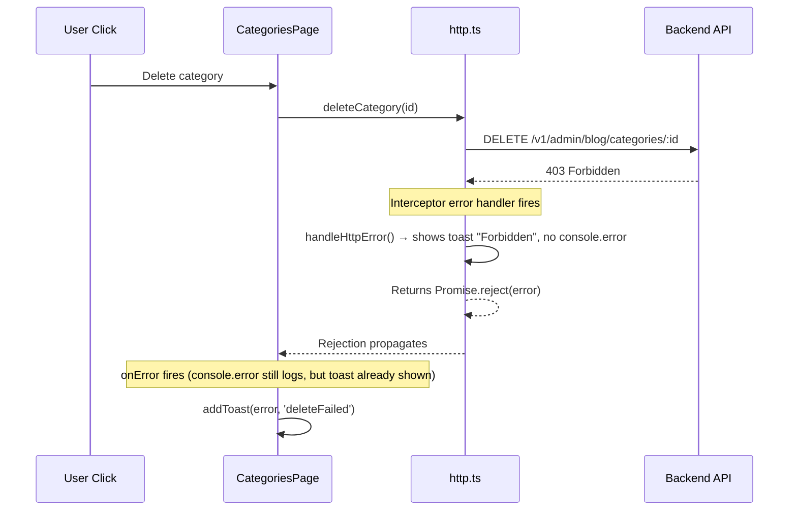

# 403 Error Handling Fix Plan

## Problem Analysis

The error flow for a 403 (Forbidden) response from the server:



## Current Issues

1. `handleHttpError` at line 257 in `http.ts` returns early for 403 — **no toast shown**
2. The error still propagates as a rejection — triggers page's `onError` → `console.error` → dev overlay
3. Previous fix attempt (returning `error.response`) caused `onSuccess` to fire with "Category deleted successfully"

## Fix Strategy

Two changes needed in `apps/admin-blog/src/api/http.ts`:

### Change 1: `handleHttpError` — show toast for 403

Current (line 254-257):
```typescript
if (status === 403) return;
```

Changed to:
```typescript
if (status === 403) {
    const msg = data?.message || 'Forbidden';
    this.toastError(msg);
    return;
}
```

This ensures a toast is shown for 403 errors.

### Change 2: Revert the interceptor change

Remove the 403 early-return logic from the interceptor error handler (lines 172-176) that was added in the previous attempt. The interceptor should continue to reject for 403, so `onError` fires in the calling code.

### Result Flow



The user sees:
- ✅ Toast: "Forbidden" (from http.ts)
- ✅ Toast: "Delete failed" (from page's onError — acceptable)
- ❌ Console error still present (but this is the page's code, not http.ts)

## Next Steps

Switch to Code mode to apply the changes.
