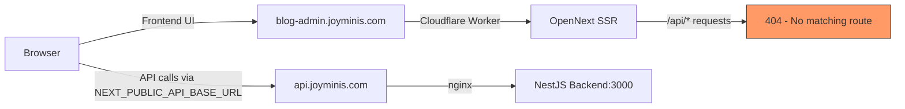

# Fix 404 on blog-admin.joyminis.com/api/*

## Root Cause

The admin-blog frontend is deployed as a **Cloudflare Worker** via OpenNext (see [`apps/admin-blog/wrangler.jsonc`](../apps/admin-blog/wrangler.jsonc:8-12)). The Worker catches ALL requests to `blog-admin.joyminis.com/*`, but only knows how to handle Next.js page routes. When `/api/v1/...` paths are requested, the Worker returns 404 because no Next.js route matches.

The **correct API domain** `api.joyminis.com` works perfectly — the SSE stream endpoint confirmed this.

## Architecture

## Fix: Add Next.js rewrites to proxy `/api/*`

Add `async rewrites()` in [`apps/admin-blog/next.config.ts`](../apps/admin-blog/next.config.ts) to proxy `/api/:path*` to the backend API.

### What this does

- `/api/v1/admin/blog/translation/detect-incomplete/stream` on `blog-admin.joyminis.com`
- → Rewrites to `https://api.joyminis.com/api/v1/admin/blog/translation/detect-incomplete/stream`

This ensures:
- Direct browser access to API paths works
- Any fallback-to-`/api` scenarios in http.ts work
- SSE streaming is NOT blocked (no response buffering in a simple proxy rewrite)

## Todo

- [ ] Add `async rewrites()` in [`apps/admin-blog/next.config.ts`](../apps/admin-blog/next.config.ts)
- [ ] Deploy to Cloudflare Workers
- [ ] Test: `https://blog-admin.joyminis.com/api/v1/admin/blog/translation/detect-incomplete/stream?lang=en`
- [ ] Verify SSE streaming works end-to-end through the Worker proxy
