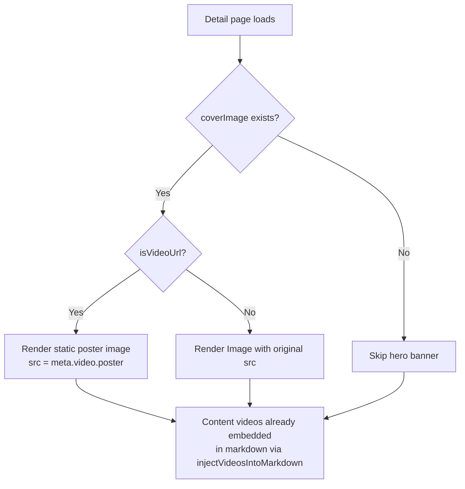

# Fix Blog Video Rendering — Plan

## Bug Summary

After uploading two videos to a blog article (one as coverImage via the media uploader field, one as content video via the rich text editor), both videos appear stacked on homepage cards, the wrong poster shows on homepage, and videos don't appear on the detail page.

---

### Two Video Upload Paths in Admin

```mermaid
flowchart LR
    A[Admin creates/edits article] --> B[CoverImage via media uploader field]
    A --> C[Content video via Quill rich text editor]
    B --> D[Stored as article.coverImage URL<br/>e.g. videos/cover-xxx.mp4]
    C --> E[Stored as <video> tag in markdown<br/>→ scanRichTextVideos extracts to meta.contentVideo[]]
    D --> F[Transcode → meta.video = {hlsUrl, poster}]
    E --> G[Transcode → meta.contentVideo[] = <br/>{hlsUrl, poster, originalUrl}]
```

### Confirmed Field Roles (from user):

- **`meta.video`** — **ONLY for list/homepage cards**. The poster appears on `ArticleCard` / `HeroSection`. Never rendered as video in detail page.
- **`meta.contentVideo[]`** — **ONLY for detail page**. Videos appear embedded in markdown content via `injectVideosIntoMarkdown()`. Never rendered on homepage cards.

### Bug A: Wrong Poster / Stacked Videos on Homepage Cards

**Root Cause:** Race condition in `handleTranscodeVideo`. All transcode jobs unconditionally overwrite `meta.video`, so whichever job finishes last wins — regardless of whether it was the coverImage video or a content video.

**Symptoms:**
1. Both videos appear as stacked `<video>` elements in `ArticleCard` (because `meta.video` may point to content video, and its poster + original URL get rendered as fallback)
2. Wrong poster (content video's poster appears on list card instead of coverImage's poster)
3. Video player shows wrong content (content video instead of coverImage video)

### Bug B: No Videos in Detail Page

**Root Cause:** SSR payload strips `meta` — the `getCachedArticle` cache returns stale data, and `injectVideosIntoMarkdown` on the backend needs `meta.contentVideo[]` to inject video tags.

**Symptoms:**
1. Article content renders without any embedded videos (even though they exist in DB)
2. On client-side refetch, videos appear but initial page load (SSR) shows raw markdown without video elements

---

## Fix Items

### P0 — CRITICAL: Fix Race Condition in `handleTranscodeVideo`

**File:** [`apps/api/src/common/media/media.processor.ts`](apps/api/src/common/media/media.processor.ts)

**Problem:** `handleTranscodeVideo()` unconditionally overwrites `meta.video` for EVERY transcode job, regardless of whether the video is a coverImage or a content video embedded in markdown.

**Solution:** Dynamically determine video type inside `handleTranscodeVideo()` by comparing the `videoKey` against the article's `coverImage` / `coverImageLocalized` URLs. No changes needed to job data, DTOs, or enqueue sites.

Logic:
1. Fetch article from DB
2. Check if `videoKey` matches any locale's `coverImage` or `coverImageLocalized` URL
3. **If coverImage video**: Update `meta.video` with transcode result, AND deduplicate into `contentVideo[]` (remove any entry with matching `originalUrl`)
4. **If content video**: Update ONLY `meta.contentVideo[]`. Do NOT touch `meta.video`.

```mermaid
flowchart TD
    A[handleTranscodeVideo called] --> B[Fetch article from DB]
    B --> C{Does videoKey match<br/>any coverImage URL?}
    C -- Yes --> D[This is a coverImage video]
    C -- No --> E[This is a content video /<br/>rich text video]
    D --> F[Set meta.video = transcode result]
    D --> G[Dedup from contentVideo[]<br/>remove entry with matching originalUrl]
    E --> H[Append/update contentVideo[]]
    H --> I[Push contentVideo entry: {hlsUrl, poster, originalUrl}]
    F --> J[Save article]
    I --> J
```

**Status:** ✅ Implemented

---

### P0 — HIGH: Fix Poster Duplication in HlsVideoPlayer

**File:** [`apps/frontend-blog/src/components/blog/HlsVideoPlayer.tsx`](apps/frontend-blog/src/components/blog/HlsVideoPlayer.tsx:262)

**Problem:** Both the `<video poster="...">` attribute AND the CSS background poster (`bg-[url(...)]`) render, creating a visual double-poster effect.

**Solution:** When the play overlay is visible (not yet clicked), omit the `poster` attribute from `<video>` — the CSS background handles poster display. When clicked (playing), remove both.

**Change:** `poster={showPlayOverlay ? undefined : effectivePoster}`

**Status:** ✅ Implemented

---

### P0 — HIGH: Keep `meta` in SSR Payload

**File:** [`apps/frontend-blog/src/app/[locale]/articles/[slug]/page.tsx`](apps/frontend-blog/src/app/[locale]/articles/[slug]/page.tsx:132)

**Problem:** SSR was stripping `meta` from the article payload, so `meta.video` and `meta.contentVideo[]` were not available on initial page load.

**Solution:** Search for `meta: undefined` or similar stripping logic and remove it, ensuring the full article object is passed to the client.

**Status:** ✅ Implemented

---

### P0 — HIGH: CoverImage in Detail Page — Static Poster Only, No Video Player

**File:** [`apps/frontend-blog/src/app/[locale]/articles/[slug]/page.client.tsx`](apps/frontend-blog/src/app/[locale]/articles/[slug]/page.client.tsx:278-308)

**Problem:** Hero banner renders `meta.video` as a playable video player (`HlsVideoPlayer` / `NativeVideoPlayer`). But `meta.video` is ONLY for the list page. In the detail page, only `meta.contentVideo[]` (embedded in markdown) should appear.

**Solution:** When `coverImage` is a video URL, render the **poster image** (thumbnail from `meta.video.poster`) as a static image, NOT as a playable video player. Content videos (`contentVideo[]`) are already embedded in markdown by `injectVideosIntoMarkdown()`.

Change the hero banner logic:
1. If `coverImage` is a regular image URL → render `<Image>` (unchanged)
2. If `coverImage` is a video URL → render `<Image>` with `meta.video.poster` as `src` (static poster, no video player)
3. Never render `HlsVideoPlayer` or `NativeVideoPlayer` in the detail page hero banner



**Status:** ❌ NEEDS FIX — currently renders video player instead of static poster

---

### P1 — MEDIUM: Improve `injectVideosIntoMarkdown` Heading Matching

**File:** [`apps/api/src/blog/frontend/frontend-blog.service.ts`](apps/api/src/blog/frontend/frontend-blog.service.ts:540-657)

**Problem:** Heading matching fails when AI translation changes heading text. Videos end up appended to end or prepended to start.

**Solution:** Use **position-based fallback** — calculate video position as % of HTML length, map to Markdown line %:

1. Primary: existing heading text matching (unchanged)
2. Fallback: position-based heading matching
3. Last resort: append to end

**Status:** ⏳ Not started

---

### P1 — MEDIUM: Video Playback Coordination for ArticleCards

**File:** [`apps/frontend-blog/src/components/blog/ArticleCard.tsx`](apps/frontend-blog/src/components/blog/ArticleCard.tsx)

**Problem:** Multiple article card videos can play simultaneously, creating audio overlap.

**Solution:** Use custom event dispatch (same pattern as detail page's ArticleMarkdown):

- On video play: dispatch `article-card-video-play` event
- All cards listen → pause their video when another starts

**Status:** ⏳ Not started

---

### P2 — LOW: Backend Safety — `scanRichTextVideos` in `createArticle`

**File:** [`apps/api/src/blog/blog.service.ts`](apps/api/src/blog/blog.service.ts:152-224)

**Problem:** `scanRichTextVideos` only runs on `updateArticle`, not `createArticle`. Rich text videos may not be detected.

**Solution:** Add `scanRichTextVideos` call at end of `createArticle` method.

**Status:** ⏳ Not started

---

### P2 — LOW: Add Structured Logging for Video Injection

**File:** [`apps/api/src/blog/frontend/frontend-blog.service.ts`](apps/api/src/blog/frontend/frontend-blog.service.ts:540-657)

**Problem:** No visibility into whether video injection succeeds or fails in production.

**Solution:** Add logging for videos found, headings matched, fallback usage.

**Status:** ⏳ Not started

---

## Execution Summary

| Priority | Fix | Files | Status |
|----------|-----|-------|--------|
| P0 | Race condition in `handleTranscodeVideo` | `media.processor.ts` | ✅ Done |
| P0 | Double poster in HlsVideoPlayer | `HlsVideoPlayer.tsx` | ✅ Done |
| P0 | SSR stripping meta | `page.tsx` (detail) | ✅ Done |
| P0 | **CoverImage hero banner — static poster only** | **`page.client.tsx` (detail)** | **❌ NEEDS FIX** |
| P1 | Heading matching in `injectVideosIntoMarkdown` | `frontend-blog.service.ts` | ⏳ |
| P1 | Video playback coordination | `ArticleCard.tsx` | ⏳ |
| P2 | `scanRichTextVideos` on create | `blog.service.ts` | ⏳ |
| P2 | Structured logging | `frontend-blog.service.ts` | ⏳ |

## Notes

- Old articles whose `meta.video` is already polluted (wrong video data) will NOT be auto-fixed. They need re-upload of coverImage or a migration script to clear `meta.video` and re-trigger transcode.
