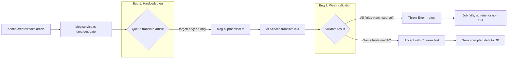

# Blog Translation Bug Analysis & Fix Plan

## Problem Summary

**Scope is much larger than initially identified.** The `targetLang: 'en'` hardcoding bug has caused systemic translation failures across ALL non-English languages.

### Initial Finding: 3 French articles
- `TITLE_NOT_TRANSLATED` + `CONTENT_NOT_TRANSLATED` — French fields contain Chinese text

### Confirmed Systemic Impact

**EN (~20+ articles)** — Various quality issues:
- `HEADING_MISMATCH` — heading structure lost in translation
- `CODE_BLOCK_MISMATCH` — code blocks corrupted
- `TABLE_MISMATCH` — table format lost
- `LIST_MISMATCH` — list structure lost
- `CONTENT_TOO_SHORT` — truncated translations
- `UNTRANSLATED_CHARS` — Chinese characters remain in "translated" text
- **`翻译结果与原文完全相同，未进行翻译`** — AI returned the EXACT same text as source (e.g., `http-client-auth-refresh-retry`, `smart-table-generic-data-grid`)

**JA (~31+ articles)** — Same categories of issues:
- `CONTENT_TOO_LONG` — content exceeds expected length
- Same quality degradation patterns as EN

## Root Cause (3 Bugs)

### Bug 1 (PRIMARY): Hardcoded `targetLang: 'en'` on Article Create/Update

**Locations**:
- [`blog.service.ts:208-214`](../apps/api/src/blog/blog.service.ts:208) — `createArticle()` 
- [`blog.service.ts:661-669`](../apps/api/src/blog/blog.service.ts:661) — `updateArticle()`
- [`blog.service.ts:1178-1181`](../apps/api/src/blog/blog.service.ts:1178) — `translateArticle()` also defaults to `'en'`

```typescript
// Current code — hardcoded 'en'!
this.blogAiQueue.add('translate-article', {
  articleId: article.id,
  sourceLang: defaultSourceLang,
  targetLang: 'en',  // ← HARDCODED!
});
```

**Impact**: When an article is created or updated, ONLY one translation job is queued → English. French, Japanese, Korean, German are **never automatically queued**.

**Why this caused the massive EN/JA failure list**:
1. `queueFullLocaleTranslation` was triggered once when each locale was enabled → queued jobs for ALL existing articles
2. But after that initial bulk run, **any new article or edit only triggers EN translation**
3. The AI occasionally fails or returns low-quality translations, but since no retry mechanism exists for non-EN locales after the initial bulk run, these failures **persist indefinitely**

### Bug 2 (SECONDARY): Weak Per-Field Translation Validation

**Location**: [`blog-ai.processor.ts:1068-1101`](../apps/api/src/blog/processors/blog-ai.processor.ts:1068)

```typescript
const allFieldsSame = titleIsSame && contentIsSame && excerptIsSame;
if (anyMeaningfulField && allFieldsSame) {
  throw new Error(...);  // Only throws if ALL three fields match source
}
```

**Impact**: If AI returns:
- Title: unchanged Chinese → `titleIsSame = true`
- Content: slightly modified (still wrong) → `contentIsSame = false`
- Result: `allFieldsSame = false` → **validation passes, Chinese title saved as "translation"**

### Bug 3 (TERTIARY): No Translation Retry After Initial Bulk Run

**Location**: [`blog.service.ts:1491-1612`](../apps/api/src/blog/blog.service.ts:1491)

`queueFullLocaleTranslation` runs once when locale is enabled. Articles created later that never received a non-EN translation job (due to Bug 1) stay untranslated in those locales forever.

## Architecture Overview



## Fix Plan

### Fix 1 (P0): Queue All Enabled Locales on Create/Update

**Files**: [`blog.service.ts`](../apps/api/src/blog/blog.service.ts)
- `createArticle()` ~line 208
- `updateArticle()` ~line 661

**`SystemConfigService` is already injected** at line 46 — no new dependency needed.

```typescript
// After article creation/update
const { list: locales } = await this.systemConfigService.getBlogLocales();
const enabledCodes = locales.filter(l => l.enabled).map(l => l.code);
const defaultSourceLang = await this.getDefaultSourceLang();

for (const targetLang of enabledCodes) {
  if (targetLang === defaultSourceLang) continue;
  
  this.blogAiQueue.add('translate-article', {
    articleId: article.id,
    sourceLang: defaultSourceLang,
    targetLang,
  }).catch(() => {});
}
```

Also fix [`translateArticle()`](../apps/api/src/blog/blog.service.ts:1163) to accept explicit `targetLang` without defaulting to 'en'.

### Fix 2 (P1): Per-Field Validation in Processor

**File**: [`blog-ai.processor.ts`](../apps/api/src/blog/processors/blog-ai.processor.ts) ~line 1068

Change from all-or-nothing validation to per-field:
- If title matches source → skip saving title translation, log warning
- If content matches source → skip saving content translation, log warning
- If excerpt matches source → skip saving excerpt translation, log warning
- Only throw error if **ALL** meaningful fields failed

### Fix 3 (P2): Retroactive Fix for Existing Articles

Use the **existing** [`retranslateIncompleteArticles()`](../apps/api/src/blog/blog.service.ts:3512) endpoint, called for each enabled locale:

```
POST /api/v1/admin/blog/translations/retranslate-incomplete
Body: { targetLang: 'en' }
Body: { targetLang: 'ja' }
Body: { targetLang: 'fr' }
Body: { targetLang: 'ko' }
Body: { targetLang: 'de' }
```

Or use the admin UI's Translation Issues page to trigger `retranslateIncompleteArticles` for each locale.

### Fix 4 (P3): Enhanced Periodic Detection

The `detectIncompleteTranslations()` (line 3216) is already functional but only checks one `targetLang` at a time. Consider:
- Adding a scheduled job that checks ALL enabled locales periodically
- Adding admin UI controls to trigger detection + retranslation per locale

## Execution Order

| Priority | Fix | Effort | Impact |
|----------|-----|--------|--------|
| P0 | Fix 1: Queue all locales on create/update | ~20 lines | Prevents ALL future articles from missing translations |
| P1 | Fix 2: Per-field validation | ~30 lines | Prevents silent data corruption |
| P2 | Fix 3: Retroactive retranslation | Manual trigger | Fixes ~50+ existing articles across EN/JA/FR |
| P3 | Fix 4: Periodic detection | Optional enhancement | Catch any remaining edge cases |

## Retroactive Fix Recovery Path

After deploying Fix 1 and Fix 2:

1. Run `detectIncompleteTranslations('en')` — identify the ~20+ EN articles
2. Run `detectIncompleteTranslations('ja')` — identify the ~31+ JA articles  
3. Run `retranslateIncompleteArticles('en')` — queue retranslation for EN
4. Run `retranslateIncompleteArticles('ja')` — queue retranslation for JA
5. Run `retranslateIncompleteArticles('fr')` — queue retranslation for FR
6. Run `retranslateIncompleteArticles('ko')` — queue retranslation for KO
7. Run `retranslateIncompleteArticles('de')` — queue retranslation for DE

---

## Implementation Status

### ✅ P0 — Fix 1: Queue All Enabled Locales on Create/Update

**Implemented**: [`blog.service.ts:201`](apps/api/src/blog/blog.service.ts:201) — `createArticle()`
**Implemented**: [`blog.service.ts:658`](apps/api/src/blog/blog.service.ts:658) — `updateArticle()`

Both methods now call `getBlogLocales()` to get all enabled locales, filter out the source language, and queue a `translate-article` job for each enabled locale.

### ✅ P1 — Fix 2: Per-Field Validation + Null-Safe Save

**Implemented**: [`blog-ai.processor.ts:1068`](apps/api/src/blog/processors/blog-ai.processor.ts:1068)

- Validation changed from all-or-nothing (`allFieldsSame`) to per-field checks
- Failed fields set to `null` → save logic falls back to existing translation via `??` operator
- Only throws error if ALL meaningful fields failed
- All 4 save blocks (titleLocalized, contentMdLocalized, contentLocalized, excerptLocalized) updated with null-safe fallbacks

### 🔲 P2 — Retroactive Fix (Manual)

After deploying, call the existing `retranslateIncompleteArticles` endpoint for each enabled locale.

### 🔲 P3 — Enhanced Periodic Detection (Optional)

Future enhancement.
