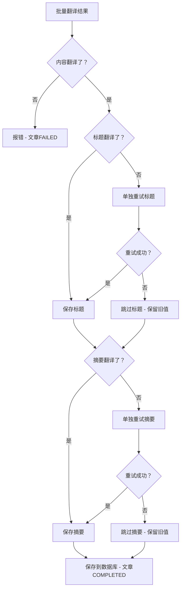

# 翻译验证失败 - 深度分析报告

## 1. 最新发现：不只是法文问题！

刚刚又出现一条新错误日志：

```
目标语言 en，失败的字段: 内容, 摘要
titleSame: false, contentSame: true, excerptSame: true
```

**英文翻译也失败了！** 而且模式不同：
| 语言 | 标题 | 内容 | 摘要 |
|------|------|------|------|
| 法文 fr | ❌ 没翻译 | ✅ 正确翻译 | ❌ 没翻译 |
| 英文 en | ✅ 正确翻译 | ❌ 没翻译 | ❌ 没翻译 |

**结论：AI 在批量翻译时随机跳过某些字段，这不是某一种语言的问题，是所有语言的普遍问题。**

## 2. 根因分析

### 根因 1：AI 批量翻译的不稳定性

在 [`batchTranslateArticle()`](../apps/api/src/blog/processors/blog-ai.processor.ts:306) 中，所有字段放在一个 prompt 里：

```
TITLE: 40字
EXCERPT: 107字
CONTENT (Markdown format): 25914字
---TITLE---
---EXCERPT---
---CONTENT---
```

因为 content 占了 99% 的 token，AI 在处理时可能会：
- 注意力集中在 content 上，忽略短字段
- 对分隔符格式理解不一致，把某些字段当成一样的
- 对某些字段的"翻译必要性"判断错误（如短文本被当作专有名词）

### 根因 2：验证太严格 - 全有或全无

[`blog-ai.processor.ts:1084-1100`](../apps/api/src/blog/processors/blog-ai.processor.ts:1084)：

```typescript
// 只要有一个字段没翻译，全部扔掉
if (failedFields.length > 0) {
  throw new Error(...);  // 内容翻译也同时被扔掉
}
```

后果：即使 25914 字的内容已正确翻译，因为 40 字的标题没翻译，全部被丢弃。

### 根因 3：没有重试机制

当前流程：
```
批量翻译 → 验证 → 发现标题/摘要没翻译 → 直接报错 → 全部扔掉
                                                      ↓
                                              文章标记 FAILED
                                                      ↓
                                          等待 detectIncompleteTranslations
                                          扫描发现再重新投递整个任务
```

缺少一个关键步骤：**单独重试失败的字段**。

## 3. 需要改什么

### 后端改动（只有 [`blog-ai.processor.ts`](../apps/api/src/blog/processors/blog-ai.processor.ts)）

#### 改动 A：Prompt 加通用规则（预防性）

在 prompt 中增加一条适用于所有语言的规则（不是针对法文）：

```
CRITICAL: ALL THREE FIELDS (TITLE, EXCERPT, CONTENT) MUST BE TRANSLATED.
The TITLE and EXCERPT are NOT metadata - they are article content that MUST be translated.
Even short text MUST be translated - do not skip any field.
```

#### 改动 B：验证逻辑改为"尽力而为 + 单独重试"（核心修复）



#### 改动 C：保存逻辑处理 null 字段

当标题/摘要为 null 时，不写入该语言的 key，保留已有翻译。

### 前端不需要改

现有前端已经支持：
- `translation.detectIncompleteTranslations()` - 检测问题
- `translation.retranslateIncompleteArticles()` - 重新翻译
- 翻译质量检测页面 - 展示问题

## 4. 安全性分析

### `translateWithRetry()` 的已有保障

[`translateWithRetry()`](../apps/api/src/blog/processors/blog-ai.processor.ts:138) 已经有：

| 机制 | 行为 |
|------|------|
| 缓存 | 避免重复翻译相同文本 |
| 重试 | 最多 2 次重试 |
| 速率限制 | 退避延迟 |
| AI 不可用检测 | 等待 120s |
| 英文检测 | `isEnglishText()` 跳过纯英文 |
| 最后兜底 | 返回原文，不抛错 |

### 边缘情况处理

| 场景 | 处理方式 |
|------|---------|
| 标题是英文技术术语 | `isEnglishText()` → 不视为失败 |
| 标题为空 | `sourceTitle.trim().length > 10` → 不验证 |
| 摘要为空 | `sourceExcerpt.trim().length > 10` → 不验证 |
| 内容很长超过 50000 字 | 走 `fallbackToTraditionalTranslation` 分块翻译 |
| AI 服务不可用 | `translateWithRetry` 等待 120s |
| 单独重试也失败 | 跳过该字段，保存其余内容 |
| Prisma 写入 null | `...(titleTranslated !== null ? { [lang]: val } : {})` 跳过 key |
| 已有翻译被覆盖 | spread 保留旧值，null 时不写入新值 |

### 最坏情况

如果内容正确翻译、标题/摘要单独重试也失败：
- 保存内容翻译 ✅
- 标题/摘要保留已有的翻译（如果有），或留空
- 文章标记 COMPLETED
- 后续可手动调用 `retranslateIncompleteArticles` 修复
- **不会丢失任何数据**

## 5. 额外修复：MediaProcessor 视频转码超时

在 [`media.processor.ts`](../apps/api/src/common/media/media.processor.ts:28) 中发现另一个 Bug：

```
"job stalled more than allowable limit"
```

**根因**: `lockDuration: 300_000` (5分钟) — ffmpeg 视频转码使用 `execSync` 同步执行，会阻塞事件循环，BullMQ 无法自动续锁。当视频较大时，转码超过 5 分钟导致 Job Stall。

**修复**: 将 `lockDuration` 从 5 分钟增加到 15 分钟 (`900_000`)。

## 6. 实施状态

| # | 改动 | 文件 | 状态 |
|---|------|------|------|
| 1 | Prompt 加通用规则（ALL THREE FIELDS MUST BE TRANSLATED） | `blog-ai.processor.ts` line 436-440 | ✅ 已完成 |
| 2 | 验证改为尽力而为：内容失败→报错；标题/摘要失败→单独重译→失败则跳过 | `blog-ai.processor.ts` lines 1073-1150 | ✅ 已完成 |
| 3 | 保存逻辑处理 null：重译失败的字段不写入 targetLang key | `blog-ai.processor.ts` lines 1126, 1171 | ✅ 已完成 |
| 4 | 状态标记：部分失败用 `COMPLETED_WITH_WARNINGS` | `blog-ai.processor.ts` line 1120 | ✅ 已完成 |
| 5 | 增加视频转码 lockDuration：5min → 15min | `media.processor.ts` line 28 | ✅ 已完成 |
| - | TypeScript 类型检查 | — | ✅ 通过 |
| - | e2e 测试（translation.e2e-spec.ts） | — | ⚠️ 预置 ESM 问题（非本次改动引起） |
