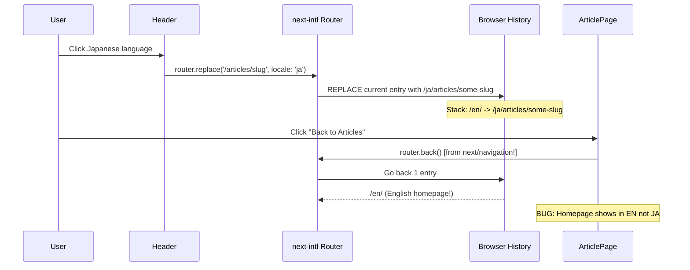

# Fix: Frontend Blog Language Reset on Navigation

## Bug Report

> "front blog 有个问题，我在详情切换日语等，点击返回到首页，语言就变成英语了"
> (Front blog: switching to Japanese on the detail page, then clicking back to homepage resets the language to English.)

## Root Cause Analysis

### Call Chain

1. User is on article detail page (e.g., `/en/articles/some-slug`)
2. User switches language via Header dropdown → [`switchLocale('ja')`](apps/frontend-blog/src/components/Header.tsx:105-116)
3. `switchLocale()` sets `NEXT_LOCALE=ja` cookie, then calls `router.replace(pathname, { locale: 'ja' })`
4. `router.replace()` **replaces** the current history entry → navigates to `/ja/articles/some-slug`
5. History stack is now: `/en/` → `/ja/articles/some-slug`
6. User clicks "Back to Articles" button → [`handleBack()`](apps/frontend-blog/src/app/%5Blocale%5D/articles/%5Bslug%5D/page.client.tsx:108-115)
7. `handleBack()` calls `router.back()` using `next/navigation`'s `router`
8. `router.back()` goes to previous history entry → `/en/` → **English homepage!**

### Key Issues

| # | Issue | Location |
|---|-------|----------|
| 1 | `handleBack()` uses `router.back()` which is unaware of locale switches | [`page.client.tsx:108-115`](apps/frontend-blog/src/app/%5Blocale%5D/articles/%5Bslug%5D/page.client.tsx:108-115) |
| 2 | `router` is imported from `next/navigation` (no locale awareness) | [`page.client.tsx:6`](apps/frontend-blog/src/app/%5Blocale%5D/articles/%5Bslug%5D/page.client.tsx:6) |
| 3 | `switchLocale()` uses `router.replace` which overwrites history | [`Header.tsx:114`](apps/frontend-blog/src/components/Header.tsx:114) |

### Flow Diagram



## Fix Plan

### Strategy

Change the `handleBack()` function in the article detail page to:
1. Use `@/navigation`'s locale-aware `useRouter` instead of `next/navigation`'s
2. Navigate to homepage via `router.push('/')` instead of `router.back()`
3. `@/navigation`'s router automatically prefixes the current locale → `/ja/`

### Changes

#### File 1: [`apps/frontend-blog/src/app/[locale]/articles/[slug]/page.client.tsx`](apps/frontend-blog/src/app/%5Blocale%5D/articles/%5Bslug%5D/page.client.tsx)

**Import change** (line 6):
```typescript
// BEFORE:
import { useParams, useRouter } from 'next/navigation';

// AFTER:
import { useParams } from 'next/navigation';
import { useRouter } from '@/navigation';
```

**handleBack change** (lines 108-115):
```typescript
// BEFORE:
const handleBack = useCallback(() => {
    setNavDirection('backward');
    if (window.history.length > 1) {
      router.back();
    } else {
      router.push(`/${locale}`);
    }
  }, [router, locale]);

// AFTER:
const handleBack = useCallback(() => {
    setNavDirection('backward');
    // Always navigate to homepage with current locale prefix.
    // Using next-intl's locale-aware router ensures the locale is preserved
    // (router.push('/') on a /ja/... page navigates to /ja/).
    router.push('/');
  }, [router]);
```

**Remove unused `locale` dependency**:
- `useLocale()` was only used by `handleBack()` for the fallback `router.push('/' + locale)`. Since we're now using `router.push('/')` from the locale-aware router, `locale` is no longer needed by `handleBack()`.

But wait — `locale` IS still used elsewhere:
- Line 56: `const locale = useLocale();` — used in `formatDate()` (line 154)
- So we keep `useLocale()` but remove `locale` from `handleBack`'s deps array.

## Verification

After fixing:
1. Switch language on article detail page (e.g., to Japanese)
2. Click "Back to Articles" button
3. Expected: homepage shows in Japanese (`/ja/`)
4. Logo/home link should also work correctly (already uses `@/navigation`'s `<Link>`)

## Risk Assessment

| Risk | Impact | Mitigation |
|------|--------|------------|
| `router.push('/')` from `@/navigation` doesn't preserve scroll position | Low - user loses scroll position, but this is acceptable | The `HomePageStateProvider` already preserves article list data in Context |
| Other pages (categories, tags) have similar issues | Low - only article detail has `router.back()` pattern | Quick audit of other page client components shows they use `@/navigation`'s `Link` components |
