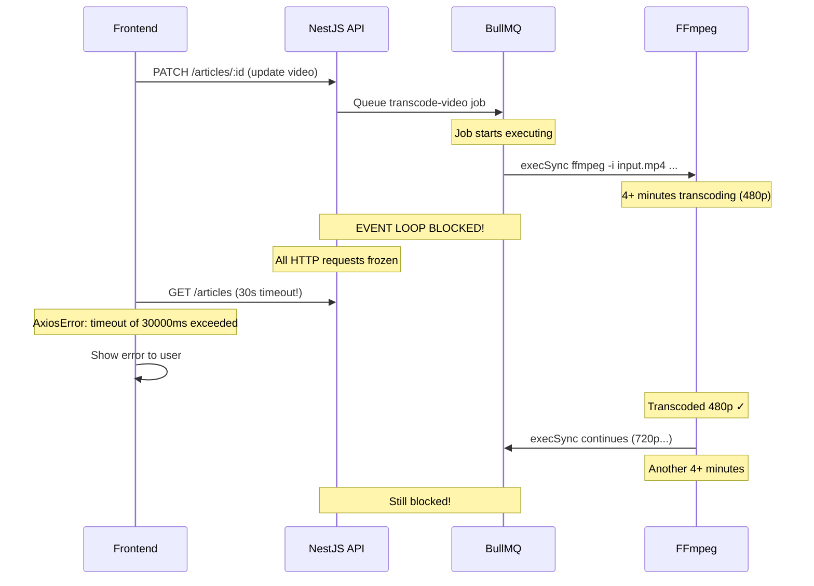
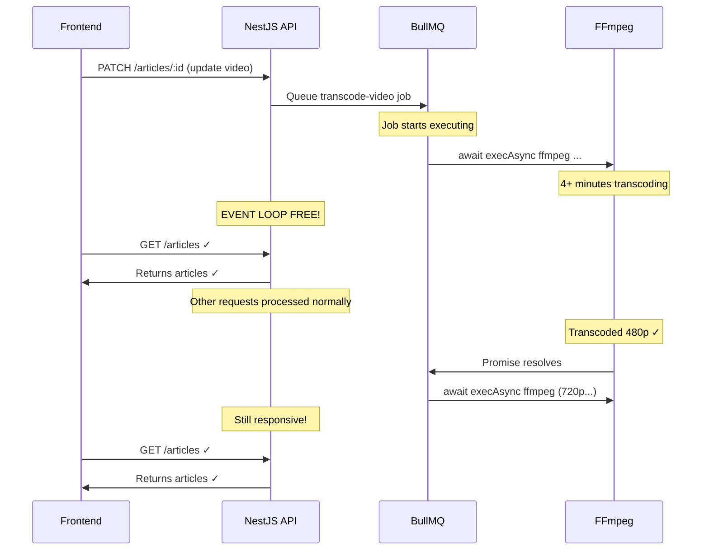

# Fix: Frontend Timeout During Video Transcoding

## Problem

After fixing the OOM (500M memory), ffmpeg now runs successfully but the frontend still times out at 30s.

**Root cause**: `execSync` in `media-processor.service.ts:286` blocks the entire Node.js event loop during ffmpeg HLS transcoding.

From the actual production logs:
- 480p quality alone took **4 minutes 2 seconds** (elapsed=0:04:02.01)
- ffmpeg runs with `threads=1` (single-threaded, forced by libx264 config)
- There are 2-3 quality variants (480p, 720p, possibly 1080p) — total could be **8-12+ minutes**
- During ALL of this time, Node.js cannot process ANY HTTP requests (including frontend article fetch)



## Fix: Convert `execSync` → Async `exec`

Only **1 call** needs conversion — the long-running ffmpeg HLS transcode at line 286.

The ffprobe calls (lines 228, 235) run in <1 second — they can stay as `execSync`.

The thumbnail extraction (line 181) uses `-ss 00:00:01 -vframes 1` and is fast — can stay sync or be converted for consistency.

### Changes Required

**File**: `apps/api/src/common/media/media-processor.service.ts`

#### Change 1: Import `exec` from `child_process` (dynamic import)

```typescript
// Before (line 212):
const { execSync } = await import('child_process');

// After:
const { execSync, exec } = await import('child_process');
const { promisify } = await import('util');
const execAsync = promisify(exec);
```

#### Change 2: Convert the HLS transcode call (line 286-297)

```typescript
// Before:
execSync(
  `ffmpeg -i "${inputPath}" ` +
    `-vf "scale=${resolution}" ` +
    `-c:v libx264 -crf 23 -preset medium ` +
    `-c:a aac -b:a 128k ` +
    `-hls_time 6 ` +
    `-hls_playlist_type vod ` +
    `-hls_segment_filename "${qualityDir}/segment_%03d.ts" ` +
    `-start_number 0 ` +
    `"${qualityDir}/playlist.m3u8"`,
  { encoding: 'utf-8', timeout: 300000 },
);

// After:
await execAsync(
  `ffmpeg -i "${inputPath}" ` +
    `-vf "scale=${resolution}" ` +
    `-c:v libx264 -crf 23 -preset medium ` +
    `-c:a aac -b:a 128k ` +
    `-hls_time 6 ` +
    `-hls_playlist_type vod ` +
    `-hls_segment_filename "${qualityDir}/segment_%03d.ts" ` +
    `-start_number 0 ` +
    `"${qualityDir}/playlist.m3u8"`,
  { encoding: 'utf-8', timeout: 300000 },
);
```

That's it — **only 1 line changes** plus the import line.

## Why This Fix Works

Before (sync): Node.js event loop is frozen → no HTTP, no BullMQ heartbeats, no DB queries

After (async): Node.js event loop stays responsive during ffmpeg → HTTP requests work, BullMQ sends lock renewals, other jobs can process



## What Doesn't Need to Change

| Aspect | Status | Reason |
|--------|--------|--------|
| `compose.prod.yml` memory 500M | ✅ Already deployed | OOM fixed |
| `Dockerfile.prod` ffmpeg | ✅ Already deployed | ffprobe found |
| `media.processor.ts` lockDuration 900s | ✅ Already deployed | Sufficient for async |
| Frontend axios timeout | No change needed | No longer blocks |
| ffprobe calls (lines 228, 235) | Stay as `execSync` | Run in <1s |
| BullMQ job concurrency | No change needed | Async releases event loop |

## Execution Order

1. Switch to Code mode
2. Edit `media-processor.service.ts` — change import + convert execSync to async exec
3. Run `yarn workspace @lucky/api type-check` to verify
4. Rebuild Docker image: `docker compose -f compose.prod.yml build api`
5. Redeploy
6. Test: upload a video and verify frontend doesn't time out
