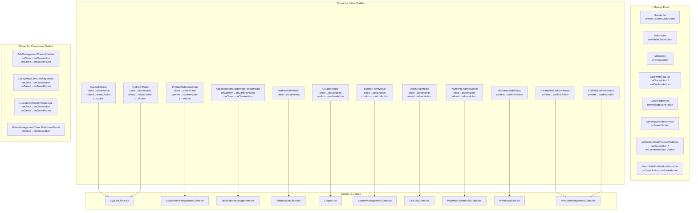

# TS71007 Serializable Props Fix Plan (Final - Complete)

## Problem
Next.js 15+ React 19 strict RSC type checking flags function props in `'use client'` entry files if the prop name doesn't end with `Action` or isn't named `action`.

## Renaming Pattern
All function callback props → append `Action` suffix:
- `close` → `closeAction`
- `reload` → `reloadAction`  
- `confirm` → `confirmAction`
- `t` → `tAction`
- `onClose` → `onCloseAction`
- `onSaved` → `onSavedAction`
- `onConfirm` → `onConfirmAction`

## ✅ Already Fixed (14 files)
| File | Props Changed |
|------|--------------|
| `Header.tsx` | `onMenuButtonClickAction` |
| `Sidebar.tsx` | `onMobileCloseAction` |
| `DashboardLayout.tsx` | Caller updated |
| `Modal.tsx` | `onCloseAction` |
| `ConfirmModal.tsx` | `onCloseAction`, `onConfirmAction` |
| `ChatWindow.tsx` | `onMessageSentAction`, `registerOnNewMessageAction`, `registerOnRecalledAction` |
| `CustomerServiceDesk.tsx` | Caller updated |
| `SchemaSearchForm.tsx` | `onSearchAction` |
| 9 SchemaSearchForm callers | Use `onSearchAction` |
| `ActSectionBindProductModal.tsx` | `onCloseAction`, `onConfirmAction`, `tAction` |
| `ActSectionManagementClient.tsx` | Caller updated |
| `FlashSaleBindProductModal.tsx` | `onCloseAction`, `onSavedAction` |
| `FlashSaleClient.tsx` | Caller updated |

---

## ❌ Phase 7a: Fix View Modals (apps/admin-next/src/views/)

### 1. KycAuditModal.tsx
- **Interface** (lines 24-29): `close`→`closeAction`, `reload`→`reloadAction`, `t`→`tAction`
- **Component** (line 166): destructure `closeAction, reloadAction, tAction`
- **Body**: `t(...)`→`tAction(...)`, `reload()`→`reloadAction()`, `close()`→`closeAction()`
- **ImagePreviewModal** `onClose` (line 35-39): Internal component within same `use client` file, called with `() => setPreviewImage(null)` at line 422 - **this is internal, NOT a server/client boundary issue, skip**
- **KycListClient.tsx** caller (lines 85-91, 102-107, 118-124): Update `close={close}`→`closeAction={close}`, `t={t}`→`tAction={t}`, `reload={...}`→`reloadAction={...}`

### 2. KycFormModal.tsx
- **Interface** (lines 33-39): `close`→`closeAction`, `reload`→`reloadAction`, `t`→`tAction`
- **Component** (lines 41-47): destructure `closeAction, reloadAction, tAction`
- **Body**: `t(...)`→`tAction(...)`, `close`→`closeAction`, `reload`→`reloadAction`
- **KycListClient.tsx** caller (same as above): Update prop names

### 3. ProductSelectorModal.tsx
- **Interface** (lines 24-29): `close`→`closeAction`, `confirm`→`confirmAction`, `t`→`tAction`
- **Component** (lines 31-36): destructure `closeAction, confirmAction, tAction`
- **Body**: `confirm()`→`confirmAction()`, `close`→`closeAction`, `t(...)`→`tAction(...)`
- **ActSectionManagementClient.tsx** caller (lines 150-156): Update `close={close}`→`closeAction={close}`, `confirm={confirm}`→`confirmAction={confirm}`, `t={t}`→`tAction={t}`

### 4. ApplicationsManagement.tsx (RejectModal)
- **Inline function** (lines 16-28): `onConfirm`→`onConfirmAction`, `onClose`→`onCloseAction`
- **Usage** (lines 51-66): `onClick={onClose}`→`onClick={onCloseAction}`, `onClick={() => onConfirm(note)}`→`onClick={() => onConfirmAction(note)}`
- **Caller** (lines 309-315): `onConfirm={...}`→`onConfirmAction={...}`, `onClose={...}`→`onCloseAction={...}`

### 5. AddressEditModal.tsx
- **Interface** (line 41): `close`→`closeAction`
- **Component** (line 45): destructure `closeAction`
- **Body**: `close`→`closeAction` (used at line ~133)
- **AddressListClient.tsx** caller (lines 63-71): `close={...}`→`closeAction={...}`

### 6. CouponModal.tsx
- **Interface** (lines 33-38): `close`→`closeAction`, `confirm`→`confirmAction`, `t`→`tAction`
- **Body**: `close()`→`closeAction()`, `confirm()`→`confirmAction()`, `t(...)`→`tAction(...)`
- **Coupon.tsx** caller (lines 138-154): Update prop names

### 7. BannerFormModal.tsx
- **Interface** (lines 25-31): `close`→`closeAction`, `confirm`→`confirmAction`, `t`→`tAction`
- **Body**: `close()`→`closeAction()`, `confirm()`→`confirmAction()`, `t(...)`→`tAction(...)`
- **BannerManagementClient.tsx** caller (lines 139-149): Update prop names

### 8. UserDetailModal.tsx
- **Interface** (lines 25-29): `close`→`closeAction`, `reload`→`reloadAction`, `t`→`tAction`
- **Body**: `close()`→`closeAction()`, `reload()`→`reloadAction()`, `t(...)`→`tAction(...)`
- **UserListClient.tsx** caller (lines 150-157): Update prop names

### 9. PaymentChannelModal.tsx
- **Interface** (lines 92-96): `close`→`closeAction`, `reload`→`reloadAction`, `t`→`tAction`
- **Body**: `close()`→`closeAction()`, `reload()`→`reloadAction()`, `t(...)`→`tAction(...)`
- **PaymentChannelListClient.tsx** caller (lines 196-202): Update prop names

### 10. ManualAdjustModal.tsx
- **Interface** (lines 38-41): `close`→`closeAction`, `confirm`→`confirmAction`
- **Body**: `close`→`closeAction`, `confirm`→`confirmAction`
- **Caller**: Not imported by any component currently — skip

### 11. TransactionDetailModal.tsx
- **Interface** (line 20): `close`→`closeAction`
- **Body**: `close`→`closeAction`
- **Caller**: Not imported by any component currently — skip

### 12. WithdrawAuditModal.tsx
- **Interface** (lines 29-32): `confirm`→`confirmAction`
- **Body**: `confirm`→`confirmAction`
- **WithdrawalList.tsx** caller (lines 87-94): Update `confirm={...}`→`confirmAction={...}`

### 13. CreateProductFormModal.tsx
- **Interface** (lines 30-33): `confirm`→`confirmAction`
- **Body**: `confirm()`→`confirmAction()`
- **ProductManagementClient.tsx** caller (line 179): Update `confirm={confirm}`→`confirmAction={confirm}`

### 14. EditProductFormModal.tsx
- **Interface** (lines 31-35): `confirm`→`confirmAction`
- **Body**: `confirm()`→`confirmAction()`
- **ProductManagementClient.tsx** caller (lines 190-195): Update `confirm={confirm}`→`confirmAction={confirm}`

---

## ❌ Phase 7b: Fix Component Modals (apps/admin-next/src/components/)

### 15. AdsManagementClient.tsx (AdModal)
- **Inline function** (lines 60-70): `onClose`→`onCloseAction`, `onSaved`→`onSavedAction`, `t`→`tAction`
- **Body**: `onClose()`→`onCloseAction()`, `onSaved()`→`onSavedAction()`, `t(...)`→`tAction(...)`
- **Caller** (lines 544-549 - same file): `onClose={...}`→`onCloseAction={...}`, `onSaved={...}`→`onSavedAction={...}`, `t={t}`→`tAction={t}`

### 16. LuckyDrawClient.tsx (ActivityModal)
- **Inline function** (lines 61-71): `onClose`→`onCloseAction`, `onSaved`→`onSavedAction`, `t`→`tAction`
- **Body**: `onClose()`→`onCloseAction()`, `onSaved()`→`onSavedAction()`, `t(...)`→`tAction(...)`
- **Caller** (lines 1144-1150 - same file): Update prop names

### 17. LuckyDrawClient.tsx (PrizeModal)
- **Inline function** (same file, ~lines 288-299): `onClose`→`onCloseAction`, `onSaved`→`onSavedAction`, `t`→`tAction`
- **Body**: `onClose()`→`onCloseAction()`, `onSaved()`→`onSavedAction()`, `t(...)`→`tAction(...)`
- **Caller** (lines 704-711 - same file): Update prop names

### 18. RolesManagementClient.tsx (RoleUsersPanel)
- **Inline function** (lines 191-201): `onClose`→`onCloseAction`, `t`→`tAction`
- **Body**: `onClose()`→`onCloseAction()`, `t(...)`→`tAction(...)`
- **Caller** (lines 370-375 - same file): Update `onClose={...}`→`onCloseAction={...}`, `t={t}`→`tAction={t}`

---

## Summary: Files to Modify

### Files where INTERFACE + BODY need changes:
1. `apps/admin-next/src/views/kyc/KycAuditModal.tsx`
2. `apps/admin-next/src/views/kyc/KycFormModal.tsx`
3. `apps/admin-next/src/views/act-section/ProductSelectorModal.tsx`
4. `apps/admin-next/src/views/admin/ApplicationsManagement.tsx`
5. `apps/admin-next/src/views/address/AddressEditModal.tsx`
6. `apps/admin-next/src/views/Marketing/CouponModal.tsx`
7. `apps/admin-next/src/views/banner/BannerFormModal.tsx`
8. `apps/admin-next/src/views/user-management/UserDetailModal.tsx`
9. `apps/admin-next/src/views/payment-channel/PaymentChannelModal.tsx`
10. `apps/admin-next/src/views/finance/ManualAdjustModal.tsx` (low priority - no callers)
11. `apps/admin-next/src/views/finance/TransactionDetailModal.tsx` (low priority - no callers)
12. `apps/admin-next/src/views/finance/WithdrawAuditModal.tsx`
13. `apps/admin-next/src/views/product/CreateProductFormModal.tsx`
14. `apps/admin-next/src/views/product/EditProductFormModal.tsx`
15. `apps/admin-next/src/components/ads/AdsManagementClient.tsx`
16. `apps/admin-next/src/components/lucky-draw/LuckyDrawClient.tsx`
17. `apps/admin-next/src/components/roles/RolesManagementClient.tsx`

### Caller-only files (prop names on JSX need updating):
18. `apps/admin-next/src/components/kyc/KycListClient.tsx`
19. `apps/admin-next/src/components/address/AddressListClient.tsx`
20. `apps/admin-next/src/views/Marketing/Coupon.tsx`
21. `apps/admin-next/src/components/banners/BannerManagementClient.tsx`
22. `apps/admin-next/src/components/users/UserListClient.tsx`
23. `apps/admin-next/src/components/payment/PaymentChannelListClient.tsx`
24. `apps/admin-next/src/views/finance/WithdrawalList.tsx`
25. `apps/admin-next/src/components/products/ProductManagementClient.tsx`

**Total: ~25 files need modification**

---

## Diagram: Complete Change Flow



---

## Verification
After all fixes, run:
```bash
cd apps/admin-next && yarn tsc --noEmit
```
Note: `tsc --noEmit` does NOT catch TS71007 (only the Next.js TS plugin does). For real verification, open the fixed files in VS Code and check that red squiggles are gone.
