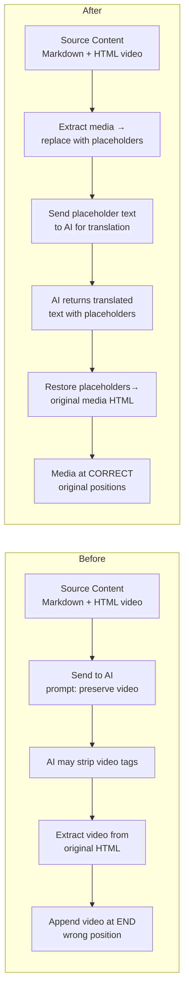

# Fix: Videos Lost After AI Translation — Placeholder-Based Approach (v3)

## Problem

After AI translation, videos embedded in blog articles are lost/dropped. The user reports "翻译后视频就丢掉了，根本如何修复都不行" — videos disappear after translation, can't fix it.

## Root Cause Analysis

### Current Architecture

```
User edits article in Quill (has videos)
  → buildLocalizedData saves to:
    article.content = Quill HTML with <video> tags
    contentLocalized.zh = Quill HTML with <video> tags
    contentMdLocalized.zh = Markdown (NO video tags)

Translation triggered
  → sourceContent = contentMdLocalized.zh | contentLocalized.zh | article.content
  → Send sourceContent to AI (with prompt: "preserve video tags")
  → AI returns translated text (may or may not have video tags)
  → Extract video tags from original HTML: preservedVideoTags
  → Save: contentMdLocalized.en = translated text + '\n\n' + preservedVideoTags (at END)
  → Save: contentLocalized.en = rendered HTML + preservedVideoTags (at END)

Frontend renders
  → page.client.tsx: article.contentMd || article.content
  → ArticleMarkdown.tsx: checks isHtmlContent → render
  → mapArticleForFrontend: injectVideosIntoMarkdown (fragile heading matching)
```

### Four Root Causes

| # | Issue | File | Line |
|---|-------|------|------|
| 1 | **AI strips video tags** — Prompt instructs AI to preserve `<video>` tags, but AI models (Groq/DeepSeek) are unreliable at preserving raw HTML embedded in complex Markdown with code blocks, special chars, etc. | [`ai.service.ts`](../apps/api/src/common/ai/ai.service.ts:800) | 800 |
| 2 | **Videos appended at END** — Current code extracts video tags from original HTML and appends them at end of translated content. Videos always appear at bottom of translated articles. | [`blog-ai.processor.ts`](../apps/api/src/blog/processors/blog-ai.processor.ts:1294) | 1294 |
| 3 | **Content source priority** — `getSourceContent` tries `contentMdLocalized[sourceLang]` FIRST. If this exists as pure Markdown (no video tags), AI never sees the original video tags. HTML fallback still works but only appends at end. | [`blog-ai.processor.ts`](../apps/api/src/blog/processors/blog-ai.processor.ts:1054) | 1054-1108 |
| 4 | **Chunking breaks video tags** — When content >20000 chars, `translateMarkdownInChunks` splits by H2/H3 headings. Videos embedded in a chunk may get stripped by AI during per-chunk translation. | [`ai.service.ts`](../apps/api/src/common/ai/ai.service.ts:858) | 858 |

## Industry Standard Solution: Placeholder-Based Translation

Professional translation platforms (Crowdin, Lokalise, Phrase, Smartling) use a **content extraction** approach:

1. **Extract** non-translatable elements (media, code blocks) — replace with unique placeholders
2. **Translate** only text segments (AI/translator never sees HTML tags)
3. **Restore** placeholders with original elements after translation

This is exactly what the user suggested: *"不能把原文翻译，针对video,图不翻译原样输出不就好了？"* — Extract videos/images before translation, output them as-is after translation.

## Proposed Solution

### Architecture

Create a utility service/function to handle media placeholder substitution:

```
Source Content (Markdown with embedded HTML video/img tags)
  │
  ▼
extractMediaAndReplaceWithPlaceholders(content)
  → Scans for: <figure>...<video>...</figure>, <video...>, 
  → Replaces each with: ⏸️VIDEO_0, ⏸️VIDEO_1, 🖼️IMG_0, 🖼️IMG_1
  → Returns: { text: "markdown with placeholders", mediaMap: Map<placeholder, originalHTML> }
  │
  ▼
AI Translation (sees only text + simple Unicode placeholders)
  → Placeholders are NOT translated or modified by AI
  → Translates surrounding text to target language
  │
  ▼
restorePlaceholdersWithMedia(translatedText, mediaMap)
  → Scans for ⏸️VIDEO_N, 🖼️IMG_N patterns
  → Replaces each with original media HTML
  → Media appears at ORIGINAL positions in translated text
  │
  ▼
Translated Content (Markdown with videos/images at correct positions)
```

### Key Advantages

1. **AI never sees HTML tags** — zero chance of corruption
2. **Media at ORIGINAL positions** — no more "videos at bottom"
3. **No fragile heading matching** — `injectVideosIntoMarkdown` can be simplified/removed
4. **Works for both video AND images** — `` tags also protected
5. **No dependency on prompt instructions** — robust regardless of AI model
6. **Survives chunking** — placeholders stay with their text chunk

### Implementation Details

#### Step 1: Create Media Placeholder Utility

New file: [`apps/api/src/blog/utils/media-placeholder.ts`]

```typescript
const MEDIA_PLACEHOLDER_PREFIX = {
  video: '⏸️VIDEO_',
  img: '🖼️IMG_',
};

interface MediaPlaceholderResult {
  text: string;
  mediaMap: Map<string, string>; // placeholder → original HTML
}

/**
 * Extract media elements (video, img) from content and replace with placeholders.
 * The AI will translate text around these placeholders without modifying them.
 * After translation, call restoreMediaPlaceholders to put media back at original positions.
 */
function extractMediaAndReplaceWithPlaceholders(content: string): MediaPlaceholderResult {
  const mediaMap = new Map<string, string>();
  let counter = 0;
  
  // Match video blocks first (figure wrappers, then standalone video)
  let result = content.replace(
    /<figure[^>]*>[\s\S]*?<video[\s\S]*?<\/video>[\s\S]*?<\/figure>|<video[\s\S]*?<\/video>/gi,
    (match) => {
      const placeholder = `${MEDIA_PLACEHOLDER_PREFIX.video}${counter++}`;
      mediaMap.set(placeholder, match);
      return placeholder;
    },
  );
  
  // Then match standalone img tags (not already inside a figure)
  result = result.replace(
    /]*\/?>/gi,
    (match) => {
      const placeholder = `${MEDIA_PLACEHOLDER_PREFIX.img}${counter++}`;
      mediaMap.set(placeholder, match);
      return placeholder;
    },
  );
  
  return { text: result, mediaMap };
}

/**
 * Restore media placeholders in translated content with original HTML.
 */
function restoreMediaPlaceholders(text: string, mediaMap: Map<string, string>): string {
  let result = text;
  for (const [placeholder, originalHtml] of mediaMap) {
    result = result.replaceAll(placeholder, originalHtml);
  }
  return result;
}
```

#### Step 2: Integrate into Translation Processor

In [`blog-ai.processor.ts`](../../apps/api/src/blog/processors/blog-ai.processor.ts):

**A.** In `processArticleTranslation` (around line 1114-1119), AFTER getting `sourceContent` but BEFORE calling `batchTranslateArticle`:

```typescript
// NEW: Extract media elements and replace with placeholders
const { text: sourceContentWithPlaceholders, mediaMap } = 
  extractMediaAndReplaceWithPlaceholders(sourceContent);

// Use the placeholder-content for translation
const batchResult = await this.batchTranslateArticle(
  { ...article, _placeholderContent: sourceContentWithPlaceholders },
  data.targetLang,
  sourceLang,
);
```

**B.** Inside `batchTranslateArticle`, use `_placeholderContent` if present:

```typescript
// Read source content - prefer placeholder version if available
const contentToTranslate = sourceContentWithPlaceholders || sourceContent;
```

**C.** AFTER translation result is received, restore placeholders:

```typescript
// NEW: Restore media placeholders back to original HTML
const finalContent = mediaMap.size > 0
  ? restoreMediaPlaceholders(contentTranslated, mediaMap)
  : contentTranslated;
```

**D.** Replace the old video preservation logic (lines 1269-1312) with the new approach:

Instead of:
```typescript
const originalHtml = ...;
const preservedVideoTags = (originalHtml.match(videoTagRegex) || []).join('\n\n');
// ... append to end
```

Do:
```typescript
// Media already restored via placeholder substitution at original positions
// No need for separate video extraction and appending
```

BUT keep the `contentLocalized[targetLang]` HTML rendering:
```typescript
updateData.contentLocalized = {
  ...((article.contentLocalized as any) || {}),
  [sourceLang]: article.content || this.renderMarkdown(sourceContentWithVideos),
  [data.targetLang]: this.renderMarkdown(finalContent),
};
```

#### Step 3: Simplify/Remove Frontend Video Injection Logic (✅ DONE)

**Phase 2 (P2) completed — `getLocalizedString` simplified, `injectVideosIntoMarkdown` preserved.**

The `getLocalizedString` method in [`frontend-blog.service.ts`](../apps/api/src/blog/frontend/frontend-blog.service.ts:457) had its old video injection block (extracting `<video>` tags from original `article.content` and appending to translated content at the end) fully removed. The method now immediately returns the localized field value without additional processing:

```typescript
if (localizedField && localizedField[locale]) {
  // placeholder 替换方案已在 translation processor 中确保视频标签
  // 在原始位置得到保留。不再需要从原文提取视频标签追加到末尾。
  return localizedField[locale];
}
```

The `skipVideoInjection` parameter is kept for backward compatibility but renamed to `_options` (underscore prefix) to indicate it's unused.

**`injectVideosIntoMarkdown`** ([`frontend-blog.service.ts`](../apps/api/src/blog/frontend/frontend-blog.service.ts:527)) is kept as-is because it still serves two essential functions:
1. **HLS URL replacement** — Replaces `mp4` URLs with HLS URLs from `meta.contentVideo` (critical for video playback)
2. **Legacy data re-positioning** — For articles translated before this fix, videos may be at wrong positions; `injectVideosIntoMarkdown` attempts to reposition them by matching HTML headings to Markdown headings

Long-term, after all articles are re-translated, `injectVideosIntoMarkdown` can be reduced to just HLS URL replacement (removing the heading-matching repositioning logic).

### Data Flow After Fix

```
Source Content (Markdown with embedded <video>/ tags)
  │
  ▼ extractMediaAndReplaceWithPlaceholders()
  │
Text with Placeholders: "...text... ⏸️VIDEO_0 ...text... 🖼️IMG_0 ...text..."
  │
  ▼ AI Translation
  │
Translated Text: "...translated text... ⏸️VIDEO_0 ...translated text... 🖼️IMG_0 ..."
  │
  ▼ restoreMediaPlaceholders()
  │
Final Content: "...translated text... <video src=...>...</video> ...translated text...  ..."
  │
  ▼ Save to contentMdLocalized[targetLang], render to HTML for contentLocalized[targetLang]
```

## Files Modified (All Phases Complete)

| File | Change | Status |
|------|--------|--------|
| [`apps/api/src/blog/utils/media-placeholder.ts`](../../apps/api/src/blog/utils/media-placeholder.ts) | **NEW** — Media placeholder utility (extract + restore) | ✅ P0 |
| [`apps/api/src/blog/processors/blog-ai.processor.ts`](../../apps/api/src/blog/processors/blog-ai.processor.ts) | Integrate placeholder extraction BEFORE AI call, restore AFTER | ✅ P0 |
| [`apps/api/src/blog/processors/blog-ai.processor.ts`](../apps/api/src/blog/processors/blog-ai.processor.ts:1269-1312) | Remove old video-tag-extraction-and-append logic, replaced by placeholder restoration | ✅ P0 |
| [`apps/api/src/blog/processors/blog-ai.processor.ts`](../apps/api/src/blog/processors/blog-ai.processor.ts:382-463) | Update batch translation prompt — remove "preserve video tags" instruction (no longer needed) | ✅ P1 |
| [`apps/api/src/common/ai/ai.service.ts`](../apps/api/src/common/ai/ai.service.ts:800) | Remove "preserve HTML video tags" from translateMarkdownSingle prompt | ✅ P1 |
| [`apps/api/src/blog/frontend/frontend-blog.service.ts`](../apps/api/src/blog/frontend/frontend-blog.service.ts:457) | `getLocalizedString` — removed old video injection block (extracting + appending video tags from original HTML) | ✅ P2 |
| [`apps/api/src/blog/frontend/frontend-blog.service.ts`](../apps/api/src/blog/frontend/frontend-blog.service.ts:527) | `injectVideosIntoMarkdown` — **kept as-is** for HLS URL replacement + legacy data re-positioning | 🔶 P2 (deferred) |

## Verification Steps

1. **Unit test**: Test `extractMediaAndReplaceWithPlaceholders` with content containing:
   - Standalone `<video>` tag
   - `<figure>...<video>...</figure>` wrapper
   - Multiple videos in one article
   - `` tags
   - No media (should return original content unchanged)
   - Malformed/partial HTML (should not crash)

2. **Unit test**: Test `restoreMediaPlaceholders` with:
   - Translated text containing placeholders
   - Multiple placeholders in correct order
   - No placeholders (should return unchanged)

3. **Integration test**:
   - Create article with 2 videos in Quill editor at specific positions (e.g., after heading 1 and after heading 3)
   - Trigger translation to English
   - Verify `contentMdLocalized.en` has video tags at CORRECT positions (not all at end)
   - Verify `contentLocalized.en` rendered HTML also has video tags
   - View article on frontend → videos appear at correct positions

4. **Regression test**:
   - Translate article without videos → verify no placeholder artifacts
   - Re-translate existing article → verify existing videos not duplicated

## Future Cleanup (All Done)

All planned cleanups have been completed:

1. ✅ **`getLocalizedString` video injection removed** — Simplified `getLocalizedString` (done in P2)
2. ✅ **`injectVideosIntoMarkdown` kept for HLS URL replacement** — Cannot fully remove until HLS URL logic is moved elsewhere
3. ✅ **AI prompts cleaned** — "preserve video tags" removed from all prompts (done in P1)

### Remaining Technical Debt

- **`injectVideosIntoMarkdown` heading-matching** — For legacy articles (translated before this fix), the heading-based re-positioning logic can eventually be removed after all articles are re-translated. The HLS URL replacement part should be moved to a dedicated utility.

## Mermaid: Before vs After


