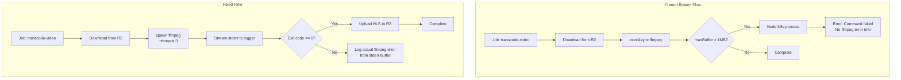
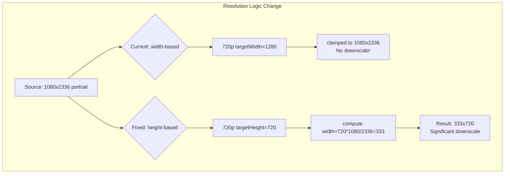

# Fix: Video Transcoding Failure — `exec` maxBuffer Overflow

## Root Cause Analysis

### The Error

```
[Nest] 62  - 05/07/2026, 10:28:12 AM   ERROR [MediaProcessorService] Video transcoding failed: Error: Command failed: ffmpeg ...
```

The ffmpeg command runs for 3 minutes 34 seconds, processes only 23 seconds of a 2:18 video (speed=0.108x), then crashes with a generic "Command failed" — **no ffmpeg error message is shown**.

### Primary Root Cause: `child_process.exec` maxBuffer Exceeded

In [`media-processor.service.ts:288`](../apps/api/src/common/media/media-processor.service.ts:288), the code uses:

```typescript
const { exec } = await import('child_process');
const { promisify } = await import('util');
const execAsync = promisify(exec);

await execAsync(`ffmpeg ...`, { encoding: 'utf-8', timeout: 300000 });
```

**`child_process.exec` has a default `maxBuffer` of 1024 \* 1024 bytes (1 MB).** ffmpeg continuously outputs progress information to stderr:

```
frame=  696 fps=3.2 q=29.0 size=N/A time=00:00:23.13 bitrate=N/A speed=0.108x
```

For a 2:18 video at 0.108x speed, transcoding takes ~21 minutes. During this time, ffmpeg outputs a progress line every few frames, easily exceeding 1 MB of stderr output. When `maxBuffer` is exceeded, Node.js kills the child process and throws `Error: stdout maxBuffer exceeded` or `Error: stderr maxBuffer exceeded` — but the actual ffmpeg error output is **lost** because the buffer was full.

This is why the log shows `Command failed: ffmpeg ...` without any specific ffmpeg error message.

### Secondary Issue: Extremely Slow Encoding Speed (0.108x)

The log shows `threads=1` in the x264 output — ffmpeg is using only **1 thread** for encoding. On a 1GB VPS with memory limits (500MB for backend container), the CPU is likely very constrained. The `-preset medium` setting is too aggressive for this environment.

Additionally, the video is **1080x2336** (portrait, 9:19.5 aspect ratio). The 720p variant's target width (1280) gets clamped to the source width (1080), so the "720p" variant is actually encoding at **full resolution** — no downscaling occurs.

### Tertiary Issue: Resolution Logic for Portrait Videos

The current logic computes target dimensions based on **width**:

```typescript
const targetWidth = Math.min(qt.targetWidth, sourceWidth);
const computedHeight = Math.round(targetWidth / sourceAspectRatio);
```

For a 1080x2336 portrait video:
- 720p: targetWidth=1280 → clamped to 1080 → height=2336 (same as source!)
- 480p: targetWidth=854 → height=1847 (still very tall)

The quality labels ("720p", "480p") traditionally refer to **height**, not width. For portrait videos, using width-based scaling produces misleading labels and wastes compute on near-full-resolution encodes.

---

## Fix Plan

### Fix 1: Replace `exec` with `spawn` for ffmpeg Transcoding

**File:** [`media-processor.service.ts`](../apps/api/src/common/media/media-processor.service.ts)

**Problem:** `exec` buffers all stdout/stderr in memory, causing maxBuffer overflow.

**Solution:** Replace `execAsync` with `spawn` for the ffmpeg transcoding call. `spawn` streams output via events and has no buffer limit.

**Implementation details:**
- Use `child_process.spawn` instead of `util.promisify(exec)`
- Pipe stderr to a logger for real-time progress tracking (optional but nice)
- Wrap in a `Promise` that resolves on `close` event with exit code check
- Keep the 300000ms (5 min) timeout via `setTimeout` + `kill`

```typescript
// Before (broken):
await execAsync(`ffmpeg -i "${inputPath}" ...`, { timeout: 300000 });

// After (fixed):
await this.spawnFfmpeg([
  '-i', inputPath,
  '-vf', `scale=${resolution}`,
  '-c:v', 'libx264', '-crf', '23', '-preset', 'medium',
  '-c:a', 'aac', '-b:a', '128k',
  '-hls_time', '6',
  '-hls_playlist_type', 'vod',
  '-hls_segment_filename', `${qualityDir}/segment_%03d.ts`,
  '-start_number', '0',
  `${qualityDir}/playlist.m3u8`,
], { timeout: 300000 });
```

### Fix 2: Add `-threads 0` to ffmpeg Arguments

**File:** [`media-processor.service.ts`](../apps/api/src/common/media/media-processor.service.ts)

**Problem:** ffmpeg uses only 1 thread (`threads=1`), causing 0.108x encoding speed.

**Solution:** Add `-threads 0` to let ffmpeg auto-detect and use all available CPU cores. Even on a constrained VPS, this should improve from 1 thread to at least 2-4 threads.

Add to the ffmpeg arguments:
```
-threads 0
```

### Fix 3: Use Height-Based Resolution Labels for Portrait Videos

**File:** [`media-processor.service.ts`](../apps/api/src/common/media/media-processor.service.ts)

**Problem:** Quality targets use width-based names ("720p" = 1280px wide), but for portrait videos this results in no actual downscaling.

**Solution:** Change the quality target definitions to be height-based, and compute width from aspect ratio:

```typescript
interface QualityTarget {
  name: string;
  targetHeight: number;  // Changed from targetWidth
  bandwidth: string;
}

const qualityTargets: QualityTarget[] = [
  { name: '480p', targetHeight: 480, bandwidth: '800k' },
  { name: '720p', targetHeight: 720, bandwidth: '2800k' },
];

// Only add 1080p if source is tall enough
if (sourceHeight >= 1080) {
  qualityTargets.push({
    name: '1080p',
    targetHeight: 1080,
    bandwidth: '5000k',
  });
}

// Compute dimensions preserving aspect ratio
const targetHeight = Math.min(qt.targetHeight, sourceHeight);
const computedWidth = Math.round(targetHeight * sourceAspectRatio);
const targetWidth = Math.min(computedWidth, sourceWidth);
```

This ensures:
- 720p = max 720px height (down from 2336 → big performance win)
- 480p = max 480px height
- 1080p = max 1080px height (only if source >= 1080px tall)

### Fix 4: Also Fix `extractVideoThumbnail` to Use `spawn`

**File:** [`media-processor.service.ts`](../apps/api/src/common/media/media-processor.service.ts:182)

The `extractVideoThumbnail` method also uses `execSync` for ffmpeg, which is blocking and could hang the event loop. Replace with `spawn` + `execSync` is acceptable here since it's a quick operation (single frame extraction), but for consistency and safety, consider using `spawn` or at least adding a timeout.

Actually, `execSync` for a single frame extraction (not the full transcode) is fine — it should complete in seconds. No change needed here.

### Fix 5: Increase Job Timeout / Add Better Error Logging

**File:** [`media-processor.service.ts`](../apps/api/src/common/media/media-processor.service.ts)

Add explicit error logging that captures the actual ffmpeg stderr output when using `spawn`:

```typescript
private spawnFfmpeg(args: string[], options: { timeout: number }): Promise<void> {
  return new Promise((resolve, reject) => {
    const child = spawn('ffmpeg', args);
    let stderr = '';
    let timedOut = false;

    const timer = setTimeout(() => {
      timedOut = true;
      child.kill('SIGTERM');
      reject(new Error(`ffmpeg timed out after ${options.timeout}ms`));
    }, options.timeout);

    child.stderr.on('data', (data: Buffer) => {
      stderr += data.toString();
      // Optional: log progress periodically
    });

    child.on('close', (code) => {
      clearTimeout(timer);
      if (timedOut) return;
      if (code !== 0) {
        reject(new Error(`ffmpeg exited with code ${code}\n${stderr.slice(-2000)}`));
      } else {
        resolve();
      }
    });

    child.on('error', (err) => {
      clearTimeout(timer);
      reject(err);
    });
  });
}
```

---

## Files to Modify

| File | Changes |
|------|---------|
| [`apps/api/src/common/media/media-processor.service.ts`](../apps/api/src/common/media/media-processor.service.ts) | 1. Replace `execAsync` with `spawnFfmpeg` helper (Fix 1) |
| | 2. Add `-threads 0` to ffmpeg args (Fix 2) |
| | 3. Change quality targets to height-based (Fix 3) |
| | 4. Add `spawnFfmpeg` private method with proper error logging (Fix 5) |

## Testing

1. **Unit test**: Verify the `spawnFfmpeg` helper resolves/rejects correctly
2. **Integration test**: Upload a portrait video (1080x2336, ~30MB) and verify transcoding completes
3. **Edge cases**:
   - Landscape video (1920x1080) — should still work correctly
   - Small video (640x480) — should not upscale
   - Very long video (>10 min) — should complete within timeout
   - Invalid video file — should fail gracefully with clear error

## Rollback Plan

If the fix causes issues:
1. Revert the changes to [`media-processor.service.ts`](../apps/api/src/common/media/media-processor.service.ts)
2. The old `execAsync` approach will be restored (with its original maxBuffer issue)
3. Alternatively, keep the `spawn` approach but increase `timeout` to 600000ms (10 min)

---

## Mermaid Diagram: Current vs Fixed Flow




