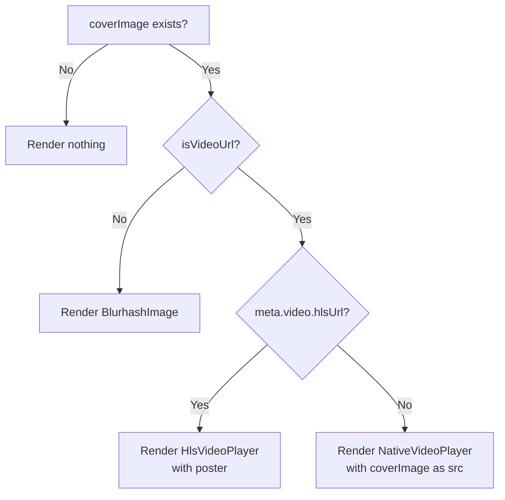

# Plan: Add Cover Image/Video to Article Detail Page

## Problem

The article detail page (`apps/frontend-blog/src/app/[locale]/articles/[slug]/page.client.tsx`) does not render the `coverImage` field in the UI. The cover image is only used in the JSON-LD structured data (SEO) at line 92, but never displayed visually.

Meanwhile, the `ArticleCard` component (`apps/frontend-blog/src/components/blog/ArticleCard.tsx`) properly renders the cover — handling both image URLs and video URLs with appropriate players.

## Root Cause

When video support was added to the article detail page (injecting `<video>` tags into the markdown content), the **hero cover image/video** section was never added to the detail page layout. The `coverImage` field from the `FrontendArticle` type can be:

1. **An image URL** (e.g., `https://cdn.example.com/images/cover.jpg`)
2. **A video URL** (e.g., `https://cdn.example.com/videos/video.mp4` or `.m3u8`)

The `ArticleCard` already handles both cases via `isVideoUrl()` detection.

## Scope of Changes

**Only one file needs modification:**

### `apps/frontend-blog/src/app/[locale]/articles/[slug]/page.client.tsx`

Add a cover image/video section **after the `<header>` block** (line 273) and **before the article content** (line 275).

## Implementation Details

### New imports needed:
- `isVideoUrl` from `@/lib/utils/media`
- `HlsVideoPlayer` from `@/components/blog/HlsVideoPlayer`
- `BlurhashImage` from `@/components/blog/BlurhashImage` (already indirect via `next/image`)
- `Play` from `lucide-react` (for video play overlay)

### Cover rendering logic (between header + content):

```tsx
{/* Cover image/video — hero section */}
{article.coverImage ? (
  <div className="relative overflow-hidden rounded-xl mb-10 aspect-video">
    {isVideoUrl(article.coverImage) ? (
      /* Video cover — use HLS if available, otherwise native video */
      article.meta?.video?.hlsUrl ? (
        <HlsVideoPlayer
          hlsUrl={article.meta.video.hlsUrl}
          poster={article.meta.video.poster}
          className="w-full h-full object-cover"
          clickToPlay
        />
      ) : (
        /* Native video with click-to-play overlay */
        <NativeVideoPlayer
          src={article.coverImage}
          poster={article.meta?.video?.poster}
          className="w-full h-full"
        />
      )
    ) : (
      /* Static image cover — use BlurhashImage for smooth loading */
      <BlurhashImage
        src={article.coverImage}
        alt={article.title}
        fill
        priority
        blurhash={article.meta?.images?.blurhash}
        className="object-cover"
        sizes="(max-width: 768px) 100vw, 1024px"
      />
    )}
  </div>
) : null}
```

### Edge cases handled:

1. **`coverImage` is empty/null** → render nothing (no placeholder needed for detail page)
2. **`meta` stripped in SSR initial data** → `meta?.video?.hlsUrl` will be `undefined`, falls through to native video path with `coverImage` as `src`; after client refetch completes, `meta` becomes available
3. **Video URL but no HLS** → native `<video>` with click-to-play via `NativeVideoPlayer`
4. **Image URL** → `BlurhashImage` with blurhash placeholder for smooth loading
5. **Image URL but no blurhash** → `BlurhashImage` shows gray placeholder during load

### Why not reuse ArticleCard directly?

`ArticleCard` wraps the cover in a `Link` for navigation and includes bookmark buttons, category badges, etc. — none of which are appropriate for the detail page hero section. A standalone cover section is cleaner.

## Flow Diagram

```
┌─────────────────────────────────────────┐
│  Back link                              │
├─────────────────────────────────────────┤
│  Header: categories, tags, title, meta  │  ← existing
├─────────────────────────────────────────┤
│  Cover: image or video (NEW)            │  ← ADD THIS
├─────────────────────────────────────────┤
│  ArticleMarkdown (content)              │  ← existing
├─────────────────────────────────────────┤
│  CommentList                            │  ← existing
└─────────────────────────────────────────┘
```

## Decision Tree for Cover Rendering



## Risks & Mitigations

| Risk | Mitigation |
|------|-----------|
| `meta` not available on SSR (stripped in `page.tsx`) | Native video fallback uses `coverImage` directly as src; `meta?.video?.poster` is optional | 
| Large hero image slows LCP | Use `priority` prop on `next/image` and `aspect-video` container |
| Video autoplay with sound | All video players use `clickToPlay`, no autoplay |
| Video cover not actually a playable video | The `isVideoUrl` check is the same used by `ArticleCard`, consistent behavior |
