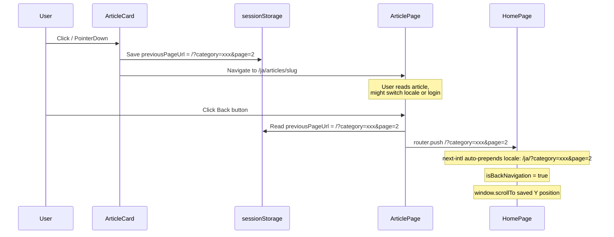

# Frontend Blog: Back Navigation Scroll Restoration + CategoryFilter Tab Jitter Fix

## Problem 1: Back Navigation Scroll Restoration

### Symptoms
1. **Scroll position not restored** — navigating home → article → back always scrolls to top
2. **URL search params lost** — `?category=xxx&page=2` disappears on back navigation

### Root Cause
Two interacting bugs:

**Bug A: Scroll restoration condition never matches**
[`page.client.tsx:245`](../../apps/frontend-blog/src/app/[locale]/page.client.tsx:245)
```typescript
if (navigatedTo?.includes('/articles/') && savedScrollY) {
```
The `homeNavigatedTo` value is set during **home page unmount** at line 184:
```typescript
sessionStorage.setItem('homeNavigatedTo', window.location.pathname);
```
At unmount, `window.location.pathname` is the **home page path** (e.g., `/ja/`), NOT the article path. So `includes('/articles/')` is always `false`.

**Bug B: No URL state preservation on back**
[`articles/[slug]/page.client.tsx:112`](../../apps/frontend-blog/src/app/[locale]/articles/[slug]/page.client.tsx:112)
```typescript
const handleBack = useCallback(() => {
    setNavDirection('backward');
    router.push('/');  // Creates new history entry, loses URL params
}, [router]);
```

### History Stack Edge Cases

```
Home /ja/?category=xxx
  ↓ click article card
Article /ja/articles/slug
  ↓ switch locale (router.replace, modifies history in-place)
Article /ja/articles/slug  (same entry, locale cookie changed)
  ↓ click bookmark (not logged in, router.push)
Login /ja/login?returnUrl=...
  ↓ login success (router.push back to article)
Article /ja/articles/slug
  ↓ click Back
  ???
```

**Critical**: Using `router.back()` would:
- Go back to login page (if user logged in) ❌
- Go back to previous locale's home page ❌

**Keeping `router.push()`** is correct, but must preserve URL search params.

---

## Problem 2: CategoryFilter Tab Jittering

### Symptom
"首页的tab每次点击都在抖动，特别是点击到后面的时候，动画回来特别长，很突然" — home page tab buttons jitter on click, especially at the end of the list; animation takes long and feels sudden.

### Root Cause Analysis
Two interacting issues in [`CategoryFilter.tsx`](../../apps/frontend-blog/src/components/blog/CategoryFilter.tsx):

**Cause A: `transition-all duration-200` on tab buttons (lines 182, 205)**
```typescript
className={`
    flex-shrink-0 px-5 py-2.5 rounded-lg text-sm font-semibold
    transition-all duration-200 whitespace-nowrap
    ${isActive
        ? 'bg-blue-600 text-white shadow-sm shadow-blue-300'
        : ...
    }
`}
```
- When a tab becomes active, its visual appearance changes: background color, text color, and shadow are added
- `transition-all` animates ALL CSS properties, including `box-shadow` which can affect perceived element width
- This creates a **feedback loop with Embla carousel**: tab size changes during transition → Embla re-centers → position changes → more visual changes → more re-centering → **jitter**

**Cause B: `align: 'center'` (line 58)**
```typescript
const [emblaRef, emblaApi] = useEmblaCarousel({
    align: 'center',           // ← PROBLEM
    containScroll: 'keepSnaps',
    dragFree: false,
    slidesToScroll: 1,
});
```
- `align: 'center'` forces Embla to keep the selected slide centered in the viewport
- When clicking a tab at the **end** of the list, there aren't enough slides to fill the right side
- Embla scrolls a very long distance to try to center the last tab, then hits the scroll boundary and stops abruptly
- This causes the "动画回来特别长，很突然" (long animation, sudden stop) effect

---

## Solution

### Fix 1: [`ArticleCard.tsx`](../../apps/frontend-blog/src/components/blog/ArticleCard.tsx:285)
Save the current page URL (without locale prefix) to `sessionStorage` when clicking an article link.

**Current code** (line 285):
```typescript
onPointerDown={() => setNavDirection('forward')}
```

**New code**:
```typescript
onPointerDown={() => {
    setNavDirection('forward');
    if (typeof window !== 'undefined') {
        const path = window.location.pathname;
        const search = window.location.search;
        // Strip locale prefix so next-intl auto-prepends correct current locale
        const localePrefix = `/${useLocale()}`;
        const pathWithoutLocale = path.startsWith(localePrefix)
            ? path.slice(localePrefix.length) || '/'
            : path;
        sessionStorage.setItem('previousPageUrl', pathWithoutLocale + search);
    }
}}
```

> **Note**: `useLocale()` is already imported and called in this component. We extract the locale value and use it to strip the prefix, saving a locale-agnostic path.

### Fix 2: [`articles/[slug]/page.client.tsx`](../../apps/frontend-blog/src/app/[locale]/articles/[slug]/page.client.tsx:110-113)
Update `handleBack` to read saved URL from `sessionStorage` instead of hardcoded `'/'`.

**Current code**:
```typescript
const handleBack = useCallback(() => {
    setNavDirection('backward');
    router.push('/');
}, [router]);
```

**New code**:
```typescript
const handleBack = useCallback(() => {
    setNavDirection('backward');
    const previousUrl = typeof window !== 'undefined'
        ? sessionStorage.getItem('previousPageUrl')
        : null;
    if (previousUrl) {
        router.push(previousUrl);
        sessionStorage.removeItem('previousPageUrl');
    } else {
        router.push('/');
    }
}, [router]);
```

### Fix 3: [`page.client.tsx`](../../apps/frontend-blog/src/app/[locale]/page.client.tsx:245)
Fix scroll restoration condition to use `isBackNavigation` instead of the broken `navigatedTo?.includes('/articles/')`.

**Current code** (line 245):
```typescript
if (navigatedTo?.includes('/articles/') && savedScrollY) {
```

**New code**:
```typescript
if (isBackNavigation && savedScrollY) {
```

The `isBackNavigation` variable is already computed at lines 104-107:
```typescript
const isBackNavigation =
    typeof window !== 'undefined' &&
    getNavDirection() === 'backward' &&
    allArticles.length > 0;
```
This correctly detects backward navigation and is the proper condition to use.

### Fix 4: [`CategoryFilter.tsx`](../../apps/frontend-blog/src/components/blog/CategoryFilter.tsx:182,205)
Change `transition-all duration-200` to `transition-colors duration-200` on tab buttons to prevent layout-animation feedback loop with Embla.

**Current code** (lines 182, 205):
```typescript
transition-all duration-200 whitespace-nowrap
```

**New code**:
```typescript
transition-colors duration-200 whitespace-nowrap
```

### Fix 5: [`CategoryFilter.tsx`](../../apps/frontend-blog/src/components/blog/CategoryFilter.tsx:58)
Change `align: 'center'` to `align: 'start'` to prevent long-distance re-centering scrolls at the end of the list.

**Current code**:
```typescript
const [emblaRef, emblaApi] = useEmblaCarousel({
    align: 'center',
    containScroll: 'keepSnaps',
    dragFree: false,
    slidesToScroll: 1,
});
```

**New code**:
```typescript
const [emblaRef, emblaApi] = useEmblaCarousel({
    align: 'start',
    containScroll: 'keepSnaps',
    dragFree: false,
    slidesToScroll: 1,
});
```

---

## Navigation Flow (After Fix)



---

## Files to Modify

| # | File | Change |
|---|------|--------|
| 1 | [`apps/frontend-blog/src/components/blog/ArticleCard.tsx`](../../apps/frontend-blog/src/components/blog/ArticleCard.tsx) | Save `previousPageUrl` (locale-stripped path + search) to `sessionStorage` in `onPointerDown` |
| 2 | [`apps/frontend-blog/src/app/[locale]/articles/[slug]/page.client.tsx`](../../apps/frontend-blog/src/app/[locale]/articles/[slug]/page.client.tsx) | `handleBack` reads `previousPageUrl` from `sessionStorage`; fallback to `router.push('/')` |
| 3 | [`apps/frontend-blog/src/app/[locale]/page.client.tsx`](../../apps/frontend-blog/src/app/[locale]/page.client.tsx) | Fix scroll restoration condition: `navigatedTo?.includes('/articles/')` → `isBackNavigation` |
| 4 | [`apps/frontend-blog/src/components/blog/CategoryFilter.tsx`](../../apps/frontend-blog/src/components/blog/CategoryFilter.tsx) | `transition-all` → `transition-colors` on tab buttons |
| 5 | [`apps/frontend-blog/src/components/blog/CategoryFilter.tsx`](../../apps/frontend-blog/src/components/blog/CategoryFilter.tsx) | `align: 'center'` → `align: 'start'` in Embla config |

---

---

## Problem 3: iOS Safari Bottom Navigation Gap (visualViewport Safe Area)

### Symptoms
1. **Gap below bottom nav on scroll** — scrolling up on the home page in iOS Safari shows a visible gap between the bottom navigation and the screen edge because `env(safe-area-inset-bottom)` is a static CSS value that doesn't update when Safari toolbars hide
2. **Nav flush against browser bottom after back navigation** — going to article detail → scrolling to bottom → clicking Back results in bottom nav being flush against the browser bottom (no safe area padding for the home indicator)

### Root Cause

[`globals.css:8`](../../apps/frontend-blog/src/app/globals.css:8)
```css
--safe-area-bottom: env(safe-area-inset-bottom, 0px);
```

`env(safe-area-inset-bottom)` is a **static CSS environment variable** evaluated once at paint time. It:
- Returns the initial safe area inset (~34px on iOS with toolbar shown)
- Does **NOT** update when iOS Safari toolbars hide during scroll
- After Next.js SPA navigation, the CSS variable may evaluate to `0px` if the browser considers the new page's initial viewport state differently

When toolbar hides:
- `visualViewport` expands downward (height increases by toolbar height)
- `env(safe-area-inset-bottom)` stays static → spacer is too big → gap appears
- After SPA back navigation → CSS may re-evaluate to 0 → spacer disappears → home indicator overlaps buttons

### Solution: Use `window.visualViewport` API

[`BottomNavigation.tsx`](../../apps/frontend-blog/src/components/BottomNavigation.tsx:17)

The `window.visualViewport` API:
- Fires a `resize` event when iOS Safari toolbars show/hide
- Provides `vv.height` (visible area) and `vv.offsetTop` (top chrome height)
- Allows dynamic calculation: `safeAreaBottom = window.innerHeight - (vv.height + vv.offsetTop)`

**Implementation** — add a new `useEffect` that:
1. Calculates safe area bottom on mount
2. Listens to `visualViewport.resize` for toolbar show/hide
3. Re-calculates on route change (`pathname` dependency)
4. Sets `--safe-area-bottom` on `document.documentElement.style` — this overrides the CSS `env()` value globally, so all consumers (`--nav-height`, `--content-padding-bottom`, spacer divs) automatically get the correct dynamic value

```typescript
useEffect(() => {
  const updateSafeArea = () => {
    if (typeof window !== 'undefined' && window.visualViewport) {
      const vv = window.visualViewport;
      const safeAreaBottom = window.innerHeight - (vv.height + vv.offsetTop);
      document.documentElement.style.setProperty(
        '--safe-area-bottom',
        `${Math.max(safeAreaBottom, 0)}px`,
      );
    }
  };

  updateSafeArea();

  if (typeof window !== 'undefined' && window.visualViewport) {
    window.visualViewport.addEventListener('resize', updateSafeArea);
  }

  return () => {
    if (typeof window !== 'undefined' && window.visualViewport) {
      window.visualViewport.removeEventListener('resize', updateSafeArea);
    }
  };
}, [pathname]);
```

This replaces the static `env(safe-area-inset-bottom)` with a value that updates in real-time:
- **Toolbar visible**: `window.innerHeight - vv.height = ~34px` (correct safe area)
- **Toolbar hidden**: visualViewport expands → `window.innerHeight - vv.height ≈ 0px` (no gap)
- **SPA navigation back**: recalculation triggered by `pathname` change → correct value restored

### Edge Cases

| Scenario | Expected Behavior |
|----------|------------------|
| iOS Safari, scroll up (toolbar hides) | No gap below bottom nav |
| iOS Safari, scroll down (toolbar shows) | Safe area padding returns smoothly |
| Article → scroll to bottom → Back to home | Safe area padding correctly restored |
| Non-iOS browser (no visualViewport) | Falls back to CSS `env(safe-area-inset-bottom)` |
| Desktop browser | No effect (visualViewport ≈ window.innerHeight) |

---

## Files to Modify (Complete)

| # | File | Change |
|---|------|--------|
| 1 | [`apps/frontend-blog/src/components/blog/ArticleCard.tsx`](../../apps/frontend-blog/src/components/blog/ArticleCard.tsx) | Save `previousPageUrl` (locale-stripped path + search) to `sessionStorage` in `onPointerDown` |
| 2 | [`apps/frontend-blog/src/app/[locale]/articles/[slug]/page.client.tsx`](../../apps/frontend-blog/src/app/[locale]/articles/[slug]/page.client.tsx) | `handleBack` reads `previousPageUrl` from `sessionStorage`; fallback to `router.push('/')` |
| 3 | [`apps/frontend-blog/src/app/[locale]/page.client.tsx`](../../apps/frontend-blog/src/app/[locale]/page.client.tsx) | Fix scroll restoration condition: `navigatedTo?.includes('/articles/')` → `isBackNavigation` |
| 4 | [`apps/frontend-blog/src/components/blog/CategoryFilter.tsx`](../../apps/frontend-blog/src/components/blog/CategoryFilter.tsx) | `transition-all` → `transition-colors` on tab buttons |
| 5 | [`apps/frontend-blog/src/components/blog/CategoryFilter.tsx`](../../apps/frontend-blog/src/components/blog/CategoryFilter.tsx) | `align: 'center'` → `align: 'start'` in Embla config |
| 6 | [`apps/frontend-blog/src/components/BottomNavigation.tsx`](../../apps/frontend-blog/src/components/BottomNavigation.tsx) | Use `window.visualViewport` API for dynamic safe-area-bottom calculation |

## Fix 7: page.client.tsx — Scroll Restoration Race Condition (Strict Mode Double-Mount)

### Root Cause

React Strict Mode (enabled in development by Next.js) double-mounts components. The exact sequence that breaks scroll restoration:

```
1. First mount
   ├── useLayoutEffect runs
   │   ├── reads homeScrollY: '7207'
   │   ├── scrollTo(0, 7207) ✅  scroll restored!
   │   └── sessionStorage.removeItem('homeScrollY')  ← removes 7207!
   └── useEffect scroll tracking attaches listener

2. Strict mode cleanup (simulated unmount)
   └── useEffect cleanup saves scrollPosRef.current
       └── scrollPosRef is still 0 (initial value, no scroll event fired yet)
       └── sessionStorage.setItem('homeScrollY', '0')  ← overwrites with 0!

3. Second mount (final)
   └── useLayoutEffect runs
       ├── reads homeScrollY: '0'
       └── scrollTo(0, 0) ❌  scroll restoration undone!
```

**Why scrollPosRef is still 0**: The ref initializes as `useRef(0)`. The scroll event listener is attached in `useEffect` (async, runs after paint). Between useLayoutEffect restoring scroll (synchronous, before paint) and strict mode cleanup, **no scroll event fires** — so the ref stays 0 and writes 0 to storage.

### Fix

Two changes in [`page.client.tsx`](../../apps/frontend-blog/src/app/[locale]/page.client.tsx:250-276):

1. **Add `scrollRestoredRef: useRef(false)`** — tracks "already restored" to prevent re-restoring on subsequent re-renders (data fetching → `allArticles` changes → useLayoutEffect re-runs)
2. **Remove `sessionStorage.removeItem`** from useLayoutEffect — let the scroll tracking cleanup effect naturally overwrite the value on next navigation away

```typescript
const scrollRestoredRef = useRef(false);

useLayoutEffect(() => {
  if (allArticles.length > 0) {
    const savedScrollY = sessionStorage.getItem('homeScrollY');

    if (isBackNavigation && savedScrollY && !scrollRestoredRef.current) {
      scrollRestoredRef.current = true;
      window.scrollTo(0, Number(savedScrollY));
    }

    // Do NOT remove from sessionStorage here.
    // The scroll tracking useEffect cleanup will naturally overwrite
    // on the next navigation away from home. This prevents strict mode
    // double-mount from clearing the value prematurely.
  }
}, [allArticles]);
```

### Safety Analysis

| Scenario | Behavior |
|----------|----------|
| Hard refresh | `isBackNavigation` = false → no restoration |
| Home → Article → Back (first time) | `scrollRestoredRef` starts false → restores scroll ✅ |
| Data fetch completes → allArticles changes | `scrollRestoredRef` is true → skips restoration ✅ |
| Home → Article → Back (second time) | Fresh mount → ref starts false → restores again ✅ |
| Strict Mode double-mount | First mount restores (ref=true). Cleanup writes 0. Second mount: ref=true → skips, ignoring stale 0 ✅ |

---

## Final Files to Modify

| # | File | Change |
|---|------|--------|
| 1 | [`apps/frontend-blog/src/components/blog/ArticleCard.tsx`](../../apps/frontend-blog/src/components/blog/ArticleCard.tsx) | Save `previousPageUrl` (locale-stripped path + search) to `sessionStorage` in `onPointerDown` |
| 2 | [`apps/frontend-blog/src/app/[locale]/articles/[slug]/page.client.tsx`](../../apps/frontend-blog/src/app/[locale]/articles/[slug]/page.client.tsx) | `handleBack` reads `previousPageUrl` from `sessionStorage`; fallback to `router.push('/')` |
| 3 | [`apps/frontend-blog/src/app/[locale]/page.client.tsx`](../../apps/frontend-blog/src/app/[locale]/page.client.tsx) | Fix scroll restoration condition + add scrollRestoredRef, remove immediate sessionStorage.removeItem |
| 4 | [`apps/frontend-blog/src/components/blog/CategoryFilter.tsx`](../../apps/frontend-blog/src/components/blog/CategoryFilter.tsx) | `transition-all` → `transition-colors` on tab buttons |
| 5 | [`apps/frontend-blog/src/components/blog/CategoryFilter.tsx`](../../apps/frontend-blog/src/components/blog/CategoryFilter.tsx) | `align: 'center'` → `align: 'start'` in Embla config |
| 6 | [`apps/frontend-blog/src/components/BottomNavigation.tsx`](../../apps/frontend-blog/src/components/BottomNavigation.tsx) | Use `window.visualViewport` API for dynamic safe-area-bottom calculation |

## Edge Cases Covered

| Scenario | Expected Behavior |
|----------|------------------|
| Home → Article → Back | Scroll restored, URL params preserved, correct locale |
| Home → Article switch locale → Back | Correct current locale, scroll restored |
| Home → Article → Login → Article → Back | Bypasses login page, goes to home |
| Category page → Article → Back | Goes back to category page |
| Direct URL / bookmark → Article → Back | Falls back to `router.push('/')` → home in correct locale |
| Browser back button | `popstate` → `getNavDirection()` = `backward` → scroll restored |
| Tab click on CategoryFilter | No jitter, smooth color-only transition |
| Tab click at end of CategoryFilter list | Short scroll distance, no sudden stop |
| Strict Mode double-mount dev | Scroll restored correctly on first mount, ref prevents re-restore on second mount |
| Fast Refresh / HMR | Same protection via scrollRestoredRef |

---

## Verification

```bash
# Type check
yarn workspace @lucky/frontend-blog type-check

# Lint
yarn workspace @lucky/frontend-blog lint
```

Manual checks:
1. Home → scroll → click article → back → scroll restored
2. Switch locale → back → correct locale
3. Click bookmark not logged in → login → article → back → home not login page
4. Category filter active → back → params preserved
5. Click different category tabs → no jitter observed
6. Click last category tab → smooth short scroll, no sudden stop
