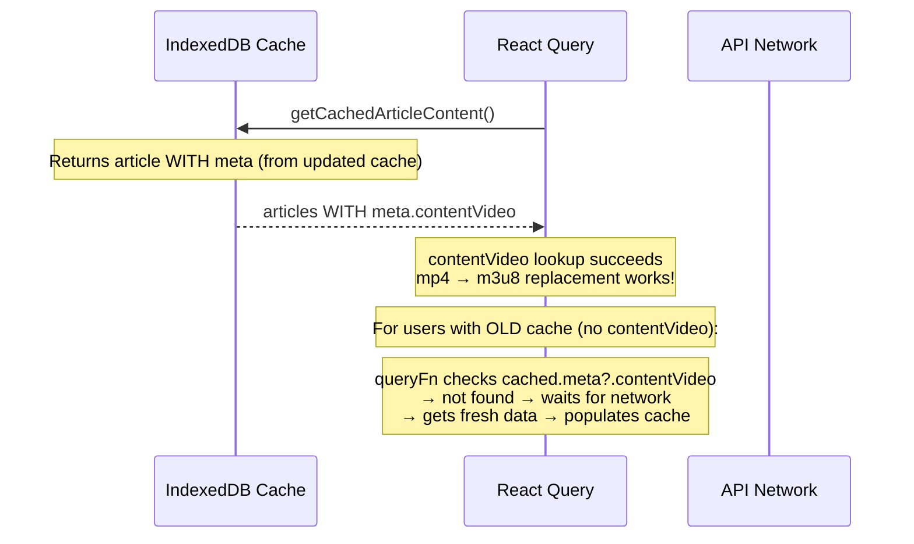

# Fix: Frontend Article Detail Not Using contentVideo

## Problem
`meta.contentVideo` is correctly stored in the API database, but the frontend's `ArticleMarkdown` component doesn't use it to replace mp4 with HLS.

## Root Cause
The **IndexedDB caching layer** (`sync.ts`) strips `meta` from cached articles:

1. **`syncArticleContent()`** — only stores `content`, `contentMd`, `updatedAt`; `meta` is omitted
2. **`getCachedArticleContent()`** — reconstructs a `FrontendArticle` but doesn't include `meta`
3. **Data flow on repeat visits**: cache (without meta) → React Query returns immediately → network response updates cache still without meta → ArticleMarkdown receives article without `meta.contentVideo` → mp4 not replaced

## Changes

### Change 6a: Add `meta` field to `ArticleContentRecord`
**File**: `apps/frontend-blog/src/lib/db/db.ts` (line 27-33)
- Add `meta?: unknown` to `ArticleContentRecord` interface

### Change 6b: Store `meta` in `syncArticleContent()`
**File**: `apps/frontend-blog/src/lib/db/sync.ts` (line 113-143)
- Add `meta: article.meta` to the `db.articleContents.put()` call

### Change 6c: Return `meta` from `getCachedArticleContent()`
**File**: `apps/frontend-blog/src/lib/db/sync.ts` (line 159-174)
- Add `meta: record.meta` to the returned object

### Change 7: Force network fetch when cached data lacks contentVideo
**File**: `apps/frontend-blog/src/lib/hooks/useFrontendArticles.ts` (line 140-165)
- In `queryFn`, after getting cached data, check if it has `meta.contentVideo`
- If cached data exists but lacks `contentVideo` (transition period for old caches), wait for network response instead
- This ensures existing users with stale caches automatically get fresh data

## Data Flow After Fix

