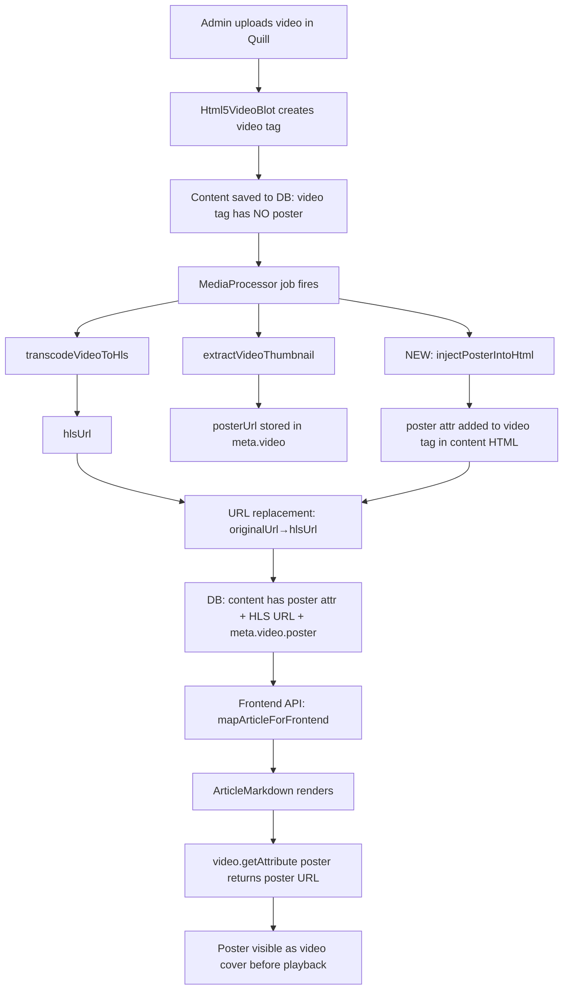

# Plan: Fix Content Video Poster + Add Article Cover Image Display

## Problem Summary

The user reported that:
1. **Primary (content video poster)**: Videos embedded in rich text content (Quill editor) don't show poster/thumbnail images as their cover before playback. The backend generates poster frames via `extractVideoThumbnail()`, but these are stored in `meta.video.poster` and **never injected into the stored HTML content's `<video>` tag**.

2. **Secondary (article coverImage)**: The article detail page (`page.client.tsx`) doesn't render `coverImage` in the UI at all — it's only used in JSON-LD structured data for SEO.

---

## Architecture & Data Flow

### Current Flow for Content Videos

```
Admin uploads video in Quill
  │
  ▼
Html5VideoBlot.create(url)
  → <video controls preload="metadata" playsInline src="URL">
    → <source src="URL" type="video/mp4">
  → ⚠️ NO poster attribute set
  │
  ▼
Content saved to DB as HTML (content field)
  │
  ▼
Backend MediaProcessor job fires (background)
  1. transcodeVideoToHls() → HLS stream → hlsUrl
  2. extractVideoThumbnail() → poster.jpg → posterUrl
  3. Saves meta.video = { hlsUrl, duration, qualities, poster: posterUrl }
  4. Replaces originalUrl → hlsUrl in content/contentLocalized
  → ⚠️ Does NOT add poster attribute to <video> tag
  │
  ▼
Frontend API (mapArticleForFrontend)
  → Returns content (HTML with HLS URLs but NO poster attr)
  → Returns meta (with meta.video.poster URL)
  │
  ▼
SSR (server page.tsx)
  → Strips meta: undefined from initialArticle (Worker CPU optimization)
  │
  ▼
ArticleMarkdown.tsx renders
  → HTML path: video.getAttribute('poster') → '' (always empty)
  → Markdown path: props.poster → undefined (always empty)
  → Falls back to dark gradient — no poster shown
```

### Root Cause Gap

The `poster` URL exists (`meta.video.poster`) but is never written into the stored HTML content's `<video>` tag. Both `Html5VideoBlot` (Quill) and the media processor (backend) skip setting the `poster` attribute.

---

## Solution: Two-Phase Approach

### Phase 1: Backend — Inject Poster into Stored HTML (Primary Fix)

**File**: [`apps/api/src/common/media/media.processor.ts`](apps/api/src/common/media/media.processor.ts:225)

**What to change**: After generating `posterUrl` and before/during the URL replacement step (lines 225-282), add `poster="posterUrl"` to the `<video>` tag that contains `originalUrl`.

**Implementation details**:

In the URL replacement section (around line 240-244), before doing `content.split(originalUrl).join(hlsUrl)`:

```typescript
// Add poster attribute to <video> tag containing originalUrl
function injectPosterIntoHtml(html: string, originalUrl: string, posterUrl: string): string {
  if (!posterUrl || !html.includes(originalUrl)) return html;
  
  // Find the opening <video> tag that has src="originalUrl" (or a <source> child with it)
  // and add poster="url" before the closing >
  return html.replace(
    /<video([^>]*?src=["'][^"']*originalUrl[^"']*["'][^>]*?)>/gi,
    (match, attrs) => {
      // Don't add if poster already exists
      if (/poster\s*=/i.test(match)) return match;
      return `<video${attrs} poster="${posterUrl}">`;
    }
  );
}
```

Then apply it to both `content` and `contentLocalized` before the existing URL replacement:

```typescript
if (articleContent?.content?.includes(originalUrl)) {
  let updatedContent = injectPosterIntoHtml(articleContent.content, originalUrl, posterUrl);
  updatedContent = updatedContent.split(originalUrl).join(hlsUrl);
  updatedData.content = updatedContent;
  needsUpdate = true;
}
```

Same for `contentLocalized`.

**Why this works**: After this change, the stored HTML content will have `<video ... poster="https://...poster.jpg" ...>`. When `injectVideosIntoMarkdown()` extracts video blocks from the HTML content during API response, it will preserve the `poster` attribute. The frontend will then have the poster available on the `<video>` tag.

### Phase 2: Frontend — Fallback Using meta.video.poster (Safety Net for Existing Articles)

**File**: [`apps/frontend-blog/src/components/blog/ArticleMarkdown.tsx`](apps/frontend-blog/src/components/blog/ArticleMarkdown.tsx:128)

**What to change**: For articles processed before Phase 1, their stored HTML still lacks `poster` attribute. As a safety net, modify `ArticleMarkdown` to accept `meta` as a prop and use `meta.video.poster` when the video's `src` matches `meta.video.hlsUrl`.

**Note**: `meta.video` stores only ONE video (the last processed one), so this fallback mainly helps articles with a single video.

**Implementation**:

1. Add `meta` prop to `ArticleMarkdownProps`:
```typescript
interface ArticleMarkdownProps {
  content: string;
  meta?: ArticleMeta;
}
```

2. In the HTML path `useEffect` (line 135), after finding each video element (line 153-154):
```typescript
// Get poster (from attribute or closest image sibling)
let poster = video.getAttribute('poster') || '';

// Fallback: try to find poster from article meta
if (!poster && meta?.video?.poster) {
  const videoSrc = video.getAttribute('src') || '';
  const sourceSrc = video.querySelector('source')?.getAttribute('src') || '';
  if (videoSrc === meta.video.hlsUrl || sourceSrc === meta.video.hlsUrl) {
    poster = meta.video.poster;
    video.setAttribute('poster', poster);
  }
}
```

3. Update component call in [`page.client.tsx`](apps/frontend-blog/src/app/[locale]/articles/[slug]/page.client.tsx:290):
```typescript
<ArticleMarkdown
  content={article.contentMd || article.content || ''}
  meta={article.meta}
/>
```

### Phase 3: Frontend — Pass meta Through SSR

**File**: Server `page.tsx` for article detail (need to find the exact file)

**What to change**: Currently `meta: undefined` is stripped from `initialArticle` in SSR. This means the client must wait for a refetch before `meta.video.poster` is available. If we pass `meta` through SSR, the frontend fallback (Phase 2) can work immediately.

**Note**: The reason `meta` was likely stripped is to reduce response size for Worker CPU optimization. `meta` contains blurhash, image variants, video HLS info — potentially large. We should keep it stripped but ensure the client-side query refetches it.

Actually, the frontend's `useFrontendArticleBySlug` already refetches after hydration, which includes `meta`. So the fallback will work after the refetch completes. No change needed here unless we want immediate poster display.

**Decision**: Skip this optimization for now. The client-side refetch is fast enough, and keeping SSR lightweight is more important.

### Phase 4: Frontend — Add coverImage Display to Article Detail Page

**File**: [`apps/frontend-blog/src/app/[locale]/articles/[slug]/page.client.tsx`](apps/frontend-blog/src/app/[locale]/articles/[slug]/page.client.tsx:273)

**What to change**: Add a cover image/video section between the `<header>` (line 273) and `ArticleMarkdown` (line 290).

Follow the pattern from [`ArticleCard.tsx`](apps/frontend-blog/src/components/blog/ArticleCard.tsx:184):

```tsx
{/* Cover Image / Video */}
{article.coverImage && (
  <div className="mb-10 rounded-lg overflow-hidden">
    {isVideoUrl(article.coverImage) ? (
      article.meta?.video?.hlsUrl ? (
        <HlsVideoPlayer
          hlsUrl={article.meta.video.hlsUrl}
          poster={article.meta?.video?.poster}
          autoPlay={false}
          muted={false}
          clickToPlay={true}
          className="w-full aspect-video"
        />
      ) : (
        <NativeVideoPlayer
          src={article.coverImage}
          className="w-full"
        />
      )
    ) : (
      <BlurhashImage
        src={article.coverImage}
        alt={article.title}
        blurhash={article.meta?.images?.blurhash}
        width={1200}
        height={675}
        className="w-full object-cover aspect-video"
        priority
      />
    )}
  </div>
)}
```

Need to import:
- `isVideoUrl` from [`@/lib/utils/media`](apps/frontend-blog/src/lib/utils/media.ts)
- `HlsVideoPlayer` from [`@/components/blog/HlsVideoPlayer`](apps/frontend-blog/src/components/blog/HlsVideoPlayer.tsx)
- `NativeVideoPlayer` from [`@/components/blog/NativeVideoPlayer`](apps/frontend-blog/src/components/blog/NativeVideoPlayer.tsx)
- `BlurhashImage` from [`@/components/blog/BlurhashImage`](apps/frontend-blog/src/components/blog/BlurhashImage.tsx)

### Phase 5: Optional — Backfill Script for Existing Articles

Create a script that iterates over articles with `meta.video.poster != null` and injects the poster into their content HTML. This can be done as a standalone migration or as part of a database migration.

---

## Files to Modify

| # | File | Change |
|---|------|--------|
| 1 | [`apps/api/src/common/media/media.processor.ts`](apps/api/src/common/media/media.processor.ts:225) | Add `injectPosterIntoHtml()` function and apply during URL replacement |
| 2 | [`apps/frontend-blog/src/components/blog/ArticleMarkdown.tsx`](apps/frontend-blog/src/components/blog/ArticleMarkdown.tsx:128) | Accept `meta` prop, use as poster fallback |
| 3 | [`apps/frontend-blog/src/app/[locale]/articles/[slug]/page.client.tsx`](apps/frontend-blog/src/app/[locale]/articles/[slug]/page.client.tsx:273) | Add coverImage display + pass meta to ArticleMarkdown |
| 4 | [`apps/frontend-blog/src/lib/types/frontend-blog.ts`](apps/frontend-blog/src/lib/types/frontend-blog.ts:31) | No changes needed — `ArticleMeta` already has `video.poster` |

---

## Mermaid Diagram: Fixed Data Flow



---

## Execution Order

1. **Phase 1** (Backend injection) — must be done first, as it's the primary fix
2. **Phase 2** (Frontend fallback) — can be done alongside or after Phase 1
3. **Phase 4** (coverImage display) — independent, can be done anytime
4. **Phase 5** (Backfill) — after Phase 1 is deployed, for existing articles

Phases 2 and 4 are independent of each other and could be done in parallel.
