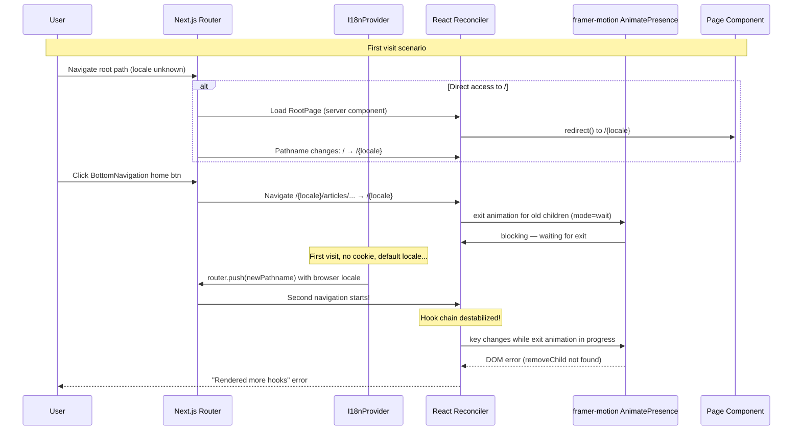
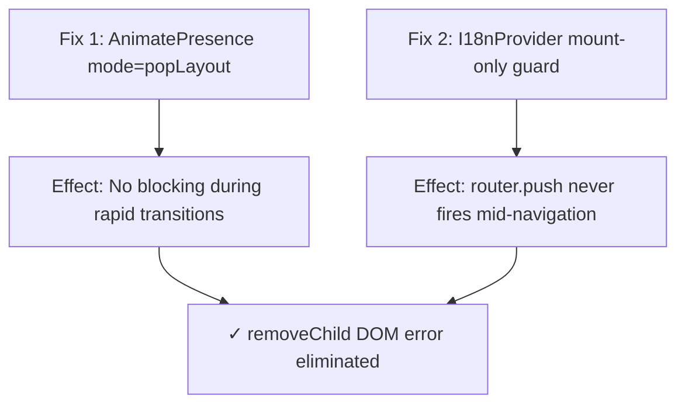

# Frontend Blog: "Rendered more hooks than during the previous render" Fix Plan

## Error Overview

**Sentry Error**: `Error: Rendered more hooks than during the previous render`
**Browser Console**: `NotFoundError: Failed to execute 'removeChild' on 'Node'`
**Expected URL**: `https://blog.joyminis.com/`
**Navigation Path**: e.g., `/en/articles/some-slug` → `/` (or via BottomNavigation) → `/[locale]`

## Root Cause Diagnosis

This is a **multi-factor race condition** during rapid route transitions, analogous to the admin-blog issue documented in [`plans/admin-blog-hooks-error-fix.md`](../admin-blog-hooks-error-fix.md).

### Navigation Flow (Normal SPA Navigation)

```
/en/articles/some-slug              /en/ (via BottomNavigation home btn)
(ArticleDetailPage.client)    ──►   (HomePageClient)
   client component                  client component
   many hooks                        many hooks
```

With `next-intl`'s `localePrefix: 'always'`, internal links via [`@/navigation`](../apps/frontend-blog/src/navigation.ts:24) (custom `Link`/`useRouter`) automatically prefix the locale, so BottomNavigation `href="/"` navigates to `/[locale]/`, **bypassing** the root `RootPage` server component redirect during SPA navigation.

However, the following **three interacting issues** still create the race condition:

---

### Factor 1: PageTransition `AnimatePresence mode="wait"` (CRITICAL — Same as Admin)

**File**: [`apps/frontend-blog/src/components/PageTransition.tsx`](../../apps/frontend-blog/src/components/PageTransition.tsx:94)

```tsx
<AnimatePresence mode="wait" initial={false}>
  <motion.div key={pathname} ...>
    {children}
  </motion.div>
</AnimatePresence>
```

**Problem**: `mode="wait"` blocks rendering of new children until the exit animation of the previous children completes. During rapid route transitions (e.g., tapping BottomNavigation quickly between Home → Categories → Tags), the key (`pathname`) changes multiple times before the first exit animation finishes. Framer Motion's internal DOM state becomes corrupted, producing:

- `NotFoundError: Failed to execute 'removeChild' on 'Node'` in console
- React hook chain destabilization (React tries to reconcile a component tree that framer-motion has partially removed from the DOM)

This is **identical** to the admin-blog's Factor 2 issue.

---

### Factor 2: I18nProvider `router.push()` in useEffect (MEDIUM — Partial match with Admin Factor 1)

**File**: [`apps/frontend-blog/src/lib/providers/I18nProvider.tsx`](../../apps/frontend-blog/src/lib/providers/I18nProvider.tsx:58)

```typescript
useEffect(() => {
  if (typeof document === 'undefined') return;

  // 1. Sync language
  document.documentElement.lang = actualLocale;
  (globalThis as any).__NEXT_INTL_LOCALE__ = actualLocale;

  // 2-3. Guards: skip if cookie exists or locale !== default
  const hasUserCookie = document.cookie.match(...);
  if (hasUserCookie) return;
  if (actualLocale !== DEFAULT_LOCALE) return;

  // 4-6. Browser locale detection → router.push()
  const browserLang = navigator.language.split('-')[0].toLowerCase();
  if (!browserLang || browserLang === actualLocale) return;
  if (!(LOCALES as readonly string[]).includes(browserLang)) return;

  document.cookie = `NEXT_LOCALE=${browserLang}; ...`;
  const newPathname = pathname.replace(`/${actualLocale}`, `/${browserLang}`);
  router.push(newPathname);  // ← Triggers navigation mid-transition
}, [actualLocale, pathname, router]);
```

**Problem**: While the guards (cookie check, default locale check) significantly reduce the window, `router.push()` can still fire **during an active navigation transition** on the user's very first visit when:
1. No `NEXT_LOCALE` cookie is set
2. Current locale is the default
3. Browser language differs from current locale

This triggers a **second navigation** (`/[locale]` → `/` + redirect → `/[browserLang]`) while the first navigation's exit animation via `AnimatePresence mode="wait"` is still in progress, compounding the DOM corruption.

**Difference from Admin**: Admin used `router.refresh()` (RSC re-fetch) which fires on every re-render. Frontend's `router.push()` only fires once on first visit due to the guards. However, that "first visit" is exactly when the race condition is most likely — the user arrives cold, and the initial page load + locale detection + animation all happen concurrently.

---

### Factor 3: RootPage Server Component `redirect()` (LOW — Similar to Admin Factor 4)

**File**: [`apps/frontend-blog/src/app/page.tsx`](../../apps/frontend-blog/src/app/page.tsx:46)

```typescript
export default async function RootPage() {
  const cookieStore = await cookies();
  // ...
  redirect(`/${cookieLocale}`);  // or `/${browserLocale}` or `/${DEFAULT_LOCALE}`
}
```

**Problem**: Server component `redirect()` creates an RSC redirect throw during rendering. However, this only triggers on **direct access to `/`** (no locale prefix). Internal SPA navigation via `@/navigation` `Link`/`useRouter` automatically adds the locale prefix, bypassing this page.

**Risk**: Lower than admin. Only affects:
- First-time visitors arriving at `https://blog.joyminis.com/`
- Bookmarked root URL
- External links pointing to root

**Contributing factor**: If combined with Factors 1 and 2 on first visit, this adds a third rapid route transition (`/` → `/[locale]` → potentially `/[browserLang]` via I18nProvider).

---

### How They Combine



## Fix Plan

### Fix 1: PageTransition - Replace `AnimatePresence mode="wait"` (CRITICAL)

**File**: [`apps/frontend-blog/src/components/PageTransition.tsx`](../../apps/frontend-blog/src/components/PageTransition.tsx)

**Problem**: `mode="wait"` blocks rendering during exit animation, causing DOM corruption during rapid key changes.

**Solution**: Change to `mode="popLayout"` which allows simultaneous exit/enter animations without blocking:

```tsx
<AnimatePresence mode="popLayout" initial={false}>
```

**Why `popLayout` works better**:
- Exiting element gets `position: absolute` (removed from layout flow)
- Entering element renders immediately in its normal position
- Both animations run concurrently — no blocking
- Direction-aware slide animations still work correctly
- Prevents the `removeChild` DOM error entirely

**Risk**: Low. The direction-aware variants (`getVariants`) work independently of the `mode` setting. The `motionProps` logic remains unchanged.

---

### Fix 2: I18nProvider - Guard `router.push()` with First-Mount Ref (MEDIUM)

**File**: [`apps/frontend-blog/src/lib/providers/I18nProvider.tsx`](../../apps/frontend-blog/src/lib/providers/I18nProvider.tsx)

**Problem**: `router.push()` in useEffect can fire during an active navigation transition.

**Solution**: Wrap the locale detection logic with a `useRef` to only run on first mount, preventing it from re-triggering during route transitions:

```typescript
'use client';

import { useEffect, useRef } from 'react';
// ... other imports

export default function I18nProvider({ children }: { children: React.ReactNode }) {
  const actualLocale = useCurrentLocale();
  const pathname = usePathname();
  const router = useRouter();
  const hasRunLocaleDetection = useRef(false);

  // Effect 1: Locale detection — run ONCE on first mount only
  useEffect(() => {
    if (typeof document === 'undefined') return;
    if (hasRunLocaleDetection.current) return;
    hasRunLocaleDetection.current = true;

    const hasUserCookie = document.cookie.match(
      new RegExp('(^| )NEXT_LOCALE=([^;]+)'),
    );
    if (hasUserCookie) return;
    if (actualLocale !== DEFAULT_LOCALE) return;

    const browserLang = navigator.language.split('-')[0].toLowerCase();
    if (!browserLang || browserLang === actualLocale) return;
    if (!(LOCALES as readonly string[]).includes(browserLang)) return;

    const expires = new Date(
      Date.now() + 365 * 24 * 60 * 60 * 1000,
    ).toUTCString();
    document.cookie = `NEXT_LOCALE=${browserLang}; path=/; expires=${expires}; SameSite=Lax`;

    const newPathname = pathname.replace(`/${actualLocale}`, `/${browserLang}`);
    router.push(newPathname);
  }, []); // Empty deps — only on mount

  // Effect 2: Sync language to HTML — runs on every locale change
  useEffect(() => {
    if (typeof document === 'undefined') return;
    document.documentElement.lang = actualLocale;
    (globalThis as any).__NEXT_INTL_LOCALE__ = actualLocale;
  }, [actualLocale]);

  return <>{children}</>;
}
```

**Key changes**:
- Split into two effects: locale detection (mount-only) and HTML sync (on locale change)
- `hasRunLocaleDetection` ref prevents re-execution during navigation
- Empty deps on locale detection effect ensures it never fires mid-navigation
- The `router.push()` will never interrupt an active transition

---

### Fix 3: RootPage — Server Component redirect() is SAFE (NO CHANGE NEEDED)

**File**: [`apps/frontend-blog/src/app/page.tsx`](../../apps/frontend-blog/src/app/page.tsx)

**Analysis**: Converting RootPage to a client component with `useRouter()` from `@/navigation` was attempted but **fails at runtime** with:

```
Error: No intl context found. Have you configured the provider?
```

**Root cause**: [`@/navigation`](../apps/frontend-blog/src/navigation.ts:24) exports (including `useRouter`) are next-intl utilities that require `NextIntlClientProvider` context. This context is only provided in [`[locale]/layout.tsx`](../apps/frontend-blog/src/app/[locale]/layout.tsx:194). The root `page.tsx` is rendered **outside** this provider tree, so any next-intl hooks will throw.

**Why it's safe to keep the server component redirect**:

1. **RootPage only triggers on direct fresh page load** — typed URL, bookmark, external link. At this point, **no animation is running** because the `<AnimatePresence>` in `PageTransition` (inside `[locale]/layout.tsx`) hasn't mounted yet.

2. **Internal SPA navigation bypasses RootPage entirely** — `@/navigation`'s `Link`/`useRouter` with `localePrefix: 'always'` automatically prefix the locale to all links. For example, `href="/"` from BottomNavigation becomes `/[locale]/`, rendering the `[locale]/page.tsx` directly.

3. **The redirect throw only happens once** — after redirecting to `/[locale]`, all subsequent navigation stays within locale-prefixed routes.

**Conclusion**: Fix 3 is **NOT needed**. The server component `redirect()` poses no risk to the "Rendered more hooks" race condition because there is no active animation context when it executes.

---

### Dependency Graph



## Affected Files

| File | Change | Risk | Priority |
|------|--------|------|----------|
| [`apps/frontend-blog/src/components/PageTransition.tsx`](../../apps/frontend-blog/src/components/PageTransition.tsx:94) | Change `mode="wait"` → `mode="popLayout"` | Low | **P0 - Critical** |
| [`apps/frontend-blog/src/lib/providers/I18nProvider.tsx`](../../apps/frontend-blog/src/lib/providers/I18nProvider.tsx:58) | Split effects, add first-mount guard | Medium | P1 - Medium |

## Not Affected

- [`apps/frontend-blog/src/lib/hooks/useCurrentLocale.ts`](../../apps/frontend-blog/src/lib/hooks/useCurrentLocale.ts) — Properly named hook, no try/catch wrapping. Already follows React Rules of Hooks.

## Verification Steps

1. **Type-check**: `yarn workspace @lucky/frontend-blog tsc --noEmit`
2. **Lint**: `yarn workspace @lucky/frontend-blog lint`
3. **Prettier**: `yarn workspace @lucky/frontend-blog prettier --check .`
4. **Manual test - rapid navigation**: Quickly tap BottomNavigation links (Home → Categories → Tags → Home) repeatedly
5. **Manual test - first visit**: Open incognito window, navigate to `https://blog.joyminis.com/`, verify no console errors
6. **Manual test - back navigation**: Navigate to article detail → press browser back button rapidly
7. **Sentry check**: Verify no new "Rendered more hooks" errors after deployment
8. **Console check**: Verify no `removeChild` errors in browser console
