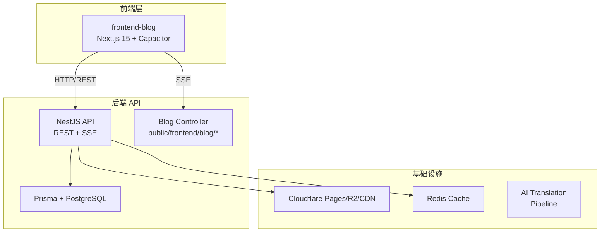

# Frontend Blog App 移动端开发评估报告

> 分析 Flutter 和 React Native 两种方案开发 front blog App 的可行性、优劣势和工时估算

---

## 1. 项目现状全景

### 1.1 当前架构



### 1.2 后端 API 现状（已完成，可直接复用）

| 端点 | 功能 | 缓存 |
|------|------|------|
| `GET /v1/frontend/blog/articles` | 文章列表（分页+筛选） | 5min CDN+Redis |
| `GET /v1/frontend/blog/articles/:slug` | 文章详情 | 10min CDN+Redis |
| `GET /v1/frontend/blog/articles/popular` | 热门文章 | 10min |
| `GET /v1/frontend/blog/featured` | 精选文章（Hero） | 5min |
| `GET /v1/frontend/blog/categories` | 分类列表 | 1h |
| `GET /v1/frontend/blog/tags` | 标签列表 | 1h |
| `GET /v1/frontend/blog/search?q=` | 全文搜索 | 无 |
| `GET /v1/frontend/blog/stats` | 博客统计 | 1h |
| `GET /v1/frontend/blog/archive` | 文章归档 | 30min |
| `GET /v1/public/blog/articles/:slug/comments` | 评论列表 | - |
| `POST /v1/public/blog/articles/:slug/comments` | 提交评论 | - |
| `SSE /v1/public/blog/comments/stream` | 实时评论推送 | - |
| `POST /v1/public/blog/articles/:slug/like` | 文章点赞 | - |
| `GET/POST/DELETE /v1/frontend/blog/bookmarks` | 收藏管理 | - |
| `GET /v1/public/blog/authors/:id` | 作者信息 | - |

### 1.3 数据库模型

- **BlogArticle** — 多语言字段（Localized JSON）、状态、元数据、视频
- **BlogCategory** — 多语言名称/描述、层级关系
- **BlogTag** — 多语言名称、颜色
- **BlogComment** — AI审核、嵌套回复、自动回复
- **UserBookmark** — 用户收藏
- **TranslationJob** — AI翻译任务

### 1.4 现有 Web 功能清单（需迁移至 App）

| 功能模块 | 复杂度 | 核心实现 |
|----------|--------|----------|
| 文章列表（分页加载更多） | 中 | 网格布局 + 分类/标签筛选 + Lazy Loading |
| 文章详情（Markdown渲染） | 高 | react-markdown + 代码高亮 + HLS视频 + TOC |
| 分类/标签浏览 | 低 | 列表页 + 筛选 + 文章列表 |
| 全文搜索 | 低 | 关键字搜索 + 结果列表 |
| 收藏系统 | 中 | 用户登录态 + 增删查 |
| 评论系统 | 高 | 嵌套评论 + AI审核 + SSE实时推送 |
| OAuth 登录 | 中 | Google OAuth |
| i18n 多语言（6种） | 中 | zh/en/ja/ko/fr/de |
| PWA 离线支持 | 高 | IndexedDB 本地缓存 |
| HLS 视频播放 | 高 | 嵌入 Markdown 并转码播放 |
| 图片优化 | 中 | blurhash + Cloudflare 多尺寸 |
| 主题切换（暗色/亮色） | 低 | 全局主题 |
| 文章归档 | 低 | 按月归档 |
| 博客统计 | 低 | 展示统计数字 |
| 响应式布局 | 中 | 手机/平板/桌面三栏自适应 |

---

## 2. Flutter vs React Native 方案对比

### 2.1 团队现有经验

| 维度 | Flutter | React Native |
|------|---------|--------------|
| **团队经验** | 有丰富经验 — JoyMini Flutter Super App 已存在，有完整的技术体系：Riverpod、GoRouter、Dio、Hive、WebRTC、Firebase 等 | 无直接项目经验，但有 Web React/Next.js 经验可迁移 |
| **已有基础设施** | 可直接复用 JoyMini Flutter 项目的工具链：Dio 封装、缓存层、主题系统、平台适配等 | 需全新搭建 |
| **与现有 Web 技术栈重合度** | 低 — Dart 与 TypeScript 不同，需完全独立开发 | 高 — 使用 TypeScript、React Query、Zustand，与现有前端技术栈一致 |
| **状态管理** | Riverpod（Flutter 项目已用） | Zustand + React Query（Web 项目已用） |
| **代码复用** | 无法复用现有 Next.js 组件代码 | 部分业务逻辑可复用（API 类型、React hooks） |

### 2.2 详细对比

| 对比项 | Flutter | React Native |
|--------|---------|--------------|
| **语言** | Dart（需新学/已有经验） | TypeScript（与 Web 一致） |
| **渲染性能** | Skia 自渲染 | React Native 新架构 |
| **UI 一致性** | 高（自绘引擎，跨平台一致） | 依赖原生组件，iOS/Android 有差异 |
| **热重载** | 优秀 | 优秀 |
| **第三方生态** | 丰富 | 非常丰富 |
| **与现有 React 技术栈复用** | 几乎为零 | 高（React Query, Zustand, TypeScript types） |
| **已有团队资产** | JoyMini Flutter Super App 代码库可直接参考/复用部分模块 | 无 |
| **学习成本** | 低（团队已有 Flutter 经验） | 中（需要学习 React Native 特有概念） |
| **CI/CD** | GitHub Actions（已有模板） | 需新建 |
| **包体积** | 较大（约15MB base） | 较小（约7MB base） |
| **Markdown 渲染** | flutter_markdown（成熟） | react-native-markdown-display（成熟） |
| **HLS 视频** | video_player + better_player | react-native-video |
| **SSE 实时推送** | dart:io HttpClient + SSE 解析 | react-native-sse 或 EventSource polyfill |

### 2.3 技术选型推荐方案

#### 方案 A: React Native

**理由：**
1. TypeScript 技术栈与现有 Web 项目一致，`@lucky/shared` 包中的类型可直接复用
2. React Query + Zustand 组合与 Web 端一致，架构思路可平移
3. 团队 React 经验可直接迁移

```
状态管理: Zustand + TanStack React Query
导航: React Navigation v7
HTTP: axios + React Query
i18n: react-i18next
Markdown: react-native-markdown-display
视频: react-native-video
缓存: react-native-mmkv
```

#### 方案 B: Flutter

**理由：**
1. **团队已有完整的 Flutter 项目经验**（JoyMini Flutter Super App）
2. 可直接参考/复用 JoyMini Flutter 项目的架构模式：Dio 封装、缓存层、主题系统、平台适配
3. Flutter 渲染性能优于 RN，特别是 Markdown + 视频混合渲染场景
4. 一套代码覆盖 6 端（iOS/Android/Web/Windows/macOS/Linux）

```
状态管理: Riverpod + GoRouter（与 JoyMini Flutter 一致）
HTTP: Dio（已有封装可复用）
i18n: Flutter intl / easy_localization
Markdown: flutter_markdown
视频: video_player + better_player
缓存: Hive（已有封装可复用）
```

---

## 3. 工时估算（人类开发者视角）

### 3.1 Phase 1: 基础设施（Foundation）

| 任务 | Flutter (天) | RN (天) | 说明 |
|------|:-----------:|:--------:|------|
| 项目脚手架 + Monorepo 集成 | 0.5 | 0.5 | Flutter 可直接在 monorepo 中新建 app，RN 同理 |
| 导航架构（Tab + Stack） | 1 | 1.5 | Flutter 有 GoRouter 经验，RN 需新学 React Navigation |
| HTTP 客户端 + API 层封装 | 0.5 | 1 | Flutter 可复用 JoyMini 的 Dio 封装 |
| i18n 多语言（6种） | 1 | 1.5 | 两种方案都需要从 Web 迁移翻译文件 |
| 主题系统（暗色/亮色） | 0.5 | 1 | Flutter 主题系统成熟且经验丰富 |
| 状态管理 | 0.5 | 0.5 | Riverpod vs Zustand，都简单 |
| 本地缓存层 | 1 | 1.5 | Flutter 可复用 Hive 封装经验 |
| 基础 UI 组件库 | 1.5 | 2.5 | Flutter Material Design 开箱即用，RN 需自建或用第三方 |
| **小计** | **6.5** | **9.5** | Flutter 领先约 3 天 |

### 3.2 Phase 2: 核心功能（Core Features）

| 任务 | Flutter (天) | RN (天) | 说明 |
|------|:-----------:|:--------:|------|
| 首页（文章列表 + 分类筛选 + LoadMore） | 1.5 | 2 | Flutter ListView + 分页更直接 |
| 文章详情页（Markdown + HLS + TOC） | 2 | 2.5 | Markdown+视频混合渲染 Flutter 更稳定 |
| 分类浏览页 | 0.5 | 1 | |
| 标签浏览页 | 0.5 | 1 | |
| 搜索功能 | 0.5 | 1 | |
| OAuth 登录 | 1.5 | 1.5 | 都需要原生插件 |
| 收藏系统 | 1 | 1 | |
| 评论系统（列表 + 提交 + SSE） | 2 | 2.5 | SSE 处理 Flutter 更直接 |
| 文章点赞 + 热度显示 | 0.5 | 0.5 | |
| **小计** | **10** | **13** | Flutter 领先约 3 天 |

### 3.3 Phase 3: 进阶功能（Advanced Features）

| 任务 | Flutter (天) | RN (天) | 说明 |
|------|:-----------:|:--------:|------|
| 文章归档页 | 0.5 | 0.5 | |
| 博客统计展示 | 0.5 | 0.5 | |
| 离线阅读（缓存文章） | 1 | 1.5 | Flutter 有 Hive 经验 |
| 图片优化（渐进式 + 缓存） | 1 | 1 | |
| 收藏管理页 | 0.5 | 1 | |
| 设置页（语言切换、主题） | 0.5 | 1 | |
| 关于页面 | 0.5 | 0.5 | |
| **小计** | **4.5** | **6** | Flutter 领先约 1.5 天 |

### 3.4 Phase 4: 打磨与发布（Polish Release）

| 任务 | Flutter (天) | RN (天) | 说明 |
|------|:-----------:|:--------:|------|
| 性能优化（列表虚拟化、图片懒加载） | 1 | 1.5 | |
| 错误处理 + 网络状态检测 | 1 | 1 | |
| 骨架屏 + 加载状态 | 0.5 | 1 | |
| 空状态 + 重试机制 | 0.5 | 0.5 | |
| 无障碍支持 | 1 | 1 | |
| iOS/Android 真机测试 | 1.5 | 2 | |
| CI/CD + 发布准备 | 1 | 1.5 | Flutter 有现成 GitHub Actions 模板 |
| **小计** | **6.5** | **8.5** | Flutter 领先约 2 天 |

### 3.5 汇总对比（人类开发者）

| Phase | Flutter (人天) | React Native (人天) |
|-------|:-------------:|:------------------:|
| Phase 1: 基础设施 | 6.5 | 9.5 |
| Phase 2: 核心功能 | 10 | 13 |
| Phase 3: 进阶功能 | 4.5 | 6 |
| Phase 4: 打磨与发布 | 6.5 | 8.5 |
| **合计** | **27.5** | **37** |

### 3.6 不同团队配置下的工期（人类开发者）

#### Flutter 方案

| 团队配置 | 预估工期 |
|----------|:--------:|
| 1人（有 Flutter 经验） | 27-35 个工作日（约 5.5-7 周） |
| 1人 Flutter + 1人后端支持 | 20-25 个工作日（约 4-5 周） |
| 2人 Flutter | 14-18 个工作日（约 3-3.5 周） |

#### React Native 方案

| 团队配置 | 预估工期 |
|----------|:--------:|
| 1人（有 RN + React 经验） | 37-45 个工作日（约 7.5-9 周） |
| 1人 RN + 1人后端支持 | 28-33 个工作日（约 5.5-6.5 周） |
| 2人 RN | 20-25 个工作日（约 4-5 周） |

---

## 4. AI 编码视角的补充分析

> **重要修正**：26.5 天的估算错误地将"人天"概念套用到了 AI 编码上。AI 编码的瓶颈不是写代码速度，而是上下文窗口限制和迭代修复。以下为修正后的估算。

### 4.1 AI 编码的实际时间分布

| 阶段 | 内容 | AI 实际编码时间 | 说明 |
|------|------|:--------------:|------|
| 代码生成 | 所有 screens、components、hooks、API 层 | ~3-4 小时 | 分多轮对话生成，每轮 15-30 分钟 |
| 依赖安装 | yarn add、pod install | ~30 分钟 | CLI 命令，等待安装 |
| 编译调试 | 修复 TypeScript 错误、import 路径、类型不匹配 | ~2-3 小时 | 迭代修复的主要时间 |
| 原生配置 | iOS Info.plist、Android manifest、原生模块链接 | ~1-2 小时 | 一次性配置 |
| **合计纯编码+调试** | | **~6-10 小时** | |

### 4.2 AI 编码的实际日历时间

| 场景 | 预计日历时间 | 说明 |
|------|:-----------:|------|
| **纯代码生成**（不含你编译验证） | **1-2 天** | AI 分轮次生成所有代码文件 |
| **代码生成 + 你编译验证 + 修复** | **3-5 天** | 你运行编译，反馈错误，AI 修复 |
| **完整交付**（含 CI/CD、双端真机测试） | **5-7 天** | 取决于原生环境问题和测试覆盖 |

### 4.3 AI 编码推荐 — React Native

从 AI 编码角度，推荐 **React Native**，理由：

1. **代码复用** — 可直接引用现有 TypeScript 类型定义（`@lucky/shared`、`blog.ts`），API 调用模式，React Query hooks 模式
2. **技术栈一致** — TypeScript + React + Zustand + React Query，与 Web 端完全一致，AI 生成的代码质量更高
3. **i18n 复用** — 现有 6 种语言的 `src/messages/*.json` 可直接用于 `react-i18next`
4. **Monorepo 集成** — TypeScript 项目与 Yarn PnP monorepo 的集成更顺畅

---

## 5. MVP 裁剪方案

如果希望快速上 MVP，可以裁剪以下功能：

| 裁剪项 | 节省时间 |
|--------|:--------:|
| 移除 SSE 实时推送，改为轮询（5min） | ~30 分钟 |
| 移除离线缓存 | ~1 小时 |
| 移除 HLS 视频播放，降级为 WebView | ~1 小时 |
| 移除深色模式（仅亮色） | ~30 分钟 |
| 移除无障碍优化 | ~30 分钟 |

**AI RN MVP（核心浏览功能）：约 2-3 天**

---

## 6. 关键风险与应对

| 风险 | 影响 | 缓解措施 |
|------|------|----------|
| **Markdown 渲染兼容性** | 与 Web 端渲染结果不一致 | 使用相同的 `marked` 解析器后端预处理，App 端仅做展示 |
| **HLS 视频播放** | Web 端使用 hls.js，App 需原生播放 | `react-native-video` 支持 HLS；提前测试多种编码格式 |
| **SSE 实时评论** | App 原生 EventSource 支持有限 | 使用 `react-native-sse` 或 fallback 轮询 |
| **OAuth 流程** | Web 端是浏览器重定向，App 需要 App Auth | 使用 `react-native-app-auth` 处理 |
| **Monorepo 集成** | 新 App 与 Yarn PnP monorepo 共存 | 通过 CI 共享 API 类型定义 |

---

## 7. 最终结论

| 场景 | 推荐方案 | 所需时间 |
|------|:--------:|:--------:|
| **人类开发者（有 Flutter 经验）** | **Flutter** | ~28 人天（约 5.5-7 周） |
| **AI Coding Agent 编码** | **React Native** | **3-5 天**（纯代码生成 + 迭代修复） |
| **人类 + AI 混合** | 看你偏好 | - |

### 关键决策因素

- 如果**你亲自写**（有 Flutter 经验）→ **Flutter**（约28人天），发挥团队 Flutter 资产优势
- 如果**让我（AI）来写代码** → **React Native（约3-5天）**，因为有 TypeScript 代码可参考，AI 生成效率最高

### 项目结构建议（React Native）

```
apps/frontend-blog-mobile/
├── src/
│   ├── api/               # API 层（参考 apps/frontend-blog/src/lib/api/）
│   ├── hooks/             # React Query hooks（参考 apps/frontend-blog/src/lib/hooks/）
│   ├── types/             # 类型定义（复用 @lucky/shared + 参考 blog.ts）
│   ├── i18n/              # 国际化（复用 src/messages/*.json）
│   ├── navigation/        # React Navigation 路由
│   ├── screens/           # 页面组件
│   │   ├── Home/
│   │   ├── ArticleDetail/
│   │   ├── Categories/
│   │   ├── Tags/
│   │   ├── Search/
│   │   ├── Bookmarks/
│   │   ├── Comments/
│   │   ├── Auth/
│   │   ├── Settings/
│   │   └── About/
│   ├── components/        # 通用 UI 组件
│   ├── stores/            # Zustand stores
│   └── utils/             # 工具函数
├── __tests__/
├── android/
├── ios/
├── package.json
└── app.json
```

> **⚠️ 以上估算中，AI 的"天"定义为包含生成代码 + 你编译验证 + 修复错误的完整迭代周期。如果只需要生成代码文件而不编译验证，1-2 天即可完成。**
