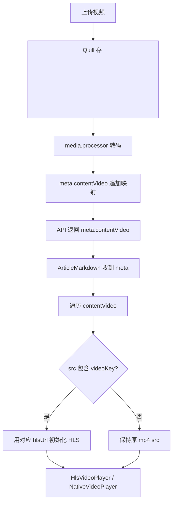

# mp4→m3u8 替换修复方案

## 问题

视频转码完成后，文章详情仍然显示 mp4 而非 m3u8 HLS 流。

## 方案

新增 `meta.contentVideo` 数组存储所有视频映射关系，后端去 DB 替换 URL 不再做（因为 URL 格式容易不匹配），改由前端直接根据映射查找 m3u8。

---

## 改动详情

### 1. 后端 [`media.processor.ts`](../../apps/api/src/common/media/media.processor.ts:210)

转码完成后，将当前视频的映射 **追加**（不是覆盖）到 `meta.contentVideo` 数组：

```typescript
// 替换原来的 meta.video 单对象覆盖逻辑（约 line 210-223）
const existingMeta = (article?.meta as Record<string, any>) || {};
const existingContentVideo = Array.isArray(existingMeta.contentVideo)
  ? existingMeta.contentVideo
  : [];

await this.prisma.blogArticle.update({
  where: { id: articleId },
  data: {
    meta: {
      ...existingMeta,
      video: {
        ...videoVariants,
        poster: posterUrl,
        status: 'completed',
      },
      contentVideo: [
        ...existingContentVideo,
        {
          videoKey,        // 例如 "videos/uuid.mp4"
          hlsUrl,          // 例如 "https://cdn.example.com/uploads/blog/videos/{id}/hls/master.m3u8"
          poster: posterUrl,
        },
      ],
    } as any,
  },
});
```

**关键点**：存储 `videoKey`（R2 key）而非完整 URL，前端匹配时更可靠。

---

### 2. 类型 [`frontend-blog.ts`](../../apps/frontend-blog/src/lib/types/frontend-blog.ts:13)

添加 `contentVideo` 类型：

```typescript
export interface ArticleMeta {
  // ... 现有字段
  video?: {
    hlsUrl: string;
    duration: number;
    qualities: string[];
    poster?: string;
  };
  contentVideo?: Array<{
    videoKey: string;
    hlsUrl: string;
    poster?: string;
  }>;
  [key: string]: unknown;
}
```

---

### 3. 前端 [`ArticleMarkdown.tsx`](../../apps/frontend-blog/src/components/blog/ArticleMarkdown.tsx:128)

接收 `meta` prop，在初始化视频时根据 `meta.contentVideo` 查找对应的 hlsUrl：

**HTML 路径**（约 line 144-151）：
```typescript
let hlsUrl = video.getAttribute('src') || '';
if (!hlsUrl.includes('.m3u8')) {
  // 在 contentVideo 中查找匹配
  const matched = meta?.contentVideo?.find(
    (v) => hlsUrl.includes(v.videoKey) || v.videoKey.includes(hlsUrl.split('/').pop() || '')
  );
  hlsUrl = matched?.hlsUrl || hlsUrl;
}
```

**Markdown 路径**（约 line 509-549）：
```typescript
video({ src, node, ...props }) {
  const srcStr = typeof src === 'string' ? src : '';
  // 查找 contentVideo 映射
  const matched = meta?.contentVideo?.find(
    (v) => srcStr.includes(v.videoKey) || v.videoKey.includes(srcStr.split('/').pop() || '')
  );
  const effectiveHlsUrl = matched?.hlsUrl || srcStr;

  if (effectiveHlsUrl.includes('.m3u8')) {
    return <HlsVideoPlayer hlsUrl={effectiveHlsUrl} ... />;
  }
  return <NativeVideoPlayer src={srcStr} ... />;
}
```

---

### 4. 前端 [`page.client.tsx`](../../apps/frontend-blog/src/app/%5Blocale%5D/articles/%5Bslug%5D/page.client.tsx:290)

传递 `meta` 给 `ArticleMarkdown`：

```typescript
<ArticleMarkdown
  content={article.contentMd || article.content || ''}
  meta={article.meta}
/>
```

---

## 数据流



## 涉及文件

| 文件 | 改动类型 |
|------|---------|
| `apps/api/src/common/media/media.processor.ts` | 修改 ~10 行，追加 contentVideo 数组 |
| `apps/frontend-blog/src/lib/types/frontend-blog.ts` | 添加类型 ~5 行 |
| `apps/frontend-blog/src/components/blog/ArticleMarkdown.tsx` | 修改 ~15 行，接收 meta + 查找映射 |
| `apps/frontend-blog/src/app/[locale]/articles/[slug]/page.client.tsx` | 修改 ~2 行，传递 meta |

## 优点

- **支持多视频**：contentVideo 是数组，每个视频独立映射
- **无需 DB 字符串替换**：完全避免 URL 格式不匹配 bug
- **匹配可靠**：用 videoKey（R2 key）匹配，不受域名格式影响
- **已有文章也生效**：下次转码完成自动追加
