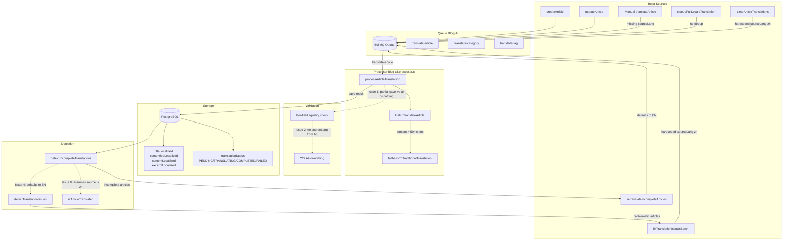

# Translation Architecture Review

## Current State

### ✅ P0 — Fixed (Already Deployed)
Hardcoded `targetLang: 'en'` in [`createArticle()`](apps/api/src/blog/blog.service.ts:209) and [`updateArticle()`](apps/api/src/blog/blog.service.ts:667) now iterates all enabled locales from [`systemConfigService.getBlogLocales()`](apps/api/src/admin/system-config/system-config.service.ts:196).

### ⚠️ P1 — Needs Revision
Current P1 implementation at [`blog-ai.processor.ts:1068-1134`](apps/api/src/blog/processors/blog-ai.processor.ts:1068) uses **PARTIAL SAVE** (skip failed fields, save successful ones). Per your feedback, this should become **ALL-OR-NOTHING**: if ANY meaningful field fails validation, skip ALL saves and set `translationStatus: 'FAILED'`.

---

## Architecture Issues Found

### Issue 1: P1 Must Change to All-or-Nothing Save
**Location**: [`blog-ai.processor.ts:1078-1134`](apps/api/src/blog/processors/blog-ai.processor.ts:1078)

**Problem**: Current logic does partial save — failed fields are skipped but successful fields are saved. This means if AI returns garbage for title but good for content, content gets saved with a broken title.

**Fix**: If any meaningful field fails validation, throw error → skip ALL saves → article stays in `FAILED` state → `detectIncompleteTranslations` catches it later.

---

### Issue 2: `translateArticle()` Missing `sourceLang` Parameter
**Locations**: [`blog.controller.ts:174-179`](apps/api/src/blog/blog.controller.ts:174), [`blog.service.ts:1172-1197`](apps/api/src/blog/blog.service.ts:1172), [`blog-ai.processor.ts:986`](apps/api/src/blog/processors/blog-ai.processor.ts:986)

**Problem**: The manual translate endpoint only accepts `{ targetLang?: string }`, NOT `sourceLang`. The processor falls back to `data.sourceLang || 'zh'` at line 986. If an article was originally written in English (not Chinese), the AI receives wrong source text and produces garbage.

**Fix**: Add `sourceLang` to the endpoint DTO and pass it through to the queue payload.

---

### Issue 3: `translationStatus` is Article-Level, Not Per-Locale
**Location**: [`prisma/schema.prisma:1541`](apps/api/prisma/schema.prisma:1541), [`blog-ai.processor.ts:966-969`](apps/api/src/blog/processors/blog-ai.processor.ts:966)

**Problem**: A single `translationStatus` field tracks status across ALL 5 target locales. If French fails but Japanese succeeds, the status becomes `FAILED` even though Japanese completed. Conversely, if English succeeded but French hasn't started, status is `COMPLETED` (misleading).

**Current values**: `PENDING | TRANSLATING | COMPLETED | MANUAL | FAILED`

**Possible fixes**:
- Option A: Change to per-locale JSON field: `{ en: "COMPLETED", fr: "FAILED", ja: "TRANSLATING" }`
- Option B: Use a composite status like `COMPLETED_5/5` (x/y locales done)
- Option C: Add a separate `translationProgress` JSON field alongside the existing status

---

### Issue 4: `detectIncompleteTranslations()` Always Defaults to 'en'
**Location**: [`blog.service.ts:3225`](apps/api/src/blog/blog.service.ts:3225), [`blog.service.ts:3521`](apps/api/src/blog/blog.service.ts:3521)

**Problem**: Both `detectIncompleteTranslations(targetLang: string = 'en')` and `retranslateIncompleteArticles(targetLang: string = 'en')` default to English only. To check/retranslate all 5 locales, you'd need 5 separate manual calls.

**Fix**: Accept an array of locales, iterate all enabled locales by default, or add a bulk overload.

---

### Issue 5: `contentLocalized` Source Language Has Hardcoded `'zh'` Check
**Location**: [`blog-ai.processor.ts:1183`](apps/api/src/blog/processors/blog-ai.processor.ts:1183)

```typescript
[sourceLang]:
  sourceLang === 'zh'
    ? ((article.contentLocalized as any)?.[sourceLang] as string) || sourceContent || article.content
    : this.renderMarkdown(sourceContent || article.content || ''),
```

**Problem**: For non-zh `sourceLang`, it calls `this.renderMarkdown(sourceContent)`. But if `contentLocalized[sourceLang]` already has HTML (because the article was created with HTML content), this would double-render markdown → produce malformed HTML.

**Fix**: Always prefer existing `contentLocalized[sourceLang]` first, regardless of sourceLang value.

---

### Issue 6: `queueFullLocaleTranslation()` Lacks Idempotency
**Location**: [`blog.service.ts:1500`](apps/api/src/blog/blog.service.ts:1500)

**Problem**: If called twice for the same locale (e.g., admin double-clicks), it queues duplicate translation jobs. No check for existing in-progress or recently-completed translations for that locale.

**Fix**: Add a deduplication check (check queue for pending jobs targeting the same locale, or use a rate-limited lock).

---

### Issue 7: Hardcoded `sourceLang: 'zh'` in Fix/Retry Endpoints

**Locations**:
- [`fixTranslationIssuesBatch()`](apps/api/src/blog/blog.service.ts:2859): `sourceLang: 'zh'`
- [`clearArticleTranslations()`](apps/api/src/blog/blog.service.ts:3610): `sourceLang: 'zh'`

**Problem**: Should use [`getDefaultSourceLang()`](apps/api/src/blog/blog.service.ts:2078) (configurable via `blog.translation.defaultSourceLang`) instead of hardcoded `'zh'`.

**Fix**: Replace `'zh'` with `await this.getDefaultSourceLang()`.

---

### Issue 8: Duplicate `getSourceContent()` Logic
**Locations**: [`blog-ai.processor.ts:322-351`](apps/api/src/blog/processors/blog-ai.processor.ts:322) and [`blog-ai.processor.ts:990-1035`](apps/api/src/blog/processors/blog-ai.processor.ts:990)

**Problem**: The same nested `getSourceContent()` helper exists in TWO places (`batchTranslateArticle` and `processArticleTranslation`). If one is fixed independently, the other becomes stale.

**Fix**: Extract to a shared method or utility function.

---

### Issue 9: `detectIncompleteTranslations()` Assumes Source is Always 'zh'
**Location**: [`blog.service.ts:3264-3269`](apps/api/src/blog/blog.service.ts:3264)

```typescript
const sourceTitle = (article.titleLocalized as any)?.zh || article.title;
```

**Problem**: Assumes source language is always `zh`. If an article was originally written in English, the comparison would be wrong.

**Fix**: Use the configured `defaultSourceLang` or add a `sourceLang` parameter.

---

### Issue 10: Legacy Fields Still in Schema
**Location**: [`prisma/schema.prisma:1535-1538`](apps/api/prisma/schema.prisma:1535)

**Fields**: `titleEn`, `contentEn`, `contentMdEn`, `excerptEn`

**Problem**: These old single-language fields still exist and are referenced in [`isArticleTranslated()`](apps/api/src/blog/blog.service.ts:2121-2132) as fallback. They may contain stale data.

**Fix**: Consider removing them after migration verification (low priority, no urgent impact).

---

### Issue 11: Inconsistent Retry Configuration
**Location**: [`blog.service.ts:209-220`](apps/api/src/blog/blog.service.ts:209) vs [`blog.service.ts:1558-1565`](apps/api/src/blog/blog.service.ts:1558)

**Problem**: `createArticle`/`updateArticle` queue jobs with `.catch()` (no retry config). `queueFullLocaleTranslation` uses `attempts: 2` with exponential backoff. Inconsistent reliability.

**Fix**: Apply consistent retry configuration across all queue enqueue points.

---

## Architecture Diagram



---

## Prioritized Fix Plan

### P0 ✅ (Done)
Hardcoded `'en'` in create/update → iterates all enabled locales.

### P1 🔄 (Needs Revision)
Change processor from partial-save to ALL-OR-NOTHING.

**Changes needed**:
- [`blog-ai.processor.ts:1078-1099`](apps/api/src/blog/processors/blog-ai.processor.ts:1078): Instead of setting failed fields to `null` and continuing, track which fields failed
- [`blog-ai.processor.ts:1101-1127`](apps/api/src/blog/processors/blog-ai.processor.ts:1101): If ANY meaningful field failed, throw error (same as current all-fields-failed path)
- [`blog-ai.processor.ts:1149-1206`](apps/api/src/blog/processors/blog-ai.processor.ts:1149): The `??` fallback logic becomes dead code on the all-or-nothing path; save only when ALL fields pass
- The catch handler at [`blog-ai.processor.ts:1246-1253`](apps/api/src/blog/processors/blog-ai.processor.ts:1246) already sets `translationStatus: 'FAILED'` — correct behavior

### P2 📋 (New — After P1)
Add `sourceLang` parameter to manual `translateArticle()` endpoint.

**Changes needed**:
- [`blog.controller.ts:177`](apps/api/src/blog/blog.controller.ts:177): Accept `{ targetLang?: string, sourceLang?: string }`
- [`blog.service.ts:1175`](apps/api/src/blog/blog.service.ts:1175): Accept `sourceLang` parameter
- [`blog.service.ts:1187-1190`](apps/api/src/blog/blog.service.ts:1187): Pass `sourceLang` in queue payload
- Also fix [`fixTranslationIssuesBatch()`](apps/api/src/blog/blog.service.ts:2859) and [`clearArticleTranslations()`](apps/api/src/blog/blog.service.ts:3610) to use `getDefaultSourceLang()` instead of hardcoded `'zh'`

### P3 📋 (New — After P2)
Make `detectIncompleteTranslations` / `retranslateIncompleteArticles` work across all enabled locales.

**Changes needed**:
- [`blog.service.ts:3225`](apps/api/src/blog/blog.service.ts:3225): Accept optional locale array; iterate all enabled locales by default
- [`blog.service.ts:3264-3269`](apps/api/src/blog/blog.service.ts:3264): Use configured `defaultSourceLang` instead of hardcoded `'zh'`
- [`blog.service.ts:3521`](apps/api/src/blog/blog.service.ts:3521): Same changes for retranslate variant

### P4 📋 (Future)
Improve `translationStatus` to be per-locale aware.

**Changes needed**:
- [`prisma/schema.prisma:1541`](apps/api/prisma/schema.prisma:1541): Add per-locale status tracking
- [`blog-ai.processor.ts:966-969`](apps/api/src/blog/processors/blog-ai.processor.ts:966): Update status per-locale instead of globally
- All detection methods need updating to use per-locale status

### P5 📋 (Future — Cleanup)
- Extract duplicate `getSourceContent()` to shared utility
- Fix hardcoded `'zh'` in [`blog-ai.processor.ts:1183`](apps/api/src/blog/processors/blog-ai.processor.ts:1183) for contentLocalized
- Add idempotency to `queueFullLocaleTranslation()`
- Apply consistent retry config to all queue enqueue points
- Consider removing legacy `titleEn`/`contentEn` fields
