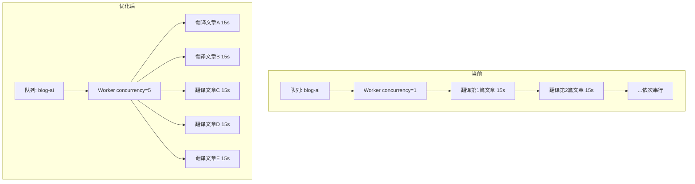

# 翻译并行度优化方案

## 现状分析

### 技术架构

```
[用户点击翻译] → [API Controller] → [BlogService.queueFullLocaleTranslation()]
                                     → [BullMQ Queue: blog-ai]
                                       → [BlogAiProcessor (Worker)]
                                         → [AI Service (DeepSeek/Groq/Gemini)]
                                           → [Prisma DB 保存结果]
```

### 核心瓶颈

通过代码分析，当前翻译系统的**根本瓶颈**是 [`BlogAiProcessor`](apps/api/src/blog/processors/blog-ai.processor.ts:17) 的装饰器配置：

```typescript
@Processor('blog-ai', {
  concurrency: 1,  // ← ★★★ 串行处理：一次只翻译一篇文章！
  limiter: {
    max: 60,
    duration: 60000,
  },
})
```

**`concurrency: 1` 意味着无论队列中有多少任务等待，Worker 每次只处理一个任务。**

#### 典型性能数据

| 场景 | 每篇耗时 | 100 篇文章总耗时 |
|------|---------|-----------------|
| 当前 (concurrency=1) | 10-30s | **~16-50 分钟** |
| 优化后 (concurrency=5) | 10-30s | **~3-10 分钟** |
| 优化后 (concurrency=10) | 10-30s | **~1.5-5 分钟** |

### 为什么当前是串行的？

从注释和历史来看：
1. **早期使用 Groq/Gemini** — 这些免费 API 有严格的速率限制（RPM/TPM），串行+延迟是最安全的策略
2. **已迁移到 DeepSeek 付费 API** — 代码中有多处注释提到 *"DeepSeek 付费 API 无速率限制"*，但 concurrency 没有同步调整
3. **保守策略** — 担心并发调用导致 API 429 错误或触发熔断

### 其他次要瓶颈

| 问题 | 位置 | 影响 |
|------|------|------|
| `interRequestDelay = 50ms` | [blog-ai.processor.ts:29](apps/api/src/blog/processors/blog-ai.processor.ts:29) | 每篇文章内部多个 API 调用间的延迟 |
| `delay: index * 600` 任务投递间隔 | [blog.service.ts:1558](apps/api/src/blog/blog.service.ts:1558) | 批量投递时 600ms 间隔 |
| 单语言逐语言翻译 | 前端调用 `translateArticle(articleId, targetLang)` | 每次只翻译一个目标语言 |
| 翻译缓存利用率不足 | [blog-ai.processor.ts:30](apps/api/src/blog/processors/blog-ai.processor.ts:30) | 缓存仅作用在单 Worker 内存中 |

---

## 优化方案

### 方案一：提高 Worker 并发度（高收益，低风险）

**修改 [`blog-ai.processor.ts:17`](apps/api/src/blog/processors/blog-ai.processor.ts:17)**

```typescript
// 当前
@Processor('blog-ai', {
  concurrency: 1,
  limiter: { max: 60, duration: 60000 },
})

// 优化后
@Processor('blog-ai', {
  concurrency: 5,       // 同时处理 5 篇文章
  limiter: { 
    max: 100,           // 提高到每分钟 100 个任务
    duration: 60000,
  },
})
```

**风险分析：**
- ✅ DeepSeek 付费 API 无速率限制
- ✅ 数据库连接池通常支持 10+ 并发写入
- ⚠️ 需监控 AI 服务熔断器状态
- ⚠️ Prisma 连接池可能需要调整

**建议值：**
- 安全起步：`concurrency: 5`
- 激进模式：`concurrency: 10`
- 需根据 DeepSeek API 响应时间和数据库负载动态调整

### 方案二：多语言并行翻译（中收益，中风险）

当前流程：翻译完所有文章到 EN → 翻译完所有文章到 JA → 翻译完所有文章到 KO → ...

优化为：同时启动多个语言的批量翻译，每个语言独立消费队列。

**修改 [`BlogTranslationProgress.tsx`](apps/admin-blog/src/views/blog/BlogTranslationProgress.tsx) 或后端批量逻辑：**

```typescript
// 当前：串行语言
await queueFullLocaleTranslation('en');  // 等全部完成
await queueFullLocaleTranslation('ja');  // 再开始
await queueFullLocaleTranslation('ko');

// 优化：并行投递所有语言
await Promise.all([
  queueFullLocaleTranslation('en'),
  queueFullLocaleTranslation('ja'),
  queueFullLocaleTranslation('ko'),
]);
```

结合方案一的 concurrency=5，如果有 3 个语言并行，则实际并发度 = 5 × 3 = 15。

**风险：**
- ⚠️ 需要确保 AI 服务能处理更高的吞吐量
- ⚠️ 需要确认数据库连接池上限

### 方案三：一篇文章一次翻译所有目标语言（高收益，中等风险）

当前每篇文章每语言需要一次 AI API 调用。如果启用 5 种语言，同一篇文章需要调用 AI 5 次。

优化为一次 Prompt 生成所有语言的翻译：

```typescript
// Prompt 示例
"Translate this article to ALL the following languages: en, ja, ko, fr, de.
Return the translations for each language in the following format..."
```

**优点：**
- 减少了 API 调用次数
- 利用 AI 的上下文理解，可能提高翻译一致性
- 文章内容只需传输一次

**风险：**
- ⚠️ Prompt 复杂，输出格式解析更困难
- ⚠️ 长文章 + 多语言可能导致 Token 超限
- ⚠️ 如果一种语言失败，整个批次失败

### 方案四：消除内部不必要的延迟（低收益，低风险）

1. **降低/移除 `interRequestDelay`** — 对于 DeepSeek 付费 API，50ms 延迟不是瓶颈但可消除
2. **降低批量投递间隔** — 将 600ms 改为 100ms 或直接移除
3. **使用 Redis 共享缓存** — 替代内存缓存，使多个 Worker 实例共享翻译缓存

---

## 推荐的渐进式优化路线

### Phase 1（立即执行，低风险高回报）

| # | 修改 | 文件 | 预期提升 |
|---|------|------|---------|
| 1 | `concurrency: 1` → `concurrency: 5` | [`blog-ai.processor.ts:18`](apps/api/src/blog/processors/blog-ai.processor.ts:18) | **5x** |
| 2 | `interRequestDelay: 50` → `20` 或移除 | [`blog-ai.processor.ts:29`](apps/api/src/blog/processors/blog-ai.processor.ts:29) | ~10% |
| 3 | 批量投递间隔 `600ms` → `200ms` | [`blog.service.ts:1558`](apps/api/src/blog/blog.service.ts:1558) | 投递更快 |

### Phase 2（观察后执行）

| # | 修改 | 预期提升 |
|---|------|---------|
| 4 | 如果 Phase 1 稳定，将 concurrency 提升到 10 | **10x** |
| 5 | 多语言并行投递（`Promise.all`） | 语言数倍 |
| 6 | 添加 Redis 共享翻译缓存（可选） | 减少重复翻译 |

### Phase 3（长期优化）

| # | 修改 | 预期提升 |
|---|------|---------|
| 7 | 多语言一次性翻译（方案三） | 3-5x |
| 8 | 考虑独立的翻译微服务或 Lambda | 弹性伸缩 |

---

## 架构对比图



## 监控指标

优化后应关注：
1. **队列等待时间** — 任务从创建到开始处理的时间
2. **AI API 响应时间** — 是否因并发增加而变慢
3. **错误率** — 429 或 503 错误是否增加
4. **数据库连接池使用率** — 是否达到上限
5. **翻译完成率** — 每分钟完成任务数

## 需要确认的问题

1. 当前使用的 AI Provider 具体是哪个？DeepSeek 付费版还是其他？
2. 有多个 Worker 实例（多 Pod 部署）还是单实例？
3. 数据库连接池的 `connection_limit` 配置是多少？
4. 是否需要保留对 Groq/Gemini 的兼容（作为 fallback）？
