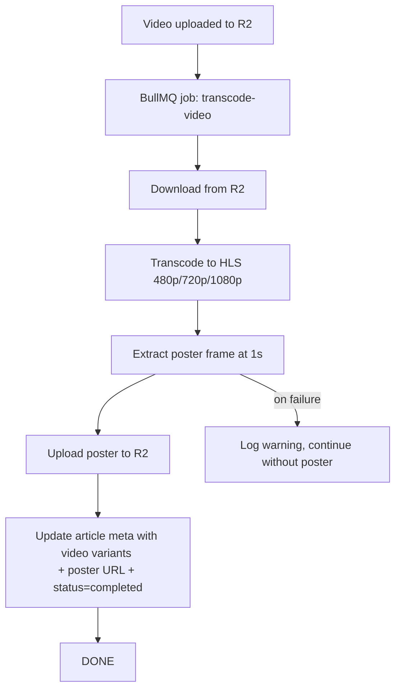

# Video Thumbnail Extraction: FFmpeg image2 Muxer Warning Fix

## Analysis Summary

**Question:** "视频上传成功了吗" (Did the video upload succeed?)

**Answer:** Yes — the video upload + thumbnail extraction **succeeded**, but there is a non-fatal FFmpeg warning that should be fixed proactively.

## What Happened

The FFmpeg log shows the [`extractVideoThumbnail()`](apps/api/src/common/media/media-processor.service.ts:162) method running for a 4:06 H.264 video (1934x1080):

- **Input:** `/tmp/thumb-.../input.mp4`
- **Output:** `/tmp/thumb-.../poster.jpg` (1280x715 JPEG)
- **Result:** `frame=    1` and `video:84KiB` — **1 frame successfully written**
- **Warning:** `image2` muxer: "does not contain an image sequence pattern"

The warning is **non-fatal** in FFmpeg 8.0.1 — the file was written anyway. However, the behavior depends on the FFmpeg version and configuration.

## Root Cause

The [`extractVideoThumbnail()`](apps/api/src/common/media/media-processor.service.ts:162) method at line 181-183 runs:

```bash
ffmpeg -i "${inputPath}" -ss 00:00:01 -vframes 1 -vf "scale=1280:-1" -q:v 3 "${outputPath}"
```

The [`image2` muxer](https://ffmpeg.org/ffmpeg-formats.html#image2) is designed for writing image **sequences**. When given a single filename like `poster.jpg` (without a sequence pattern like `%03d`), it issues this warning. Adding the `-update 1` flag tells the muxer to overwrite the same file on each frame, which is the correct behavior for single-frame extraction.

## Full Pipeline Context

The overall video processing flow (see [`MediaProcessor.handleTranscodeVideo()`](apps/api/src/common/media/media.processor.ts:153)):



Since the thumbnail extraction produced output (84KB), steps E → F → G likely all completed successfully, assuming no downstream errors in R2 upload or Prisma update.

## Recommended Fix

### 1. Add `-update 1` to the FFmpeg command

**File:** [`apps/api/src/common/media/media-processor.service.ts`](apps/api/src/common/media/media-processor.service.ts:182)

**Current:**
```typescript
execSync(
  `ffmpeg -i "${inputPath}" -ss 00:00:01 -vframes 1 -vf "scale=1280:-1" -q:v 3 "${outputPath}"`,
  { encoding: 'utf-8', timeout: 30000 },
);
```

**Proposed:**
```typescript
execSync(
  `ffmpeg -i "${inputPath}" -ss 00:00:01 -vframes 1 -vf "scale=1280:-1" -q:v 3 -update 1 "${outputPath}"`,
  { encoding: 'utf-8', timeout: 30000 },
);
```

### 2. (Optional) Migrate from `execSync` to `spawnFfmpeg`

The HLS transcoding method already uses [`spawnFfmpeg()`](apps/api/src/common/media/media-processor.service.ts:374) (spawn-based) to avoid maxBuffer overflow. The thumbnail extraction still uses `execSync`. For a short command like this, `execSync` is acceptable (30s timeout, minimal output), but migrating to `spawnFfmpeg` would provide consistency.

If desired, the refactor would convert from:
```typescript
execSync(`ffmpeg ...`, { encoding: 'utf-8', timeout: 30000 });
```
to:
```typescript
await this.spawnFfmpeg(
  ['-i', inputPath, '-ss', '00:00:01', '-vframes', '1', '-vf', 'scale=1280:-1', '-q:v', '3', '-update', '1', outputPath],
  { timeout: 30000 },
);
```

This is **optional** — the current code works for this small output.

### 3. Improve error logging for poster failure

**File:** [`apps/api/src/common/media/media.processor.ts`](apps/api/src/common/media/media.processor.ts:199-201)

The catch block for poster generation could include the `articleId` and the specific `thumbError` message for easier debugging:

```typescript
catch (thumbError) {
  this.logger.warn(
    `Video poster generation failed for article ${articleId}: ${thumbError instanceof Error ? thumbError.message : thumbError}`,
  );
}
```

*(The current code already logs this, but ensuring the error message is clearly extracted is good practice.)*

## Files to Modify

| File | Change |
|------|--------|
| [`apps/api/src/common/media/media-processor.service.ts`](apps/api/src/common/media/media-processor.service.ts:182) | Add `-update 1` flag to FFmpeg command |
| [`apps/api/src/common/media/media-processor.service.ts`](apps/api/src/common/media/media-processor.service.ts:162-199) | (Optional) Migrate from `execSync` to `this.spawnFfmpeg()` |

## Verification

After applying the fix:

1. Upload a test video via the blog admin
2. Check the BullMQ job logs for the warning — it should no longer appear
3. Verify the poster URL is accessible in the article meta
