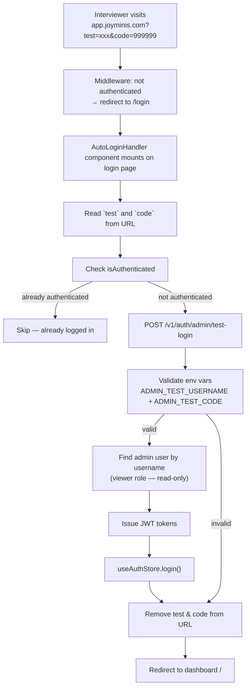

# Auto-Login via URL Parameters — Demo/Interview Feature

## Use Case
Interviewers visit `app.joyminis.com?test=mrsuperportertest&code=999999` and get **automatically logged in** to the admin panel for demo purposes. **Works in production.**

## Scope
- ✅ `admin-blog` — auto-login via `?test=xxx&code=999999`
- ✅ `admin-next` — auto-login via `?test=xxx&code=999999`
- ❌ `frontend-blog` — excluded

## Architecture Overview



## Security Analysis (Production)

### Core Protection: RBAC

The admin backend already has **Role-Based Access Control**:
- `admin` — full access
- `editor` — content management
- `viewer` — **read-only** (cannot write/edit/delete)

**All mutation endpoints** are protected by `AdminJwtAuthGuard` + `RolesGuard`. Even if someone gains access via the auto-login URL, a `viewer`-role account **cannot modify any data** — all write operations return 403 Forbidden.

### Risk Assessment

| Scenario | Risk Level | Why |
|----------|-----------|-----|
| URL leaked, test account = `viewer` role | **LOW** | RBAC prevents all mutations |
| URL leaked, test account = `admin` role | **HIGH** | Full system access — DON'T do this |
| `ADMIN_TEST_CODE` brute forced | **LOW** | Rate limited (5 req/min) + strong code recommended |
| Env vars leaked from server | **LOW** | Server-side only, managed via CI/CD |
| Interviewer accidentally modifies data | **ZERO** | RBAC viewer role blocks all writes |

### Production Recommendations

1. **Create a dedicated `viewer`-role admin account** for the demo (e.g., username `demo_viewer`)
2. **Use a strong random `ADMIN_TEST_CODE`** (UUID or similar), not `999999`
3. **Rate limiting** on the endpoint (5 requests per minute)
4. **No `NODE_ENV` guard** — works in all environments
5. **If code is compromised**: change `ADMIN_TEST_CODE` env var → URL immediately invalidated
6. **The test admin account itself** can be disabled via the admin panel (status = disabled) to instantly revoke access

The URL-based auto-login is actually **more secure** than sharing a password:
- Code is in the URL, not stored in browser password manager
- Can be revoked instantly by changing env var
- No credential reuse risk

## Implementation Steps

### Step 1: Backend DTO
**CREATE** `apps/api/src/admin/auth/dto/admin-test-login.dto.ts`

```typescript
import { IsNotEmpty, IsString } from 'class-validator';
import { ApiProperty } from '@nestjs/swagger';

export class AdminTestLoginDto {
  @ApiProperty({ description: 'test identifier (admin username)', example: 'demo_viewer' })
  @IsNotEmpty()
  @IsString()
  test!: string;

  @ApiProperty({ description: 'test verification code', example: 'a1b2c3d4-e5f6-...' })
  @IsNotEmpty()
  @IsString()
  code!: string;
}
```

### Step 2: Backend Service Method
**MODIFY** `apps/api/src/admin/auth/auth.service.ts`

Add `adminTestLogin(dto: AdminTestLoginDto, ip: string, ua: string)`:
1. Read `ADMIN_TEST_USERNAME` and `ADMIN_TEST_CODE` from ConfigService
2. If env vars not configured → `UnauthorizedException('invalid credentials')`
3. Check `dto.test` matches `ADMIN_TEST_USERNAME` (trimmed, case-insensitive)
4. Check `dto.code` matches `ADMIN_TEST_CODE` (trimmed)
5. If either check fails → generic `UnauthorizedException('invalid credentials')`
6. Find admin user by `dto.test` (username lookup)
7. If user not found or disabled (status != 1) → generic error
8. Update lastLoginAt, create login log
9. Issue JWT token pair via `issueTokenPair()`
10. Return `{ tokens, userInfo }`

### Step 3: Backend Controller
**MODIFY** `apps/api/src/admin/auth/auth.controller.ts`

Add endpoint:
```typescript
@Post('admin/test-login')
@HttpCode(HttpStatus.OK)
@Throttle({ default: { limit: 5, ttl: 60_000 } })
async testLoginAdmin(
  @Body() dto: AdminTestLoginDto,
  @RealIp() ip: string,
  @UserAgent() ua: string,
) {
  return this.auth.adminTestLogin(dto, ip, ua);
}
```

Import `AdminTestLoginDto` from the new DTO file.

### Step 4: Frontend API (admin-next)
**MODIFY** `apps/admin-next/src/api/index.ts`

Add to `authApi`:
```typescript
testLogin: (data: { test: string; code: string }) =>
  http.post<LoginResponse>('/v1/auth/admin/test-login', data, {
    headers: { 'x-skip-auth-refresh': '1' },
  }),
```

### Step 5: AutoLoginHandler (admin-next)
**CREATE** `apps/admin-next/src/components/AutoLoginHandler.tsx`

```typescript
'use client';

import { useEffect, useRef } from 'react';
import { useSearchParams, useRouter, usePathname } from 'next/navigation';
import { authApi } from '@/api';
import { useAuthStore } from '@/store/useAuthStore';

export function AutoLoginHandler() {
  const searchParams = useSearchParams();
  const router = useRouter();
  const pathname = usePathname();
  const attempted = useRef(false);
  const isAuthenticated = useAuthStore((s) => s.isAuthenticated);
  const login = useAuthStore((s) => s.login);

  useEffect(() => {
    const test = searchParams?.get('test');
    const code = searchParams?.get('code');
    if (!test || !code) return;
    if (attempted.current) return;
    attempted.current = true;
    if (isAuthenticated) return;

    const doAutoLogin = async () => {
      try {
        const result = await authApi.testLogin({ test, code });
        if (result?.tokens?.accessToken) {
          await login(
            result.tokens.accessToken,
            result.userInfo?.role ?? 'admin' as any,
            result.userInfo,
            result.tokens.refreshToken ?? null,
          );
        }
      } catch {
        // silent
      } finally {
        const params = new URLSearchParams(searchParams.toString());
        params.delete('test');
        params.delete('code');
        const query = params.toString();
        router.replace(query ? `${pathname}?${query}` : pathname);
      }
    };
    doAutoLogin();
  }, [searchParams, pathname, router, isAuthenticated, login]);

  return null;
}
```

### Step 6: Integrate (admin-next)
**MODIFY** `apps/admin-next/src/components/Providers.tsx`

Add `import { AutoLoginHandler } from './AutoLoginHandler';` and `<AutoLoginHandler />` inside the provider tree.

### Step 7: Frontend API (admin-blog)
**MODIFY** `apps/admin-blog/src/api/index.ts`

Add to `authApi`:
```typescript
testLogin: (data: { test: string; code: string }) =>
  http.post<LoginResponse>('/v1/auth/admin/test-login', data, {
    headers: { 'x-skip-auth-refresh': '1' },
  }),
```

### Step 8: AutoLoginHandler (admin-blog)
**CREATE** `apps/admin-blog/src/components/AutoLoginHandler.tsx`

Same logic as admin-next, adapted for admin-blog imports (`@/api`, `@/store/useAuthStore`).

### Step 9: Integrate (admin-blog)
**MODIFY** `apps/admin-blog/src/components/Providers.tsx`

Add `<AutoLoginHandler />`.

## Environment Variables

| Variable | Description | Production Recommendation |
|----------|-------------|--------------------------|
| `ADMIN_TEST_USERNAME` | Admin username for auto-login | Use a dedicated **`viewer`-role** account |
| `ADMIN_TEST_CODE` | Verification code | Use a **strong random string** (e.g., UUID v4) |

## Files Summary
| # | Action | File |
|---|--------|------|
| 1 | CREATE | `apps/api/src/admin/auth/dto/admin-test-login.dto.ts` |
| 2 | MODIFY | `apps/api/src/admin/auth/auth.service.ts` |
| 3 | MODIFY | `apps/api/src/admin/auth/auth.controller.ts` |
| 4 | MODIFY | `apps/admin-next/src/api/index.ts` |
| 5 | CREATE | `apps/admin-next/src/components/AutoLoginHandler.tsx` |
| 6 | MODIFY | `apps/admin-next/src/components/Providers.tsx` |
| 7 | MODIFY | `apps/admin-blog/src/api/index.ts` |
| 8 | CREATE | `apps/admin-blog/src/components/AutoLoginHandler.tsx` |
| 9 | MODIFY | `apps/admin-blog/src/components/Providers.tsx` |
