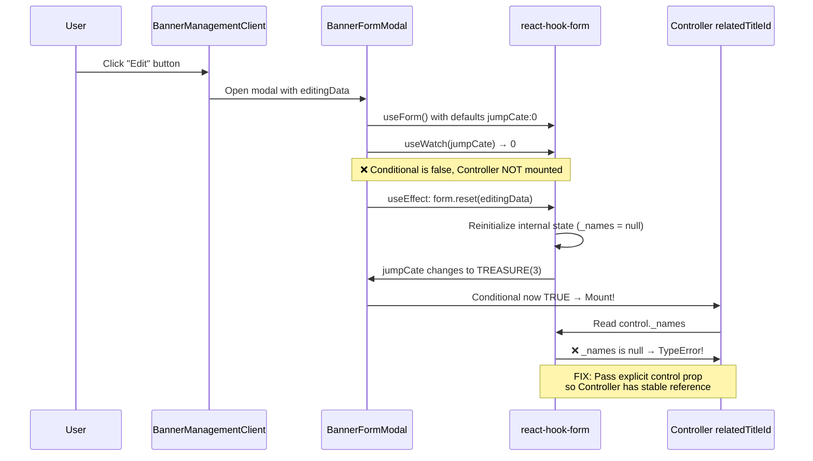

# Banners Edit Modal Runtime Error - Root Cause Analysis & Fix Plan

## Error

```
2177-1189e5025e1e98e9.js:1 Uncaught TypeError: Cannot read properties of null (reading '_names')
    at 2177-1189e5025e1e98e9.js:1:3783
    at U (2177-1189e5025e1e98e9.js:1:6084)
```

Triggered when clicking "Edit" on any banner in the admin-next Banners Management page.

---

## Root Cause

**File**: [`apps/admin-next/src/views/banner/BannerFormModal.tsx:214`](../apps/admin-next/src/views/banner/BannerFormModal.tsx:214)

The `<Controller name="relatedTitleId">` on line 214 is rendered **without an explicit `control` prop**. It relies on the implicit `FormProvider` context from line 113 (`<Form {...form}>`).

### Why it fails only when editing

1. The component mounts with `jumpCate` defaulting to `0`.
2. The `useEffect` on lines 92-109 calls `form.reset()` with `editingData`, which sets `jumpCate` to the banner's actual value (e.g., `JUMP_CATE.TREASURE = 3`).
3. Calling `form.reset()` reinitializes the internal `Control` state. During this reinitialization, the `_names` property can be temporarily `null`.
4. The **conditional rendering** `{Number(jumpCate) === JUMP_CATE.TREASURE && (<Controller .../>)}` evaluates to `true` **after** `reset()`, causing the `<Controller>` to mount **during a re-render where `control._names` is null**.
5. The raw `<Controller>` tries to access `control._names` internally and throws `TypeError`.

### Why other fields don't fail

All other form fields (`FormTextField`, `FormSelectField`, `FormDateField`, `FormMediaUploaderField`) use the [`@repo/ui` `<FormField>` wrapper](../packages/ui/src/form/FormField.tsx:56), which explicitly captures `control` via:

```ts
const { control } = useFormContext<TFieldValues>();
return <Controller name={name} control={control} .../>;
```

This explicit capture provides a stable reference that survives the `form.reset()` lifecycle.

### Scope of the issue

There are only 2 usages of `<Controller>` in the admin-next app:
| File | Line | Has `control` prop? | OK? |
|------|------|---------------------|-----|
| `BannerFormModal.tsx` | 214 | ❌ No | **BUG** |
| `EditAdminUserModal.tsx` | 131 | ✅ Yes | OK |

So this is an **isolated bug** in `BannerFormModal.tsx`.

---

## Fix Plan

### Step 1: Pass explicit `control` prop to `<Controller>` (Minimal Fix)

**File**: [`apps/admin-next/src/views/banner/BannerFormModal.tsx`](../apps/admin-next/src/views/banner/BannerFormModal.tsx)

**Change**: Add `control={form.control}` to the `<Controller>` on line 214.

```diff
 {Number(jumpCate) === JUMP_CATE.TREASURE && (
   <Controller
     name="relatedTitleId"
+    control={form.control}
     render={({ field, fieldState }) => (
       <div>
         <BannerBindProduct
           value={field.value}
           onChange={field.onChange}
           t={t}
         />
         {fieldState.error && (
           <div className="mt-1 text-sm text-red-500">
             {fieldState.error.message}
           </div>
         )}
       </div>
     )}
   />
 )}
```

### Step 2: Verify the fix

1. Run `yarn workspace @lucky/admin-next type-check` to ensure no type errors.
2. Run `yarn workspace @lucky/admin-next lint --fix` to ensure lint passes.
3. Manually test:
   - Click "Edit" on a banner with `jumpCate = TREASURE` (should have `relatedTitleId` bound)
   - Click "Edit" on a banner with `jumpCate = NONE` or `EXTERNAL` (should NOT show product selector)
   - Click "Edit" on a banner with `jumpCate = INTERNAL` (should NOT show product selector)
   - Create a new banner with `jumpCate = TREASURE` and bind a product
   - Create a new banner with `jumpCate = EXTERNAL` and enter a URL

### Step 3: (Optional) Refactor to use `FormField` wrapper

For consistency with the rest of the codebase, consider replacing the raw `<Controller>` with `@repo/ui`'s `<FormField>`. However, this is optional since the minimal fix in Step 1 resolves the root cause.

---

## Sequence Diagram: How the Error Occurs



---

## Data Flow Diagram: How the Fix Works

```mermaid
flowchart TD
    A[BannerFormModal] --> B[FormProvider form]
    B --> C[FormTextField name=title]
    B --> D[FormSelectField name=jumpCate]
    B --> E{useWatch jumpCate}

    E -->|EXTERNAL 5| F[FormTextField name=jumpUrl]
    E -->|TREASURE 3| G[Controller name=relatedTitleId]
    E -->|NONE 1| H[Nothing]

    G -.->|BEFORE FIX: implicit context| I[control._names ?? null]
    G -->|AFTER FIX: control={form.control}| J[Stable control ref]

    style G stroke:#f00,stroke-width:2
    style J stroke:#0f0,stroke-width:2
    style I stroke:#f00,stroke-width:2
```
