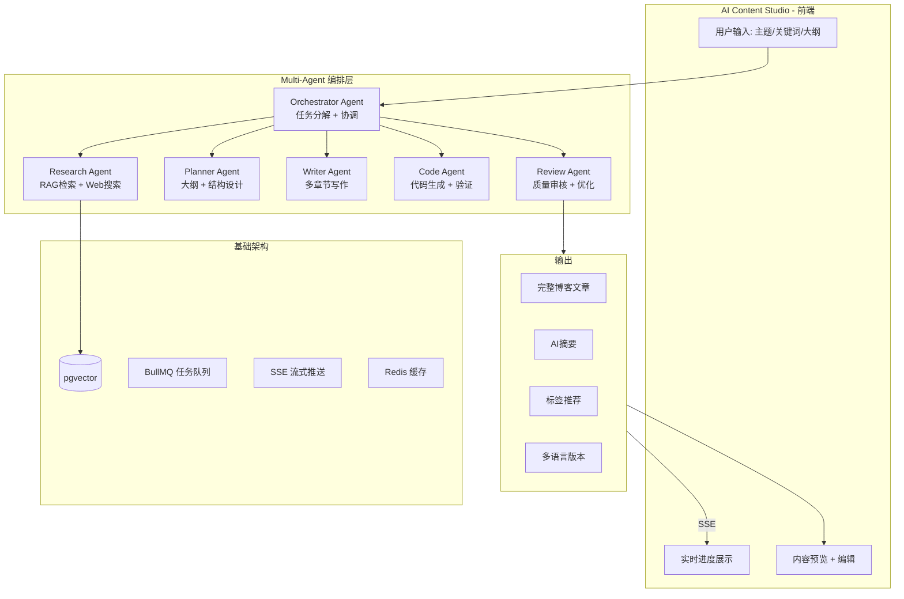

# AI Blog Content Agent System — 大模型应用方案

## 为什么这是真正的"大模型应用"

| 维度 | 普通AI辅助功能 | ✅ AI内容智能体系统 |
|------|--------------|-------------------|
| 架构 | 单次 LLM 调用 | Multi-Agent 编排 |
| 技术栈 | prompt → response | RAG + Agent + Tool Use + Streaming |
| 复杂度 | 增删改现有代码 | 从0到1全新子系统 |
| 求职价值 | "用过AI" | "设计并实现了多智能体系统" |

---

## 系统架构总览



---

## 核心组件详解

### 1. Orchestrator Agent (编排智能体)

**职责**: 接收用户需求，分解任务，协调各Agent工作

```
用户输入: "写一篇关于Next.js SSR优化的文章"

Orchestrator 输出:
{
  "plan": {
    "tasks": [
      { "agent": "research", "query": "Next.js SSR optimization best practices 2026" },
      { "agent": "planner", "context": { "research_results": "..." } },
      { "agent": "writer", "sections": ["intro", "ssr-vs-ssg", "optimization", "caching", "conclusion"] },
      { "agent": "code-gen", "tech_stack": "Next.js 15, React 19" },
      { "agent": "reviewer", "quality_check": true }
    ],
    "parallel": ["research", "planner"],
    "sequential": ["writer", "code-gen", "reviewer"]
  }
}
```

**关键技术**: Agent orchestration, task graph, dependency resolution

### 2. Research Agent (研究智能体)

**职责**: 从博客现有内容 + 外部来源收集资料

```typescript
interface ResearchResult {
  internalSources: Array<{
    articleId: string;
    title: string;
    relevance: number;  // 向量相似度分数
    keyInsights: string[];
  }>;
  externalSources?: Array<{
    url: string;
    title: string;
    summary: string;
  }>;
  knowledgeGaps: string[];  // 博客尚未覆盖的领域
}
```

**检索策略**:
1. **向量检索**: 用户query → embedding → pgvector相似度搜索
2. **关键词检索**: BM25 全文搜索（混合搜索）
3. **重排序**: Cohere/LLM reranker 提升相关性
4. **Query转换**: 原始query → 3个不同角度的子query

### 3. Planner Agent (规划智能体)

**职责**: 设计文章结构和叙事逻辑

```typescript
interface ArticlePlan {
  title: string;
  slug: string;
  seo: {
    metaDescription: string;
    focusKeywords: string[];
    targetAudience: string;
  };
  sections: Array<{
    heading: string;
    level: number;
    estimatedLength: number;
    requiredCodeExamples: boolean;
    keyPoints: string[];
  }>;
  readingTime: number;
  difficulty: 'beginner' | 'intermediate' | 'advanced';
}
```

### 4. Writer Agent (写作智能体)

**职责**: 按规划逐节生成文章内容

**写作策略**:
- **逐节生成**: 每节一个 LLM 调用，避免长文本退化
- **上下文传递**: 前一节摘要传给下一节
- **温度控制**: 技术说明用 T=0.3，启发部分用 T=0.7
- **结构化输出**: 使用 JSON Schema 确保格式一致

### 5. Code Agent (代码智能体)

**职责**: 生成并验证技术博客中的代码示例

```typescript
interface CodeExample {
  language: string;
  code: string;
  explanation: string;   // 自然语言解释
  validation: {
    syntaxCheck: boolean;
    typeCheck: boolean;
    testResult?: string;
  };
  contextRequired: string;  // 前置知识说明
}
```

**独特价值**: 
- 不仅仅是生成代码，还能**实际验证**语法正确性
- 如果代码可执行（Node.js/Python），自动运行测试
- 生成前后对比代码（"优化前" vs "优化后"）

**代码验证安全执行方案**:

> ⚠️ 这是整个系统复杂度最高的部分，简历中提到时面试官必问，需要有明确方案：

| 方案 | 实现方式 | 安全性 | 复杂度 |
|------|---------|--------|--------|
| **子进程沙箱（推荐起步）** | `child_process.exec` + 超时 + 白名单语言 | 中 | 低 |
| **Docker 容器隔离** | `dockerode` 起临时容器，挂载代码文件，捕获 stdout | 高 | 高 |
| **第三方沙箱 API** | Judge0 / Piston API，代码发给外部 API 执行 | 外部托管 | 最低 |

推荐分阶段实现：
1. **MVP**: 子进程方案，仅支持 TypeScript/Node.js，设 3 秒超时，禁止 `require('fs')` / `require('child_process')` 等危险模块
2. **生产**: 升级为 Docker 方案，每次生成独立容器，容器执行完毕立即销毁

### 6. Review Agent (审核智能体)

**职责**: LLM-as-a-Judge 质量评估

```typescript
interface ReviewResult {
  overallScore: number; // 1-100
  dimensions: {
    technicalAccuracy: number;
    clarity: number;
    completeness: number;
    codeQuality: number;
    seoScore: number;
    readabilityScore: number;
  };
  issues: Array<{
    type: 'technical_error' | 'ambiguous' | 'missing_info' | 'code_bug';
    section: string;
    description: string;
    fixSuggestion: string;
  }>;
  suggestions: string[];
}
```

---

## 求职价值分析

### 写在简历上的技术点

| 技术领域 | 具体体现 | 面试考点 |
|---------|---------|---------|
| **Multi-Agent 编排** | Orchestrator 负责任务分解和 Agent 协调 | Agent架构设计、状态管理、错误恢复 |
| **高级 RAG** | pgvector + 混合搜索 + 重排序 + Query转换 | Embedding策略、检索优化、Hybrid Search |
| **Tool Use / Function Calling** | Code Agent执行代码验证、Research Agent调用搜索API | Function Calling 设计模式 |
| **Structured Output** | JSON Schema 约束所有Agent输出 | Pydantic/Zod schema、LLM输出解析 |
| **Streaming (SSE)** | 实时展示Agent工作进度和生成过程 | 流式传输设计、用户体验优化 |
| **LLM-as-a-Judge** | Review Agent 自动质量评估 | 评估方法论、多维评分体系 |
| **Async Pipeline** | BullMQ 队列处理长任务 | 任务队列设计、幂等性、重试策略 |
| **Prompt Engineering** | 6个不同的Agent各有专用prompt系统 | Prompt链条、Few-shot、System Prompt设计 |

### 面试中可以展示的故事

> "我设计并实现了一个多智能体内容生成系统。核心创新点是**Orchestrator Agent**，它不直接生成内容，而是将用户需求分解为子任务，动态规划执行图，协调6个专业Agent协作。Research Agent使用混合检索策略——同时用向量相似度和全文搜索从博客的PostgreSQL(pgvector)中检索，再用LLM重排序。Code Agent不仅能生成代码示例，还能自动**验证语法和执行正确性**，确保技术文章没有错误代码。整个系统通过SSE流式推送进度，用户可以看到'Research Agent正在检索...' → 'Writer Agent正在撰写第三节...' 的实时过程。"

这个故事的每句话都对应一个面试考点。

---

## 实施路线图

### Phase 1: 基础设施 (1周)
- [ ] 启用 pgvector 扩展，创建 embedding 表
- [ ] 实现 EmbeddingService（文章向量化）
- [ ] 实现 HybridSearchService（向量 + 关键词混合检索）
- [ ] 创建 BlogAiAgent 模块（NestJS Module）

### Phase 2: Core Agents (2周)
- [ ] 实现 Orchestrator Agent（任务规划 + 编排）
- [ ] 实现 Research Agent（RAG 检索 + 外部搜索）
- [ ] 实现 Planner Agent（文章结构规划）
- [ ] 实现 Writer Agent（逐节文章生成）

### Phase 3: Advanced Agents (1周)
- [ ] 实现 Code Agent（代码生成 + 验证）
- [ ] 实现 Review Agent（LLM-as-a-Judge 质量评估）
- [ ] 实现 SSE 流式推送（实时进度展示）

### Phase 4: 前端 + 集成 (1周)
- [ ] Admin 端 AI Content Studio 界面
- [ ] Agent 工作流可视化面板
- [ ] 生成内容的预览 + 编辑 + 发布流程
- [ ] 历史记录和版本管理

---

## 技术栈选型

| 组件 | 选择 | 原因 |
|------|------|------|
| 向量数据库 | pgvector (PostgreSQL) | 无需新基础设施，现有DB直接使用 |
| Embedding 模型 | Gemini text-embedding-004 | 项目已有 Gemini Provider，维度 768，免费额度充足 |
| Agent 编排 | 自有实现 (vs LangChain) | 展示架构能力，面试更有说服力 |
| 流式通信 | Server-Sent Events (SSE) | 已有 SSE 模式在前端，复用最佳 |
| 任务队列 | BullMQ (现有) | 已有 blog-ai queue |
| LLM Providers | Gemini/DeepSeek (现有) | 复用 AiService |
| 前端 | React + Next.js | 已有前端框架 |
| 代码验证 | 子进程沙箱 → Docker容器（分阶段） | MVP用子进程，生产升Docker |

---

## 与现有代码的集成点

| 现有代码 | 如何复用 |
|---------|---------|
| [`AiService`](apps/api/src/common/ai/ai.service.ts) | 所有Agent共用的LLM调用底座，Rate limiting、Key rotation 全复用 |
| [`BlogAiProcessor`](apps/api/src/blog/processors/blog-ai.processor.ts) | 扩展 Job 类型，支持 content-generation 任务 |
| [`BlogArticle`](apps/api/prisma/schema.prisma:1510) | 生成的最终文章写入相同模型 |
| SSE 模式 ([`BlogController:432`](apps/api/src/blog/blog.controller.ts:432)) | Agent进度推送复用相同模式 |
| [`FrontendBlogController`](apps/api/src/blog/frontend/frontend-blog.controller.ts) | 生成的AI文章通过现有前端API展示 |
