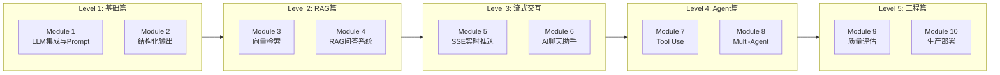
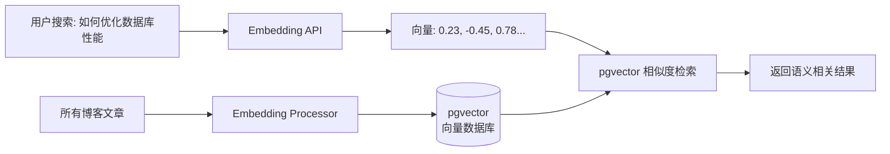
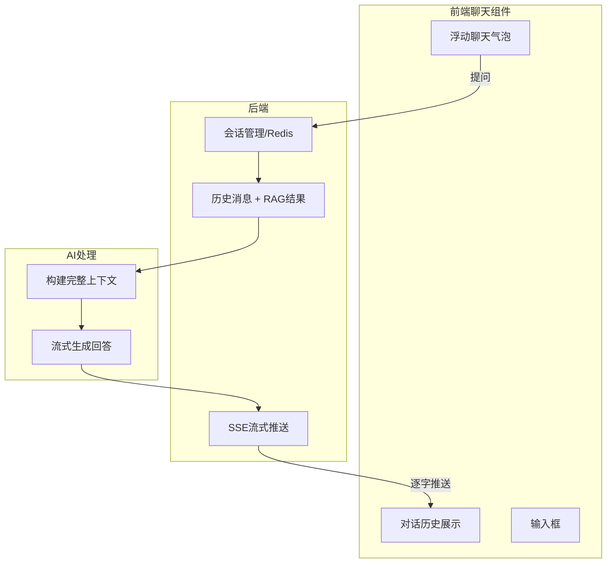
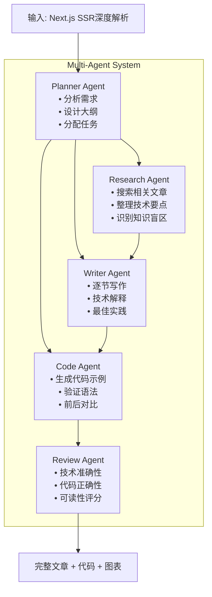

# AI Blog — 大模型应用实战教学进度表

基于博客系统，从零构建真正的大模型应用。每个阶段产出可展示的完整功能。

---

## 🗺️ 总览



---

## Level 1: 基础篇 — LLM 集成与 Prompt Engineering

### Module 1: 第一个 AI 接口
**目标**: 理解 LLM 的 API 调用方式和 Prompt 设计基础

**实战**: 给博客文章生成 SEO 关键词和摘要

```
用户请求:
  POST /api/blog/ai/seo-suggest
  { "articleContent": "...", "title": "..." }

AI返回:
  {
    "keywords": ["Next.js", "SSR", "SEO优化"],
    "metaDescription": "...",
    "readabilityScore": 75,
    "suggestions": ["增加H2标题", "优化代码块展示"]
  }
```

**学习要点**:
- [ ] LLM API 调用基础 (system/user/assistant 角色)
- [ ] Prompt 设计原则 (角色设定、指令清晰、格式约束)
- [ ] 温度/Token/MaxOutput 参数含义
- [ ] 错误处理 (API不可用、超时、限流)

**产出**: 一个完整的 `/api/blog/ai/seo-suggest` 端点 + admin页面的"SEO建议"按钮

**知识点对求职的价值**: ⭐⭐⭐ (基础，但必须掌握)

### Module 2: 结构化输出
**目标**: 让 LLM 按照严格 Schema 返回数据，而不是自由文本

**实战**: 自动生成文章标签、分类建议、相关文章推荐

```typescript
// 定义输出 Schema
const tagSuggestionSchema = {
  type: "object",
  properties: {
    tags: {
      type: "array",
      items: {
        type: "object",
        properties: {
          name: { type: "string" },
          confidence: { type: "number", min: 0, max: 100 },
          reason: { type: "string" }
        },
        required: ["name", "confidence", "reason"]
      },
      minItems: 3,
      maxItems: 5
    },
    suggestedCategory: { type: "string" },
    relatedArticleTopics: { type: "array", items: { type: "string" } }
  },
  required: ["tags", "suggestedCategory"]
}
```

**学习要点**:
- [ ] JSON Schema / Zod 定义输出结构
- [ ] Function Calling / Tool Use 强制结构化输出
- [ ] 输出解析与验证 (parse + validate)
- [ ] 错误重试逻辑 (输出格式不对时自动重试)

**产出**: 写文章时自动推荐标签和分类，精确到置信度分数

**知识点对求职的价值**: ⭐⭐⭐⭐ (结构化输出是LLM工程的基础技能)

---

## Level 2: RAG 篇 — 向量检索与知识库

### Module 3: 文章向量化与语义搜索
**目标**: 将博客文章变成 AI 可以"理解"的向量，实现语义搜索

**实战**: 替换现有的关键词搜索，升级为语义搜索



**学习要点**:
- [ ] Embedding 模型选择 (text-embedding-3-small / 开源模型)
- [ ] pgvector 安装与配置
- [ ] 文章分块策略 (chunk size, overlap, 分块策略)
- [ ] 混合搜索: 向量相似度 + BM25 全文检索
- [ ] 重排序 (Re-ranking) 提升精度

**产出**: 博客搜索支持语义理解，"数据库优化"能搜到"索引调优"、"查询慢怎么办"

**知识点对求职的价值**: ⭐⭐⭐⭐⭐ (RAG是LLM应用核心技能)

### Module 4: RAG 问答系统
**目标**: 基于博客内容构建知识问答系统，读者可以提问并从文章中获取答案

**实战**: 读者针对博客内容提问，AI 检索相关文章后回答

```typescript
// 查询流程
async function answerQuestion(question: string) {
  // 1. 问题向量化
  const questionEmbedding = await embed(question);
  
  // 2. 检索相关文章段落
  const relevantChunks = await hybridSearch(questionEmbedding, {
    topK: 5,
    similarityThreshold: 0.7
  });
  
  // 3. 构建 RAG Prompt
  const prompt = `
    基于以下博客内容回答问题。如果内容不足以回答，请明确说明。
    
    相关文章:
    ${relevantChunks.map(c => `[${c.title}]: ${c.content}`).join('\n\n')}
    
    问题: ${question}
    
    回答要求:
    - 引用具体文章作为依据
    - 如果信息不足，说明缺少什么
    - 使用技术性语言回答
  `;
  
  // 4. LLM 生成回答
  return await llm.generate(prompt);
}
```

**学习要点**:
- [ ] 完整的 RAG Pipeline: 检索 → 增强 → 生成
- [ ] 上下文窗口管理 (Context Window 限制)
- [ ] 引用溯源 (回答中标注来源文章)
- [ ] Query Transformation (改写问题为更易检索的形式)
- [ ] 检索策略对比: 单轮检索 vs 多轮检索

**产出**: 博客每个文章页底部有"问AI"功能，读者提问后AI从博客内容检索答案并标注引用

**知识点对求职的价值**: ⭐⭐⭐⭐⭐ (RAG是所有LLM应用的标配)

---

## Level 3: 流式交互篇

### Module 5: SSE 实时流式输出
**目标**: 将项目已有的 SSE 基础模式应用到 AI 对话场景，实现逐字输出效果

> **注意**: 项目中 `blog.controller.ts` 的 `detectIncompleteTranslationsStream` 已经用 `@Sse()` 实现了 SSE，这个 Module 不是从零学 SSE 协议，而是**将同样的模式移植到 AI 流式生成场景**，学习成本比全新功能低。

**实战**: RAG 问答支持打字机效果

**学习要点**:
- [ ] 回顾现有 SSE 实现模式（`@Sse()` + `Observable<MessageEvent>`）
- [ ] LLM Provider 如何开启流式模式（Gemini/DeepSeek streaming API）
- [ ] 前端 EventSource / fetch + ReadableStream 处理 AI token 流
- [ ] 流式中断与恢复
- [ ] 错误处理和重连

**产出**: AI 问答回答是一个一个字显示出来的打字机效果

**知识点对求职的价值**: ⭐⭐⭐⭐ (流式是LLM应用的标配体验)

### Module 6: AI 聊天助手
**目标**: 构建一个完整的对话式 AI 助手，支持多轮对话、上下文记忆

**实战**: 博客右下角的"AI 助手"浮动聊天窗口



**学习要点**:
- [ ] 多轮对话的上下文管理 (滑动窗口)
- [ ] 会话持久化 (Redis 存储聊天历史)
- [ ] 结合 RAG 的对话系统
- [ ] 用户意图识别 (查文章 vs 闲聊 vs 技术问题)
- [ ] 对话限流和成本控制

**产出**: 博客右下角的浮动 AI 助手，可以回答技术问题、推荐文章

**知识点对求职的价值**: ⭐⭐⭐⭐⭐ (对话式AI是主流产品形态)

---

## Level 4: Agent 篇 — 工具调用与多智能体

### Module 7: Tool Use / Function Calling
**目标**: LLM 不再只是"说话"，而是可以调用工具执行操作

**实战**: AI 助手可以执行代码、搜索文章、推荐文章

```typescript
// 定义 AI 可以使用的工具
const tools = {
  searchArticles: {
    description: "搜索博客文章，keywords可以是技术概念或问题",
    parameters: {
      query: "string",
      limit: "number"
    },
    execute: async ({ query, limit }) => {
      return await blogService.searchArticles(query, limit);
    }
  },
  
  getArticleContent: {
    description: "获取某篇文章的完整内容",
    parameters: { slug: "string" },
    execute: async ({ slug }) => {
      return await blogService.getArticleBySlug(slug);
    }
  },
  
  recommendArticles: {
    description: "根据用户兴趣推荐文章",
    parameters: { interest: "string", count: "number" },
    execute: async ({ interest, count }) => {
      return await blogService.getRecommendations(interest, count);
    }
  }
}
```

**学习要点**:
- [ ] Function Calling 原理 (LLM 选择调用哪个函数)
- [ ] Tool 定义与 Schema 设计
- [ ] 工具执行结果回传给 LLM 继续推理
- [ ] 安全控制 (哪些工具可以调用，参数校验)
- [ ] Loop：LLM思考 → 调用工具 → 获取结果 → 继续思考

**产出**: AI 助手可以"帮我找一下 Next.js 相关的文章" → 自动调用搜索 → 总结推荐

**知识点对求职的价值**: ⭐⭐⭐⭐⭐ (Tool Use是Agent的基础)

### Module 8: Multi-Agent 协作系统
**目标**: 多个 AI Agent 分工协作完成复杂任务

**实战**: AI 内容创作工坊 — 输入一个主题，AI 自动产出完整的博客文章

**架构**:



**Orchestrator 工作流程**:

```typescript
class OrchestratorAgent {
  async generateArticle(topic: string) {
    // Step 1: 规划阶段 - 分析主题，设计大纲
    const plan = await this.planner.createPlan(topic);
    
    // Step 2: 研究阶段 - 并行搜索资料
    const research = await Promise.all(
      plan.sections.map(s => this.research.gather(s.topic))
    );
    
    // Step 3: 写作阶段 - 逐节生成内容
    const sections = [];
    for (const section of plan.sections) {
      const content = await this.writer.writeSection(section, {
        previousContext: sections.slice(-1)[0],
        researchData: research
      });
      sections.push(content);
    }
    
    // Step 4: 代码生成 - 为需要代码的部分生成示例
    const codeExamples = await this.codeGen.generate(
      plan.codeRequiredSections,
      sections
    );
    
    // Step 5: 质量审核 - LLM-as-a-Judge
    const review = await this.reviewer.evaluate({
      sections,
      codeExamples,
      plan
    });
    
    return { sections, codeExamples, review };
  }
}
```

**学习要点**:
- [ ] Agent 编排模式 (顺序/并行/条件分支)
- [ ] Agent 间通信协议 (数据结构设计)
- [ ] 任务分解策略 (复杂任务如何拆解)
- [ ] 状态管理 (整个生成过程的进度追踪)
- [ ] 错误恢复 (某个 Agent 失败怎么办)
- [ ] Agent 的 Token 预算管理

**产出**: 在 Admin 后台输入"写一篇Next.js优化文章"，系统自动研究 → 规划 → 写作 → 生成代码 → 质量审核，输出完整文章

**知识点对求职的价值**: ⭐⭐⭐⭐⭐⭐⭐ (Multi-Agent是2026年最热门方向)

---

## Level 5: 工程篇 — 质量与生产

### Module 9: LLM-as-a-Judge 质量评估
**目标**: 用 AI 来评估 AI 的输出质量，建立质量保障体系

**实战**: 自动评估 AI 生成的文章质量，生成质量报告

```typescript
interface QualityReport {
  overallScore: number;
  dimensions: {
    technicalAccuracy: number;  // 技术准确性
    codeQuality: number;         // 代码质量
    readability: number;         // 可读性
    completeness: number;        // 完整性
    originalInsight: number;     // 原创见解
  };
  issues: Array<{
    severity: 'critical' | 'major' | 'minor';
    type: 'technical_error' | 'outdated' | 'ambiguous' | 'incomplete';
    location: string;
    description: string;
    suggestion: string;
  }>;
  citations: Array<{
    claim: string;
    sourceArticle?: string;  // 如果是基于博客内容的
    confidence: 'verified' | 'likely' | 'unverified';
  }>;
}
```

**学习要点**:
- [ ] Evaluation 方法论 (G-Eval、LLM-Eval)
- [ ] 多维评分体系设计
- [ ] 参考标准 (Ground Truth) 构建
- [ ] 评估结果的可信度衡量
- [ ] A/B 测试不同 Prompt/模型的效果

**产出**: 每次 AI 生成文章后自动评分，不合格自动要求重写

**知识点对求职的价值**: ⭐⭐⭐⭐ (质量保证是生产环境必需)

### Module 10: 生产化部署
**目标**: 让 AI 应用在生产环境稳定运行

**实战**: 完整的 AI 应用部署方案

**学习要点**:
- [ ] 成本控制策略 (Token 预算、模型选择策略)
- [ ] 缓存策略 (相同问题直接返回缓存)
- [ ] 监控和日志 (每次LLM调用的 latency/token消耗/成功率)
- [ ] 降级策略 (LLM不可用时回退到离线方案)
- [ ] Rate Limiting 和并发控制
- [ ] Prompt 版本管理

**产出**: AI 助手稳定上线，带监控面板和成本仪表盘

**知识点对求职的价值**: ⭐⭐⭐⭐ (能上线才是真正的工程能力)

---

## 📅 学习进度表（建议时间安排）

| 周次 | Module | 实战产出 | 求职价值点 |
|------|--------|---------|-----------|
| 1-2 | M1: LLM集成 | SEO建议功能 | Prompt Engineering |
| 2-3 | M2: 结构化输出 | 标签/分类自动推荐 | Function Calling |
| 3-4 | M3: 向量检索 | 语义搜索 | Embedding + Vector DB |
| 4-6 | M4: RAG问答 | 文章知识问答 | 完整RAG Pipeline |
| 6-7 | M5: SSE流式 | 打字机效果 | Streaming |
| 7-9 | M6: 聊天助手 | 浮动AI助手 | 对话系统 |
| 9-10 | M7: Tool Use | AI可执行操作 | Function Calling + Tool |
| 10-12 | M8: Multi-Agent | AI内容工坊 | 多智能体编排 |
| 12-13 | M9: 质量评估 | 自动质量审核 | LLM Evaluation |
| 13-14 | M10: 生产部署 | 完整上线+监控 | 工程化能力 |

---

## 🎯 每个阶段的面试回答

### 学完 M1-M2 可以说的
> "我设计了一个结构化输出系统，用JSON Schema约束LLM输出格式，实现了自动标签推荐和SEO优化建议。解决了LLM输出不可控的工程问题。"

### 学完 M3-M4 可以说的
> "我构建了一个完整的RAG系统，使用pgvector做向量存储，实现了混合搜索（向量+关键词）。支撑了博客的语义搜索和AI问答功能。重点解决了分块策略和重排序的优化问题。"

### 学完 M5-M6 可以说的
> "我实现了基于SSE的流式对话系统，支撑了博客的AI聊天助手。支持多轮对话上下文管理、会话持久化，以及RAG增强的回答生成。"

### 学完 M7-M8 可以说的 ✅ **最有竞争力**
> "我设计了一个多Agent内容生成系统。Orchestrator Agent负责任务分解和编排，协调Research/Writer/Code/Review四个Agent协作。Research Agent使用RAG检索博客内容，Code Agent能生成并验证代码语法，Review Agent用LLM-as-a-Judge评估质量。整个流程通过SSE实时展示进度。"

### 学完 M9-M10 可以说的
> "我建立了完整的LLM应用生产体系：质量评估、成本控制、缓存策略、监控告警、降级方案。确保AI功能在生产环境稳定运行。"

---

## 🔧 技术栈总结

| 阶段 | 新增技术 | 依赖 |
|------|---------|------|
| M1 | 无 | 现有 AiService |
| M2 | Zod/JSON Schema | `zod` |
| M3 | pgvector | PostgreSQL 扩展 |
| M4 | RAG Pipeline | pgvector + embedding |
| M5 | SSE | NestJS + EventSource |
| M6 | Redis 会话 | `ioredis` |
| M7 | Tool Use 框架 | Function Calling |
| M8 | Agent 编排 | 自实现 |
| M9 | 评估框架 | LLM-as-a-Judge |
| M10 | 监控 | Prometheus + Grafana |

---

## 代码组织结构

> **目录分工原则**:  
> - `src/common/ai/` — AI 基础设施（Provider、限流、Key 轮换），**不要动**  
> - `src/blog/ai/` — Blog 业务专用 AI 功能（SEO、标签、摘要等）  
> - `src/blog/search/` — 搜索与 RAG 管道  
> - `src/blog/chat/` — 对话与流式  
> - `src/blog/agents/` — Agent 系统

```
apps/api/src/
├── common/
│   └── ai/                          # ✅ 已有：Provider、限流、Key轮换（勿改动）
│       ├── ai.service.ts
│       └── providers/
├── blog/
│   ├── ai/                          # Module 1-2: AI基础功能（新增）
│   │   ├── seo-suggestion.service.ts
│   │   ├── tag-suggestion.service.ts
│   │   └── dto/
│   ├── search/                      # Module 3-4: RAG搜索（新增）
│   │   ├── embedding.service.ts
│   │   ├── hybrid-search.service.ts
│   │   └── rag-qa.service.ts
│   ├── chat/                        # Module 5-6: 流式对话（新增）
│   │   ├── chat-session.service.ts
│   │   ├── chat-stream.service.ts
│   │   └── chat.controller.ts
│   ├── agents/                      # Module 7-8: Agent系统（新增）
│   │   ├── orchestrator.agent.ts
│   │   ├── research.agent.ts
│   │   ├── writer.agent.ts
│   │   ├── code-gen.agent.ts
│   │   ├── reviewer.agent.ts
│   │   └── tools/
│   ├── evaluation/                  # Module 9: 质量评估（新增）
│   │   ├── quality-evaluator.service.ts
│   │   └── metrics.service.ts
```

---

## 最终 Capstone 项目

完成所有 Module 后，你将拥有一个**端到端的AI内容系统**：

```
用户: "写一篇Next.js性能优化的文章"
  ↓
AI Agent系统自动完成:
  1. 研究现有博客内容 → RAG检索已有文章
  2. 规划文章结构 → Planner Agent
  3. 逐节写作 → Writer Agent
  4. 生成代码示例 → Code Agent (还自动验证语法)
  5. 质量审核 → Review Agent (LLM-as-a-Judge)
  6. 生成SEO元数据 → M1的SEO模块
  7. 自动打标签和分类 → M2的标签模块
  8. 添加到语义搜索索引 → M3的向量化
  ↓
输出: 完整文章 + 代码 + 质量报告 + SEO数据
```

这个项目在面试时可以完整演示，从输入一个标题到输出完整文章的全过程，展示你掌握了RAG、Agent、Streaming、Structured Output 等所有核心技能。
