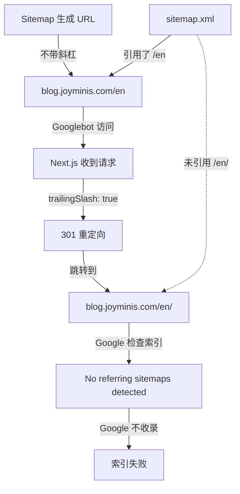
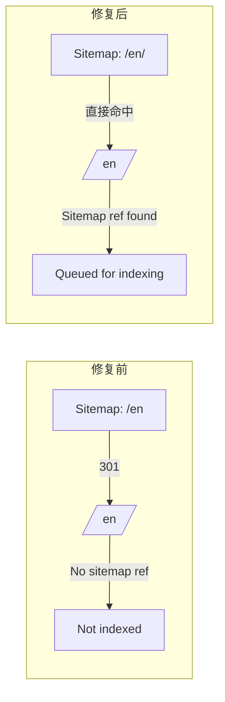

# Blog SEO: Sitemap Trailing Slash 修复方案

## 问题概述

Google Search Console 显示 Sitemap 已成功处理（7 个页面），但所有页面状态为 **"Discovered - currently not indexed"**（已发现 - 当前未编入索引）。

通过 URL Inspection 发现关键线索：**"No referring sitemaps detected"** — Google 不认为当前页面 URL 被 sitemap 引用。

## 根因分析



### 核心冲突

| 配置 | 值 | 文件位置 |
|------|-----|---------|
| `trailingSlash` | `true` | [`next.config.ts:138`](apps/frontend-blog/next.config.ts:138) |
| Sitemap 首页 URL | `https://blog.joyminis.com/en`（无斜杠） | [`[locale]/sitemap.ts:33`](apps/frontend-blog/src/app/%5Blocale%5D/sitemap.ts:33) |
| Sitemap 页面 URL | `https://blog.joyminis.com/en/about`（无斜杠） | [`[locale]/sitemap.ts:40`](apps/frontend-blog/src/app/%5Blocale%5D/sitemap.ts:40) |

`trailingSlash: true` 导致 Next.js 将所有不带斜杠的 URL 301 重定向到带斜杠版本。但 Sitemap 中提交的 URL 全都不带斜杠，造成：
1. Google 从 sitemap 获取 `/en`
2. 访问 `/en` 收到 301 → `/en/`
3. Google 记录 `/en/` 为实际页面
4. 但 `/en/` 没有 sitemap 关联记录
5. Google 不认为该页已被提交，不纳入索引队列

## 修复方案

### 方案 A：Sitemap URL 加 trailing slash（推荐）

修改 [`apps/frontend-blog/src/app/[locale]/sitemap.ts`](apps/frontend-blog/src/app/%5Blocale%5D/sitemap.ts)，所有 `url:` 末尾加 `/`。

**改动清单（8 处）：**

| 行号 | 当前值 | 修改为 |
|------|--------|--------|
| 33 | `` `${baseUrl}/${locale}` `` | `` `${baseUrl}/${locale}/` `` |
| 40 | `` `${baseUrl}/${locale}/about` `` | `` `${baseUrl}/${locale}/about/` `` |
| 48 | `` `${baseUrl}/${locale}/categories` `` | `` `${baseUrl}/${locale}/categories/` `` |
| 55 | `` `${baseUrl}/${locale}/tags` `` | `` `${baseUrl}/${locale}/tags/` `` |
| 62 | `` `${baseUrl}/${locale}/search` `` | `` `${baseUrl}/${locale}/search/` `` |
| 77 | `` `${baseUrl}/${locale}/articles/${article.slug}` `` | `` `${baseUrl}/${locale}/articles/${article.slug}/` `` |
| 88 | `` `${baseUrl}/${locale}/categories/${category.slug}` `` | `` `${baseUrl}/${locale}/categories/${category.slug}/` `` |
| 99 | `` `${baseUrl}/${locale}/tags/${tag.slug}` `` | `` `${baseUrl}/${locale}/tags/${tag.slug}/` `` |

**影响范围：** 仅 sitemap.xml 输出内容变更，不影响页面渲染逻辑。

### 方案 B：移除 `trailingSlash: true`（不推荐）

移除 [`next.config.ts:138`](apps/frontend-blog/next.config.ts:138) 的 `trailingSlash: true` 会导致：
- 所有现有页面 URL 结构改变（从 `/en/` 变为 `/en`）
- 已有外部链接全部失效
- PWA Service Worker 缓存 URL 不匹配
- 需要大量额外重定向规则

**结论：方案 A 更安全、影响更小。**

## 验证步骤

1. **部署后**：访问 `https://blog.joyminis.com/en/sitemap.xml` 确认 URL 带 `/`
2. **Search Console**：在顶部输入框检查 `https://blog.joyminis.com/en/`，确认出现 "Sitemap 已提交"
3. **重新提交 sitemap**：在 Search Console → Sitemaps → 点击已提交的 sitemap → 请求重新抓取
4. **手动请求收录**：选择最重要的 2-3 个页面，点击 "REQUEST INDEXING"

## 附加优化建议

### P2：移除 `BUILD_TARGET === 'app'` 跳过逻辑

[`[locale]/sitemap.ts:19-22`](apps/frontend-blog/src/app/%5Blocale%5D/sitemap.ts:19)

```typescript
if (process.env.BUILD_TARGET === 'app') {
    return []; // 可能导致生产环境 sitemap 为空
}
```

如果生产环境没有设置 `BUILD_TARGET=app` 则此问题不存在，但建议移除或改用更精确的判断条件，防止未来 CI/CD 配置变更导致 sitemap 静默失效。

### P3：Middleware 排除每语言 sitemap

[`middleware.ts:93`](apps/frontend-blog/middleware.ts:93)

当前正则只排除了根 `/sitemap.xml`，建议加 `[a-z]{2}/sitemap.xml` 以排除 `/en/sitemap.xml`、`/zh/sitemap.xml` 等路径。

---

## 总结



修复后，sitemap 中的 URL 与实际页面 URL 完全一致，消除 301 重定向，Google 能正确识别页面与 sitemap 的关联关系，从而进入正常的索引队列。
