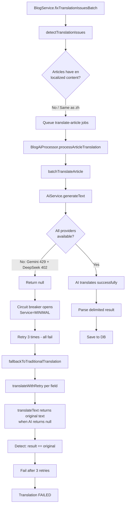

# Blog AI Translation Failure - Root Cause Analysis & Fix Plan

## 1. Problem Summary

The blog's AI-powered article translation is failing. When the system tries to translate articles to English (`en`), all AI providers return errors, causing the entire translation pipeline to fail.

## 2. Root Cause Analysis

### 2.1 Immediate Cause: All AI Providers Unavailable

From the logs at `12:12:35`:

```
[GeminiProvider] ⚠️ Gemini key ...UV_w hit 429, blocking for 60s
[GeminiProvider] 🛑 All 4 Gemini keys exhausted
[DeepSeekProvider] DeepSeek API error on key ...8220: Request failed with status code 402
[AiService] ❌ All AI providers failed for generateText()
```

**Three providers, two failures, one missing:**

| Provider | Error | Reason |
|----------|-------|--------|
| **Gemini** (4 keys) | HTTP 429 Too Many Requests | Free tier quota exhausted: 20 requests/day for `gemini-2.5-flash` |
| **DeepSeek** (1 key) | HTTP 402 Payment Required | Account needs payment/insufficient balance |
| **Groq** | Not in logs | `GROQ_API_KEY` environment variable not configured → provider initialized with 0 keys → `isAvailable()` returns `false` → fallback skips it |

**Groq is registered as a provider** in [`ai.service.ts:105`](apps/api/src/common/ai/ai.service.ts:105) but **never initialized** because `GROQ_API_KEY` is not set in the environment. The [`GroqProvider.initialize()`](apps/api/src/common/ai/providers/groq.provider.ts:47) method checks `this.configService.get<string>('GROQ_API_KEY')` and if it's missing, logs "Groq API key not configured, provider disabled" and returns with an empty `keyInstances` array. This causes [`isAvailable()`](apps/api/src/common/ai/providers/groq.provider.ts:176) to return `false`, so the fallback loop in [`generateText()`](apps/api/src/common/ai/ai.service.ts:350) skips it entirely.

### 2.2 Cascade: Circuit Breaker Opens

After 5 consecutive failures across all providers, the circuit breaker opens at `12:12:39`:

```
[AiService] 🔥 Circuit breaker OPENED for 15 minutes after 5 consecutive failures
[AiService] 🔄 AI service level recovered to: MINIMAL
```

This means **all AI features** (translation, moderation, auto-reply) are blocked for 15 minutes.

### 2.3 The "Translation Returns Same Text" Problem

When the batch translation fails, the system falls back to `fallbackToTraditionalTranslation()` at [`blog-ai.processor.ts:411`](apps/api/src/blog/processors/blog-ai.processor.ts:411), which calls `translateWithRetry()` for each field individually.

The `translateText()` method at [`ai.service.ts:586`](apps/api/src/common/ai/ai.service.ts:586) has this fallback:

```typescript
return result || text;  // line 649
```

When AI returns `null` (all providers failed), it returns the **original text unchanged**. Then `translateWithRetry()` at [`blog-ai.processor.ts:164`](apps/api/src/blog/processors/blog-ai.processor.ts:164) detects:

```
[BlogAiProcessor] 翻译结果与原文相同，可能翻译失败 (尝试 1/3)
```

This triggers 3 retries, all of which also fail because the circuit breaker is open.

### 2.4 The "Already English" Problem

Looking at the articles being translated:

| Article ID | Title | Language |
|-----------|-------|----------|
| `cmon3syxp...` | "Redis Distributed Lock System: Decorator-Based Concurrency Control" | Already English |
| `cmon4imfb...` | "Avatar Service, Payment Integration & Public Cache Interceptor" | Already English |
| `cmopn4sv7...` | "OpenNext Cloudflare 构建管道深度分析：从 Next.js 构建到 Worker 部署" | Mixed (Chinese title) |

**Articles 1 and 2 already have English titles.** The `detectTranslationIssues()` at [`blog.service.ts:2415`](apps/api/src/blog/blog.service.ts:2415) flags them because:
- The `titleLocalized.en` field might be missing or empty
- OR the `titleLocalized.en` equals `titleLocalized.zh` (same content)

But these articles were **originally written in English** (or already translated). The system is trying to "translate" English → English, which is wasteful and will always produce "same as original" results.

### 2.5 The `isEnglishText()` Guard Is Not Used

There's a method [`isEnglishText()`](apps/api/src/blog/processors/blog-ai.processor.ts:587) that detects if text is already English, but it's **never called** in the translation pipeline. It exists but is dead code.

## 3. Flow Diagram



## 4. Fix Plan

### Fix 1: Skip Translation for Already-English Content (HIGH priority)

**Problem:** The system tries to translate English articles to English, wasting quota and failing.

**Solution:** In [`processArticleTranslation()`](apps/api/src/blog/processors/blog-ai.processor.ts:768), add a check at the beginning:

```typescript
// If targetLang is 'en' and source content is already English, skip
if (targetLang === 'en' && this.isEnglishText(sourceTitle)) {
  this.logger.log(`Skipping translation: article ${data.articleId} is already in English`);
  // Copy source to target locale
  await this.copySourceToTargetLocale(article, data.targetLang);
  return;
}
```

**Files to modify:**
- [`apps/api/src/blog/processors/blog-ai.processor.ts`](apps/api/src/blog/processors/blog-ai.processor.ts) - Add early-exit check in `processArticleTranslation()`
- [`apps/api/src/blog/blog.service.ts`](apps/api/src/blog/blog.service.ts) - Update `detectTranslationIssues()` to not flag English articles for English translation

### Fix 2: Add Paid Gemini API Keys (HIGH priority)

**Problem:** The free tier of Gemini has only 20 requests/day for `gemini-2.5-flash`. All 4 keys are on the free tier.

**Solution:** Upgrade at least one Gemini API key to a paid tier (Pay-as-you-go). This increases the quota from 20 req/day to 2000 req/day.

**Alternatively:** Configure a different provider with working keys (e.g., Groq if a key is available).

### Fix 3: Fix DeepSeek Account (HIGH priority)

**Problem:** DeepSeek returns HTTP 402 (Payment Required), meaning the account has no balance.

**Solution:** Add funds to the DeepSeek account associated with key `...8220`, or replace with a working key.

### Fix 4: Improve `translateText()` Fallback Behavior (MEDIUM priority)

**Problem:** When AI returns `null`, [`translateText()`](apps/api/src/common/ai/ai.service.ts:649) returns the original text unchanged, which then gets detected as a "translation failure" after 3 retries.

**Solution:** Instead of silently returning original text, throw an error so the caller can handle it properly:

```typescript
// Current (line 649):
return result || text;

// Better:
if (!result) {
  throw new Error(`AI translation failed for text (length: ${text.length}, target: ${targetLang})`);
}
return result;
```

**Files to modify:**
- [`apps/api/src/common/ai/ai.service.ts`](apps/api/src/common/ai/ai.service.ts) - Change `translateText()` and `translateMarkdown()` to throw on null

### Fix 5: Add Translation Skip Logic in `detectTranslationIssues()` (MEDIUM priority)

**Problem:** [`detectTranslationIssues()`](apps/api/src/blog/blog.service.ts:2415) flags articles that are already in English as having "translation problems" for English.

**Solution:** Before flagging an article, check if the source content is already in the target language:

```typescript
// In detectArticleTranslationIssues(), add:
if (lang === 'en' && this.isEnglishText(article.title)) {
  continue; // Skip - already English
}
```

**Files to modify:**
- [`apps/api/src/blog/blog.service.ts`](apps/api/src/blog/blog.service.ts) - Add language detection skip in `detectArticleTranslationIssues()`

### Fix 6: Add Monitoring / Alerting for Provider Failures (LOW priority)

**Problem:** Provider failures are only logged; there's no alerting mechanism.

**Solution:** Add a webhook or notification when all providers are exhausted or circuit breaker opens.

## 5. Immediate Action Items (to unblock translation)

1. **Add funds to DeepSeek** OR add a working Groq/OpenAI key
2. **Upgrade at least one Gemini key** to paid tier
3. **Deploy Fix 1** (skip English→English translation) to prevent wasting quota
4. **Manually mark** the 2 already-English articles as translated in the database

## 6. Code Changes Summary

| # | File | Change | Priority |
|---|------|--------|----------|
| 1 | [`blog-ai.processor.ts`](apps/api/src/blog/processors/blog-ai.processor.ts) | Add early-exit in `processArticleTranslation()` when target=en and content is already English | HIGH |
| 2 | [`blog.service.ts`](apps/api/src/blog/blog.service.ts) | Skip English articles in `detectArticleTranslationIssues()` for en target | MEDIUM |
| 3 | [`ai.service.ts`](apps/api/src/common/ai/ai.service.ts) | Throw error instead of returning original text when AI fails | MEDIUM |
| 4 | Environment config | Add paid Gemini keys / fund DeepSeek | HIGH |
