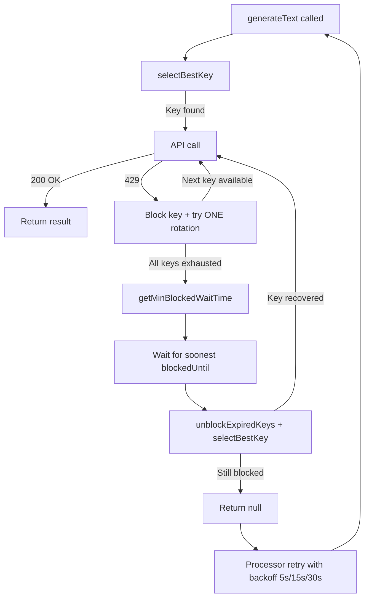

# Blog Translation Failure Analysis V3 — Wait-for-Recovery Mechanism

## 1. Why V2 Didn't Work

**V2 was prophylactic, not curative.** RPM-aware key selection + inter-request delays prevent future rate limiting when starting clean. But they **cannot recover already-blocked keys**.

### The Death Spiral (in ~1 second)

Looking at [`groq.provider.ts`](../apps/api/src/common/ai/providers/groq.provider.ts:179-189):

```
generateText() called
  → selectBestKey() → key #1 (clean state)
  → API call → 429
  → Block key #1 for 60s
  → rotateToNextKey() → key #2
  → Recursive generateText() with key #2
    → API call → 429 (SAME account-level limit!)
    → Block key #2 for 60s
    → rotateToNextKey() → key #3
    → Recursive generateText() with key #3
      → key #3 → 429 → blocked
      → key #4 → 429 → blocked
      → All 4 keys exhausted in < 1 second
      → Returns null
```

**All 4 keys burn down in milliseconds because they share a Groq account-level rate limit.**

### Why Processor Retries Also Fail

The processor's exponential backoff ([`blog-ai.processor.ts:74-98`](../apps/api/src/blog/processors/blog-ai.processor.ts:74-98)):

| Retry | Delay | Cooldown remaining | Result |
|-------|-------|--------------------|--------|
| 1st   | 5s    | ~55s               | ❌ All still blocked |
| 2nd   | 15s   | ~45s               | ❌ All still blocked |
| 3rd   | 30s   | ~30s               | ❌ All still blocked |
| Final | —     | —                  | ❌ Translation failed |

**The 60s cooldown is always longer than max retry (30s).** Every retry is wasted.

### The Missing Piece

The existing `getMinRpmWaitTime()` ([`groq.provider.ts:276-300`](../apps/api/src/common/ai/providers/groq.provider.ts:276-300)) only checks RPM slot availability. It **skips blocked keys entirely** (line 280: `if (key.blocked) continue;`), returning 0 when all keys are blocked — meaning "no wait needed" when actually we need to wait ~60s.

## 2. Root Cause

All 4 Groq API keys are likely from the **same Groq account**, sharing a per-account rate limit (~30 RPM). The admin panel confirms this:

```
Groq
0 req / 0k tok
#1  1k / 500k  BLOCKED
#2  0k / 500k  BLOCKED   ← never used successfully
#3  0k / 500k  BLOCKED   ← never used successfully
#4  0k / 500k  BLOCKED   ← never used successfully
```

Keys #2-#4 had **0 successful requests** but are blocked — they were rate-limited purely by association with key #1's account-level limit.

## 3. Solution: Hybrid Wait-for-Recovery

Only [`groq.provider.ts`](../apps/api/src/common/ai/providers/groq.provider.ts) needs changes. Strategy:

1. **On 429**: Block the key, try **ONE rotation** (in case keys have independent limits)
2. **If second key ALSO 429s**: STOP rotating (remaining keys will also 429 if same account)
3. **Calculate** minimum time until any blocked key's `blockedUntil` expires
4. **Wait** that long
5. **Retry** with the recovered key

### Change 1: Add `getMinBlockedWaitTime()` (~15 lines)

```typescript
private getMinBlockedWaitTime(): number {
    let minWait = Infinity;
    const now = Date.now();
    for (const key of this.keyInstances) {
        if (key.blocked && key.blockedUntil > now) {
            minWait = Math.min(minWait, key.blockedUntil - now);
        }
    }
    return minWait === Infinity ? 0 : minWait + 100; // +100ms buffer
}
```

### Change 2: Update 429 catch block (lines 180-202)

**Before:**
```
On 429 → block key → rotateToNextKey() → recurse → ... all 4 blocked → return null
```

**After:**
```
On 429 → block key → try ONE rotation
  → If rotation finds available key → try it
    → If that ALSO 429s → DON'T try remaining keys → calculate minBlockedWaitTime
    → Wait → unblock → retry with recovered key
  → If no rotation available → calculate minBlockedWaitTime
    → Wait → unblock → retry with recovered key
  → If retry ALSO 429s → return null (let processor handle with its own retry)
```

### Change 3: Update proactive rate check (lines 93-107)

Also consider `getMinBlockedWaitTime()` when `selectBestKey()` fails, so the system waits for key recovery instead of immediately aborting.

## 4. Recovery Flow Diagram



## 5. Implementation Summary

| # | Change | Location | Lines |
|---|--------|----------|-------|
| 1 | Add `getMinBlockedWaitTime()` method | `groq.provider.ts` | ~15 new lines after `getMinRpmWaitTime()` |
| 2 | Update 429 catch: try 1 rotation, then wait for recovery | `groq.provider.ts:180-202` | ~20 lines modified |
| 3 | Update proactive check: also consider blockedUntil | `groq.provider.ts:93-107` | ~10 lines modified |

**No changes needed**: [`ai.service.ts`](../apps/api/src/common/ai/ai.service.ts), [`blog-ai.processor.ts`](../apps/api/src/blog/processors/blog-ai.processor.ts), [`gemini.provider.ts`](../apps/api/src/common/ai/providers/gemini.provider.ts), [`deepseek.provider.ts`](../apps/api/src/common/ai/providers/deepseek.provider.ts)

**After deploy**: Restart server to clear in-memory blocked state from previous runs.

## 6. Edge Cases Handled

| Edge Case | Handling |
|-----------|----------|
| Keys have independent rate limits | First rotation may succeed → proceeds normally |
| Keys share account limit | Second 429 triggers wait-for-recovery, preserves remaining keys |
| Permanent rate limiting | Processor retry at 5s/15s/30s provides safety net |
| Deep recursion | Max depth 5 (4 keys + 1 recovery) — safe |
| 60s wait blocks queue | BullMQ concurrency=1, default timeout is minutes — fine |
