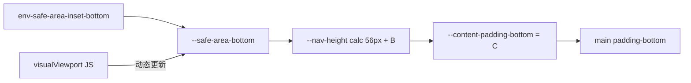
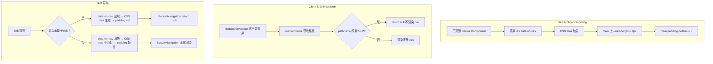
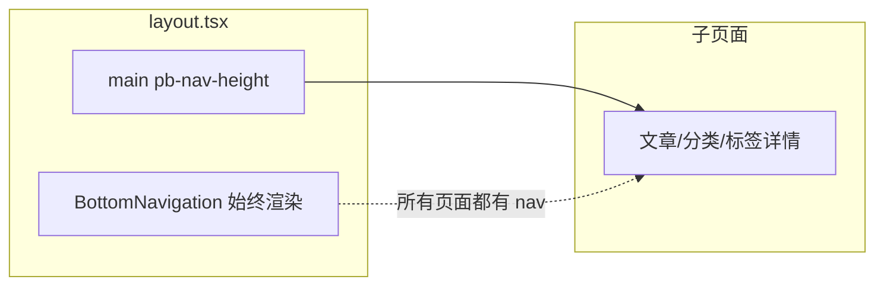
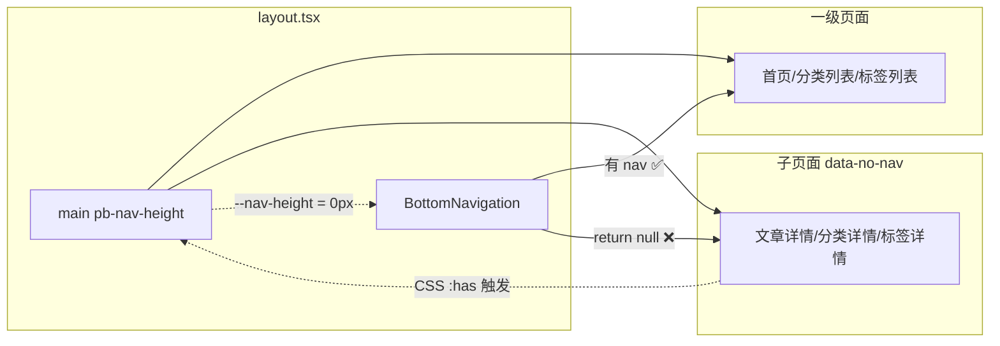
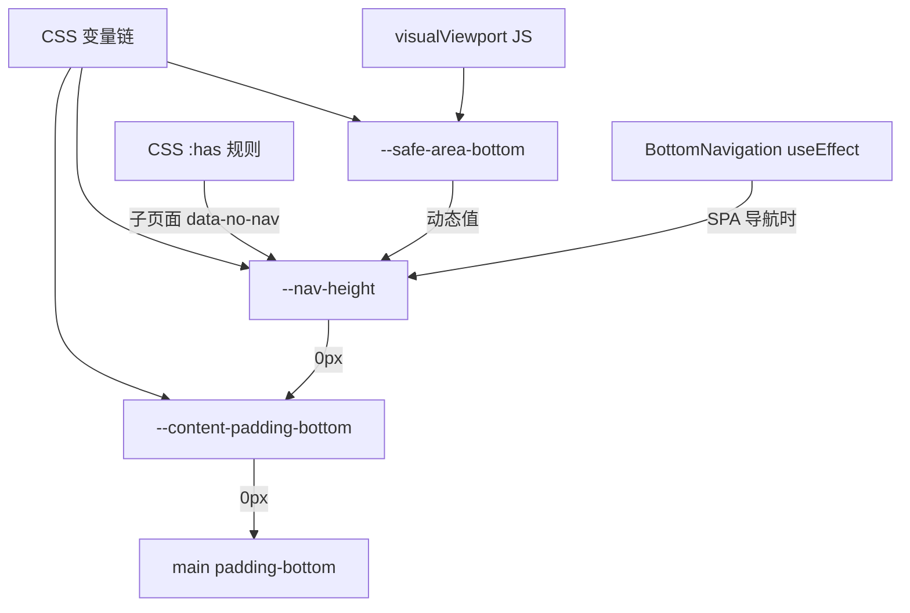

# BottomNavigation 重构方案

## 问题

### 原始问题（已修复 ✅）：nav 下方空白

H5 移动端 nav 下方有多余空白。原因是：

1. `<div className="absolute bottom-0 left-0 right-0 h-[100px] ...">`（backdrop 扩展元素）
2. `<div style={{ height: 'var(--safe-area-bottom)' }}>`（spacer 占位）

**已修复：** 移除了 spacer + backdrop，在 `<nav>` 上直接添加 `padding-bottom: env(safe-area-inset-bottom, 0px)`。用户已确认 ✅

### 新需求：子页面隐藏 BottomNavigation

用户要求 nav "只在一级页面"显示，子页面（2+ 级路径）隐藏 nav。

---

## 分析

### 当前渲染结构（你看到的样子）

```html
<main class="pb-[var(--content-padding-bottom)]">
  <!-- 内容区域 -->
  <article>...</article>
</main>

<!-- BottomNavigation 在 layout.tsx，所有页面都会渲染 -->
<nav class="md:hidden fixed bottom-0 ...">...</nav>
```

### 根源：两个问题元素

```
--safe-area-bottom: env(safe-area-inset-bottom, 0px);   /* globals.css:8  */
--nav-height: calc(56px + var(--safe-area-bottom));       /* globals.css:12 */
--content-padding-bottom: var(--nav-height);              /* globals.css:14 */
```

`main` 的 `pb-[var(--content-padding-bottom)]` = `56px + safe-area-bottom`。隐藏 nav 后这个 padding 依然存在，需要同步移除。

### CSS 变量链



### "一级页面" vs "子页面" 定义

| 路径深度 | 示例                                                                | 显示 nav？ |
| -------- | ------------------------------------------------------------------- | ---------- |
| 0 段     | `/`（首页）                                                         | ✅         |
| 1 段     | `/about`, `/categories`, `/tags`, `/bookmarks`, `/login`, `/search` | ✅         |
| 2+ 段    | `/articles/some-article`, `/categories/tech`, `/tags/javascript`    | ❌         |

---

## 方案选择

### 方案对比

| 方案                           | 改动量                    | SSR 安全     | SPA 导航兼容 | 复杂度    |
| ------------------------------ | ------------------------- | ------------ | ------------ | --------- |
| A: Route Group 重构            | 多文件移动 + 新 layout    | ✅           | ✅           | 🔴 高     |
| B: 仅 JS useEffect             | BottomNavigation.tsx 一处 | ⚠️ SSR flash | ✅           | 🟢 低     |
| **C: CSS :has + 组件条件渲染** | **CSS 1条 + TSX 4处**     | **✅**       | **✅**       | **🟢 中** |

### 推荐：方案 C（CSS `:has()` + 组件条件渲染）

**核心思路：**

1. **CSS 层**：`main:has([data-no-nav]) { --nav-height: 0px; }` — SSR 安全、无 flash
2. **组件层**：BottomNavigation 检测路径深度，深度 ≥2 时返回 null
3. **页面层**：子页面 Server Component 添加 `data-no-nav` 属性，触发 CSS 规则



---

## 详细实施步骤

### 文件 1: `apps/frontend-blog/src/app/globals.css`

**添加**（在 `:root` 块之后）：

```css
/* 子页面（如文章详情、分类详情）隐藏 BottomNavigation 时，
   同步移除 main 的底部 padding，避免 56px 空白区域 */
main:has([data-no-nav]) {
  --nav-height: 0px;
}
```

**原理：** CSS 自定义属性级联。当 `main` 有 `--nav-height: 0px` 时，`--content-padding-bottom = var(--nav-height) = 0px`，`padding-bottom` = 0。

### 文件 2: `apps/frontend-blog/src/components/BottomNavigation.tsx`

**添加**（在 hooks 之后、SSR shell return 之前）：

```tsx
// 检测是否为子页面（路径段数 >= 2）
// 例如 /articles/some-article, /categories/tech, /tags/javascript
const pathSegments = pathname.split("/").filter(Boolean);
const isDeepPage = pathSegments.length >= 2;

// 管理 --nav-height CSS 变量，配合 SPA 导航
useEffect(() => {
  if (isDeepPage) {
    document.documentElement.style.setProperty("--nav-height", "0px");
  } else {
    document.documentElement.style.setProperty("--nav-height", "");
  }
}, [isDeepPage]);

// 子页面不渲染 nav
if (isDeepPage) {
  return null;
}
```

**注意：** `useEffect` 必须在 `return null` 之前声明（React hooks 规则）。CSS `:has()` 负责 SSR 安全，`useEffect` 负责 SPA 导航时的变量恢复。

### 文件 3: `apps/frontend-blog/src/app/[locale]/articles/[slug]/page.tsx`

**修改**：将 Fragment `<>` 替换为 `<div data-no-nav>`：

```tsx
// 成功路径（原 return 的 <>...</> 改为）
return (
  <div data-no-nav>
    <link ... />
    <link ... />
    <script ... />
    <ArticlePageClient initialArticle={initialArticle} />
  </div>
);

// 错误路径
return (
  <div data-no-nav>
    <ArticlePageClient initialArticle={undefined} />
  </div>
);
```

### 文件 4: `apps/frontend-blog/src/app/[locale]/categories/[slug]/page.tsx`

**修改**：用 `<div data-no-nav>` 包裹：

```tsx
// 两个 return 都包裹：
return (
  <div data-no-nav>
    <CategoryClientView initialData={data} />
  </div>
);
```

### 文件 5: `apps/frontend-blog/src/app/[locale]/tags/[slug]/page.tsx`

**修改**：用 `<div data-no-nav>` 包裹：

```tsx
// 两个 return 都包裹：
return (
  <div data-no-nav>
    <TagClientView initialData={data} />
  </div>
);
```

---

## Mermaid: 修改前后的结构对比

### 修改前（所有页面都渲染 nav）



### 修改后（子页面隐藏 nav + padding）



---

## Mermaid: 简化的 CSS 变量管理



---

## 执行清单

| #   | 步骤                              | 文件                         | 说明                                                            |
| --- | --------------------------------- | ---------------------------- | --------------------------------------------------------------- |
| 1   | ✅ 移除 spacer + backdrop         | `BottomNavigation.tsx`       | SSR 壳和客户端渲染各有一组，都要删                              |
| 2   | ✅ 在 nav 上添加 padding-bottom   | `BottomNavigation.tsx`       | `style={{ paddingBottom: 'env(safe-area-inset-bottom, 0px)' }}` |
| 3   | ✅ 验证 main 的 padding           | `layout.tsx` + `globals.css` | 确保 CSS 变量链正常工作                                         |
| 4   | ✅ 浏览器缓存清理验证             | 用户确认                     | 原始问题已解决                                                  |
| 5   | ⬜ 添加 CSS :has 规则             | `globals.css`                | `main:has([data-no-nav]) { --nav-height: 0px; }`                |
| 6   | ⬜ BottomNavigation 路径深度检测  | `BottomNavigation.tsx`       | `pathname.split('/')` + early return                            |
| 7   | ⬜ 添加 data-no-nav 到子页面      | `articles/[slug]/page.tsx`   | 包裹 content 在 `<div data-no-nav>` 中                          |
| 8   | ⬜ 添加 data-no-nav 到子页面      | `categories/[slug]/page.tsx` | 同上                                                            |
| 9   | ⬜ 添加 data-no-nav 到子页面      | `tags/[slug]/page.tsx`       | 同上                                                            |
| 10  | ⬜ TypeScript check + lint        | 终端                         | `yarn workspace @lucky/frontend-blog type-check`                |
| 11  | ⬜ 重启 dev server + 清浏览器缓存 | 终端 + 浏览器                | 确保无缓存问题                                                  |
