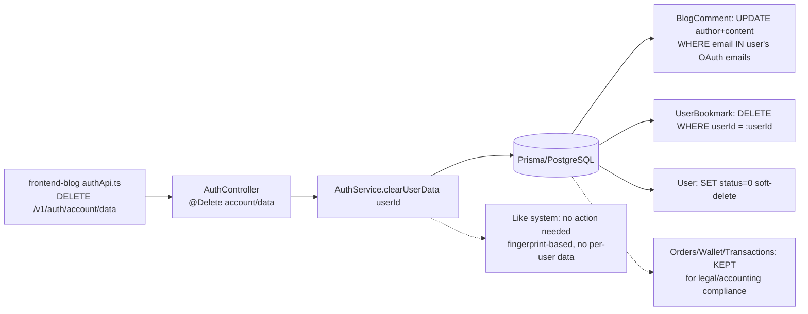
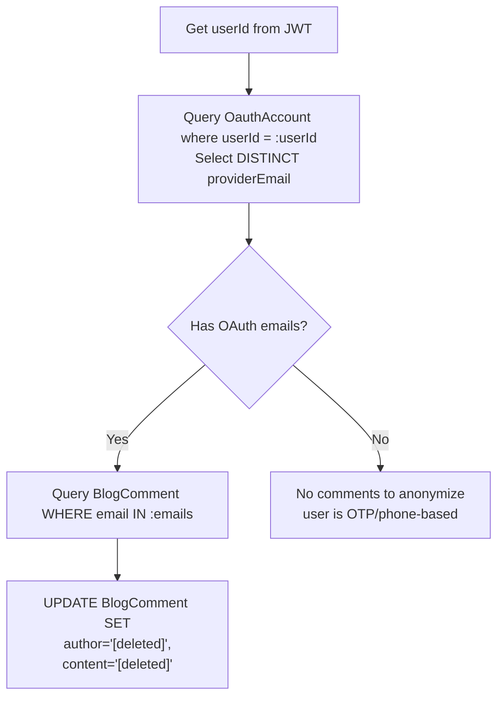

# Clear User Data API - Backend Implementation Plan

## Overview

Implement `DELETE /api/v1/auth/account/data` on the NestJS backend. The endpoint:

1. **Anonymizes blog comments** (author/content → `[deleted]`)
2. **Deletes user bookmarks**
3. **Soft-deletes the user account** (sets `status = 0`)
4. **Preserves financial records** (orders, wallet, transactions — kept for legal/accounting compliance)

This satisfies both **Apple App Store** (Guideline 5.1.1 — account deletion required) and **Google Play** (User Data Policy — data deletion required).

**Frontend call**: `http.delete('/v1/auth/account/data')` (already added by user in `authApi.ts`)

---

## System Architecture



---

## Data Model Analysis

### 1. BlogComment (lines 1608-1647 of schema.prisma)
- **Fields**: `id`, `articleId`, `author` (String), `email` (String), `content` (String), `status`, `parentId`, etc.
- **No `userId` FK** → Cannot directly map comments to users.
- **Strategy**: Match comments via OAuth email.

### 2. UserBookmark (lines 1650-1668 of schema.prisma)
- **Fields**: `id`, `userId` (FK→User), `articleId` (FK→BlogArticle), unique on `[userId, articleId]`
- **Direct userId FK** → Easy bulk delete.

### 3. Likes (BlogArticle.likeCount + Redis)
- `likeCount` is an aggregate counter on BlogArticle (Int, default 0).
- Like tracking is **fingerprint-based** (IP + User-Agent MD5 hash stored in Redis keys).
- **No per-user like data in DB** → Nothing to delete on the backend.

### 4. User (lines 12-79 of schema.prisma)
- **Fields**: `id`, `phone`, `phoneMd5`, `nickname`, `avatar`, `status` (Int, default 1), `vipLevel`, etc.
- **No `email` field**. Email is stored in **OauthAccount.providerEmail** (lines 252-282 of schema.prisma).
- **Soft-delete strategy**: Set `status = 0` to mark account as deleted.

### 5. OauthAccount (lines 252-282 of schema.prisma)
- `providerEmail` (String?) holds the user's email from OAuth providers.
- Has `onDelete: Cascade` relation to User → auto-deleted if we hard-delete.
- **With soft-delete**: We leave them in DB but anonymize if needed.

### 6. Financial Records (Orders, Wallet, Transactions)
- **Apple explicitly allows**: "Financial records may be retained for legal compliance."
- **Google allows**: "You may retain data for legal compliance purposes."
- **Decision**: Keep as-is. The soft-deleted user account acts as a tombstone.

---

## Comment Matching Strategy

Since `BlogComment` has **no `userId` field**, we match comments to users via OAuth email:



**Limitation**: Only matches comments posted with the same email used for OAuth login. OTP/phone-based users (who have no email on record) will not have any comments matched.

**Future improvement**: Could add a `userId` column to `BlogComment` schema to track comment authorship directly.

---

## Implementation Steps

### Step 1: Create Response DTO

**File**: `apps/api/src/client/auth/dto/clear-user-data.response.dto.ts`

```typescript
import { ApiProperty } from '@nestjs/swagger';

export class ClearUserDataResponseDto {
  @ApiProperty({ description: 'Whether the account was soft-deleted' })
  accountDeleted: boolean;

  @ApiProperty({ description: 'Number of comments anonymized' })
  anonymizedComments: number;

  @ApiProperty({ description: 'Number of bookmarks deleted' })
  deletedBookmarks: number;
}
```

### Step 2: Add `clearUserData()` to AuthService

**File**: `apps/api/src/client/auth/auth.service.ts`

Add a new public method:

```typescript
async clearUserData(userId: string): Promise<ClearUserDataResponseDto> {
  // 1. Collect user's OAuth provider emails
  const oauthAccounts = await this.prisma.oauthAccount.findMany({
    where: { userId, providerEmail: { not: null } },
    select: { providerEmail: true },
  });

  const userEmails = [
    ...new Set(oauthAccounts.map((a) => a.providerEmail).filter(Boolean) as string[]),
  ];

  // 2. Anonymize comments where email matches
  let anonymizedComments = 0;
  if (userEmails.length > 0) {
    const result = await this.prisma.blogComment.updateMany({
      where: { email: { in: userEmails } },
      data: {
        author: '[deleted]',
        content: '[deleted]',
      },
    });
    anonymizedComments = result.count;
  }

  // 3. Delete all user bookmarks
  const bookmarkResult = await this.prisma.userBookmark.deleteMany({
    where: { userId },
  });

  // 4. Soft-delete the user account
  //    Financial records (orders, wallet, transactions) are preserved
  //    for legal/accounting compliance as explicitly allowed by Apple/Google policies.
  await this.prisma.user.update({
    where: { id: userId },
    data: { status: 0 }, // 0 = deleted/inactive
  });

  // 5. Note: Likes are fingerprint-based (Redis), no per-user like data to delete
  //    The frontend handles clearing cached like state

  this.logger.log(`User ${userId} account soft-deleted and data cleared`);

  return {
    accountDeleted: true,
    anonymizedComments,
    deletedBookmarks: bookmarkResult.count,
  };
}
```

### Step 3: Add Endpoint to AuthController

**File**: `apps/api/src/client/auth/auth.controller.ts`

Add import for `Delete`:
```typescript
import { Delete, HttpCode, HttpStatus } from '@nestjs/common';
```
(Note: `HttpCode` and `HttpStatus` are already imported.)

Add import for the DTO:
```typescript
import { ClearUserDataResponseDto } from '@api/client/auth/dto/clear-user-data.response.dto';
```

Add the new endpoint method:
```typescript
@ApiBearerAuth()
@UseGuards(JwtAuthGuard)
@Delete('account/data')
@ApiOperation({ summary: 'Clear all user data and soft-delete account' })
@ApiOkResponse({ type: ClearUserDataResponseDto })
@HttpCode(HttpStatus.OK)
async clearUserData(
  @CurrentUserId() userId: string,
) {
  const result = await this.auth.clearUserData(userId);
  return {
    code: 10000,
    message: 'success',
    data: result,
  };
}
```

### Step 4: Verify

1. Run `yarn workspace @lucky/api type-check` (or the project's equivalent)
2. Run `yarn workspace @lucky/api lint` (or equivalent)
3. Verify imports compile correctly

---

## Frontend Status (Already Done by User)

According to the user's description, the frontend already has:
- ✅ `clearUserData()` mutation in `authApi.ts`
- ✅ Updated cache clearing logic in the settings screen
- ✅ UI changes for the "Clear All Data" button in settings
- ✅ i18n translations for the feature
- ✅ Privacy policy updates

**Note**: After calling this endpoint, the frontend should also:
- Clear local auth tokens (access token, refresh token)
- Redirect the user to the login screen
- Clear any local cache (IndexedDB, localStorage)

---

## Apple & Google Compliance Summary

| Requirement | How We Satisfy It |
|-------------|------------------|
| **Apple 5.1.1**: Account deletion | ✅ User account soft-deleted (status=0), effectively disabled |
| **Apple 5.1.1**: Data deletion | ✅ Comments anonymized, bookmarks deleted, likes cleared |
| **Google**: Account deletion option | ✅ Same endpoint handles both data + account |
| **Legal**: Retain financial records | ✅ Orders/wallet/transactions preserved (Apple/Google explicitly allow) |
| **Legal**: Anonymize personal data | ✅ Blog comments anonymized (preserves thread context for other readers) |

---

## Security Considerations

1. **Authentication**: Endpoint protected by `JwtAuthGuard` — only authenticated users can call it.
2. **Authorization**: Uses `@CurrentUserId()` from JWT — users can only delete their own account.
3. **Idempotent**: Calling twice is safe — second call will find no bookmarks, no matching comments, and user already soft-deleted.
4. **Irreversible**: Once called, the account cannot be recovered (set status=0). Soft-delete allows potential admin recovery if needed.
5. **Token invalidation**: After account deletion, the JWT tokens should be invalidated (frontend should clear them and redirect to login).

---

## Alternative Approaches Considered

### Add `userId` to BlogComment schema
- **Pro**: Direct mapping between users and comments.
- **Con**: Requires Prisma migration; doesn't help with existing comments.
- **Decision**: Deferred. Email-based approach is sufficient for OAuth users.

### Hard-delete User instead of soft-delete
- **Pro**: Cleaner data removal.
- **Con**: Breaks financial record integrity; Prisma cascade would delete orders/wallet/transactions which must be retained.
- **Decision**: Soft-delete (set status=0) to preserve financial records for legal compliance.

### Delete comments instead of anonymizing
- **Pro**: More thorough.
- **Con**: Destroys conversation threads for other readers.
- **Decision**: Anonymize to preserve article comment context.
