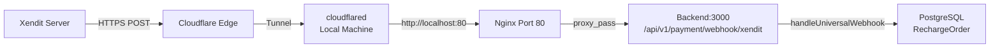

# Cloudflare Tunnel Setup & Webhook Code Deployment

## Current State

- **Cloudflare Tunnel**: Already configured — [`cloudflared.yml`](cloudflared.yml) exists with tunnel ID `bd7bd901-8cc2-4d6c-bba6-7f98eddfce5e`, cloudflared is installed and authenticated, DNS records are configured.
- **Code Fix**: Invoice V2 webhook routing fix + diagnostic logging + camelCase `externalId` support already applied to [`client-wallet.service.ts`](apps/api/src/client/wallet/client-wallet.service.ts) and [`payment-webhook.controller.ts`](apps/api/src/client/wallet/payment-webhook.controller.ts).
- **Infrastructure**: Docker Compose with Nginx on ports 80/443, backend on port 3000.

## Architecture Flow



## Step-by-Step Plan

### Step 1: Start Cloudflare Tunnel

Run the tunnel in a persistent terminal. The tunnel will establish an outbound connection from your local machine to Cloudflare Edge, making `dev-api.joyminis.com` publicly accessible.

```bash
make tunnel
```

This executes: `cloudflared tunnel --config cloudflared.yml run lucky-nest-monorepo`

**Keep this terminal running.** The tunnel must stay alive for webhooks to work.

To stop later: `make tunnel-kill` (or Ctrl+C, or `pkill cloudflared`)

### Step 2: Verify Docker Services Are Running

Ensure all required Docker containers are up:

```bash
make ps
```

Expected: `lucky-nginx-dev`, `lucky-backend-dev`, `lucky-db`, `lucky-redis` should all be running.

### Step 3: Verify Code Auto-Reload

The backend runs with `start:dev` (NestJS watch mode, see [`compose.yml`](compose.yml:48)), and the entire project is mounted as a volume ([`compose.yml`](compose.yml:52): `- .:/app`). The code changes should already be picked up.

To verify the running code has the fix, check the backend logs for diagnostic output:

```bash
make log s=backend
```

Search for `[Webhook Entry]` in the logs after triggering a webhook.

If watch mode didn't pick up changes, restart the backend:

```bash
docker compose restart backend
```

### Step 4: Verify Tunnel Connectivity

Test that the tunnel is working and Xendit can reach the webhook endpoint:

```bash
curl -X POST "https://dev-api.joyminis.com/api/v1/payment/webhook/xendit" \
  -H "Content-Type: application/json" \
  -d '{"test": true}'
```

Expected response: Should reach the backend (may return 400/401 due to missing token, but should NOT return connection refused/timeout).

### Step 5: Trigger Test Deposit & Monitor Webhook

1. Create a test deposit order via the app
2. Check the backend logs for webhook callback:

```bash
make log s=backend | grep -E "\[Webhook (Entry|Router|Invoice)\]"
```

Expected log output (after Xendit sends callback):

```
[Webhook Entry] Received payload with keys: event, data
[Webhook Router] Identified as INVOICE V2 (Event: invoice.paid)
[Webhook Invoice] Processing V2 payload with externalId: DEP20260512xxxxxx
[Webhook Invoice] Field validation passed for order DEP20260512xxxxxx
```

### Step 6: Confirm Order Status Updates

Check the admin panel that the deposit record status changed from `PROCESSING` to `SUCCESS` without manual sync.

## Rollback Plan

If the tunnel causes issues:

1. **Stop tunnel**: `make tunnel-kill`
2. **DNS**: Remove tunnel DNS records in Cloudflare Dashboard (or switch back to original DNS pointing to VPS)
3. **Code**: The code changes are backward-compatible — they add support for V2 format while keeping V1 support intact. No rollback needed.

## Key Files

| File | Purpose |
|------|---------|
| [`cloudflared.yml`](cloudflared.yml) | Tunnel configuration mapping hostnames to local services |
| [`Makefile`](Makefile:118) | `make tunnel` / `make tunnel-kill` commands |
| [`nginx/nginx.dev.conf`](nginx/nginx.dev.conf) | Nginx routing webhook → backend, port 80 for tunnel |
| [`compose.yml`](compose.yml) | Docker services, volume mounts for auto-reload |
| [`client-wallet.service.ts`](apps/api/src/client/wallet/client-wallet.service.ts) | Webhook handler with V2 fix + diagnostic logging |
| [`payment-webhook.controller.ts`](apps/api/src/client/wallet/payment-webhook.controller.ts) | Webhook entry point with diagnostic logging |
