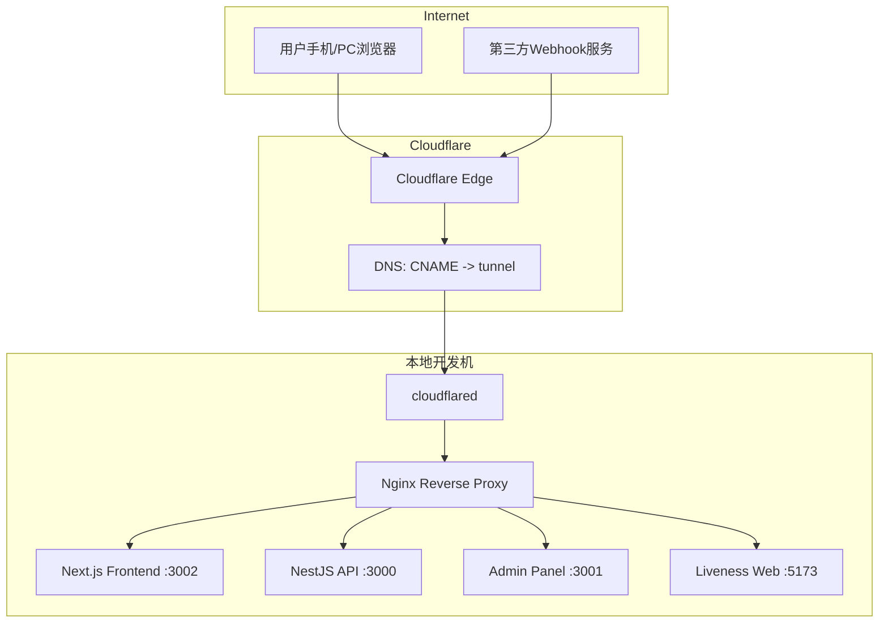

# Cloudflare Tunnel 博客文章写作计划

## 文章信息

| 字段 | 值 |
|------|-----|
| **标题** | Cloudflare Tunnel 实战指南：从零搭建开发环境公网访问 |
| **分类** | devops |
| **标签** | Cloudflare, DevOps, Tutorial, Webhook, Development |
| **文件名** | `cloudflare-tunnel-guide.md` |
| **存放路径** | `docs/blog/articles/devops/cloudflare-tunnel-guide.md` |
| **语言** | 中文（zh） |
| **目标读者** | 前后端开发者、DevOps 工程师、独立开发者 |

## 文章大纲

### 1. 场景痛点：为什么需要公网访问本地开发环境

列出 4 个典型场景：
- **Webhook 回调调试** — 第三方支付（Xendit、Stripe）需要可访问的回调 URL
- **手机端测试** — Flutter App / 移动端 H5 连接开发 API
- **PC 端跨设备调试** — 多浏览器、不同操作系统测试
- **对外演示** — 给客户/PM 实时查看开发进度

传统方案的局限性：
- 公网 IP 成本高、配置复杂
- 端口映射（NAT/UPnP）存在安全风险
- ngrok 免费版域名随机、连接数限制、速度慢

### 2. 方案选型：为什么选择 Cloudflare Tunnel

对比表格：

| 特性 | ngrok Free | Cloudflare Tunnel | 自建 VPN |
|------|-----------|-------------------|----------|
| 价格 | 有限免费 | 免费 | 需服务器成本 |
| 域名 | 随机 | 自有域名 | 自有域名 |
| HTTPS | 自动 | 自动 | 需手动配置 |
| 速度 | 较慢 | 快（全球边缘网络） | 取决于服务器 |
| 带宽 | 1 连接/分钟 | 无限制 | 无限制 |
| 配置复杂度 | 简单 | 中等 | 复杂 |

核心技术原理：
- cloudflared 客户端建立出站 WebSocket 连接到 Cloudflare Edge
- Cloudflare Edge 接收公网请求，通过 Tunnel 转发到本地
- 无需开放防火墙端口，零信任安全模型

### 3. 整体架构

Mermaid 架构图：



数据流说明：
1. 用户访问 `https://dev-api.joyminis.com`
2. DNS 解析到 Cloudflare Edge
3. Cloudflare 通过 Tunnel ID 找到活跃的 cloudflared 连接
4. cloudflared 根据 ingress 规则匹配 hostname，转发到 `http://localhost:80`
5. Nginx 根据 `Host` Header 将请求分发到对应后端服务

### 4. 安装与配置全流程

分 6 步：

**Step 1: 安装 cloudflared**
- macOS: `brew install cloudflare/cloudflare/cloudflared`
- Linux: apt/deb 安装
- 验证: `cloudflared --version`

**Step 2: 登录授权**
- `cloudflared tunnel login`
- 浏览器打开 Cloudflare 授权页面，选择域名
- 生成 `~/.cloudflared/cert.pem`

**Step 3: 创建隧道**
- `cloudflared tunnel create <name>` → 生成 Tunnel ID
- 生成 credentials file: `~/.cloudflared/<tunnel-id>.json`

**Step 4: 配置 DNS**
- `cloudflared tunnel route dns <name> <hostname>`
- 或手动在 Cloudflare Dashboard 添加 CNAME 记录

**Step 5: 编写 cloudflared.yml**

```yaml
tunnel: <tunnel-id>
credentials-file: ~/.cloudflared/<tunnel-id>.json
ingress:
  - hostname: dev-api.joyminis.com
    service: http://localhost:80
  - hostname: admin-dev.joyminis.com
    service: http://localhost:80
  - hostname: blog-dev.joyminis.com
    service: http://localhost:80
  - hostname: liveness-dev.joyminis.com
    service: http://localhost:80
  - service: http_status:404
```

**Step 6: Nginx 配置要点**

- Server Name 包含 Cloudflare 域名
- 无需配置 SSL（Cloudflare 自动处理）
- WebSocket 支持：`proxy_set_header Upgrade $http_upgrade`
- Webhook 特定路由：`/api/(v1/)?payment/webhook/xendit`

**Step 7: 启动隧道**
- `cloudflared tunnel --config cloudflared.yml run <name>`
- 或封装为 `make tunnel` 命令

### 5. 移动端测试方案

- **Flutter App**: 修改 baseUrl 为 `https://dev-api.joyminis.com`
- **手机浏览器**: 直接访问 Tunnel 域名
- **微信/小程序调试**: 配置域名白名单
- **注意**: Cookie/Secure 属性需适配 HTTPS 环境

### 6. PC 端测试方案

- **Webhook 模拟**: 使用第三方服务（如 RequestBin）验证回调
- **跨浏览器测试**: Tunnel 域名 + 不同 UA
- **开发者工具**: 远程调试 Chrome DevTools
- **cURL/Postman**: 直接请求 Tunnel 域名

### 7. 故障排除清单

| 问题 | 排查命令 | 解决方案 |
|------|---------|---------|
| Tunnel 无连接 | `cloudflared tunnel info <name>` | 检查进程是否运行 |
| DNS 未生效 | `dig <hostname> CNAME` | 等待 TTL 或刷新 DNS |
| 证书冲突 | `mv ~/.cloudflared/cert.pem ~/.cloudflared/cert.pem.backup` | 重新 login |
| Nginx 502 | `curl localhost:80 -H "Host: ..."` | 确认后端服务运行 |
| Webhook 收不到 | 检查 `[Webhook Entry]` 日志 | 确认路由匹配 |

### 8. 生产环境 vs 开发环境对比

| 维度 | 开发环境 (Tunnel) | 生产环境 (Cloudflare Workers/Pages) |
|------|------------------|-----------------------------------|
| 部署方式 | 本地 cloudflared | Workers/Pages 全球部署 |
| 延迟 | 依赖本地网络 | 全球边缘节点 |
| 域名 | `dev-*.joyminis.com` | `*.joyminis.com` |
| 配置 | cloudflared.yml | wrangler.toml / Dashboard |
| 日志 | `cloudflared tunnel info` | Workers 日志 / Sentry |

### 9. 总结与最佳实践

- Tunnel 是开发环境的最佳公网访问方案
- 结合 Makefile 命令封装（`make tunnel` / `make tunnel-kill`）
- 多域名通过 ingress 规则灵活映射
- 与 Docker Compose + Nginx 配合，零侵入集成
- 安全建议：使用独立子域名、定期轮换 Token、监控 Tunnel 状态

## 实施步骤

1. [x] 调研博客文章格式与目录结构
2. [x] 制定文章大纲
3. [ ] 等待用户确认计划
4. [ ] 撰写完整文章内容（中文）
5. [ ] 保存到 `docs/blog/articles/devops/cloudflare-tunnel-guide.md`
6. [ ] 通过 admin API 批量导入文章
7. [ ] 发布文章
