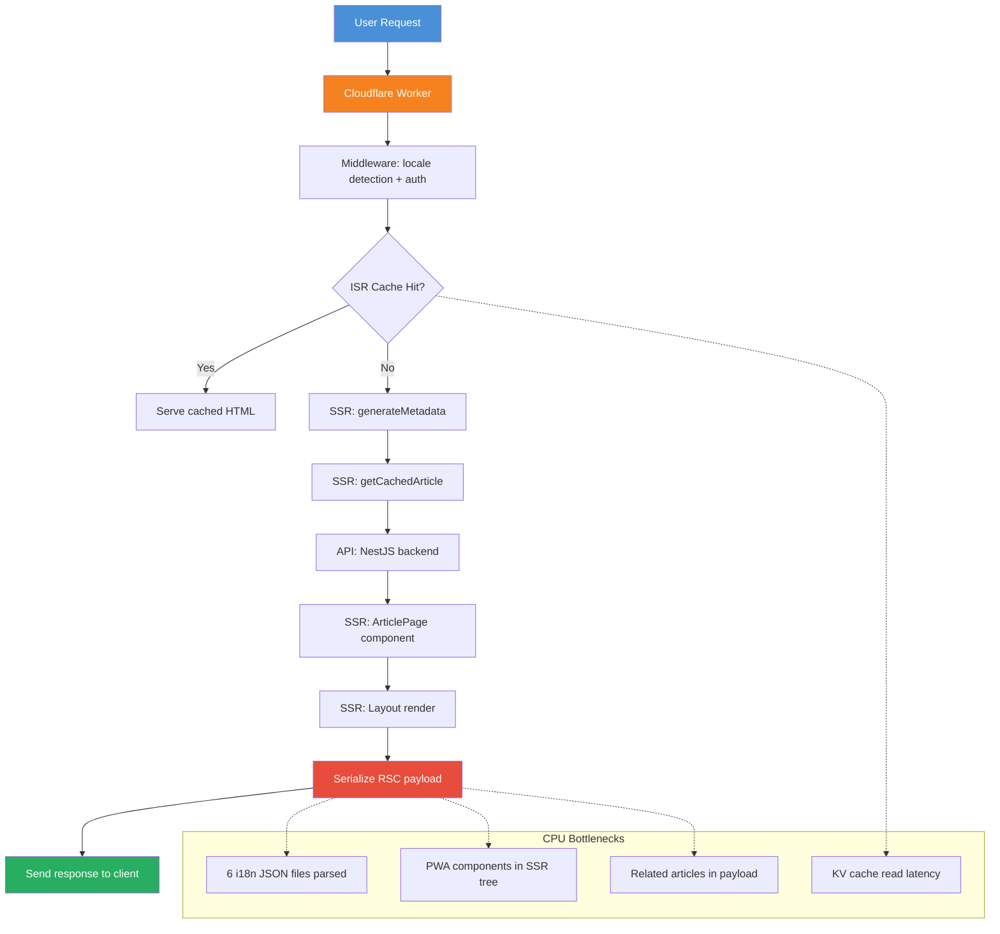

# Cloudflare Workers CPU Time Limit Fix Plan

## Problem Analysis

### Symptoms (from Cloudflare Workers logs)

| Request | Server Time | Total Time | Issue |
|---------|-------------|------------|-------|
| `GET /ja/articles/nestjs-gemini-ai-circuit-breaker/` | 89ms (API) | 10ms (Worker) | **Worker exceeded CPU time limit** (4x) |
| `GET /ko/articles/nestjs-gemini-ai-circuit-breaker/` | 86ms (API) | 10ms (Worker) | Worker exceeded CPU time limit |
| `GET /en/` | 629ms | 1.66s | Very slow, likely same CPU issue |

### Key Insight

The **NestJS API backend is fast** (86-89ms for article detail). The bottleneck is **Cloudflare Workers SSR CPU time**. The free plan has a **10ms CPU time limit** per request (paid plans get 30s). Even though the API I/O takes 89ms, the Worker's actual CPU execution time exceeds 10ms.

### Current Mitigation (Already in Place)

The article page at [`apps/frontend-blog/src/app/[locale]/articles/[slug]/page.tsx`](apps/frontend-blog/src/app/[locale]/articles/[slug]/page.tsx:131) already strips `content` and `contentMd` from the SSR payload:

```typescript
const initialArticle = article
  ? { ...article, content: undefined, contentMd: undefined }
  : undefined;
```

**Despite this, the Worker still exceeds CPU limits**, meaning the problem is deeper than just large content fields.

## Root Causes Identified

### 1. All 6 i18n Message Files Loaded in Layout (HIGH PRIORITY)

[`apps/frontend-blog/src/app/[locale]/layout.tsx`](apps/frontend-blog/src/app/[locale]/layout.tsx:175-183) statically imports ALL 6 language message files:

```typescript
import zhMessages from '@/messages/zh.json';
import enMessages from '@/messages/en.json';
import jaMessages from '@/messages/ja.json';
import koMessages from '@/messages/ko.json';
import frMessages from '@/messages/fr.json';
import deMessages from '@/messages/de.json';
```

Even though only one locale is used per request, all 6 JSON files are:
- Bundled into the Cloudflare Worker (increases bundle size)
- Parsed during SSR (adds CPU time)
- Held in memory

**Impact**: Each JSON file is ~2-5KB, but the parsing + bundling overhead adds significant CPU time on every SSR request.

### 2. Heavy Layout Component Tree (HIGH PRIORITY)

The layout renders many components during SSR:
- [`Header`](apps/frontend-blog/src/components/Header.tsx)
- [`Sidebar`](apps/frontend-blog/src/components/navigation/Sidebar.tsx)
- [`BottomNavigation`](apps/frontend-blog/src/components/BottomNavigation.tsx)
- [`PageTransition`](apps/frontend-blog/src/components/PageTransition.tsx)
- [`HomePageStateProvider`](apps/frontend-blog/src/lib/providers/HomePageStateProvider.tsx)
- [`InstallPrompt`](apps/frontend-blog/src/components/pwa/InstallPrompt.tsx)
- [`OfflineIndicator`](apps/frontend-blog/src/components/pwa/OfflineIndicator.tsx)
- [`UpdateAvailable`](apps/frontend-blog/src/components/pwa/UpdateAvailable.tsx)

Each component adds to RSC serialization cost. PWA components (`InstallPrompt`, `OfflineIndicator`, `UpdateAvailable`) are client-side only but still add to the SSR component tree traversal.

### 3. Article API Response Size (MEDIUM PRIORITY)

The [`getFrontendArticleBySlug`](apps/api/src/blog/frontend/frontend-blog.service.ts:105-131) returns:
- Full article metadata (title, excerpt, coverImage, views, likes, etc.)
- Category object
- Tags array
- Author object
- **Related articles array** (5 articles, each with title, excerpt, coverImage, etc.)
- Meta field (may contain blurhash data, image variants)

Even without `content`/`contentMd`, the response can be 5-15KB of JSON. This JSON must be parsed by the Worker during SSR.

### 4. ISR KV Cache Reads (LOW PRIORITY)

[`open-next.config.ts`](apps/frontend-blog/open-next.config.ts:18-22) uses KV-based incremental cache. Every SSR request requires a KV read to check for cached ISR pages, adding latency.

### 5. Middleware Processing (LOW PRIORITY)

[`middleware.ts`](apps/frontend-blog/middleware.ts:21-82) runs on every request and includes:
- Locale detection
- Auth cookie check
- Protected route validation
- `next-intl` middleware processing

## Proposed Solutions

### Solution A: ~~Dynamic i18n Message Loading~~ Keep Static Imports (REVERTED)

**Problem**: All 6 locale JSON files are statically imported and bundled.

**Initial Fix Attempt**: Use dynamic import based on the locale parameter.

**Why REVERTED**: After analysis and user feedback ("能动态加载吗，claudfare好像有问题？"), we determined that **dynamic `import()` is NOT suitable for Cloudflare Workers with OpenNext**:

1. **OpenNext bundles everything** into a single `worker.js` — there is no code splitting, so dynamic `import()` still bundles all 6 JSON files
2. **Static JSON imports are inlined by webpack** as plain JS objects during build — no parsing cost on warm requests
3. **Dynamic `import()` adds async overhead** in Workers (microtask queue, promise resolution)
4. **For warm requests**, all 6 JSON objects are already in memory as parsed JS objects — the "parsing cost" concern was incorrect

**Final Decision**: Keep static imports. The 6 JSON files (~2-5KB each) are negligible compared to the RSC serialization cost of the component tree.

```typescript
// Current state (layout.tsx) — static imports kept with explanatory comment:
import zhMessages from '@/messages/zh.json';
import enMessages from '@/messages/en.json';
import jaMessages from '@/messages/ja.json';
import koMessages from '@/messages/ko.json';
import frMessages from '@/messages/fr.json';
import deMessages from '@/messages/de.json';

// In the component:
const allMessages: Record<string, any> = {
  zh: zhMessages,
  en: enMessages,
  ja: jaMessages,
  ko: koMessages,
  fr: frMessages,
  de: deMessages,
};
const messages = allMessages[locale] || allMessages['zh'];
```

### Solution B: Move Heavy Components to Client-Only (HIGH IMPACT, MEDIUM RISK) ✅ IMPLEMENTED

**Problem**: PWA components and other heavy UI components are rendered during SSR.

**Fix**: Wrap client-only components with a dynamic import with `ssr: false`:

```typescript
// In layout.tsx, use next/dynamic with ssr: false
// NOTE: Must use .then((mod) => mod.ComponentName) for named exports
const InstallPrompt = dynamic(
  () => import('@/components/pwa/InstallPrompt').then((mod) => mod.InstallPrompt),
  { ssr: false },
);
const OfflineIndicator = dynamic(
  () => import('@/components/pwa/OfflineIndicator').then((mod) => mod.OfflineIndicator),
  { ssr: false },
);
const UpdateAvailable = dynamic(
  () => import('@/components/pwa/UpdateAvailable').then((mod) => mod.UpdateAvailable),
  { ssr: false },
);
```

**Impact**: Reduces SSR component tree size. These components don't need SSR since they're PWA-related (client-only functionality).

**Note**: The `.then((mod) => mod.ComponentName)` pattern is required because these components use `export function` (named exports), not `export default`. Without this, TypeScript cannot infer the props types.

### Solution C: Reduce Article SSR Payload (MEDIUM IMPACT, LOW RISK) ✅ IMPLEMENTED

**Problem**: The article API response includes related articles and other metadata that may not be needed during SSR.

**Fix**: In [`page.tsx`](apps/frontend-blog/src/app/[locale]/articles/[slug]/page.tsx), strip more fields from the SSR payload:

```typescript
const initialArticle = article
  ? {
      ...article,
      content: undefined,
      contentMd: undefined,
      relatedArticles: undefined, // Strip related articles from SSR
      meta: undefined, // Strip meta (blurhash, variants) from SSR
    }
  : undefined;
```

The client-side hook [`useFrontendArticleBySlug`](apps/frontend-blog/src/lib/hooks/useFrontendArticles.ts:128) already fetches the full article on the client, so these fields will be populated client-side.

**Impact**: Reduces JSON payload size by ~30-50%. Less data to serialize in RSC.

### Solution D: Add Next.js `unstable_cache` for Article Fetch (MEDIUM IMPACT, MEDIUM RISK)

**Problem**: [`getCachedArticle`](apps/frontend-blog/src/lib/cached/article.ts:12-24) uses `React.cache()` which only deduplicates within the same request, not across requests.

**Fix**: Add `unstable_cache` (or `next/cache` `cache()` function) to cache the API response across requests:

```typescript
import { cache } from 'react';
import { unstable_cache } from 'next/cache';

export const getCachedArticle = unstable_cache(
  async (slug: string, locale: string) => {
    return serverGet<FrontendArticle>(
      `/v1/frontend/blog/articles/${slug}`,
      { lang: locale },
    );
  },
  ['article-by-slug'],
  { revalidate: 3600, tags: ['articles'] }
);
```

**Note**: This requires the `React.cache()` wrapper too since `unstable_cache` doesn't deduplicate within the same request.

**Impact**: Reduces API calls to the backend. The article data is cached in KV (via OpenNext ISR cache) for 1 hour.

### Solution E: Optimize Middleware (LOW IMPACT, LOW RISK)

**Problem**: Middleware runs on every request and does locale detection + auth checks.

**Fix**: Simplify the middleware matcher to exclude static assets more aggressively, and ensure the middleware doesn't do unnecessary work for public blog pages.

**Impact**: Minor improvement, but every microsecond counts on Workers.

### Solution F: Upgrade to Paid Cloudflare Workers Plan (IMMEDIATE RELIEF)

**Problem**: Free plan has 10ms CPU time limit.

**Fix**: Upgrade to Workers Paid plan ($5+/month) which has 30s CPU time limit.

**Impact**: Immediate fix. The 10ms limit is extremely restrictive for Next.js SSR with OpenNext.

## Recommended Action Plan

### Phase 1: Immediate Relief (Highest Impact) ✅ COMPLETED

| # | Task | File(s) | Effort | Impact | Status |
|---|------|---------|--------|--------|--------|
| 1 | ~~Dynamic i18n message loading~~ **Keep static imports** (dynamic import() not suitable for CF Workers) | [`layout.tsx`](apps/frontend-blog/src/app/[locale]/layout.tsx:5-10) | Small | Negligible | ✅ Reverted |
| 2 | Move PWA components to `dynamic(() => import(...).then(mod => mod.X), { ssr: false })` | [`layout.tsx`](apps/frontend-blog/src/app/[locale]/layout.tsx:23-42) | Small | High | ✅ Done |
| 3 | Strip `relatedArticles` and `meta` from SSR payload | [`page.tsx`](apps/frontend-blog/src/app/[locale]/articles/[slug]/page.tsx:131-139) | Small | Medium | ✅ Done |

### Phase 2: Caching & Optimization

| # | Task | File(s) | Effort | Impact |
|---|------|---------|--------|--------|
| 4 | Add `unstable_cache` for article fetch | [`article.ts`](apps/frontend-blog/src/lib/cached/article.ts) | Medium | Medium |
| 5 | Optimize middleware matcher | [`middleware.ts`](apps/frontend-blog/middleware.ts:84-88) | Small | Low |

### Phase 3: Monitoring & Fallback

| # | Task | File(s) | Effort | Impact |
|---|------|---------|--------|--------|
| 6 | Consider upgrading to Workers Paid plan | N/A (Cloudflare dashboard) | Small | Immediate |
| 7 | Add observability/logging for SSR CPU time | [`instrumentation.ts`](apps/frontend-blog/src/instrumentation.ts) | Medium | Medium |

## Architecture Diagram



## Verification Steps

After implementing each change:

1. **Type-check**: `yarn workspace @lucky/frontend-blog tsc --noEmit` ✅ Passed
2. **Lint**: `yarn workspace @lucky/frontend-blog lint` ✅ Passed (pre-existing warnings only)
3. **Deploy to staging**: `yarn workspace @lucky/frontend-blog deploy:staging`
4. **Test article page**: Visit `https://blog-dev.joyminis.com/ja/articles/nestjs-gemini-ai-circuit-breaker/`
5. **Check Cloudflare logs**: Verify no "Worker exceeded CPU time limit" errors
6. **Check response times**: Should be under 500ms total
7. **Verify content loads**: Ensure article content still loads client-side via `useFrontendArticleBySlug`
8. **Test all locales**: en, zh, ja, ko, fr, de
9. **Test homepage**: `https://blog-dev.joyminis.com/en/` should load under 1s

## Rollback Plan

If any change causes issues:
- **SSR: false components**: Revert to normal imports (layout.tsx)
- **Payload stripping**: Restore `relatedArticles` and `meta` fields (page.tsx)
- **unstable_cache**: Revert to `React.cache()` only (article.ts)
