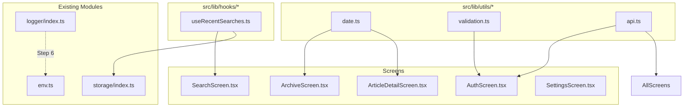

# Plan: Common Utilities Extraction

## Goal
Extract duplicated patterns across the codebase into reusable utility functions, hooks, and helpers in the empty `src/lib/utils/` directory.

## Background
The `src/lib/utils/` directory exists but is empty. Many screens contain inline helper functions and duplicated patterns that should be centralized.

---

## Step 1: Commit Current Bug Fixes

Run `git add . && git commit -m "fix: resolve 10 bugs across mobile blog app"` in the project directory.

Files to commit:
- `src/api/endpoints/bookmarks.ts` (new)
- `src/navigation/RootNavigator.tsx` (TabBar fix)
- `src/screens/HomeScreen.tsx` (navigation redirect)
- `src/screens/CategoryListScreen.tsx` (navigation redirect)
- `src/screens/TagListScreen.tsx` (navigation redirect)
- `src/lib/i18n/index.ts` (type fix)
- `src/api/baseApi.ts` (dynamic Accept-Language)
- `src/screens/SettingsScreen.tsx` (theme.isDark + language switch)
- `src/screens/StatsScreen.tsx` (Platform import + pageSize)
- `src/screens/AuthScreen.tsx` (eye icon)
- `src/components/core/SvgIcon.tsx` (eye-off icon)
- `src/lib/env.ts` (full rewrite)
- `.env.development`, `.env.production`, `.env.staging` (API URLs)

---

## Step 2: Create `src/lib/utils/date.ts` — Date Formatting Utilities

**Problem**: `ArticleDetailScreen.tsx:253-264` defines an inline `formatDate` function. `ArchiveScreen.tsx:74` creates `new Date()` and uses a `MONTH_NAMES` array. Multiple screens format dates inconsistently.

**Solution**: Create shared date helpers:

```typescript
// src/lib/utils/date.ts

/**
 * Format ISO date string to human-readable format
 * Used in: ArticleDetailScreen, ArchiveScreen, ArticleCard
 */
export function formatDate(
  dateString: string,
  options?: Intl.DateTimeFormatOptions,
): string {
  try {
    const date = new Date(dateString);
    return date.toLocaleDateString('en-US', {
      year: 'numeric',
      month: 'long',
      day: 'numeric',
      ...options,
    });
  } catch {
    return dateString;
  }
}

/**
 * Format ISO date string to relative time ("2 hours ago", "3 days ago")
 * Useful for: ArticleCard timestamps, comment timestamps
 */
export function formatRelativeTime(dateString: string): string {
  // ...implementation...
}

/**
 * Format ISO date string to "YYYY-MM-DD" format
 * Useful for: Archive grouping, API params
 */
export function formatISODate(dateString: string): string {
  // ...implementation...
}

/**
 * Month names array for archive grouping
 */
export const MONTH_NAMES = [
  'January', 'February', 'March', 'April', 'May', 'June',
  'July', 'August', 'September', 'October', 'November', 'December',
];

/**
 * Group articles by year → month for archive view
 * Used in: ArchiveScreen
 */
export function groupArticlesByYearMonth<T extends { publishedAt?: string; updatedAt?: string }>(
  articles: T[],
): Array<{ year: number; months: Array<{ month: string; monthIndex: number; articles: T[] }> }> {
  // ...implementation from ArchiveScreen...
}
```

---

## Step 3: Create `src/lib/hooks/useRecentSearches.ts` — Recent Search Storage

**Problem**: `SearchScreen.tsx:96-121` has inline MMKV-based recent searches (save/clear/remove). This pattern could be reused.

**Solution**: Extract into a custom hook:

```typescript
// src/lib/hooks/useRecentSearches.ts
import { useState, useCallback } from 'react';
import { storage } from '../storage';

const RECENT_SEARCHES_KEY = 'recent_searches';
const MAX_RECENT = 10;

export function useRecentSearches() {
  const [recentSearches, setRecentSearches] = useState<string[]>(() => {
    try {
      const stored = storage.getString(RECENT_SEARCHES_KEY);
      return stored ? JSON.parse(stored) : [];
    } catch { return []; }
  });

  const saveRecentSearch = useCallback((query: string) => {
    if (!query.trim()) return;
    setRecentSearches(prev => {
      const updated = [query, ...prev.filter(s => s !== query)].slice(0, MAX_RECENT);
      storage.set(RECENT_SEARCHES_KEY, JSON.stringify(updated));
      return updated;
    });
  }, []);

  const clearRecentSearches = useCallback(() => {
    setRecentSearches([]);
    storage.delete(RECENT_SEARCHES_KEY);
  }, []);

  const removeRecentSearch = useCallback((query: string) => {
    setRecentSearches(prev => {
      const updated = prev.filter(s => s !== query);
      storage.set(RECENT_SEARCHES_KEY, JSON.stringify(updated));
      return updated;
    });
  }, []);

  return { recentSearches, saveRecentSearch, clearRecentSearches, removeRecentSearch };
}
```

---

## Step 4: Create `src/lib/utils/validation.ts` — Form Validation Helpers

**Problem**: `AuthScreen.tsx:84-116` has inline form validation for email/password. New forms would duplicate this.

**Solution**: Create shared validation functions:

```typescript
// src/lib/utils/validation.ts

export function isValidEmail(email: string): boolean {
  return /^[^\s@]+@[^\s@]+\.[^\s@]+$/.test(email);
}

export function isValidPassword(password: string): boolean {
  return password.length >= 6;
}

export interface ValidationErrors {
  [field: string]: string;
}

export function validateLoginForm(email: string, password: string): ValidationErrors {
  const errors: ValidationErrors = {};
  if (!email.trim()) errors.email = 'Email is required';
  else if (!isValidEmail(email)) errors.email = 'Invalid email format';
  if (!password) errors.password = 'Password is required';
  else if (!isValidPassword(password)) errors.password = 'Password must be at least 6 characters';
  return errors;
}
```

---

## Step 5: Create `src/lib/utils/api.ts` — API Error & Helper Utilities

**Problem**: Multiple screens handle API errors similarly (`isError` → show `EmptyState` with retry). `authSlice.ts` uses raw `fetch()` instead of RTK Query.

**Solution**: Create API helpers:

```typescript
// src/lib/utils/api.ts
import { logger } from '../logger';

/**
 * Standard API error response type
 */
export interface ApiError {
  message: string;
  statusCode?: number;
  errors?: Record<string, string[]>;
}

/**
 * Extract user-friendly error message from an API error
 */
export function getApiErrorMessage(error: unknown): string {
  if (typeof error === 'string') return error;
  if (error && typeof error === 'object') {
    const err = error as Record<string, unknown>;
    if (typeof err.message === 'string') return err.message;
    if (typeof err.error === 'string') return err.error;
  }
  return 'An unexpected error occurred';
}

/**
 * Safe JSON parse with fallback
 */
export function safeJsonParse<T>(value: string, fallback: T): T {
  try { return JSON.parse(value) as T; }
  catch { return fallback; }
}
```

---

## Step 6: Update `src/lib/logger/index.ts` to use `env.LOG_LEVEL`

**Problem**: Logger hardcodes `currentLevel = __DEV__ ? 'debug' : 'warn'` (line 12) instead of reading `env.LOG_LEVEL`.

**Fix**: Change to use the configured log level from env.

---

## Step 7: Update Screens to Use Shared Utilities

Replace inline code with imports from the new utility files.

| File | Inline Code → Replace With |
|------|---------------------------|
| `ArticleDetailScreen.tsx:253-264` | `formatDate()` from `src/lib/utils/date` |
| `ArchiveScreen.tsx:68-100` | `groupArticlesByYearMonth()` from `src/lib/utils/date` |
| `SearchScreen.tsx:96-121` | `useRecentSearches()` from `src/lib/hooks/useRecentSearches` |
| `AuthScreen.tsx:84-116` | `validateLoginForm()` from `src/lib/utils/validation` |

---

## Mermaid: Utility Dependency Map



---

## Execution Order

1. Commit current fixes (`git add . && git commit`)
2. Create `src/lib/utils/date.ts`
3. Create `src/lib/hooks/useRecentSearches.ts`
4. Create `src/lib/utils/validation.ts`
5. Create `src/lib/utils/api.ts`
6. Update `src/lib/logger/index.ts` to use `env.LOG_LEVEL`
7. Update screens: `SearchScreen`, `ArchiveScreen`, `ArticleDetailScreen`, `AuthScreen`
8. Run `yarn tsc --noEmit` to verify
