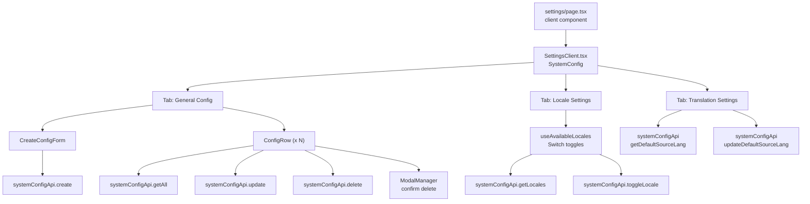

# Plan: Copy Settings Page from admin-next to admin-blog

## Problem

User requested copying admin-next's Settings (System Config) page to admin-blog. Previously I only added the i18n keys (`systemConfig` section in `en.json`/`de.json`/`request.ts`) but did NOT create the actual page files. The user requires the full Settings page with:

- **General Config** tab: Browse/edit/delete system config key-value pairs
- **Locale Settings** tab: Enable/disable supported locales with toggle switches
- **Translation Settings** tab: Configure default source language and translation strategy

## Existing Infrastructure (already in admin-blog)

| Resource | Path | Status |
|----------|------|--------|
| `systemConfigApi` | [`apps/admin-blog/src/api/index.ts:398`](../apps/admin-blog/src/api/index.ts:398) | Already exists (`getLocales`, `toggleLocale`, `getDefaultSourceLang`, `updateDefaultSourceLang`) |
| `PageHeader` | [`apps/admin-blog/src/components/scaffold/PageHeader.tsx`](../apps/admin-blog/src/components/scaffold/PageHeader.tsx) | Already exists |
| `useTranslation` | [`apps/admin-blog/src/hooks/useTranslation.ts`](../apps/admin-blog/src/hooks/useTranslation.ts) | Already exists |
| `useAvailableLocales` | [`apps/admin-blog/src/hooks/useAvailableLocales.ts`](../apps/admin-blog/src/hooks/useAvailableLocales.ts) | Already exists |
| `useToastStore` | [`apps/admin-blog/src/store/useToastStore.ts`](../apps/admin-blog/src/store/useToastStore.ts) | Already exists (same API: `addToast(type, message)`) |
| `Switch` (from `@repo/ui`) | [`packages/ui/src/components/ui/switch.tsx`](../packages/ui/src/components/ui/switch.tsx) | Available via workspace dep (Radix UI, uses `checked` + `onCheckedChange`) |
| `ModalManager` (from `@repo/ui`) | [`packages/ui/src/components/Modal/modal-manager.tsx`](../packages/ui/src/components/Modal/modal-manager.tsx) | Available via workspace dep |
| `SystemConfigItem` type | [`apps/admin-blog/src/type/types.ts:1461`](../apps/admin-blog/src/type/types.ts:1461) | Already exists (`key: string; value: string`) |
| `systemConfig` i18n keys | [`apps/admin-blog/src/i18n/en.json`](../apps/admin-blog/src/i18n/en.json), [`apps/admin-blog/src/i18n/de.json`](../apps/admin-blog/src/i18n/de.json) | Already added (50+ keys) |
| `request.ts` flatten/merge | [`apps/admin-blog/src/i18n/request.ts`](../apps/admin-blog/src/i18n/request.ts) | Already updated for `systemConfig` nested object |
| Routes (`/settings`, `/settings/locales`) | [`apps/admin-blog/src/routes/index.ts:81-94`](../apps/admin-blog/src/routes/index.ts:81-94) | Already exist with `hidden: true` |

## What's Missing (Needs to be Created)

### Missing Directories & Files

```
apps/admin-blog/src/app/(dashboard)/settings/
  page.tsx              ← NEEDS TO BE CREATED
  locales/
    page.tsx            ← NEEDS TO BE CREATED

apps/admin-blog/src/components/settings/
  SettingsClient.tsx    ← NEEDS TO BE CREATED
```

### File 1: `apps/admin-blog/src/components/settings/SettingsClient.tsx`

**Source**: [`apps/admin-next/src/components/settings/SettingsClient.tsx`](../apps/admin-next/src/components/settings/SettingsClient.tsx) (671 lines)

**Adaptations needed**:

| Change | Reason |
|--------|--------|
| Import `{ Switch, ModalManager }` from `@repo/ui` instead of `@repo/ui` | Keep same - admin-blog has `@repo/ui` workspace dep |
| Import `{ PageHeader }` from `@/components/scaffold/PageHeader` | Same path, works |
| Import `{ systemConfigApi }` from `@/api` | Same path, works |
| Import `{ useToastStore }` from `@/store/useToastStore` | Same path, works |
| Import `{ useAvailableLocales }` from `@/hooks/useAvailableLocales` | Same path, works |
| Import `{ useTranslation }` from `@/hooks/useTranslation` | Same path, works |
| Import `{ SystemConfigItem }` from `@/type/types` | Change from `@/type/types` → same for admin-blog |
| Remove `initialData` prop and `hasServerPrefetch` logic | admin-blog has no `serverGet`/`serverFetch` |
| All configs load client-side via `useRequest` on mount | Simpler approach |
| Clean up `CONFIG_META` to only blog-relevant keys | Remove `exchange_rate_*`, `min/max_withdraw_amount`, `withdraw_fee_rate`, `platform_*`, `kyc_required`. Keep `blog.translation.*` keys |

### File 2: `apps/admin-blog/src/app/(dashboard)/settings/page.tsx`

**Source**: [`apps/admin-next/src/app/(dashboard)/settings/page.tsx`](../apps/admin-next/src/app/(dashboard)/settings/page.tsx) (37 lines)

**Adaptations needed**:

| Change | Reason |
|--------|--------|
| Make it a `'use client'` component | No `serverGet` available in admin-blog |
| Remove `Suspense` and `PageSkeleton` wrapper | Keep simple: just render `<SystemConfig />` |
| Remove `serverGet` initial data fetch | Data fetches client-side |
| Remove `metadata` export | Client component can't export metadata |

### File 3: `apps/admin-blog/src/app/(dashboard)/settings/locales/page.tsx`

**Source**: [`apps/admin-next/src/app/(dashboard)/settings/locales/page.tsx`](../apps/admin-next/src/app/(dashboard)/settings/locales/page.tsx) (57 lines)

**Adaptations needed**:

| Change | Reason |
|--------|--------|
| Use i18n `t()` for all hardcoded Chinese strings | We have `systemConfig.*` keys already in locale files |
| Use `PageHeader` with `t()` | Consistent with admin-blog pattern |
| Use `@repo/ui` `Switch` (same API: `checked` + `onCheckedChange`) | Already available |

## Step Details

### Step 9: Create `SettingsClient.tsx` (the SystemConfig component)

Copy admin-next's 671-line component and adapt:
- Remove `CONFIG_META` entries unrelated to blog (keep only `blog.translation.*`)
- Remove `initialData`/`hasServerPrefetch` logic
- All configs loaded via `useRequest(() => systemConfigApi.getAll())` on mount
- Keep all 3 tabs: General Config, Locale Settings, Translation Settings
- Use `@repo/ui` Switch and ModalManager (available)
- Use existing toast, translation, locale hooks

### Step 10: Create `settings/locales/page.tsx`

Create a simple client page that:
- Uses `PageHeader` with i18n labels
- Lists all locales with `Switch` toggles
- Uses `useAvailableLocales()` hook
- Uses i18n `t('systemConfig.*')` keys

### Step 11: Create `settings/page.tsx`

Simple client component that renders `<SystemConfig />`.

### Step 12: Update `routes/index.ts`

Change `/settings` route `hidden: true` → `hidden: false`.

### Step 13: Verify

Run `type-check` + `lint` to ensure everything compiles.

## Mermaid Diagram: Settings Page Architecture


